<div align="center">
  
  <br>
  <h3>Universidad Peruana de Ciencias Aplicadas</h3>
  <h4>Facultad de Ingeniería</h4>
  <h4>Carrera de Ingeniería de Software</h4>
  <br>
  <h4>Ciclo 2026-20</h4>
  <br>
  <h4>1ASI0729 - Desarrollo de Aplicaciones Open Source</h4>
  <h4>NRC: 7747</h4>
  <h4>Profesor: Ivan Robles Fernández</h4>
  <br>
  <h2>Informe de Trabajo Final</h2>
  <br>
  <h3>Startup: Digital Clinical System</h3>
  <h3>Producto: ClinicalSync</h3>
  <br>
  <h4>Integrantes:</h4>
  <ul style="list-style-type: none; padding: 0;">
    <li>U202417448 - Johan Giovani Huamán Cuba</li>
    <li>u202212214 - Oskar Rodrigo Sosa Soto</li>
    <li>u202314898 - Mathias Joaquin Acuache Lucas</li>
    <li>u20261D993 - Angel Andres Valdez Melo</li>
    <li>U20231F412 - Johnny Alexander Ojanama Abanto</li>
  </ul>
  <br>
  <h4>Setiembre, 2026</h4>
</div>

---

## Registro de Versiones del Informe

| Versión | Fecha | Autor | Descripción de modificación |
|---|---|---|---|
| 1.0 | 2026-08-27 | Huamán Cuba, Johan Giovani | Versión inicial del documento. Se crea la estructura base del informe con el índice de los cinco capítulos. |
| AV1 | 2026-09-17 | <ul><li>Huamán Cuba, Johan Giovani</li><li>Sosa Soto, Oskar Rodrigo</li><li>Acuache Lucas, Mathias Joaquin</li><li>Valdez Melo, Angel Andres</li><li>Ojanama Abanto, Johnny Alexander</li></ul> | Entrega AV1. Capítulo I: perfil de la startup, perfil de la solución, proceso Lean UX y segmentos objetivo. Capítulo II: análisis competitivo, entrevistas y su análisis, needfinding, Big Picture Event Storming y Ubiquitous Language. Capítulo III: User Stories, Impact Mapping y Product Backlog. Capítulo IV: style guidelines, arquitectura de información, diseño de la landing page y de la aplicación web, prototipado, arquitectura DDD, diseño orientado a objetos y diseño de base de datos. Capítulo V: configuración del entorno, gestión del código fuente, despliegue y evidencias del Sprint 1, con la Landing Page publicada en producción. |

---

## Project Report Collaboration Insights

**URL del repositorio del informe:** [https://github.com/Digital-Clinical-Systems/Informe](https://github.com/Digital-Clinical-Systems/Informe)

**URL del repositorio de la Landing Page:** [https://github.com/Digital-Clinical-Systems/Landing-Page](https://github.com/Digital-Clinical-Systems/Landing-Page)

La elaboración del informe se organizó con una rama `feature/report-chapter-N` por cada capítulo, de modo que cada integrante pudiera avanzar sobre su sección sin bloquear a los demás. Cada commit corresponde, por regla general, a una sección o título completado y sigue la convención de Conventional Commits descrita en la sección 5.1.3. Al cierre de la entrega, las cinco ramas se integraron a `develop` en orden, resolviendo en el `README.md` los conflictos propios de un documento compartido.

La siguiente captura corresponde al panel de Insights del repositorio y refleja la contribución de cada integrante durante el Sprint 1.

<p align="center">
  
</p>

---

## Contenido

- [Registro de Versiones del Informe](#registro-de-versiones-del-informe)
- [Project Report Collaboration Insights](#project-report-collaboration-insights)
- [Contenido](#contenido)
- [Student Outcome](#student-outcome)
- [Capítulo I: Introducción](#capítulo-i-introducción)
  - [1.1. Startup Profile](#11-startup-profile)
    - [1.1.1. Descripción de la Startup](#111-descripción-de-la-startup)
    - [1.1.2. Perfiles de integrantes del equipo](#112-perfiles-de-integrantes-del-equipo)
  - [1.2. Solution Profile](#12-solution-profile)
    - [1.2.1 Antecedentes y problemática](#121-antecedentes-y-problemática)
      - [A. Quiénes están involucrados (Who)](#a-quiénes-están-involucrados-who)
      - [B. Qué problema resuelve la solución (What)](#b-qué-problema-resuelve-la-solución-what)
      - [C. Cuándo ocurre el problema (When)](#c-cuándo-ocurre-el-problema-when)
      - [D. Dónde ocurre el problema (Where)](#d-dónde-ocurre-el-problema-where)
      - [E. Por qué es relevante este problema (Why)](#e-por-qué-es-relevante-este-problema-why)
      - [F. Cómo se gestiona actualmente el problema (How)](#f-cómo-se-gestiona-actualmente-el-problema-how)
      - [G. Cuánto impacta el problema (How much)](#g-cuánto-impacta-el-problema-how-much)
      - [Puntos principales que debe resolver la solución](#puntos-principales-que-debe-resolver-la-solución)
      - [Objetivos de la solución](#objetivos-de-la-solución)
      - [Restricciones y alcance del proyecto](#restricciones-y-alcance-del-proyecto)
    - [1.2.2 Lean UX Process](#122-lean-ux-process)
        - [Business Outcomes y User Outcomes](#business-outcomes-y-user-outcomes)
  - [1.2.2.1. Lean UX Problem Statements](#1221-lean-ux-problem-statements)
  - [1.2.2.2. Lean UX Assumptions](#1222-lean-ux-assumptions)
  - [Supuestos sobre los usuarios](#supuestos-sobre-los-usuarios)
  - [Supuestos sobre las necesidades](#supuestos-sobre-las-necesidades)
  - [Supuestos sobre la solución](#supuestos-sobre-la-solución)
  - [Supuestos sobre el negocio](#supuestos-sobre-el-negocio)
  - [Lean UX Assumption Prioritization](#lean-ux-assumption-prioritization)
      - [1.2.2.3. Lean UX Hypothesis Statements](#1223-lean-ux-hypothesis-statements)
    - [Hipótesis 1 — Transferencia estructurada (SBAR)](#hipótesis-1--transferencia-estructurada-sbar)
    - [Hipótesis 2 — Captura de parámetros vitales](#hipótesis-2--captura-de-parámetros-vitales)
    - [Hipótesis 3 — Revisión del progreso médico](#hipótesis-3--revisión-del-progreso-médico)
    - [Hipótesis 4 — Auditoría y seguimiento clínico](#hipótesis-4--auditoría-y-seguimiento-clínico)
    - [Hipótesis 5 — Notificaciones de riesgo y sucesos clave](#hipótesis-5--notificaciones-de-riesgo-y-sucesos-clave)
    - [Hipótesis 6 — Página de presentación comercial (Landing Page)](#hipótesis-6--página-de-presentación-comercial-landing-page)
    - [Hipótesis 7 — Integración en centros de salud](#hipótesis-7--integración-en-centros-de-salud)
    - [Experimentos Lean UX y Adquisición de Conocimiento](#experimentos-lean-ux-y-adquisición-de-conocimiento)
  - [1.2.2.4. Lean UX Canvas](#1224-lean-ux-canvas)
  - [1.3. Segmentos objetivo](#13-segmentos-objetivo)
    - [Segmento objetivo #1: Personal de enfermería cardiovascular](#segmento-objetivo-1-personal-de-enfermería-cardiovascular)
    - [Segmento objetivo #2: Médicos especialistas cardiovasculares](#segmento-objetivo-2-médicos-especialistas-cardiovasculares)
    - [Cliente Institucional](#cliente-institucional)
    - [Sustento Estadístico y Justificación de Segmentos](#sustento-estadístico-y-justificación-de-segmentos)
- [Capítulo II: Requirements Elicitation \& Analysis](#capítulo-ii-requirements-elicitation--analysis)
  - [2.1. Competidores](#21-competidores)
    - [2.1.1. Análisis competitivo](#211-análisis-competitivo)
    - [2.1.2. Estrategias y tácticas frente a competidores](#212-estrategias-y-tácticas-frente-a-competidores)
  - [2.2. Entrevistas](#22-entrevistas)
    - [2.2.1. Diseño de entrevistas](#221-diseño-de-entrevistas)
      - [Segmento objetivo 1: Personal de enfermería cardiovascular](#segmento-objetivo-1-personal-de-enfermería-cardiovascular)
        - [Descripción del segmento](#descripción-del-segmento)
        - [Información principal a recolectar](#información-principal-a-recolectar)
        - [Información complementaria para construir arquetipos](#información-complementaria-para-construir-arquetipos)
        - [Preguntas principales](#preguntas-principales)
        - [Preguntas complementarias](#preguntas-complementarias)
      - [Segmento objetivo 2: Médicos especialistas cardiovasculares](#segmento-objetivo-2-médicos-especialistas-cardiovasculares)
        - [Descripción del segmento](#descripción-del-segmento-1)
        - [Información principal a recolectar](#información-principal-a-recolectar-1)
        - [Información complementaria para construir arquetipos](#información-complementaria-para-construir-arquetipos-1)
        - [Preguntas principales](#preguntas-principales-1)
        - [Preguntas complementarias](#preguntas-complementarias-1)
      - [Buenas prácticas aplicadas en el diseño](#buenas-prácticas-aplicadas-en-el-diseño)
    - [2.2.2. Registro de entrevistas](#222-registro-de-entrevistas)
      - [Segmento objetivo 1: Personal de enfermería cardiovascular](#segmento-objetivo-1-personal-de-enfermería-cardiovascular-1)
        - [Entrevista 1 — Samuel Akerman](#entrevista-1--samuel-akerman)
        - [Entrevista 2](#entrevista-2)
        - [Entrevista 3](#entrevista-3)
      - [Segmento objetivo 2: Médicos especialistas cardiovasculares](#segmento-objetivo-2-médicos-especialistas-cardiovasculares-1)
        - [Entrevista 1](#entrevista-1)
        - [Entrevista 2](#entrevista-2-1)
    - [2.2.3. Análisis de entrevistas](#223-análisis-de-entrevistas)
      - [Resumen de entrevistas analizadas](#resumen-de-entrevistas-analizadas)
      - [Segmento objetivo 1: Personal de enfermería cardiovascular](#segmento-objetivo-1-personal-de-enfermería-cardiovascular-2)
        - [Análisis de características objetivas](#análisis-de-características-objetivas)
        - [Análisis de características subjetivas](#análisis-de-características-subjetivas)
        - [Interpretación del segmento](#interpretación-del-segmento)
      - [Segmento objetivo 2: Médicos especialistas cardiovasculares](#segmento-objetivo-2-médicos-especialistas-cardiovasculares-2)
        - [Análisis de características objetivas](#análisis-de-características-objetivas-1)
        - [Análisis de características subjetivas](#análisis-de-características-subjetivas-1)
        - [Interpretación del segmento](#interpretación-del-segmento-1)
      - [Comparación entre segmentos](#comparación-entre-segmentos)
      - [Conclusiones generales del análisis](#conclusiones-generales-del-análisis)
  - [2.3. Needfinding](#23-needfinding)
    - [2.3.1. User Personas](#231-user-personas)
      - [User Persona 1: Daniela Ríos](#user-persona-1-daniela-ríos)
      - [User Persona 2: Dr. Alejandro Torres](#user-persona-2-dr-alejandro-torres)
      - [Conclusión de los User Personas](#conclusión-de-los-user-personas)
    - [2.3.2. User Task Matrix](#232-user-task-matrix)
      - [User Task Matrix de ClinicalSync](#user-task-matrix-de-clinicalsync)
      - [Tareas con mayor frecuencia e importancia combinadas](#tareas-con-mayor-frecuencia-e-importancia-combinadas)
      - [Tareas prioritarias de Daniela Ríos](#tareas-prioritarias-de-daniela-ríos)
      - [Tareas prioritarias del Dr. Alejandro Torres](#tareas-prioritarias-del-dr-alejandro-torres)
      - [Coincidencias y divergencias entre arquetipos](#coincidencias-y-divergencias-entre-arquetipos)
    - [2.3.3. User Journey Mapping](#233-user-journey-mapping)
      - [User Journey Map 1: Daniela Ríos](#user-journey-map-1-daniela-ríos)
      - [User Journey Map 2: Dr. Alejandro Torres](#user-journey-map-2-dr-alejandro-torres)
      - [Comparación entre recorridos](#comparación-entre-recorridos)
      - [Conclusión del User Journey Mapping](#conclusión-del-user-journey-mapping)
    - [2.3.4. Empathy Mapping](#234-empathy-mapping)
      - [Empathy Map 1: Daniela Ríos](#empathy-map-1-daniela-ríos)
        - [¿Con quién estamos empatizando?](#con-quién-estamos-empatizando)
        - [¿Qué necesita hacer?](#qué-necesita-hacer)
        - [¿Qué la convencería de que ClinicalSync es la alternativa correcta?](#qué-la-convencería-de-que-clinicalsync-es-la-alternativa-correcta)
      - [Empathy Map 2: Dr. Alejandro Torres](#empathy-map-2-dr-alejandro-torres)
        - [¿Con quién estamos empatizando?](#con-quién-estamos-empatizando-1)
        - [¿Qué necesita hacer?](#qué-necesita-hacer-1)
        - [¿Qué lo convencería de que ClinicalSync es la alternativa correcta?](#qué-lo-convencería-de-que-clinicalsync-es-la-alternativa-correcta)
      - [Conclusión del Empathy Mapping](#conclusión-del-empathy-mapping)
  - [2.4. Big Picture Event Storming](#24-big-picture-event-storming)
    - [Paso 1: Unstructured Exploration](#paso-1-unstructured-exploration)
    - [Paso 2: Timelines](#paso-2-timelines)
    - [Paso 3: Pain Points](#paso-3-pain-points)
    - [Paso 4: Pivotal Points](#paso-4-pivotal-points)
    - [Paso 5: Commands](#paso-5-commands)
    - [Paso 6: Policies](#paso-6-policies)
    - [Paso 7: Read Models](#paso-7-read-models)
    - [Paso 8: External Systems](#paso-8-external-systems)
    - [Paso 9: Aggregates](#paso-9-aggregates)
    - [Paso 10: Bounded Contexts](#paso-10-bounded-contexts)
    - [Conclusión del Big Picture Event Storming](#conclusión-del-big-picture-event-storming)
  - [2.5. Ubiquitous Language](#25-ubiquitous-language)
    - [Criterios de selección](#criterios-de-selección)
    - [Glosario del dominio](#glosario-del-dominio)
      - [Paciente y unidad asistencial](#paciente-y-unidad-asistencial)
      - [Turno y traspaso](#turno-y-traspaso)
      - [Registro clínico](#registro-clínico)
      - [Vigilancia y eventos clínicos](#vigilancia-y-eventos-clínicos)
      - [Indicaciones médicas](#indicaciones-médicas)
      - [Trazabilidad y responsabilidad](#trazabilidad-y-responsabilidad)
      - [Sistemas, soportes y carga de trabajo](#sistemas-soportes-y-carga-de-trabajo)
    - [Términos prioritarios del dominio](#términos-prioritarios-del-dominio)
    - [Relación con los demás artefactos del proyecto](#relación-con-los-demás-artefactos-del-proyecto)
    - [Conclusión del Ubiquitous Language](#conclusión-del-ubiquitous-language)
- [Capítulo III: Requirements Specification](#capítulo-iii-requirements-specification)
  - [3.1. User Stories](#31-user-stories)
  - [3.2. Impact Mapping](#32-impact-mapping)
  - [3.3. Product Backlog](#33-product-backlog)
- [Capítulo IV: Product Design](#capítulo-iv-product-design)
  - [4.1. Style Guidelines](#41-style-guidelines)
    - [4.1.1. General Style Guidelines](#411-general-style-guidelines)
    - [4.1.2. Web Style Guidelines](#412-web-style-guidelines)
  - [4.2. Information Architecture](#42-information-architecture)
    - [4.2.1. Organization Systems](#421-organization-systems)
      - [Organización de la Landing Page](#organización-de-la-landing-page)
      - [Organización de la Web Application](#organización-de-la-web-application)
    - [4.2.2. Labeling Systems](#422-labeling-systems)
      - [Convenciones de etiquetado](#convenciones-de-etiquetado)
      - [Correspondencia entre el dominio y la interfaz](#correspondencia-entre-el-dominio-y-la-interfaz)
      - [Etiquetado de estados](#etiquetado-de-estados)
      - [Etiquetado de la Landing Page](#etiquetado-de-la-landing-page)
    - [4.2.3. SEO Tags and Meta Tags](#423-seo-tags-and-meta-tags)
      - [Landing Page](#landing-page)
      - [Etiquetas Open Graph y Twitter Card](#etiquetas-open-graph-y-twitter-card)
      - [Reglas aplicadas](#reglas-aplicadas)
      - [Exclusión de la Web Application](#exclusión-de-la-web-application)
    - [4.2.4. Searching Systems](#424-searching-systems)
      - [Landing Page](#landing-page-1)
      - [Web Application](#web-application)
      - [Criterios de filtrado por vista](#criterios-de-filtrado-por-vista)
      - [Comportamiento de la búsqueda](#comportamiento-de-la-búsqueda)
    - [4.2.5. Navigation Systems](#425-navigation-systems)
      - [Navegación de la Landing Page](#navegación-de-la-landing-page)
      - [Navegación de la Web Application](#navegación-de-la-web-application)
      - [Tipos de navegación empleados](#tipos-de-navegación-empleados)
      - [Ruta de migas](#ruta-de-migas)
      - [Verificación de la restricción de dos interacciones](#verificación-de-la-restricción-de-dos-interacciones)
      - [Consideraciones de accesibilidad en la navegación](#consideraciones-de-accesibilidad-en-la-navegación)
  - [4.3. Landing Page UI Design](#43-landing-page-ui-design)
    - [4.3.1. Landing Page Wireframe](#431-landing-page-wireframe)
    - [4.3.2. Landing Page Mock-up](#432-landing-page-mock-up)
  - [4.4. Web Applications UX/UI Design](#44-web-applications-uxui-design)
    - [4.4.1. Web Applications Wireframes](#441-web-applications-wireframes)
    - [4.4.2. Web Applications Wireflow Diagrams](#442-web-applications-wireflow-diagrams)
    - [4.4.3. Web Applications Mock-ups](#443-web-applications-mock-ups)
    - [4.4.4. Web Applications User Flow Diagrams](#444-web-applications-user-flow-diagrams)
  - [4.5. Web Applications Prototyping](#45-web-applications-prototyping)
  - [4.6. Domain-Driven Software Architecture](#46-domain-driven-software-architecture)
    - [4.6.1. Design-Level Event Storming](#461-design-level-event-storming)
    - [4.6.2. Software Architecture Context Diagram](#462-software-architecture-context-diagram)
    - [4.6.3. Software Architecture Container Diagrams](#463-software-architecture-container-diagrams)
    - [4.6.4. Software Architecture Components Diagrams](#464-software-architecture-components-diagrams)
  - [4.7. Software Object-Oriented Design](#47-software-object-oriented-design)
    - [4.7.1. Class Diagrams](#471-class-diagrams)
  - [4.8. Database Design](#48-database-design)
    - [4.8.1. Database Diagrams](#481-database-diagrams)
- [Capítulo V: Product Implementation, Validation \& Deployment](#capítulo-v-product-implementation-validation--deployment)
  - [5.1. Software Configuration Management](#51-software-configuration-management)
    - [5.1.1. Software Development Environment Configuration](#511-software-development-environment-configuration)
  - [Project Management y Requirements Management](#project-management-y-requirements-management)
  - [Product UX/UI Design](#product-uxui-design)
  - [Software Development](#software-development)
  - [Software Deployment](#software-deployment)
    - [5.1.2. Source Code Management](#512-source-code-management)
  - [GitFlow Workflow implementado](#gitflow-workflow-implementado)
  - [Feature Branches utilizados en el proyecto](#feature-branches-utilizados-en-el-proyecto)
  - [Convención de ramas](#convención-de-ramas)
  - [Semantic Versioning](#semantic-versioning)
  - [Conventional Commits](#conventional-commits)
      - [Tipos de commits utilizados:](#tipos-de-commits-utilizados)
    - [5.1.3. Source Code Style Guide \& Conventions](#513-source-code-style-guide--conventions)
  - [HTML / CSS (Landing Page y vistas estáticas)](#html--css-landing-page-y-vistas-estáticas)
  - [HTML](#html)
  - [CSS](#css)
  - [AngularJS (Frontend Web Application)](#angularjs-frontend-web-application)
  - [Nomenclatura](#nomenclatura)
  - [Buenas prácticas](#buenas-prácticas)
  - [Estilo de código](#estilo-de-código)
  - [Java / Spring Boot (RESTful API Backend)](#java--spring-boot-restful-api-backend)
  - [Nomenclatura](#nomenclatura-1)
  - [Buenas prácticas](#buenas-prácticas-1)
  - [Estilo de código](#estilo-de-código-1)
  - [Convenciones generales del proyecto ClinicalSync](#convenciones-generales-del-proyecto-clinicalsync)
  - [Gherkin (Especificaciones)](#gherkin-especificaciones)
  - [Ejemplos:](#ejemplos)
    - [5.1.4. Software Deployment Configuration](#514-software-deployment-configuration)
  - [Componentes de Despliegue](#componentes-de-despliegue)
  - [1. Control de Versiones](#1-control-de-versiones)
  - [Estrategia de ramas](#estrategia-de-ramas)
  - [2. Despliegue de Landing Page (Vercel)](#2-despliegue-de-landing-page-vercel)
    - [Pasos de despliegue](#pasos-de-despliegue)
    - [Despliegue alternativo mediante la CLI](#despliegue-alternativo-mediante-la-cli)
    - [Resultado](#resultado)
  - [3. Despliegue del Frontend Web Application (Angular en Firebase Hosting)](#3-despliegue-del-frontend-web-application-angular-en-firebase-hosting)
  - [Pasos de despliegue](#pasos-de-despliegue-1)
    - [1. Subir el proyecto al repositorio](#1-subir-el-proyecto-al-repositorio)
    - [2. Configurar en Firebase](#2-configurar-en-firebase)
    - [3. Configurar variables de entorno](#3-configurar-variables-de-entorno)
    - [4. Configurar el build](#4-configurar-el-build)
    - [5. Ejecutar Despliegue](#5-ejecutar-despliegue)
  - [4. Despliegue de los Web Services RESTful API (Cloud Provider)](#4-despliegue-de-los-web-services-restful-api-cloud-provider)
  - [Pasos de despliegue](#pasos-de-despliegue-2)
    - [1. Configurar credenciales y entorno](#1-configurar-credenciales-y-entorno)
    - [2. Construcción del artefacto](#2-construcción-del-artefacto)
    - [3. Publicación en el servicio Cloud](#3-publicación-en-el-servicio-cloud)
    - [4. Documentación desplegada](#4-documentación-desplegada)
  - [5. Integración de Componentes](#5-integración-de-componentes)
  - [6. Consideraciones de Despliegue](#6-consideraciones-de-despliegue)
  - [5.2. Landing Page, Services \& Applications Implementation](#52-landing-page-services--applications-implementation)
    - [5.2.1. Sprint 1](#521-sprint-1)
      - [5.2.1.1. Sprint Planning 1](#5211-sprint-planning-1)
      - [5.2.1.2. Aspect Leaders and Collaborators](#5212-aspect-leaders-and-collaborators)
      - [5.2.1.3. Sprint Backlog 1](#5213-sprint-backlog-1)
        - [Estados de las tareas](#estados-de-las-tareas)
      - [5.2.1.4. Development Evidence for Sprint Review](#5214-development-evidence-for-sprint-review)
      - [5.2.1.5. Execution Evidence for Sprint Review](#5215-execution-evidence-for-sprint-review)
      - [5.2.1.6. Services Documentation Evidence for Sprint Review](#5216-services-documentation-evidence-for-sprint-review)
      - [5.2.1.7. Software Deployment Evidence for Sprint Review](#5217-software-deployment-evidence-for-sprint-review)
      - [5.2.1.8. Team Collaboration Insights during Sprint](#5218-team-collaboration-insights-during-sprint)
- [Conclusiones](#conclusiones)
  - [Conclusiones y recomendaciones](#conclusiones-y-recomendaciones)
  - [Video About-the-Team](#video-about-the-team)
- [Bibliografía](#bibliografía)
- [Anexos](#anexos)
  - [Anexo A. Videos de Exposiciones](#anexo-a-videos-de-exposiciones)

---

## Student Outcome

**ABET - EAC - Student Outcome 3**

**Criterio:** Capacidad de comunicarse efectivamente con un rango de audiencias.

El curso contribuye al cumplimiento del Student Outcome ABET. En el siguiente cuadro se describen las acciones realizadas por cada integrante y los enunciados de conclusiones del grupo, que permiten sustentar el haber alcanzado el logro.

| Criterio específico | Acciones realizadas | Conclusiones |
|---|---|---|
| Comunica oralmente con efectividad a diferentes rangos de audiencia. | **Huamán Cuba, Johan Giovani**<br>AV1: Condujo la Entrevista 1 del segmento de médicos especialistas cardiovasculares (sección 2.2.2), formulando el guion ante un profesional externo al equipo y repreguntando sobre el flujo de evaluación del paciente.<br><br>**Sosa Soto, Oskar Rodrigo**<br>AV1: Condujo la Entrevista 1 del segmento de personal de enfermería cardiovascular (sección 2.2.2) y expuso en video el prototipo del Sprint 1 (sección 4.5), recorriendo la Landing Page publicada en producción y el prototipo de la aplicación web.<br><br>**Acuache Lucas, Mathias Joaquin**<br>AV1: Condujo la Entrevista 2 del segmento de personal de enfermería cardiovascular (sección 2.2.2), adaptando el lenguaje del guion técnico al vocabulario asistencial del entrevistado.<br><br>**Valdez Melo, Angel Andres**<br>AV1: Condujo la Entrevista 3 del segmento de personal de enfermería cardiovascular (sección 2.2.2), indagando sobre el registro en papel durante la atención y el traspaso al cierre del turno.<br><br>**Ojanama Abanto, Johnny Alexander**<br>AV1: Condujo la Entrevista 2 del segmento de médicos especialistas cardiovasculares (sección 2.2.2), recogiendo la perspectiva del especialista sobre la consulta del estado del paciente. | El equipo concluye que exponer el dominio clínico ante profesionales de salud obligó a abandonar el vocabulario técnico de software y a hablar en los términos del turno asistencial. Las entrevistas, conducidas por los cinco integrantes, fueron la fuente directa de los hallazgos de la sección 2.2.3 y del Ubiquitous Language de la sección 2.5. El registro en video del prototipo mostró además que demostrar un producto funcionando comunica el alcance con más precisión que describirlo. |
| Comunica por escrito con efectividad a diferentes rangos de audiencia. | **Huamán Cuba, Johan Giovani**<br>AV1: Redactó el Big Picture Event Storming (sección 2.4), la arquitectura orientada al dominio (secciones 4.6.1 a 4.6.4), los diagramas de clases (4.7.1) y de base de datos (4.8.1), y la configuración del entorno de desarrollo y la gestión del código fuente (5.1.1 a 5.1.4).<br><br>**Sosa Soto, Oskar Rodrigo**<br>AV1: Redactó el análisis de entrevistas (2.2.3), el Capítulo III completo (User Stories, Impact Mapping y Product Backlog), la arquitectura de información (4.2), el prototipado del Sprint 1 (4.5) y las evidencias de ejecución y despliegue del Capítulo V.<br><br>**Acuache Lucas, Mathias Joaquin**<br>AV1: Redactó el perfil de la startup (1.1), los Lean UX Assumptions, Hypothesis Statements y Lean UX Canvas (1.2.2.2 a 1.2.2.4), y documentó los wireframes y mock-ups de la Landing Page.<br><br>**Valdez Melo, Angel Andres**<br>AV1: Redactó los antecedentes y la problemática (1.2.1), los Lean UX Problem Statements y los segmentos objetivo (1.3), y el diseño UX/UI de la aplicación web (4.4.2 wireflow diagrams, 4.4.3 mock-ups y 4.4.4 user flow diagrams).<br><br>**Ojanama Abanto, Johnny Alexander**<br>AV1: Redactó las style guidelines generales y web (4.1.1 y 4.1.2), las Epics 01 y 02 con sus User Stories y Technical Stories, los wireframes y mock-ups de la aplicación web, y las tablas de development evidence del Sprint 1 (5.2.1.4). | El equipo concluye que documentar en un repositorio compartido impone una disciplina que un documento aislado no exige: cada sección debe ser legible para los demás integrantes y trazable hasta el commit que la originó. Trabajar con una rama por capítulo y con Conventional Commits permitió avanzar en paralelo y, al integrar, detectar y corregir incoherencias entre lo redactado y lo efectivamente construido. |

---

## Capítulo I: Introducción
### 1.1. Startup Profile

Esta sección presenta a Digital Clinical System como organización y al equipo que la conforma. Su propósito es dejar establecido desde qué capacidades y con qué motivación se aborda el problema descrito en el resto del capítulo, ya que las decisiones de alcance y de enfoque que se toman más adelante responden tanto a la naturaleza del problema como al perfil de quienes lo resuelven.

#### 1.1.1. Descripción de la Startup
Digital Clinical System emerge como una iniciativa tecnológica desarrollada por talento especializado en ingeniería de software, enfocada en transformar la eficiencia operativa y la gestión de datos dentro del sector clínico. El equipo prioriza la creación de plataformas digitales orientadas a optimizar flujos de trabajo sanitarios mediante metodologías de experiencia de usuario, desarrollo full-stack y arquitectura de microservicios e interfaces REST.

El núcleo de la propuesta es ClinicalSync, un sistema web diseñado específicamente para optimizar el control de registros médicos y la monitorización en áreas de cardiología. Su propósito principal es asistir al personal médico en tareas cotidianas como la actualización de parámetros vitales, el registro cronológico de incidencias, el traspaso de información entre guardias y el acceso rápido a expedientes de pacientes.

ClinicalSync nace como respuesta directa a los desafíos habituales de los centros de salud: la fragmentación de historiales, la redundancia en la captura de datos, los vacíos en la transmisión de información entre turnos y la carencia de mecanismos fiables para auditar responsables, tiempos y eventos. Para contrarrestar esto, la plataforma centraliza los datos en una interfaz intuitiva que garantiza la continuidad asistencial y minimiza el margen de error operativo.

Como propuesta de valor, la iniciativa se orienta a entregar un entorno digital robusto, interoperable y de alta disponibilidad. Su metodología integra investigación de necesidades, diseño centrado en el usuario, ingeniería frontend de alto rendimiento, despliegue de servicios en la nube, documentación exhaustiva y validación continua con profesionales del área médica.

Misión: Proveer herramientas tecnológicas que optimicen la trazabilidad, la comunicación interdepartamental y la organización de flujos asistenciales, generando un impacto positivo en los profesionales de la salud y en la calidad del servicio a los pacientes.

Visión: Consolidarnos como una plataforma de referencia en el ámbito de la salud digital, destacando por el desarrollo de ecosistemas web escalables, seguros y centrados en la excelencia técnica y el uso de estándares abiertos.
#### 1.1.2. Perfiles de integrantes del equipo
<table>
  <tr>
    <td rowspan="4" align="center" width="200">
      
    </td>
    <td><b>Nombre:</b> Oskar Rodrigo Sosa Soto</td>
  </tr>
  <tr>
    <td><b>Código:</b> U202212214</td>
  </tr>
  <tr>
    <td>
      <b>Descripción:</b><br/>
      Soy Oskar Rodrigo Sosa Soto, estudiante de la carrera de Ingeniería de Software, actualmente cursando el séptimo ciclo. Tengo 21 años y me caracterizo por ser una persona responsable, organizada y puntual, comprometida con cumplir los objetivos y entregar los trabajos dentro de los plazos establecidos. Cuento con conocimientos en programación y habilidades en edición de video generado por IA, lo que me permite aportar tanto en el desarrollo técnico como en la presentación de los proyectos. Dentro del equipo, busco contribuir de manera proactiva, proponiendo ideas que ayuden a mejorar el trabajo y fomentando un ambiente colaborativo y positivo que impulse el logro de resultados de calidad.
    </td>
  </tr>
</table>

<table>
  <tr>
    <td rowspan="4" align="center" width="200">
      
    </td>
    <td><b>Nombre:</b> Angel Andres Valdez Melo</td>
  </tr>
  <tr>
    <td><b>Código:</b> U20261D993</td>
  </tr>
  <tr>
    <td>
      <b>Descripción:</b><br/>
      Soy Angel Andres Valdez Melo, estudiante de Ingeniería de Software. Soy egresado de la carrera de Desarrollo de Software en ISIL y realicé la convalidación para terminar mis estudios en la UPC. Tengo 22 años y me considero una persona responsable; me adapto rápido a las necesidades y siempre estoy dispuesto a aprender. Tengo conocimientos en programación, un buen nivel de inglés y experiencia actual como Supervisor de Operaciones. Dentro del equipo, busco ayudar en todas las tareas por realizar y fomentar un buen ambiente para concluir los trabajos de manera exitosa.
    </td>
  </tr>
</table>

<table>
  <tr>
    <td rowspan="4" align="center" width="200">
      
    </td>
    <td><b>Nombre:</b> Johnny Alexander Ojanama Abanto </td>
  </tr>
  <tr>
    <td><b>Código:</b> U20231F412 </td>
  </tr>
  <tr>
    <td>
      <b>Descripción:</b><br/>
      Soy Johnny Alexander Ojanama Abanto, me encuentro en el septimo ciclo de la carrera de Ingenieria de Software. Tengo conocimientos en C++, MySQL, Mongo DB, Python y experiencia creando Frontend y Backend en frameworks como Angular, Vue.js y Flutter, ademas, tambien tengo conocimientos en DDD (Domain Driven Design) e Hibrido DDD con Clean Architecture. Me considero alguien participativo que le gusta ayudar en lo que puede y alguien capaz de trabajar en situaciones de contratiempo y presion.
    </td>
  </tr>
</table>

<table>
  <tr>
    <td rowspan="4" align="center" width="200">
      
    </td>
    <td><b>Nombre:</b> Mathias Joaquin Acuache Lucas</td>
  </tr>
  <tr>
    <td><b>Código:</b> u202314898</td>
  </tr>
  <tr>
    <td>
      <b>Descripción:</b><br/>
      Soy Mathias Joaquin Acuache Lucas, me encuentro en el septimo ciclo de la carrera de Ingeniería de Software. Tengo experiencia en C++, SQL y MongoDB,tambien poder crear un Frontend y Backend basico, en vue.js, java,etc.Además de utilizar GitHub de manera correcta. Asimismo, tengo conocimiento en Domain Driven Design y algunos patrones de software los cuales he aplicado en diversos proyectos.Asimismo me considero una persona que le gusta aprender nuevas cosas, aportar las ideas que tenga en mente y apartir de ello presentar buenos trabajos.
    </td>
  </tr>
</table>

<table>
  <tr>
    <td rowspan="4" align="center" width="200">
      
    </td>
    <td><b>Nombre:</b> Johan Giovani Huamán Cuba</td>
  </tr>
  <tr>
    <td><b>Código:</b> u202417448 </td>
  </tr>
  <tr>
    <td>
      <b>Descripción:</b><br/>
      Soy Johan, soy un estudiante de Ingeniería de Software. Pero más que eso soy alguien que le encanta acumular conocimientos de diferentes campos, pues soy alguien curioso. Me gusta la tecnología, pero me gusta más lo que podamos hacer con ella. Miro al pasado con cautela y, gracias a esta habilidad, desvarío con la fantasía de construir el mejor futuro.
    </td>
  </tr>
</table>

### 1.2. Solution Profile

Esta sección delimita el problema que ClinicalSync se propone resolver y el razonamiento que condujo a la solución planteada. Comienza por los antecedentes y la problemática, donde se caracteriza la situación actual de la gestión de información en unidades cardiovasculares, y continúa con el proceso Lean UX, que traduce esa problemática en supuestos e hipótesis verificables. Este orden es deliberado: la solución no se enuncia como punto de partida sino como consecuencia de un problema previamente delimitado, y cada una de sus características deberá poder rastrearse hasta una necesidad identificada aquí.


#### 1.2.1 Antecedentes y problemática
ClinicalSync es una plataforma web diseñada para optimizar el manejo de datos clínicos en las áreas de cardiología. Este proyecto nace como respuesta a un obstáculo recurrente en los centros de salud: la fragmentación de los datos del paciente, los cuales suelen estar divididos entre anotaciones en papel, documentos de Excel, softwares hospitalarios genéricos y reportes verbales entre el personal.

En las unidades cardiovasculares, la velocidad y precisión con la que médicos y enfermeros acceden, registran y comparten los datos es vital. Elementos como el control de signos vitales, la administración de terapias, la evolución médica y las transiciones de turno necesitan un registro transparente y auditable. La desorganización de este flujo de información propicia errores por omisión, duplicación del trabajo y barreras para tener un historial claro de la atención brindada al paciente.

La Organización Mundial de la Salud (OMS) clasifica a las patologías cardiovasculares como la causa número uno de mortalidad en el mundo. En el plano local, el Ministerio de Salud (MINSA) confirma que estas afecciones lideran los índices de mortalidad en el Perú. Esta realidad subraya la urgencia de implementar flujos clínicos estructurados, sobre todo en departamentos de salud donde el monitoreo constante y el registro de eventualidades no admiten margen de error.

##### A. Quiénes están involucrados (Who)

Los principales perjudicados por esta deficiencia son los **profesionales de la salud**. **El equipo de enfermería**, que necesita documentar terapias y signos vitales de manera continua; y **los médicos cardiólogos**, que dependen de esta información para emitir diagnósticos y tratamientos. De forma colateral, impacta en **los pacientes e instituciones de salud (clínicas y hospitales)** que buscan reducir el margen de error.

##### B. Qué problema resuelve la solución (What)

El desafío central radica en el manejo fragmentado, carente de estructura y difícil de auditar de los datos médicos dentro de las unidades de cardiología.

Hoy en día, los datos críticos de los pacientes se encuentran esparcidos en múltiples formatos (apuntes manuales, sistemas aislados) o se transmiten únicamente de forma verbal. Esta situación provoca los siguientes inconvenientes:

- Fuga o pérdida de detalles vitales durante el relevo del personal de salud.
- Doble esfuerzo al tener que registrar la misma información tanto en papel como en medios digitales.
- Tiempos de espera prolongados al intentar acceder al historial o estado actual del paciente.
- Alta probabilidad de pasar por alto indicaciones importantes durante situaciones de emergencia.
- Incapacidad para rastrear de forma exacta qué profesional ejecutó una acción clínica y en qué momento preciso.
- Aumento de la fatiga laboral y la carga administrativa para los trabajadores de la salud.
- Obstáculos para visualizar de manera clara y cronológica la recuperación o deterioro del paciente.

Para hacer frente a este panorama, ClinicalSync se presenta como una plataforma web que unifica toda la información clínica esencial. Nuestro sistema permite estandarizar las transferencias de turno mediante el protocolo SBAR, agiliza la captura de constantes vitales y eventualidades médicas, y garantiza una trazabilidad absoluta de las intervenciones, los responsables y los horarios exactos en los que se actuó.

##### C. Cuándo ocurre el problema (When)

Aunque estas deficiencias se manifiestan a lo largo de toda la rutina hospitalaria, alcanzan su punto máximo de riesgo en situaciones que exigen registrar, consultar o transmitir datos de forma inmediata.

Estos escenarios críticos incluyen:

- Los empalmes y relevos de turno del personal de enfermería.
- La captura de constantes vitales durante el monitoreo continuo del paciente.
- El manejo de episodios o complicaciones médicas imprevistas.
- El análisis del progreso y evolución del paciente por parte de los médicos especialistas.
- La validación de recetas, indicaciones o terapias a seguir.
- Emergencias que demandan acceso instantáneo a un historial clínico totalmente actualizado.
- La evaluación retrospectiva de casos para fines de auditoría o control de calidad asistencial.

Durante estos instantes decisivos, cualquier retraso en el acceso a la información o la pérdida de un dato clave puede comprometer gravemente la seguridad y la continuidad del tratamiento. Es precisamente en estas ventanas de tiempo donde la agilidad y centralización que ofrece ClinicalSync resultan indispensables para evitar negligencias.

##### D. Dónde ocurre el problema (Where)

La problemática se presenta principalmente en establecimientos dedicados a la salud cardiovascular, abarcando desde hospitales y clínicas particulares hasta Unidades de Cuidados Intensivos (UCI) cardiológicas y salas de emergencia.

##### E. Por qué es relevante este problema (Why)

La gravedad de esta problemática radica en que la calidad de los datos clínicos dicta el rumbo del tratamiento y la precisión de las decisiones médicas. Si el historial se encuentra fragmentado, redundante o inconcluso, el equipo de salud se ve forzado a desperdiciar minutos vitales rastreando, verificando o intentando deducir el contexto real del paciente.

Este desorden informativo trae consigo diversas consecuencias negativas:

- Caída en el rendimiento y la agilidad operativa durante la jornada laboral.
- Incremento sustancial en la probabilidad de cometer negligencias o errores de medicación por falta de contexto.
- Obstáculos para monitorear adecuadamente las complicaciones y episodios de alto riesgo.
- Trabas en la comunicación asertiva entre el equipo multidisciplinario.
- Aumento excesivo de la carga administrativa y de estrés para el cuerpo de enfermería.
- Falta de garantías y altos niveles de duda para los cardiólogos al momento de prescribir tratamientos.
- Carencia de herramientas para realizar auditorías efectivas y auditar el historial de intervenciones médicas.

Ante este panorama, implementar ClinicalSync representa una ventaja estratégica e indispensable. Nuestra solución elimina estos cuellos de botella operativos, reduciendo drásticamente la fricción administrativa y garantizando que el flujo de la información clínica sea ágil, estructurado y completamente seguro.

##### F. Cómo se gestiona actualmente el problema (How)

Actualmente, las instituciones sobreviven utilizando un ecosistema mixto y deficiente. Emplean sistemas informáticos generales que no se adaptan a la urgencia cardiológica, forzando al personal a usar cuadernos o notas físicas como respaldo rápido, para luego transcribir la información. Los traspasos de turno suelen ser verbales, sin un formato estructurado, lo que genera duplicidad de trabajo y riesgo de errores, como también dificulta la continuidad de atención.

##### G. Cuánto impacta el problema (How much)

- Impacto en Salud: Alta mortalidad global por afecciones cardiovasculares y prevalencia de hipertensión en Perú (ENDES 2024), lo que exige un monitoreo crítico constante.

- Costo Operativo: El personal de enfermería pierde horas-hombre en tareas de doble registro, mientras que los cardiólogos retrasan sus diagnósticos al consolidar historiales dispersos.

- Riesgo Institucional: Sin ClinicalSync, los centros de salud pierden la capacidad de auditar eventos clínicos al carecer de una trazabilidad exacta sobre responsables, fechas y acciones médicas.

##### Puntos principales que debe resolver la solución

ClinicalSync está diseñado para garantizar:

- Centralización y agilidad: Unificar el historial cardiovascular, signos vitales y evolución del paciente en una plataforma de consulta rápida, eliminando la dependencia del papel.
- Comunicación estandarizada: Estructurar los traspasos de turno utilizando el modelo SBAR para evitar pérdida de datos.
- Trazabilidad total: Registrar con exactitud a los responsables, fechas, horarios y acciones de cada intervención médica.
- Experiencia web integral: Ofrecer una interfaz fluida, responsiva y coherente entre el sitio promocional (Landing Page) y la - aplicación principal (Web Application).

##### Objetivos de la solución

**Objetivo general:**
Desarrollar ClinicalSync como una plataforma web distribuida que optimice la comunicación, garantice la trazabilidad y asegure la continuidad de la atención médica en áreas cardiovasculares.

**Objetivos específicos:**

- Frontend (Experiencia Web): Diseñar un sitio promocional (Landing Page) y una Web Application adaptable (responsive) que mantengan total coherencia visual y funcional.
- Backend e Integración: Construir un RESTful API interno para soportar los recursos del sistema y conectarlo de manera fluida con la Web Application (y al menos un servicio externo, según rúbrica).
- Flujos Clínicos: Implementar módulos específicos para el registro de signos vitales, eventualidades médicas y relevos de turno estandarizados (SBAR).
- Validación: Comprobar la usabilidad y experiencia de usuario (UX) mediante pruebas directas con el personal médico objetivo.

##### Restricciones y alcance del proyecto

El desarrollo de ClinicalSync está delimitado por los siguientes lineamientos técnicos y académicos:

- Desarrollo y Arquitectura: Creación de una Landing Page (estática/open-source) y una Web Application (adaptable), integradas a un RESTful API propio documentado con OpenAPI/Swagger.
- Estándares de Calidad (UX): Aplicación obligatoria de directrices de accesibilidad (a11y) e internacionalización (i18n) en la experiencia web.
- Gestión de Código: Uso estricto de buenas prácticas en el control de versiones (GitFlow, Conventional Commits y Semantic Versioning).
- Límite Funcional: Es una solución complementaria enfocada en la comunicación y trazabilidad cardiovascular; no pretende sustituir el sistema informático principal (HIS) de la institución.
- Validación Académica: Las pruebas del producto se limitarán a evaluaciones heurísticas, navegación y entrevistas con usuarios representativos del sector salud.

#### 1.2.2. Lean UX Process

El proceso Lean UX de ClinicalSync se fundamenta en un ciclo de aprendizaje continuo enfocado en resultados (outcomes) en lugar de simples entregables. Basado en los principios de "Lean UX, 3rd Edition" de Jeff Gothelf y Josh Seiden, este enfoque transforma la problemática inicial en suposiciones (assumptions) e hipótesis medibles que se validan empíricamente durante el ciclo de vida del software.  

El diseño y la validación del producto se centran en dos perfiles de usuarios directos: el personal de enfermería y los médicos especialistas cardiovasculares. Simultáneamente, el modelo contempla como clientes institucionales a los hospitales y clínicas privadas que adoptarán esta plataforma para optimizar sus flujos operativos.

###### Business Outcomes y User Outcomes

**Business Outcomes**

- Eficiencia operativa: Reducción significativa del tiempo invertido por el personal médico en la captura y recuperación de los datos cardiovasculares.
- Reducción de redundancia: Disminución drástica de la duplicidad de tareas al eliminar la necesidad de trasladar apuntes físicos a sistemas digitales.
- Adopción del sistema: Alta tasa de uso activo de ClinicalSync como herramienta complementaria principal en la rutina diaria de las unidades de cardiología.
- Auditoría y control médico: Incremento en la precisión de la trazabilidad clínica, asegurando un historial auditable de las acciones, los responsables y los horarios exactos.
- Conversión comercial (Leads): Aumento medible en la tasa de conversión a través de la Landing Page, reflejado en el número de instituciones de salud que solicitan demostraciones del producto.

**User Outcomes**

- Registro ágil: El personal de enfermería cardiovascular logra documentar la información clínica y los signos vitales con menor fricción y reduciendo la cantidad de pasos operativos.
- Traspasos estructurados: Los profesionales de la salud estandarizan la comunicación durante los relevos de turno, transmitiendo el estado del paciente de forma clara mediante el modelo SBAR.
- Consulta médica eficiente: Los médicos especialistas reducen significativamente el tiempo invertido en buscar y analizar la evolución clínica reciente de sus pacientes.
- Visibilidad de riesgos: El equipo clínico identifica de manera rápida y sin confusiones los eventos críticos, las alertas del sistema y el historial de acciones previamente registradas.
- Comprensión del producto: Los visitantes de la Landing Page asimilan de inmediato la propuesta de valor de Digital Clinical System y tienen claro el flujo para acceder a la solución.

##### 1.2.2.1. Lean UX Problem Statements

El estado actual de la gestión de información clínica en áreas cardiovasculares se ha enfocado principalmente en el uso de sistemas hospitalarios genéricos, registros manuales redundantes y comunicación verbal no estructurada, generando una alta carga operativa para el personal de enfermería y los médicos especialistas.

Lo que los productos y servicios existentes no logran abordar es la necesidad de un flujo digital especializado, ágil y trazable que evite la pérdida o duplicidad de información clínica crítica durante los cambios de turno y la atención continua.

Nuestro producto, ClinicalSync, abordará esta brecha mediante una plataforma web centralizada que facilite el registro inmediato de signos vitales, estandarice la comunicación clínica mediante el modelo SBAR y garantice la trazabilidad de responsables y acciones.

Nuestro enfoque inicial será el personal de enfermería y los médicos especialistas cardiovasculares que laboran en unidades de cuidados intensivos, hospitalización y emergencias.

Sabremos que tenemos éxito cuando veamos una reducción medible en el tiempo invertido en los traspasos de turno, la eliminación de registros físicos duplicados y la adopción diaria y constante de la plataforma por parte del equipo de salud.

##### 1.2.2.2. Lean UX Assumptions
###### Supuestos sobre los usuarios

* El personal de enfermería cardiovascular requiere capturar datos clínicos de manera ágil durante sus guardias.
* Los especialistas en cardiología precisan acceder a historiales consolidados previamente a la toma de decisiones terapéuticas.
* Los operadores clínicos priorizan entornos digitales intuitivos, despejados y con una curva de aprendizaje mínima.
* Los profesionales del sector aceptarían la incorporación de un nuevo sistema siempre que disminuya la burocracia manual y evite sobrecargas operativas.
* El seguimiento riguroso de autores, marcas temporales e incidencias resulta indispensable para respaldar la veracidad de los datos.

###### Supuestos sobre las necesidades

* La transferencia de pacientes entre guardias constituye una etapa crítica y propensa a fallas dentro de la rutina asistencial.
* La coexistencia de expedientes en papel y digitales incrementa innecesariamente el esfuerzo administrativo.
* La dispersión documental entorpece la revisión ágil del progreso clínico del paciente.
* Los sucesos médicos significativos exigen un registro transparente, estructurado y auditable.
* Las pantallas ejecutivas con resúmenes gráficos facilitan el criterio médico oportuno.

###### Supuestos sobre la solución

* Un formato digital estructurado mediante la metodología SBAR optimiza la calidad del traspaso de guardia.
* La digitalización de constantes vitales disminuye la dependencia de notas manuscritas.
* Un panel de control clínico optimiza la consulta expedita de las condiciones del paciente.
* Un registro de auditoría interno fortalece la trazabilidad de los procedimientos asistenciales.
* Una página de presentación comercial de alto impacto transmite con eficacia la propuesta de valor y capta interés operativo.

###### Supuestos sobre el negocio

* Las organizaciones de salud y clínicas especializadas reconocen el valor de herramientas orientadas a la trazabilidad y la comunicación asistencial.
* Un esquema comercial bajo demanda (SaaS) minimiza las fricciones de despliegue y los costos de infraestructura.
* La consolidación del software se sustenta en su utilidad percibida, simplicidad y sincronía con el flujo de trabajo real.
* La experimentación y validación temprana con usuarios del dominio médico permiten refinar el producto antes de su expansión.

###### Lean UX Assumption Prioritization

Las hipótesis se clasifican evaluando dos variables críticas: riesgo e incertidumbre, focalizando los esfuerzos iniciales en aquellos factores que, de invalidarse, comprometerían severamente la propuesta de valor.

| Supuesto | Riesgo | Incertidumbre | Prioridad |
| :--- | :--- | :--- | :--- |
| El traspaso SBAR reduce omisiones en cambios de turno. | Alto | Alto | Alta |
| El registro digital de signos vitales reduce la dependencia de papel. | Alto | Alto | Alta |
| La vista resumida permite al médico revisar el estado del paciente más rápido. | Alto | Medio | Alta |
| La trazabilidad por fecha, hora y responsable genera confianza. | Medio | Medio | Media |
| La Landing Page comunica con claridad la propuesta de valor. | Medio | Medio | Media |
| Las instituciones aceptarían una herramienta complementaria. | Alto | Alto | Alta |
| Una interfaz simple mejora la disposición de uso. | Medio | Medio | Media |

##### 1.2.2.3. Lean UX Hypothesis Statements

Las hipótesis de diseño se estructuran como premisas verificables. Cada una de ellas vincula una solución funcional, un perfil de usuario, un impacto proyectado y una métrica de éxito. 

**Estructura aplicada:**
*Tenemos la convicción de que implementar [funcionalidad o experiencia] dirigida a [perfil de usuario] facilitará [impacto proyectado].*
*Comprobaremos su validez al evidenciar [indicador cualitativo o cuantitativo].*
###### Hipótesis 1 — Transferencia estructurada (SBAR)

Tenemos la convicción de que implementar una plantilla digital fundamentada en el modelo SBAR para los enfermeros de cardiología facilitará una transmisión de datos médicos mucho más nítida entre guardias. 
Comprobaremos su validez al evidenciar que, en pruebas de usabilidad, el profesional logra documentar el cambio de guardia (situación, historial, análisis y sugerencias) de forma autónoma, manifestando además que este formato optimiza la estructuración de su reporte.

###### Hipótesis 2 — Captura de parámetros vitales

Tenemos la convicción de que implementar una interfaz digital para la toma de constantes vitales dirigida a enfermeros cardiovasculares facilitará la disminución del uso de papel y libretas auxiliares. 
Comprobaremos su validez al evidenciar que, durante un escenario simulado, el operador ingresa las mediciones, reconoce intuitivamente los campos obligatorios y finaliza el proceso sin dejar de lado métricas fundamentales.

###### Hipótesis 3 — Revisión del progreso médico

Tenemos la convicción de que implementar un panel consolidado de la evolución del paciente para cardiólogos facilitará una lectura acelerada de la condición actual del interno. 
Comprobaremos su validez al evidenciar que el especialista encuentra los datos clave sin navegar por demasiadas pantallas y es capaz de diagnosticar la situación general basándose únicamente en el resumen visualizado.

###### Hipótesis 4 — Auditoría y seguimiento clínico

Tenemos la convicción de que incorporar el registro visible de marcas de tiempo y autores en las intervenciones médicas facilitará el incremento de la credibilidad de los expedientes. 
Comprobaremos su validez al evidenciar que el operador reconoce de inmediato al responsable de una actualización, su momento exacto, y valora esta transparencia para la continuidad del cuidado.

###### Hipótesis 5 — Notificaciones de riesgo y sucesos clave

Tenemos la convicción de que integrar un sistema visual de alertas médicas dirigido al personal asistencial facilitará la detección inmediata de cuadros que exigen intervención. 
Comprobaremos su validez al evidenciar que el profesional detecta una advertencia de riesgo sin esfuerzo durante su navegación y es capaz de articular la medida correctiva que aplicaría al verla.

###### Hipótesis 6 — Página de presentación comercial (Landing Page)

Tenemos la convicción de que publicar un sitio web promocional detallando ventajas, módulos, casos de éxito y botones de conversión para prospectos del sector sanitario facilitará el entendimiento integral de ClinicalSync. 
Comprobaremos su validez al evidenciar que el prospecto logra resumir el propósito de la plataforma con su propio vocabulario y localiza sin dificultad el botón para agendar una demostración o pedir información.

###### Hipótesis 7 — Integración en centros de salud

Tenemos la convicción de que posicionar a ClinicalSync como un software de apoyo para la gestión comunicacional y seguimiento de pacientes dirigido a entidades especializadas facilitará una adopción tecnológica con menor fricción. 
Comprobaremos su validez al evidenciar que un coordinador médico o experto en gestión hospitalaria apruebe la pertinencia del sistema para documentar transiciones de guardia y auditar historiales.

---

###### Experimentos Lean UX y Adquisición de Conocimiento

Cada premisa debe someterse a una prueba concisa, práctica y enfocada en la recolección de datos.

| Hipótesis Evaluada | Diseño del Experimento | Indicador de Éxito | Conocimiento Adquirido |
| :--- | :--- | :--- | :--- |
| **Método SBAR** | Test de usabilidad con enfermeros. | Finalización autónoma de la transferencia comprendiendo el formato. | Corroborar que el modelo SBAR mitiga confusiones y ordena la data. |
| **Constantes Vitales** | Simulación de ingreso de métricas médicas. | Reconocimiento de datos requeridos y llenado exitoso. | Constatar la disminución de obstáculos operativos comparado al papel. |
| **Progreso del Paciente** | Ejercicio de búsqueda guiada. | Lectura y evaluación veloz por parte del especialista. | Ratificar que el panel consolidado agiliza la toma de decisiones. |
| **Auditoría de Acciones** | Validación de historiales en casos ficticios. | Identificación rápida de quién, cuándo y qué acción se realizó. | Demostrar que el seguimiento cronológico aporta seguridad al equipo. |
| **Sucesos de Riesgo** | Evaluación de jerarquía visual. | Localización inmediata de notificaciones de emergencia. | Evaluar si las advertencias son lo suficientemente notorias y orientan a la acción. |
| **Web Comercial** | Test de claridad del mensaje. | El usuario expone qué necesidad clínica cubre la plataforma. | Certificar que la página transmite el beneficio principal en pocos segundos. |
| **Viabilidad en Clínicas** | Sesión de entrevistas con líderes de área. | Aceptación del software como sistema de respaldo útil. | Sondear la disposición genuina y posibles barreras de entrada institucionales. |

Estas pruebas se llevan a cabo mediante iteraciones ágiles, utilizando los descubrimientos para guiar el desarrollo de la interfaz. Cuando una premisa es validada, el rumbo del proyecto se consolida; en caso de refutarse, se iteran las funcionalidades o se replantea el enfoque antes de invertir más recursos.

##### 1.2.2.4. Lean UX Canvas

| Sección | Descripción |
| :--- | :--- |
| **1. Business Problem** | En los departamentos de cardiología, los expedientes médicos suelen estar fragmentados en documentos de papel, plataformas internas, archivos sueltos y conversaciones informales. Esta situación provoca vacíos de información, redundancia en las tareas, falta de auditoría y demoras en el servicio. ClinicalSync tiene como propósito optimizar el seguimiento asistencial a través de un sistema web que consolide los datos médicos clave y organice los flujos de trabajo más sensibles. |
| **2. Business Outcomes** | Minimizar la fricción administrativa, evitar el doble ingreso de datos médicos, asegurar el seguimiento cronológico de acciones e impulsar la integración de esta plataforma de apoyo dentro de las instituciones. |
| **3. Users and Customers** | Operadores principales: enfermeros de áreas cardíacas y médicos cardiólogos. Compradores organizacionales: redes hospitalarias, centros médicos privados e institutos especializados en salud cardiovascular. |
| **4. User Outcomes** | Ingresar constantes fisiológicas, asentar los cambios de guardia bajo el formato SBAR, revisar el progreso del paciente, detectar cuadros críticos, auditar historiales detallados y erradicar el uso de notas manuales o reportes informales. |
| **5. User Benefits** | Reducción del estrés burocrático, seguimiento asistencial ininterrumpido, disminución de errores por descuido, reportes de guardia estructurados y absoluta certeza sobre los datos consultados. |
| **6. Solutions** | Sitio web promocional, plataforma médica en la nube, módulos de transferencia SBAR, captura de métricas vitales, panel de control de pacientes, notificaciones de riesgo y registro interno de trazabilidad. |
| **7. Hypotheses** | Las herramientas desarrolladas optimizarán el flujo de datos entre guardias, la revisión de historiales médicos y el seguimiento integral de la estadía del paciente. |
| **8. Assumptions** | El personal de salud prioriza interfaces ágiles, intuitivas y sistemas de soporte que aligeren su jornada laboral en lugar de complejizarla. |
| **9. Experiments** | Rondas de entrevistas cualitativas, simulaciones de usabilidad, testeos de comprensión del sitio comercial, análisis experto de la interfaz y recorridos cognitivos por los procesos centrales. |
| **10. Learning** | Toda prueba ejecutada generará mejoras iterativas en el diseño interactivo del producto y reordenará estratégicamente las prioridades de desarrollo en el backlog. |

### 1.3. Segmentos objetivo

ClinicalSync atiende a dos perfiles de usuarios directos que operan la plataforma en su día a día clínico, y a un cliente institucional responsable de la adopción y financiamiento del software.

#### Segmento objetivo #1: Personal de enfermería cardiovascular

**Perfil demográfico y profesional:** Profesionales de la salud técnicos o universitarios (24 a 55 años) que laboran en UCI, emergencias, hospitalización y áreas cardiovasculares bajo turnos rotativos y alta presión.

**Comportamiento y necesidades:** Son los principales generadores de datos. Requieren interfaces ágiles para el registro de signos vitales, buscan reducir la duplicidad de trabajo entre papel/digital, y necesitan estructurar los traspasos de turno sin riesgo a omitir eventos críticos.

#### Segmento objetivo #2: Médicos especialistas cardiovasculares

**Perfil demográfico y profesional:** Cardiólogos, intensivistas y cirujanos (28 a 60 años) enfocados en el diagnóstico, prescripción y seguimiento de pacientes de alto riesgo.

**Comportamiento y necesidades:** Son los principales consumidores de datos. Requieren acceso inmediato a la evolución consolidada del paciente. Valoran la trazabilidad exacta (responsables, fechas, intervenciones) para tomar decisiones médicas oportunas y rechazan herramientas que aumenten su carga administrativa.

#### Cliente Institucional

Perfil y necesidades: Hospitales, clínicas privadas y centros especializados que buscan soluciones tecnológicas complementarias a sus sistemas actuales (HIS) para auditar procesos, mejorar la comunicación interna y garantizar la continuidad en la atención.

#### Sustento Estadístico y Justificación de Segmentos

La elección de este mercado se fundamenta en un desafío crítico de salud pública. El Ministerio de Salud (MINSA) identifica a las enfermedades cardiovasculares como la primera causa de muerte en el Perú, en sintonía con las alertas de mortalidad global de la OMS y la OPS. De forma más específica, la Encuesta Demográfica y de Salud Familiar (ENDES) 2024 advierte que el 14.2% de los peruanos mayores de 15 años padece de hipertensión arterial.

Este alto volumen de pacientes de riesgo justifica la necesidad de integrar a las dos partes vitales del ecosistema: el personal de enfermería (responsable del flujo de registro y monitoreo constante) y los médicos especialistas (responsables del flujo de validación y decisión). Abordar a ambos garantiza una trazabilidad total del paciente y resuelve la problemática operativa de las instituciones de salud.

---

## Capítulo II: Requirements Elicitation & Analysis

En este capítulo se documenta el proceso de elicitación y análisis de requisitos de ClinicalSync, la plataforma web desarrollada por Digital Clinical System para dar soporte a la continuidad asistencial en áreas cardiovasculares. El objetivo es pasar de la problemática planteada en el Capítulo I a un conjunto de hallazgos verificables que sustenten las decisiones de producto, diseño y arquitectura de los capítulos siguientes.

El capítulo se organiza en cinco bloques: el estudio del panorama competitivo, el trabajo de campo mediante entrevistas a representantes de los segmentos objetivo, los artefactos de Needfinding que traducen esos hallazgos en arquetipos y recorridos, el Big Picture Event Storming que modela el dominio clínico completo y, finalmente, el Ubiquitous Language que fija el vocabulario común del equipo.

### 2.1. Competidores

El posicionamiento de ClinicalSync exige entender contra qué compite realmente. La plataforma no pretende sustituir el sistema de información hospitalaria (HIS) ni la historia clínica electrónica institucional: se plantea como una capa complementaria y especializada que resuelve tres necesidades concretas del área cardiovascular, a saber, el traspaso estructurado de turno bajo el modelo SBAR, el registro ágil de signos vitales y eventos clínicos, y la trazabilidad verificable de responsables, fechas y acciones.

Por esa razón el mapa competitivo no se limita a fabricantes de historia clínica electrónica. ClinicalSync compite, en distintos grados, con cuatro familias de soluciones: las herramientas especializadas en traspaso clínico estructurado, las plataformas de comunicación y colaboración clínica, los sistemas de monitoreo centralizado de pacientes y las suites de historia clínica electrónica. A ellas se suma el sustituto más extendido en la práctica peruana, que es la combinación de registro en papel, hojas de cálculo y reporte verbal.

Los competidores seleccionados para el análisis son los siguientes:

| Competidor | Tipo de competencia | Justificación de la selección |
|---|---|---|
| **I-PASS Institute — Herramienta de traspaso escrito y plataforma eVIEW** | Competidor directo | Es la referencia internacional en traspaso clínico estructurado. Ofrece una metodología de handoff (Illness severity, Patient summary, Action list, Situation awareness, Synthesis by receiver) junto con una herramienta de traspaso escrito que se despliega dentro del EHR nativo de la institución. Compite directamente con el eje central de ClinicalSync, que es estandarizar y dejar registro del cambio de turno, aunque su alcance se concentra en el handoff y no en el registro continuo de signos vitales ni en el seguimiento cardiovascular. |
| **Stryker Vocera Platform** | Competidor directo | Plataforma de comunicación y colaboración clínica que combina un dispositivo vestible activado por voz con mensajería segura, notificaciones enriquecidas con contexto del paciente y un middleware de integración con sistemas clínicos. Compite directamente en la coordinación del equipo asistencial y en la entrega de alertas al profesional correcto, pero su producto resuelve la transmisión del mensaje y no la estructura ni la persistencia del contenido clínico traspasado. |
| **GE HealthCare CARESCAPE Central Station** | Competidor directo | Estación central de monitoreo que concentra las camas de una unidad, gestiona alarmas, detecta arritmias y cambios del segmento ST, conserva histórico de eventos y permite enviar reportes al EMR. Compite directamente en el pilar de vigilancia de signos vitales y alertas cardiovasculares, aunque es una solución de hardware biomédico atada a la cama del paciente y no cubre el traspaso de turno ni el registro narrativo de eventos clínicos. |
| **Oracle Health (Cerner Millennium)** | Competidor indirecto | Suite de historia clínica electrónica y gestión hospitalaria de alcance integral, con módulos clínicos, administrativos y de reportería. Compite indirectamente porque cubre el registro y la consulta de información del paciente, pero su amplitud funcional y su costo la orientan a la institución completa y no a los flujos rápidos y específicos de una unidad cardiovascular. |
| **Nubimed** | Competidor indirecto | Software de historia clínica electrónica en la nube, configurable por especialidad, con agenda, firma digital, facturación, integración con CIE-10 y vademécum, y comercializado en el mercado hispanohablante bajo modelo de suscripción. Compite indirectamente porque representa la alternativa SaaS accesible a la que puede recurrir una clínica mediana, aunque está orientada a consulta ambulatoria y no al trabajo por turnos en hospitalización o UCI. |
| **SIHCE y RENHICE (Ministerio de Salud del Perú)** | Competidor indirecto | El Sistema de Información de Historia Clínica Electrónica del MINSA y el Registro Nacional de Historias Clínicas Electrónicas constituyen la infraestructura pública peruana de información clínica. Compite indirectamente porque en establecimientos públicos ya ocupa el espacio del registro obligatorio del paciente; sin embargo, su diseño responde a fines de registro nacional e interoperabilidad, no a la operación minuto a minuto de un turno cardiovascular. |
| **Métodos tradicionales: papel, hojas de cálculo, mensajería informal y reporte verbal** | Sustituto actual | No constituyen un producto digital, pero son la forma real en que hoy se resuelve buena parte del problema en muchos servicios: cuadernos de enfermería, kardex impreso, archivos de Excel, grupos de mensajería y reporte oral en el cambio de guardia. Es el sustituto con mayor participación efectiva y, por lo tanto, el punto de comparación más honesto para medir la adopción de ClinicalSync. |


#### 2.1.1. Análisis competitivo

El siguiente análisis compara a ClinicalSync frente a los competidores identificados en términos de perfil, estrategia de marketing, características de producto, costos, canales de distribución y análisis SWOT.

**Pregunta guía del análisis:**
¿Cómo puede ClinicalSync diferenciarse de las soluciones de traspaso clínico, comunicación hospitalaria, monitoreo centralizado e historia clínica electrónica disponibles hoy, para cubrir de manera más eficiente las necesidades operativas del personal de enfermería y de los médicos especialistas en unidades cardiovasculares?

| Dimensión | Criterio | ClinicalSync (Digital Clinical System) | I-PASS Institute | Stryker Vocera Platform | GE HealthCare CARESCAPE Central Station | Oracle Health (Cerner Millennium) | Nubimed | SIHCE / RENHICE (MINSA) | Métodos tradicionales |
|---|---|---|---|---|---|---|---|---|---|
| **Perfil** | **Overview** | Plataforma web complementaria para unidades cardiovasculares. Centraliza pacientes, signos vitales, eventos clínicos, traspasos SBAR, alertas y bitácora de trazabilidad, con landing page y API REST propia. | Metodología de traspaso estructurado más capacitación, coaching y una herramienta de handoff escrito que se configura dentro del EHR de la institución. | Plataforma de comunicación clínica basada en dispositivo vestible con control por voz, mensajería segura y enrutamiento de notificaciones con contexto del paciente. | Estación central de monitoreo que agrupa las camas de una unidad, gestiona alarmas y arritmias, y conserva histórico de eventos fisiológicos. | Suite integral de historia clínica electrónica y gestión hospitalaria para toda la institución. | Historia clínica electrónica en la nube, configurable por especialidad, orientada a clínicas y consultorios. | Infraestructura pública peruana de historia clínica electrónica y registro nacional interoperable. | Conjunto de prácticas manuales: cuaderno de enfermería, kardex impreso, hojas de cálculo y reporte verbal en el relevo. |
| **Perfil** | **Ventaja competitiva** | Resuelve un problema acotado y de alto costo clínico: la pérdida de información en el cambio de turno cardiovascular. Combina estructura SBAR, registro rápido y trazabilidad en una sola herramienta ligera y de adopción corta. | Respaldo académico y evidencia acumulada sobre reducción de daño evitable asociado a traspasos, con una metodología reconocida y ampliamente publicada. | Manos libres real: el profesional se comunica sin dejar la atención del paciente, y las alertas llegan al responsable correcto con contexto. | Precisión clínica del monitoreo continuo y capacidad de detectar deterioro fisiológico antes de que sea evidente para el equipo. | Cobertura funcional completa del ciclo asistencial y administrativo, con un ecosistema maduro de integraciones. | Costo de entrada bajo, despliegue rápido y configuración por especialidad sin necesidad de proyecto de TI. | Cobertura normativa y alcance nacional, con obligatoriedad progresiva en establecimientos públicos. | Costo cero, disponibilidad inmediata y cero curva de aprendizaje. |
| **Perfil de Marketing** | **Mercado objetivo** | Clínicas privadas, hospitales, unidades de cuidados intensivos cardiovasculares, hospitalización cardiológica y servicios de emergencia en Perú y la región. | Hospitales, sistemas de salud, programas de residencia médica y aseguradoras de responsabilidad profesional, principalmente en Estados Unidos y Canadá. | Hospitales y redes de salud que buscan reemplazar buscapersonas y canales dispersos por una plataforma unificada de comunicación. | Unidades críticas, cardiología, telemetría y emergencia que requieren vigilancia continua a nivel de cama. | Grandes redes hospitalarias y sistemas de salud con capacidad de inversión y equipos de TI propios. | Clínicas medianas, centros especializados y consultorios del mercado hispanohablante. | Establecimientos de salud del sistema público peruano. | Servicios que aún no han digitalizado el flujo de turno o que usan el papel como respaldo del sistema digital. |
| **Perfil de Marketing** | **Estrategias de marketing** | Landing page centrada en el problema del traspaso de turno, con propuesta de valor, módulos, beneficios, planes y llamados a la acción para solicitar demostración. Difusión académica y validación con profesionales del sector. | Posicionamiento basado en evidencia científica, publicaciones revisadas por pares, casos institucionales y programas de certificación. | Marketing B2B enfocado en seguridad del personal, reducción de la fatiga por interrupciones y casos de éxito hospitalarios. | Venta consultiva a través de fuerza comercial biomédica e integradores, apoyada en especificaciones técnicas y certificaciones. | Venta empresarial de ciclo largo, con licenciamiento, consultoría de implantación y acompañamiento posventa. | Marketing digital autoservicio, prueba gratuita, contenido para profesionales independientes y precios publicados. | Comunicación institucional, normativa y programas de despliegue estatal. | No aplica. |
| **Perfil de Producto** | **Productos y servicios** | Aplicación web responsiva, API REST documentada con OpenAPI, autenticación por roles, gestión de pacientes, registro de signos vitales, eventos clínicos, traspaso SBAR, alertas visuales y bitácora de auditoría. | Herramienta de traspaso escrito integrada al EHR, plataforma de capacitación virtual, coaching y gestión del programa de mejora. | Dispositivo vestible con pantalla táctil, mensajería y llamadas por voz, botón de emergencia y middleware de integración con sistemas clínicos. | Monitores de cabecera, estación central, algoritmos de arritmia y segmento ST, gestión de alarmas y exportación de reportes al EMR. | Módulos clínicos, de enfermería, farmacia, laboratorio, imágenes, facturación y analítica institucional. | Historia clínica configurable, agenda, firma digital, facturación, inventario y funciones asistidas por IA. | Registro de atenciones, historia clínica electrónica pública e interoperabilidad entre establecimientos. | Formatos impresos, cuadernos, plantillas de hoja de cálculo y comunicación verbal o por mensajería. |
| **Perfil de Producto** | **Precios y costos** | Modelo SaaS por planes escalonados según tamaño del servicio, con costo de entrada bajo frente a soluciones empresariales. | Licenciamiento institucional por programa, que incluye capacitación y acompañamiento; requiere contar previamente con un EHR. | Licenciamiento por usuario más inversión en dispositivos e infraestructura inalámbrica hospitalaria. | Inversión de capital elevada en hardware por cama, más licenciamiento y contrato de mantenimiento biomédico. | Licenciamiento empresarial de alto costo, con proyecto de implantación y soporte plurianual. | Suscripción mensual accesible por profesional o por clínica. | Sin costo directo para el establecimiento público; el costo es institucional y de despliegue. | Sin costo monetario visible, pero con alto costo oculto en horas de trabajo duplicado. |
| **Perfil de Producto** | **Canales de distribución** | Landing page pública, aplicación web desplegada en la nube y API documentada, accesible desde navegador en computadora, tablet o teléfono. | Contratación institucional directa y despliegue de plantillas dentro del EHR existente. | Venta directa e integradores; uso mediante dispositivo vestible y aplicación móvil complementaria. | Venta directa e integradores biomédicos; consulta desde la estación central y los monitores de cabecera. | Venta directa corporativa con socios de implantación certificados. | Autoservicio en la web, con registro y prueba en línea. | Despliegue institucional coordinado por el MINSA. | No aplica. |
| **Análisis SWOT** | **Fortalezas** | Enfoque específico en el problema del traspaso cardiovascular, baja complejidad de uso, trazabilidad visible, tiempo corto de adopción y coherencia entre landing page y aplicación. | Metodología validada, evidencia publicada y fuerte reconocimiento en seguridad del paciente. | Comunicación en tiempo real sin ocupar las manos, integración amplia con sistemas clínicos y adopción consolidada en hospitales. | Alta confiabilidad clínica, detección temprana de deterioro y continuidad del monitoreo sin intervención humana. | Cobertura funcional total, madurez del producto y respaldo corporativo. | Precio accesible, rapidez de puesta en marcha y flexibilidad de configuración. | Alcance nacional, respaldo normativo e interoperabilidad entre establecimientos. | Disponibilidad inmediata, flexibilidad total y familiaridad del personal. |
| **Análisis SWOT** | **Debilidades** | Producto emergente, sin base instalada, con integraciones clínicas aún por construir y necesidad de validación con más instituciones. | Depende de que la institución ya cuente con un EHR compatible; no cubre registro continuo de signos vitales ni seguimiento cardiovascular. | Resuelve la transmisión del mensaje pero no estructura ni conserva el contenido clínico del traspaso; requiere inversión en dispositivos. | Es hardware atado a la cama: no modela el traspaso de turno ni el registro narrativo de eventos, y su costo limita su alcance. | Complejidad de uso, exceso de pasos operativos para tareas rápidas y costo prohibitivo para servicios pequeños. | Orientada a consulta ambulatoria; no contempla trabajo por turnos, relevos ni vigilancia continua en unidades críticas. | Diseñada para registro e interoperabilidad, no para la operación rápida del turno; adopción desigual entre establecimientos. | Genera duplicidad, omisiones, ilegibilidad y ausencia total de trazabilidad. |
| **Análisis SWOT** | **Oportunidades** | Posicionarse como capa complementaria y de bajo riesgo sobre el HIS existente, y crecer desde un MVP validado hacia integraciones con monitores y EHR. | Ampliar su alcance hacia el traspaso de enfermería y hacia mercados fuera de Norteamérica. | Incorporar estructura clínica al contenido que hoy solo transporta. | Extender la explotación de sus datos hacia flujos de trabajo asistenciales fuera de la cama. | Modularizar su oferta para servicios que no requieren la suite completa. | Especializarse en escenarios de hospitalización y trabajo por turnos. | Habilitar interoperabilidad con soluciones complementarias de terceros. | Ser reemplazados de forma progresiva por herramientas de adopción sencilla. |
| **Análisis SWOT** | **Amenazas** | Que un competidor consolidado incorpore traspaso SBAR estructurado en su producto, y la resistencia institucional a sumar una herramienta más al ecosistema existente. | Que los fabricantes de EHR integren de forma nativa el traspaso estructurado y reduzcan la necesidad de un tercero. | La competencia de plataformas de mensajería clínica basadas únicamente en software y sin costo de hardware. | La migración del monitoreo hacia soluciones de software y dispositivos de menor costo. | La presión regulatoria y la aparición de alternativas modulares más económicas. | La entrada de competidores locales con mejor conocimiento del contexto regulatorio peruano. | Las limitaciones presupuestales y los ritmos de despliegue del sector público. | La obligatoriedad progresiva del registro electrónico en el marco normativo peruano. |
| **Análisis SWOT** | **Oportunidad concreta para ClinicalSync** | — | Cubrir el traspaso de enfermería cardiovascular con un formato SBAR propio, sin exigir un EHR previo. | Aportar la estructura y la persistencia que la mensajería no ofrece, quedando como registro auditable del traspaso. | Actuar como capa de software que da continuidad narrativa a los datos fisiológicos que el monitor produce. | Ofrecer un flujo ligero para las tareas frecuentes del turno, sin competir por reemplazar el HIS. | Atender el escenario de hospitalización y unidades críticas que Nubimed no cubre. | Complementar el registro obligatorio con la operación diaria del turno cardiovascular. | Sustituir el cuaderno y la hoja de cálculo con una herramienta igual de rápida pero trazable. |

Del análisis se desprende que ClinicalSync no compite por cobertura funcional ni por precisión de instrumentación, terrenos donde Oracle Health y GE HealthCare tienen una ventaja estructural difícil de disputar. Tampoco compite por prestigio metodológico frente a I-PASS ni por infraestructura de comunicación frente a Vocera. Su espacio está en la intersección que ninguno de ellos ocupa por completo: una herramienta ligera que estructura el traspaso de turno cardiovascular, registra signos vitales y eventos con pocos pasos, y deja constancia auditable de quién hizo qué y cuándo, sin exigir a la institución un proyecto de implantación ni la sustitución de sus sistemas actuales.

Un hallazgo relevante del análisis es que el competidor más fuerte de ClinicalSync no es un producto digital sino el sustituto tradicional. El cuaderno de enfermería y la hoja de cálculo siguen siendo rápidos, flexibles y gratuitos, y cualquier solución que pretenda desplazarlos debe igualar esa rapidez antes de ofrecer cualquier beneficio adicional. Esta conclusión condiciona directamente las decisiones de diseño de los capítulos siguientes.

#### 2.1.2. Estrategias y tácticas frente a competidores

A partir del análisis anterior, Digital Clinical System define un conjunto de estrategias orientadas a competir por especialización y simplicidad, evitando la confrontación directa con soluciones de alcance institucional. Cada estrategia se acompaña de tácticas concretas y de su fundamento en el panorama competitivo estudiado.

| Estrategia | Tácticas propuestas | Fundamento en el análisis competitivo |
|---|---|---|
| **Especialización en el traspaso de turno cardiovascular** | Construir el producto alrededor del formulario SBAR, con campos guiados, validación de secciones obligatorias y generación automática del resumen de relevo. | I-PASS demuestra que el traspaso estructurado tiene valor probado, pero exige un EHR previo y se orienta al ámbito médico anglosajón. ClinicalSync puede ocupar ese espacio en enfermería cardiovascular sin ese prerrequisito. |
| **Estructurar el contenido, no solo transportarlo** | Persistir cada traspaso como un registro consultable, versionado y asociado al paciente, y no como un mensaje efímero. | Vocera resuelve la comunicación en tiempo real, pero el contenido no queda estructurado ni auditable. Ese vacío es la ventaja de ClinicalSync. |
| **Complementariedad con el monitoreo biomédico** | Diseñar el registro de signos vitales para convivir con los monitores existentes, permitiendo el ingreso manual rápido y dejando abierta la integración futura. | CARESCAPE genera datos fisiológicos de alta calidad pero no los conecta con el relevo ni con la narrativa clínica del turno. |
| **Complementariedad con el HIS institucional** | Comunicar desde la landing page que ClinicalSync no reemplaza la historia clínica oficial y que puede operar junto al SIHCE o al sistema de la institución. | Reduce la principal objeción de compra frente a Oracle Health y frente al marco normativo peruano, y baja el riesgo percibido de adopción. |
| **Competir contra el papel en rapidez, no en funciones** | Fijar un objetivo explícito de pasos y de tiempo para las tareas frecuentes del turno, y validarlo en pruebas de usabilidad con personal real. | El sustituto tradicional es el competidor con mayor participación efectiva; si la herramienta no es tan rápida como el cuaderno, no será adoptada. |
| **Trazabilidad visible como argumento de venta** | Mostrar de forma explícita responsable, fecha, hora y tipo de acción en cada registro clínico relevante, y ofrecer una vista de bitácora consultable. | Es la carencia más evidente de los métodos tradicionales y un requisito recurrente para auditoría y control de calidad asistencial. |
| **Diseño para el contexto peruano** | Considerar el idioma, la terminología local, la conectividad variable de los establecimientos y la coexistencia con el registro obligatorio del MINSA. | Los competidores internacionales no están diseñados para este contexto, y Nubimed no cubre el trabajo por turnos en unidades críticas. |
| **Precio accesible y escalonado** | Ofrecer planes por tamaño de servicio, de manera que una unidad pueda iniciar sin comprometer un presupuesto institucional. | Frente al licenciamiento empresarial de Oracle Health y a la inversión en hardware de GE HealthCare, el costo de entrada bajo es una barrera de adopción menos. |
| **Validación temprana con usuarios del dominio** | Realizar entrevistas, pruebas de navegación y evaluación heurística con personal de enfermería y médicos especialistas antes de ampliar el alcance funcional. | Permite ajustar el producto sobre evidencia real y no sobre supuestos del equipo, reduciendo el riesgo de construir funcionalidades que nadie usa. |
| **Crecimiento gradual desde un MVP acotado** | Priorizar traspaso SBAR, signos vitales, eventos clínicos y trazabilidad, y postergar reportería avanzada e integraciones hasta contar con adopción. | Evita sobredimensionar el producto frente a competidores consolidados y concentra el esfuerzo en el núcleo que define la propuesta de valor. |

En conclusión, la estrategia de ClinicalSync se sostiene en cuatro pilares: especialización en el flujo cardiovascular, simplicidad medible frente al papel, trazabilidad visible y complementariedad explícita con los sistemas ya instalados. La oportunidad no está en sustituir a los competidores analizados, sino en cubrir con claridad el espacio operativo que hoy queda repartido entre la historia clínica electrónica, el monitor de cabecera, la mensajería del equipo y el cuaderno de enfermería.

### 2.2. Entrevistas

Esta sección documenta el trabajo de campo realizado con representantes de los segmentos objetivo de ClinicalSync. El propósito de las entrevistas es contrastar la problemática planteada en el Capítulo I con la experiencia real de quienes trabajan a diario en unidades cardiovasculares, e identificar necesidades, frustraciones, hábitos tecnológicos y expectativas que no serían visibles desde el análisis documental.

La evidencia recolectada sustenta directamente los artefactos de Needfinding de la sección 2.3, el modelado del dominio de la sección 2.4 y la especificación de requisitos del Capítulo III. Por ello, el diseño de las preguntas se orientó a obtener descripciones de situaciones concretas y no valoraciones generales sobre la conveniencia de digitalizar procesos clínicos.

Se definieron dos segmentos de entrevista, correspondientes a los segmentos objetivo establecidos en la sección 1.3, con tres entrevistas por segmento.

| Segmento | Perfil de los entrevistados | Entrevistas previstas |
|---|---|---|
| Segmento 1: Personal de enfermería cardiovascular | Enfermeros y enfermeras de UCI cardiovascular, hospitalización cardiológica y emergencia, con responsabilidad sobre monitoreo, registro y relevo de turno. | 3 |
| Segmento 2: Médicos especialistas cardiovasculares | Cardiólogos, intensivistas y cirujanos cardiovasculares responsables de consultar, validar e interpretar información clínica para tomar decisiones. | 3 |
| **Total** | — | **6** |

#### 2.2.1. Diseño de entrevistas

El diseño de las entrevistas se elaboró con enfoque exploratorio y cualitativo. Se emplearon preguntas abiertas, redactadas en lenguaje no técnico, orientadas a que el entrevistado describiera su práctica actual antes de opinar sobre cualquier solución propuesta. Las preguntas se organizaron en principales, que abordan el núcleo del problema y se formulan a todos los entrevistados del segmento, y complementarias, que profundizan en hábitos tecnológicos y en información necesaria para construir los arquetipos de usuario.

##### Segmento objetivo 1: Personal de enfermería cardiovascular

###### Descripción del segmento

Este segmento agrupa a profesionales de enfermería que trabajan en unidades de cuidados intensivos cardiovasculares, hospitalización cardiológica, emergencia y áreas de telemetría. Sus responsabilidades incluyen el monitoreo continuo del paciente, el control y registro de signos vitales, la administración de medicamentos según indicación médica, el reporte de eventos clínicos y la entrega de información al equipo entrante al finalizar el turno.

Es el segmento que genera la mayor parte de la información clínica operativa y, al mismo tiempo, el que trabaja bajo mayor presión de tiempo. Cualquier herramienta dirigida a este perfil compite directamente con la rapidez del papel, por lo que interesa conocer con precisión cuántos pasos y cuánto tiempo demanda hoy cada tarea de registro.

###### Información principal a recolectar

- Forma actual de registrar información clínica durante el turno.
- Herramientas y soportes utilizados, tanto digitales como físicos.
- Momento y frecuencia con que se realiza el registro respecto de la atención.
- Dificultades concretas con los sistemas disponibles.
- Mecánica real del cambio de turno y qué información se transmite.
- Situaciones en que se perdió u omitió información clínica.
- Tiempo estimado dedicado a documentación durante la jornada.
- Motivos por los que se recurre a registros físicos complementarios.
- Percepción sobre la trazabilidad de las acciones realizadas.
- Condiciones bajo las cuales adoptaría una nueva herramienta digital.

###### Información complementaria para construir arquetipos

| Característica | Información a recolectar |
|---|---|
| Rango de edad | Rango etario del entrevistado. |
| Distrito o zona | Lugar de residencia o referencia geográfica. |
| Ocupación | Rol y especialidad dentro del servicio. |
| Experiencia laboral | Años de ejercicio profesional en el sector salud. |
| Área de trabajo | UCI cardiovascular, hospitalización, emergencia, telemetría u otra. |
| Tipo de establecimiento | Hospital público, clínica privada, instituto especializado. |
| Modalidad de turno | Diurno, nocturno, rotativo, guardias. |
| Nivel tecnológico | Básico, intermedio o avanzado. |
| Dispositivos utilizados | Computadora fija, laptop, tablet, teléfono. |
| Objetivos | Qué busca lograr durante su turno. |
| Frustraciones | Qué le hace perder tiempo o le genera riesgo. |
| Canales digitales | Sistemas institucionales, hojas de cálculo, mensajería, aplicaciones. |

###### Preguntas principales

1. ¿Podría describirme cómo transcurre un turno suyo desde que llega hasta que se retira?
2. ¿En qué momento del turno registra la información clínica del paciente y en qué soporte lo hace?
3. ¿Qué sistema o herramienta usa su institución para el registro clínico y qué opinión tiene de él?
4. ¿Utiliza además algún registro en papel o personal? ¿Por qué motivo?
5. ¿Cómo se realiza el cambio de turno en su servicio y qué información se transmite?
6. ¿Ha ocurrido que un dato importante no llegue al turno siguiente? ¿Podría contarme qué pasó?
7. ¿Cuánto tiempo de su turno calcula que dedica a documentar?
8. ¿Qué parte del registro clínico le resulta más lenta o más engorrosa?
9. Si necesita saber qué pasó con un paciente en las últimas horas, ¿dónde lo consulta y cuánto le toma?
10. ¿Qué debería tener una herramienta digital para que usted la usara durante el turno y no después?

###### Preguntas complementarias

1. ¿Qué situaciones del turno le generan mayor estrés o mayor riesgo de error?
2. ¿Utiliza el teléfono o alguna tablet durante su jornada? ¿Para qué?
3. ¿Qué tan cómodo se siente aprendiendo a usar sistemas nuevos?
4. ¿Prefiere registrar desde una computadora fija o desde un dispositivo que pueda llevar consigo?
5. ¿Qué información considera imprescindible comunicar en un relevo, aunque falte tiempo?
6. ¿Le ha ocurrido que le pregunten quién registró o quién administró algo y no haya forma de saberlo?
7. ¿Considera que la digitalización del registro mejora o entorpece la atención al paciente?

##### Segmento objetivo 2: Médicos especialistas cardiovasculares

###### Descripción del segmento

Este segmento agrupa a cardiólogos, médicos intensivistas y cirujanos cardiovasculares responsables del diagnóstico, la prescripción y el seguimiento de pacientes de alto riesgo. A diferencia del segmento anterior, su relación con la información clínica es predominantemente de consulta, validación e interpretación, más que de registro.

Su necesidad central es acceder con rapidez a una visión consolidada y confiable de la evolución reciente del paciente, con certeza sobre el origen, el momento y el responsable de cada dato. Cualquier herramienta dirigida a este perfil es rechazada si incrementa su carga administrativa.

###### Información principal a recolectar

- Forma actual de acceder a la información clínica del paciente.
- Fuentes que debe consultar para formarse una idea completa del caso.
- Tiempo y esfuerzo que demanda consolidar esa información.
- Dificultades relacionadas con información incompleta, tardía o dispersa.
- Situaciones en que la falta de información retrasó o condicionó una decisión.
- Mecánica de comunicación con el personal de enfermería.
- Importancia atribuida a la trazabilidad de responsables y horarios.
- Limitaciones percibidas en los sistemas hospitalarios actuales.
- Expectativas respecto de una herramienta digital especializada.

###### Información complementaria para construir arquetipos

| Característica | Información a recolectar |
|---|---|
| Rango de edad | Rango etario del entrevistado. |
| Distrito o zona | Lugar de residencia o referencia geográfica. |
| Ocupación | Especialidad médica y subespecialidad. |
| Experiencia laboral | Años de ejercicio profesional. |
| Área de trabajo | UCI cardiovascular, cirugía, hospitalización, emergencia, consulta externa. |
| Tipo de establecimiento | Hospital público, clínica privada, instituto especializado. |
| Nivel tecnológico | Básico, intermedio o avanzado. |
| Dispositivos utilizados | Computadora institucional, laptop, tablet, teléfono. |
| Objetivos | Qué necesita resolver al evaluar a un paciente. |
| Frustraciones | Qué le impide decidir con rapidez y seguridad. |
| Canales digitales | Sistemas hospitalarios, monitores, reportes impresos, mensajería. |

###### Preguntas principales

1. Cuando evalúa a un paciente cardiovascular, ¿qué información necesita revisar antes de decidir?
2. ¿De dónde obtiene esa información hoy y cuántas fuentes distintas debe consultar?
3. ¿Cuánto tiempo le toma formarse una idea completa del estado actual de un paciente?
4. ¿Ha tenido que tomar una decisión con información incompleta? ¿Podría describir la situación?
5. ¿Cómo se entera de que ocurrió un evento clínico relevante durante un turno en el que usted no estuvo?
6. ¿Cómo es la comunicación con el personal de enfermería respecto de indicaciones y su cumplimiento?
7. ¿Le resulta posible saber quién registró un dato, en qué momento y si una indicación fue ejecutada?
8. ¿Qué limitaciones concretas identifica en el sistema que usa su institución?
9. ¿Qué información querría ver reunida en una sola pantalla al abrir el caso de un paciente?
10. ¿Bajo qué condiciones incorporaría una herramienta adicional a su práctica diaria?

###### Preguntas complementarias

1. ¿Con qué frecuencia consulta información clínica fuera del establecimiento o desde un dispositivo móvil?
2. ¿Qué tipo de reporte o resumen consulta con mayor frecuencia?
3. ¿Qué tan crítica es la velocidad de acceso a la información en una urgencia cardiovascular?
4. ¿Qué situaciones considera de mayor riesgo por ausencia o retraso de información?
5. ¿Qué opinión le merecen las alertas automáticas en sistemas clínicos?
6. ¿Qué condiciones debería cumplir una herramienta digital para que el equipo la acepte?

##### Buenas prácticas aplicadas en el diseño

- Se formularon preguntas abiertas orientadas a la descripción de situaciones concretas y no a respuestas cerradas.
- Se evitó mencionar ClinicalSync en las primeras preguntas para no inducir respuestas favorables.
- Se priorizó el relato de experiencias vividas por encima de opiniones generales sobre tecnología.
- Se separaron preguntas principales y complementarias para conducir la conversación sin rigidez.
- Se recolectó información objetiva y subjetiva, necesaria para la construcción de arquetipos.
- Se solicitó consentimiento para grabar y se explicó el uso académico de la información.
- Se mantuvo la trazabilidad entre cada hallazgo y su origen, de modo que los artefactos posteriores puedan sustentarse en evidencia.

#### 2.2.2. Registro de entrevistas

Las entrevistas fueron grabadas en video previo consentimiento de los participantes y se organizaron por segmento objetivo. Cada registro incluye los datos generales del entrevistado, la captura del video, el enlace de acceso, el timing dentro de la grabación consolidada, la duración y un resumen descriptivo de las respuestas obtenidas.

> Nota para el equipo: las celdas marcadas entre corchetes deben completarse con los datos reales de cada entrevista. Las capturas se colocan en assets/chapter-2/ respetando los nombres de archivo indicados en cada etiqueta de imagen.

##### Segmento objetivo 1: Personal de enfermería cardiovascular

###### Entrevista 1 — Samuel Akerman

<table border="1">
  <tr>
    <td width="40%">
      <b>Nombres y apellidos:</b> Samuel Akerman<br>
      <b>Edad:</b> 26 años<br>
      <b>Distrito:</b> Surquillo, Lima<br>
      <b>Ocupación:</b> Licenciado en Enfermería, especialista en Cuidados Intensivos Cardiológicos<br>
      <b>Experiencia laboral:</b> 2 años en el sector salud<br>
      <b>Área de trabajo:</b> UCI Cardiovascular<br>
      <b>Tipo de establecimiento:</b> Clínica privada de alta complejidad<br>
      <b>Modalidad de turno:</b> Guardias rotativas de 12 horas (07:00–19:00 / 19:00–07:00)<br>
      <b>Nivel tecnológico:</b> Intermedio<br>
      <b>Timing:</b> 00:02 - 11:53<br>
      <b>Duración:</b> 11:51<br>
      <b>Entrevistador:</b> Oskar Rodrigo Sosa Soto
    </td>
    <td align="center">
      
    </td>
  </tr>
  <tr>
    <td colspan="2">
      <b>Enlace:</b>
      <a href="https://upcedupe-my.sharepoint.com/:v:/g/personal/u202212214_upc_edu_pe/IQDCvv-X8xukTYr3tB9DGJgIAUSkFvzdSWYZ3wmXkWXsx0g?nav=eyJyZWZlcnJhbEluZm8iOnsicmVmZXJyYWxBcHAiOiJPbmVEcml2ZUZvckJ1c2luZXNzIiwicmVmZXJyYWxBcHBQbGF0Zm9ybSI6IldlYiIsInJlZmVycmFsTW9kZSI6InZpZXciLCJyZWZlcnJhbFZpZXciOiJNeUZpbGVzTGlua0NvcHkifX0&e=6jnLQV">Ver entrevista en Microsoft Stream</a>
      <br><br>
      <b>Resumen:</b> Samuel Akerman, licenciado en enfermería especializado en cuidados intensivos cardiológicos, trabaja en la UCI cardiovascular de una clínica privada bajo guardias rotativas de 12 horas, con dos o tres pacientes críticos a su cargo. Describió que el registro clínico ocurre en dos tiempos: durante la atención anota "en caliente" en un kardex manual o cuaderno borrador que mantiene al costado de la cama, y recién al final del turno traslada esa información al sistema informático. El motivo es estructural y no de preferencia: la única computadora está fija en la estación central de enfermería y no puede dejar solo a un paciente crítico para ir a digitar. En sus palabras, el papel "no se cuelga ni me pide contraseña", lo que lo vuelve la opción viable cuando un paciente se descompensa.
      <br><br>
      Sobre el sistema institucional, un EHR comercial, señaló que es pesado y poco intuitivo, con demasiados clics para tareas simples: registrar una presión arterial o una saturación de oxígeno le exige abrir tres pestañas distintas. Añadió que el sistema no está adaptado al flujo de cardiología y le solicita campos que no aplican a una unidad de cuidados intensivos. Estimó que dedica entre 2.5 y 3 horas de cada guardia de 12 horas a documentar, cerca del 25% de su tiempo, y que las tareas más lentas son la nota de enfermería narrativa y la consolidación del balance hídrico al cierre, que debe sumar a mano y luego transcribir incidencia por incidencia.
      <br><br>
      El relevo se realiza de forma presencial, cama por cama, transmitiendo diagnóstico principal, eventos críticos del turno, infusiones de inotrópicos activas, balances de líquidos, pendientes de laboratorio y estado hemodinámico y neurológico. Relató un caso concreto ocurrido meses atrás: un cambio en la dosis de nitroglicerina de un paciente infartado no fue anotado en la hoja física ni digitado a tiempo, y el turno entrante mantuvo la dosis anterior durante dos horas hasta que el médico revisó la indicación. Atribuyó el error a haber confiado en la transmisión verbal durante un relevo apresurado. Identificó además dos fallas de trazabilidad: en el papel las firmas resultan ilegibles o se omite el sello, y en el sistema, cuando alguien deja la sesión abierta, los registros quedan atribuidos a otro usuario, lo que calificó como un problema serio de responsabilidad legal.
      <br><br>
      Respecto de las condiciones para adoptar una herramienta digital, fue explícito en que debe ser accesible desde la cabecera del paciente, idealmente en tablet o dispositivo móvil, permitir guardar con un par de toques sin formularios extensos, y ofrecer una pantalla de resumen visual donde se vean de un vistazo las curvas de funciones vitales y los eventos del día. Manifestó comodidad para aprender sistemas nuevos siempre que "el sistema ayude y no estorbe", y estimó adaptarse en un día si la interfaz se asemeja a las aplicaciones que usa cotidianamente en su celular. Señaló que actualmente la clínica no provee tablets y que emplea su teléfono personal para coordinar por mensajería con los médicos residentes y calcular dosis. Consultar qué ocurrió con un paciente le toma un par de minutos en las hojas físicas, pero entre 5 y 10 minutos si necesita historial o resultados de días previos desde el sistema.
    </td>
  </tr>
</table>

###### Entrevista 2

<table border="1">
  <tr>
    <td width="40%">
      <b>Nombres y apellidos:</b> Bruno Elescano<br>
      <b>Edad:</b> 25 años<br>
      <b>Distrito:</b> Comas<br>
      <b>Ocupación:</b> Enfermero <br>
      <b>Área de trabajo:</b> UCI Cardiovascular<br>
      <b>Timing:</b> 00:00 - 06:36<br>
      <b>Duración:</b> 6:36<br>
      <b>Entrevistador:</b> Mathias Acuache
    </td>
    <td align="center">
      
    </td>
  </tr>
  <tr>
    <td colspan="2">
      <b>Enlace:</b> <a href="https://upcedupe-my.sharepoint.com/:v:/g/personal/u202314898_upc_edu_pe/IQB1lYPPM22mTJ94R6JmnyPkAXLcARq12Viyy43AoueqhiA?nav=eyJyZWZlcnJhbEluZm8iOnsicmVmZXJyYWxBcHAiOiJPbmVEcml2ZUZvckJ1c2luZXNzIiwicmVmZXJyYWxBcHBQbGF0Zm9ybSI6IldlYiIsInJlZmVycmFsTW9kZSI6InZpZXciLCJyZWZlcnJhbFZpZXciOiJNeUZpbGVzTGlua0NvcHkifX0&e=7jOopw">Ver grabación de la entrevista</a>
      <br><br>
      <b>Resumen:</b> Durante el turno, el personal de enfermería cardiovascular realiza la documencación clínica de manera fraccionada, concentrando el grueso del balance hídrico y las notas extensas en el tramo final de la jornada. Institucionalmente, se utiliza la historia clínica electrónica a través de computadoras fijas en la estación de enfermería. Si bien esto centraliza los datos y evita problemas de legibilidad, el sistema presenta importantes barreras operativas en los cuales se evidencia interfaces poco intuitivas, lentitud y bloqueos frencuentes.
      <br><br>
      El cambio de turno se ejecuta mediante una modalidad mixta que combiana una reunión informativa general en la estación y una pasada de visita física cama por cama para poder revisar los diversos aparatos como monitores, infusiones y drenajes. En este espacio se transmite el estado hemodinámico, modificaciones de fármacos vasoactivos, laboratorios, eventos críticos y pendientes. No obstante, se han registrado incidentes donde la información crítica se omite debido a pases de guardia atropelladas por urgencias y acuerdos puramente verbales que no se han podido plasmar.
      <br><br>
      Para lograr que una solución tecnológica sea utilizada de forma continua durante el turno, el personal de enfermería establece tres requerimientos estructurales indispensables. Integración interoperable, portabilidad y movilidad y agilidad operativa, de acorde a esto se puede mejorar de cierta forma todo el avance que se hace en dicho sector.
    </td>
  </tr>
</table>

###### Entrevista 3

<table border="1">
  <tr>
    <td width="40%">
      <b>Nombres y apellidos:</b> Nathalia Dávila<br>
      <b>Edad:</b> 25 años<br>
      <b>Distrito:</b> San Miguel, Lima <br>
      <b>Ocupación:</b> Interna de enfermería <br>
      <b>Área de trabajo:</b> UCI Cardiovascular<br>
      <b>Timing:</b> 00:00 - 11:51<br>
      <b>Duración:</b> 11:51<br>
      <b>Entrevistador:</b> Angel Andres Valdez Melo
    </td>
    <td align="center">
      
    </td>
  </tr>
  <tr>
    <td colspan="2">
      <b>Enlace:</b> <a href="https://upcedupe-my.sharepoint.com/:v:/g/personal/u20261d993_upc_edu_pe/IQBNmG-SCCk7R66msW6rNFoQAYij_ld9x94YIjyedfDnM0g?nav=eyJyZWZlcnJhbEluZm8iOnsicmVmZXJyYWxBcHAiOiJPbmVEcml2ZUZvckJ1c2luZXNzIiwicmVmZXJyYWxBcHBQbGF0Zm9ybSI6IldlYiIsInJlZmVycmFsTW9kZSI6InZpZXciLCJyZWZlcnJhbFZpZXciOiJNeUZpbGVzTGlua0NvcHkifX0&e=HyATGR">Ver grabación de la entrevista</a>
      <br><br>
      <b>Resumen:</b> Actualmente, el personal de enfermería realiza el registro clínico iniciando con la toma de notas en libretas o fichas físicas de manera manual, para posteriormente transcribir todos esos datos al sistema informático genérico del hospital. Este uso obligado de registros manuales redundantes y sistemas no especializados genera una alta carga operativa para los profesionales de la salud. Las principales dificultades de este flujo radican en la duplicidad del trabajo, lo cual resulta confuso, prolonga el tiempo necesario para completar una historia clínica y mantiene la información vital del paciente dispersa en diferentes medios
      <br><br>
      La mecánica del cambio de turno se basa en la lectura de carpetas físicas y una comunicación verbal que a menudo carece de estructura, lo que genera una frecuente pérdida parcial de información. Esta falta de estandarización ha provocado situaciones de riesgo, como la omisión de comunicar al siguiente turno que una paciente cardíaca interrumpió voluntariamente su tratamiento. Para mitigar estos errores de memoria y compensar las deficiencias de los sistemas actuales, el personal recurre constantemente al uso de apuntes físicos complementarios (cuadernos de bolsillo) donde anotan detalles rápidos o eventos referidos por el paciente durante el monitoreo continuo
      <br><br>
      Para que el personal clínico adopte una herramienta digital, esta debe ser didáctica, de fácil acceso para usuarios de distintas edades, extremadamente rápida y diseñada para dispositivos móviles (tablets) que puedan llevarse directamente a la cama del paciente. Las funcionalidades indispensables incluyen un flujo especializado que facilite el registro inmediato de signos vitales, estandarice la comunicación de los traspasos de turno mediante formatos claros (como el modelo SBAR) para informar sobre medicación pendiente y crisis recientes, y garantice una trazabilidad absoluta que permita identificar de inmediato quién y cuándo registró cada acción médica
    </td>
  </tr>
</table>

##### Segmento objetivo 2: Médicos especialistas cardiovasculares

###### Entrevista 1

<table border="1">
  <tr>
    <td width="40%">
      <b>Nombres y apellidos:</b> Mark Alex Esquivel Cabrera<br>
      <b>Edad:</b> 28 años<br>
      <b>Distrito:</b> Ate <br>
      <b>Ocupación:</b> Médico cirujano <br>
      <b>Área de trabajo:</b> Cardiología <br>
      <b>Timing:</b> 00:00 - 13:30 <br>
      <b>Duración:</b> 13:51 <br>
      <b>Entrevistador:</b> Johan Giovani Huamán Cuba
    </td>
    <td align="center">
      
    </td>
  </tr>
  <tr>
    <td colspan="2">
      <b>Enlace:</b> <a href="https://upcedupe-my.sharepoint.com/:v:/g/personal/u202417448_upc_edu_pe/IQCz-S_sX1VtRpa46phr7i2dAcsVgntggm8La7JXS1Vt4QQ?nav=eyJyZWZlcnJhbEluZm8iOnsicmVmZXJyYWxBcHAiOiJPbmVEcml2ZUZvckJ1c2luZXNzIiwicmVmZXJyYWxBcHBQbGF0Zm9ybSI6IldlYiIsInJlZmVycmFsTW9kZSI6InZpZXciLCJyZWZlcnJhbFZpZXciOiJNeUZpbGVzTGlua0NvcHkifX0&e=uiada9">Ver entrevista en Microsoft Stream</a>
      <br><br>
      <b>Resumen:</b> Mark Alex Esquivel Cabrera labora en un centro de salud rural con un sistema de registro doble. El personal primero anota datos generales, síntomas y códigos de enfermedades en hojas de papel. Luego, esa información se traslada a una hoja de cálculo básica para mantener un archivo de pacientes.
      <br><br>
      Este método genera pérdida de trazabilidad, dificultad para interpretar registros físicos y riesgo de información incompleta. El entrevistado mencionó que la letra de los doctores puede resultar ilegible, que algunos detalles pueden omitirse y que ciertos espacios quedan incompletos en las hojas, lo que complica el seguimiento médico del paciente.
      <br><br>
      Mark muestra disposición para probar una solución tecnológica nueva, siempre que sea segura y fácil de usar. También resaltó que una herramienta compleja podría generar rechazo en profesionales con menor familiaridad tecnológica, especialmente médicos de mayor edad, quienes podrían preferir mantener el uso de registros en papel u hojas de cálculo por costumbre.
    </td>
  </tr>
</table>

###### Entrevista 2

<table border="1">
  <tr>
    <td width="40%">
      <b>Nombres y apellidos:</b> Brenda Estefania Rios Caballero<br>
      <b>Edad:</b> 26 años<br>
      <b>Distrito:</b> Callao<br>
      <b>Ocupación:</b> Médico especialista <br>
      <b>Área de trabajo:</b> Cardiología <br>
      <b>Timing:</b> 00:00 - 05:35<br>
      <b>Duración:</b> 05:35<br>
      <b>Entrevistador:</b> Johnny Alexander Ojanama Abanto
    </td>
    <td align="center">
      
    </td>
  </tr>
  <tr>
    <td colspan="2">
      <b>Enlace:</b> <a href="https://upcedupe-my.sharepoint.com/:v:/g/personal/u20231f412_upc_edu_pe/IQAn-Y01eCNLS5orrIkmlM-8AfXogfgb8uXdgScpTyujMLw?nav=eyJyZWZlcnJhbEluZm8iOnsicmVmZXJyYWxBcHAiOiJPbmVEcml2ZUZvckJ1c2luZXNzIiwicmVmZXJyYWxBcHBQbGF0Zm9ybSI6IldlYiIsInJlZmVycmFsTW9kZSI6InZpZXciLCJyZWZlcnJhbFZpZXciOiJNeUZpbGVzTGlua0NvcHkifX0&e=uBMjbw">Ver grabación de la entrevista</a>
      <br><br>
      <b>Resumen:</b> Brenda Estefanía Ríos Caballero, médico que atiende pacientes cardiovasculares, describió que la revisión del estado clínico de un paciente le exige consultar entre tres y cuatro fuentes distintas. Debe ingresar al sistema principal del hospital para ver la historia, abrir otras pestañas o programas para los resultados de laboratorio (especialmente enzimas) e imágenes, y revisar las hojas de enfermería para verificar la medicación. Este proceso de consolidación de datos le toma entre 10 y 15 minutos por paciente de manera habitual, tiempo que se incrementa si el historial es extenso, si debe buscar quién anotó qué cosa o si el sistema presenta lentitud.
      <br><br>
      Señaló que frecuentemente, sobre todo durante las guardias de madrugada, debe tomar decisiones críticas con información incompleta. Relató que, ante pacientes que llegan con dolor de pecho, la falla del sistema para cargar los electrocardiogramas antiguos la obliga a asumir el peor escenario e iniciar el tratamiento sin poder comparar la evolución. Asimismo, indicó que la comunicación con enfermería suele estar "desconectada"; deja indicaciones en la computadora sin obtener feedback inmediato de su cumplimiento, lo que a veces la obliga a ir físicamente a preguntar a la enfermera. Para enterarse de eventos relevantes en turnos anteriores depende casi exclusivamente del reporte verbal en el cambio de turno, ya que no tiene el tiempo necesario para leer todas las notas de evolución.
      <br><br>
      Respecto a las limitaciones tecnológicas, criticó que los sistemas actuales no están integrados, son pesados, exigen contraseñas constantemente y tienen una interfaz poco intuitiva que requiere demasiados clics para encontrar trazabilidad básica (como quién y a qué hora ejecutó una orden). Expresó que su solución ideal sería un perfil que muestre en una sola pantalla una curva de los signos vitales del día cruzada con la medicación recién administrada y los últimos laboratorios importantes. Finalmente, enfatizó que solo adoptaría una nueva herramienta si esta le ahorra trabajo real: no debe exigir doble digitación, tiene que extraer la información automáticamente de otros sistemas, y debe ser accesible desde una tablet o celular mientras pasa visita.
    </td>
  </tr>
</table>


#### 2.2.3. Análisis de entrevistas

El análisis de entrevistas organiza los hallazgos en tres niveles. En primer lugar, las características objetivas, que corresponden a hechos verificables sobre el contexto de trabajo del entrevistado. En segundo lugar, las características subjetivas, que recogen percepciones, prioridades y frustraciones. Finalmente, la interpretación del segmento, que sintetiza los patrones recurrentes y su implicancia para el diseño de ClinicalSync.

Los porcentajes se calculan sobre el total de entrevistas efectivamente registradas en la sección anterior, y una característica se contabiliza únicamente cuando aparece de forma explícita en el testimonio. No se infieren respuestas a partir de lo que el entrevistado no dijo, aunque resulte plausible: un porcentaje menor al 100% indica que la característica no fue mencionada, no que haya sido negada.

##### Resumen de entrevistas analizadas

| Segmento | Entrevistados | Cantidad |
|---|---|---|
| Personal de enfermería cardiovascular | Samuel Akerman, Bruno Elescano, Nathalia Dávila | 3 |
| Médicos especialistas cardiovasculares | Mark Alex Esquivel Cabrera, Brenda Estefanía Ríos Caballero | 2 |
| **Total** | — | **5** |

> El segmento de médicos especialistas cuenta a la fecha con dos de las tres entrevistas previstas. Los porcentajes de ese segmento se calculan sobre las dos registradas y deberán recalcularse al incorporar la tercera.

##### Segmento objetivo 1: Personal de enfermería cardiovascular

###### Análisis de características objetivas

| Característica objetiva | Evidencia identificada | Porcentaje |
|---|---|---|
| Ejerce en una unidad de cuidados intensivos cardiovascular | Presente en las 3 entrevistas | 100% |
| Utiliza un sistema digital institucional para el registro clínico | Presente en las 3 entrevistas | 100% |
| Posterga el registro formal hacia el tramo final del turno | Presente en las 3 entrevistas | 100% |
| Participa directamente en el proceso de cambio de turno | Presente en las 3 entrevistas | 100% |
| Ha experimentado pérdida u omisión de información durante un relevo | Presente en las 3 entrevistas | 100% |
| Recurre a anotaciones en papel como soporte complementario | Presente en 2 de 3 entrevistas | 67% |
| Señala la computadora fija de la estación como limitación operativa | Presente en 2 de 3 entrevistas | 67% |
| Describe el relevo como recorrido presencial cama por cama | Presente en 2 de 3 entrevistas | 67% |
| Cuantifica el tiempo dedicado a documentación | Presente en 1 de 3 entrevistas | 33% |

###### Análisis de características subjetivas

| Característica subjetiva | Evidencia identificada | Porcentaje |
|---|---|---|
| Considera los sistemas actuales lentos o poco intuitivos | Presente en las 3 entrevistas | 100% |
| Identifica la comunicación verbal no estructurada como punto de falla | Presente en las 3 entrevistas | 100% |
| Exige acceso desde un dispositivo portátil junto a la cama del paciente | Presente en las 3 entrevistas | 100% |
| Condiciona la adopción a la rapidez y a la economía de pasos | Presente en las 3 entrevistas | 100% |
| Señala la duplicidad de registro como carga operativa | Presente en 2 de 3 entrevistas | 67% |
| Solicita trazabilidad del responsable y del momento de cada acción | Presente en 2 de 3 entrevistas | 67% |
| Menciona explícitamente el formato SBAR como solución al relevo | Presente en 1 de 3 entrevistas | 33% |
| Solicita una vista de resumen visual del estado del paciente | Presente en 1 de 3 entrevistas | 33% |

###### Interpretación del segmento

Las tres entrevistas coinciden en un mismo patrón de trabajo: el registro clínico no ocurre en el momento de la atención sino que se acumula y se resuelve al final del turno. Samuel Akerman lo describe como un proceso de dos tiempos, con anotación "en caliente" junto a la cama y transcripción posterior al sistema; Bruno Elescano señala que el balance hídrico y las notas extensas se concentran en el tramo final de la jornada; y Nathalia Dávila describe la misma secuencia de libreta física seguida de transcripción al sistema hospitalario.

Lo relevante es que ninguno lo presenta como una preferencia personal, sino como consecuencia de una restricción física concreta: la computadora está fija en la estación de enfermería y el profesional no puede abandonar a un paciente crítico para ir a digitar. La frase de Samuel Akerman resume la lógica del papel como soporte de emergencia: "no se cuelga ni me pide contraseña". Esto reordena la prioridad de diseño: el problema no es que el personal prefiera el papel, sino que el sistema no está donde ocurre la atención. Por eso los tres entrevistados exigen acceso desde un dispositivo portátil, y por eso esa exigencia aparece en el 100% de los testimonios.

El segundo patrón es la fragilidad del relevo. Los tres relataron incidentes concretos de pérdida de información: un cambio en la dosis de nitroglicerina que el turno entrante mantuvo durante dos horas, pases de guardia interrumpidos por urgencias donde los acuerdos quedaron solo en lo verbal, y la omisión de comunicar que una paciente cardíaca había interrumpido voluntariamente su tratamiento. En los tres casos la causa señalada es la misma: la transmisión verbal sin un formato que garantice la cobertura mínima. Este hallazgo sustenta directamente la prioridad asignada al traspaso SBAR dentro del backlog.

El tercer patrón se refiere a las condiciones de adopción. Los tres coinciden en que la herramienta debe ser rápida y exigir pocos pasos, y dos de ellos añaden la necesidad de trazabilidad explícita del responsable y el momento de cada acción. Samuel Akerman identificó dos fallas concretas en este punto: firmas ilegibles o sin sello en el papel, y registros atribuidos a otro usuario cuando alguien deja la sesión abierta en el sistema, lo que calificó como un problema de responsabilidad legal. La trazabilidad, por tanto, no es percibida como una función administrativa sino como una protección para el propio profesional.

##### Segmento objetivo 2: Médicos especialistas cardiovasculares

###### Análisis de características objetivas

| Característica objetiva | Evidencia identificada | Porcentaje |
|---|---|---|
| Ejerce en el ámbito cardiológico | Presente en las 2 entrevistas | 100% |
| Debe consultar más de una fuente para reconstruir el estado del paciente | Presente en las 2 entrevistas | 100% |
| Convive con registros en papel dentro de su flujo de trabajo | Presente en las 2 entrevistas | 100% |
| Identifica problemas de trazabilidad en los registros disponibles | Presente en las 2 entrevistas | 100% |
| Ha enfrentado situaciones de información incompleta o ilegible | Presente en las 2 entrevistas | 100% |
| Consulta información generada por el personal de enfermería | Presente en 1 de 2 entrevistas | 50% |
| Cuantifica el tiempo de consolidación previo a la decisión | Presente en 1 de 2 entrevistas | 50% |

###### Análisis de características subjetivas

| Característica subjetiva | Evidencia identificada | Porcentaje |
|---|---|---|
| Identifica la fragmentación de la información como obstáculo principal | Presente en las 2 entrevistas | 100% |
| Rechaza herramientas complejas o con exceso de pasos | Presente en las 2 entrevistas | 100% |
| Condiciona la adopción a que la herramienta sea segura y sencilla | Presente en las 2 entrevistas | 100% |
| Atribuye importancia a la trazabilidad de acciones y responsables | Presente en las 2 entrevistas | 100% |
| Solicita una vista consolidada en una sola pantalla | Presente en 1 de 2 entrevistas | 50% |
| Requiere acceso desde tablet o teléfono durante la visita | Presente en 1 de 2 entrevistas | 50% |
| Describe la comunicación con enfermería como desconectada | Presente en 1 de 2 entrevistas | 50% |
| Señala la ilegibilidad de los registros manuscritos | Presente en 1 de 2 entrevistas | 50% |

###### Interpretación del segmento

Ambos entrevistados coinciden en que el obstáculo principal no es la ausencia de información sino su dispersión. Brenda Ríos Caballero cuantificó el costo: consultar entre tres y cuatro fuentes distintas —sistema hospitalario, resultados de laboratorio, imágenes y hojas de enfermería— le toma entre 10 y 15 minutos por paciente, tiempo que aumenta cuando el historial es extenso o cuando debe averiguar quién anotó determinado dato. Mark Esquivel Cabrera describe el mismo problema en un contexto distinto, un centro de salud rural con registro doble en papel y hoja de cálculo, donde la pérdida de trazabilidad y la ilegibilidad de la letra manuscrita complican el seguimiento del paciente.

El testimonio de Brenda Ríos aporta el hallazgo más significativo del segmento: la consecuencia clínica de decidir sin información completa. Relató que durante las guardias de madrugada, ante pacientes con dolor torácico, la imposibilidad de cargar electrocardiogramas antiguos la obliga a asumir el peor escenario e iniciar tratamiento sin poder comparar la evolución. Esto demuestra que el costo de la fragmentación no se limita al tiempo perdido, sino que altera la decisión terapéutica.

También señaló que la comunicación con enfermería está "desconectada": deja indicaciones en el sistema sin recibir confirmación de su cumplimiento, lo que en ocasiones la obliga a acudir físicamente a preguntar. Esta observación es simétrica a la del segmento de enfermería y confirma que el ciclo entre la indicación emitida y su ejecución confirmada está roto en ambos extremos.

Respecto de la adopción, ambos coinciden en que la herramienta debe ser simple. Brenda Ríos fue explícita en la condición: solo adoptaría un sistema que le ahorre trabajo real, sin doble digitación y accesible desde una tablet durante la visita. Mark Esquivel añadió una advertencia sobre el perfil del usuario, al señalar que una herramienta compleja generaría rechazo entre profesionales con menor familiaridad tecnológica, particularmente médicos de mayor edad.

##### Comparación entre segmentos

| Hallazgo | Personal de enfermería cardiovascular | Médicos especialistas cardiovasculares | Implicancia para ClinicalSync |
|---|---|---|---|
| Relación con la información clínica | Producción: registra durante o después de la atención. | Consumo: consulta, contrasta e interpreta antes de decidir. | Dos experiencias sobre un mismo modelo de datos: captura rápida para uno, síntesis para el otro. |
| Origen de la fricción | La computadora fija está lejos del paciente. | La información está repartida entre tres o cuatro fuentes. | Movilidad para el registro y consolidación para la consulta. |
| Momento de mayor riesgo | El relevo de turno transmitido verbalmente. | La decisión adoptada sin historial disponible. | El traspaso estructurado y la vista consolidada atacan riesgos distintos y ambos son prioritarios. |
| Trazabilidad | Protección frente a la responsabilidad por acciones ajenas. | Verificación del origen del dato antes de decidir. | Registrar responsable, fecha y hora en toda operación satisface ambas necesidades. |
| Comunicación entre roles | Los acuerdos verbales no quedan registrados. | Las indicaciones emitidas no reciben confirmación de cumplimiento. | El ciclo indicación-ejecución-confirmación debe cerrarse dentro del sistema. |
| Condición de adopción | Que sea más rápido que el cuaderno. | Que no exija doble digitación. | En ambos casos, la herramienta debe restar trabajo antes de agregar funciones. |

##### Conclusiones generales del análisis

Las cinco entrevistas registradas confirman la problemática planteada en el Capítulo I y, sobre todo, precisan su origen. La dispersión de la información clínica no se debe a una resistencia del personal frente a la tecnología: los cinco entrevistados manifestaron disposición a adoptar una herramienta digital. Se debe a que los sistemas disponibles no acompañan el ritmo ni la ubicación del trabajo clínico. El personal de enfermería no puede registrar junto al paciente porque el equipo está fijo en la estación, y el médico no puede reconstruir el caso sin recorrer varias fuentes.

De ello se desprende un criterio que atraviesa el diseño del producto: ClinicalSync compite contra el cuaderno y la hoja de cálculo antes que contra cualquier sistema hospitalario. Si registrar en la plataforma no resulta más rápido que anotar en papel, el personal continuará usando papel, y sin datos registrados ninguna de las funciones dirigidas al médico especialista aporta valor.

Los hallazgos sustentan las siguientes prioridades funcionales:

- Registro accesible desde dispositivo portátil, junto a la cama del paciente.
- Traspaso de turno estructurado que no dependa de la transmisión verbal.
- Trazabilidad visible de responsable, fecha y hora en cada operación.
- Vista consolidada de la evolución reciente para la decisión médica.
- Cierre del ciclo entre la indicación emitida y su cumplimiento confirmado.
- Economía de pasos en las tareas más frecuentes del turno.

Estos resultados constituyen la base directa de los User Personas, la User Task Matrix, los User Journey Maps y los Empathy Maps que se desarrollan en la sección siguiente, y se traducen en los epics y las historias de usuario del Capítulo III.

### 2.3. Needfinding

El Needfinding traduce la evidencia obtenida en las entrevistas y en el análisis competitivo en artefactos que el equipo puede utilizar para tomar decisiones de producto. Su propósito no es describir la solución, sino comprender con precisión cómo trabajan hoy los usuarios, qué obstáculos enfrentan y qué necesidades deben quedar cubiertas antes de definir requisitos.

Los cuatro artefactos desarrollados en esta sección se construyen de forma encadenada: los User Personas sintetizan los patrones observados en cada segmento, la User Task Matrix ordena las tareas reales que esos arquetipos ejecutan, el User Journey Mapping sitúa esas tareas en un recorrido temporal con sus puntos de fricción, y el Empathy Mapping profundiza en el contexto emocional y cognitivo que explica ese comportamiento.

| Artefacto | Propósito | Insumo principal |
|---|---|---|
| **User Personas** | Representar arquetipos de usuario a partir de los segmentos objetivo y de los hallazgos de entrevistas. | Segmentos objetivo y análisis de entrevistas. |
| **User Task Matrix** | Identificar las tareas reales de cada arquetipo, con su frecuencia e importancia relativas. | User Personas y entrevistas. |
| **User Journey Mapping** | Representar el recorrido actual (As-Is) del usuario, con sus emociones y puntos de dolor. | User Personas y User Task Matrix. |
| **Empathy Mapping** | Comprender qué piensa, siente, ve, escucha, dice, hace, necesita y espera cada arquetipo. | Todos los anteriores. |

Los artefactos visuales fueron elaborados en UXPressia y se incorporan como imágenes en la carpeta assets/chapter-2/.

#### 2.3.1. User Personas

Los User Personas de ClinicalSync se construyeron a partir de los dos segmentos objetivo definidos en la sección 1.3 y de los patrones identificados en las entrevistas. No representan a ningún entrevistado en particular: son perfiles sintéticos que concentran comportamientos, objetivos y frustraciones recurrentes, con el fin de que las decisiones de diseño puedan discutirse en términos de una persona concreta y no de una categoría abstracta.

Cada persona reúne información demográfica, contexto laboral, nivel de familiaridad con la tecnología, objetivos, frustraciones, motivaciones y canales que utiliza. Estos elementos serán la referencia para priorizar funcionalidades, definir la arquitectura de información y evaluar la usabilidad del producto en los capítulos siguientes.

| User Persona | Segmento objetivo | Rol en el dominio |
|---|---|---|
| **Daniela Ríos** | Personal de enfermería cardiovascular | Genera la información clínica del turno: registra signos vitales, administra medicamentos, reporta eventos y entrega el relevo. |
| **Dr. Alejandro Torres** | Médico especialista cardiovascular | Consume y valida la información clínica: revisa la evolución, confirma indicaciones y toma decisiones sobre el paciente. |

##### User Persona 1: Daniela Ríos

Daniela Ríos representa al personal de enfermería que trabaja en unidades cardiovasculares de alta exigencia, bajo turnos rotativos y con varios pacientes críticos a cargo simultáneamente. Su jornada combina atención directa al paciente con obligaciones de documentación que compiten por el mismo tiempo, lo que la lleva a postergar el registro formal y a apoyarse en anotaciones propias durante el turno.

Su objetivo es completar el turno sin omitir información relevante y entregar un relevo del que el equipo entrante pueda partir con seguridad. Sus frustraciones se concentran en los sistemas que exigen demasiados pasos para una tarea breve, en la duplicidad entre el papel y el sistema digital, y en la sensación de que la información importante depende de que alguien la recuerde y la mencione a tiempo.

<p align="center">
  
</p>

##### User Persona 2: Dr. Alejandro Torres

El Dr. Alejandro Torres representa al médico especialista cardiovascular responsable de evaluar la evolución del paciente y decidir sobre su tratamiento. Su relación con la información es de consulta e interpretación: necesita reconstruir con rapidez qué ocurrió desde su última evaluación, con qué respaldo y bajo la responsabilidad de quién.

Su objetivo es decidir con información completa y verificable, en el menor tiempo posible. Sus frustraciones aparecen cuando debe reunir datos de fuentes distintas para formarse una idea del caso, cuando no puede confirmar si una indicación fue ejecutada, y cuando una herramienta le exige tiempo administrativo que preferiría dedicar a la evaluación clínica.

<p align="center">
  
</p>

##### Conclusión de los User Personas

Ambos arquetipos comparten el mismo problema de fondo, la información dispersa y poco trazable, pero lo enfrentan desde extremos opuestos del flujo. Daniela necesita que registrar sea rápido; Alejandro necesita que consultar sea completo. Esta tensión es la que ClinicalSync debe resolver: si la captura se simplifica a costa de la información, el médico pierde contexto; si se exige demasiado detalle, el personal de enfermería no registrará durante el turno.

De esta lectura se desprende una decisión de producto que atraviesa todo el proyecto: la estructura del formulario SBAR y del registro de signos vitales debe diseñarse desde la restricción de tiempo de Daniela, y la vista consolidada debe diseñarse desde la necesidad de síntesis de Alejandro, sobre el mismo conjunto de datos.

#### 2.3.2. User Task Matrix

La User Task Matrix organiza las tareas que los User Personas realizan hoy en su entorno de trabajo, evaluadas según dos criterios: la frecuencia con que las ejecutan durante la jornada y la importancia que tienen para la continuidad asistencial y la seguridad del paciente.

Es importante precisar que estas tareas no corresponden a pantallas ni a funcionalidades de ClinicalSync. Describen actividades que los usuarios ya realizan, con o sin herramienta digital, y que el producto deberá soportar o simplificar. Su valor está en revelar dónde debe concentrarse el esfuerzo de diseño: las tareas de frecuencia muy alta e importancia crítica son las que determinarán si el producto se adopta o se abandona.

| Criterio | Descripción | Escala utilizada |
|---|---|---|
| **Frecuencia** | Cuántas veces ejecuta el User Persona la tarea durante su jornada laboral. | Muy alta, Alta, Media, Baja |
| **Importancia** | Impacto de la tarea sobre la continuidad asistencial, la seguridad del paciente y el cumplimiento profesional. | Crítica, Alta, Media, Baja |

##### User Task Matrix de ClinicalSync

| Tarea | Daniela Ríos — Frecuencia | Daniela Ríos — Importancia | Dr. Alejandro Torres — Frecuencia | Dr. Alejandro Torres — Importancia |
|---|---|---|---|---|
| Recibir la información del turno saliente | Muy alta | Crítica | Media | Alta |
| Revisar el estado actual de los pacientes asignados | Muy alta | Crítica | Muy alta | Crítica |
| Registrar signos vitales del paciente | Muy alta | Crítica | Baja | Media |
| Administrar medicamentos y dejar constancia | Muy alta | Crítica | Baja | Alta |
| Registrar eventos clínicos ocurridos durante el turno | Alta | Crítica | Baja | Alta |
| Consultar la evolución clínica reciente del paciente | Alta | Alta | Muy alta | Crítica |
| Revisar e interpretar indicaciones médicas vigentes | Alta | Crítica | Muy alta | Crítica |
| Confirmar el cumplimiento de una indicación | Alta | Crítica | Alta | Crítica |
| Identificar cambios críticos en el estado del paciente | Alta | Crítica | Muy alta | Crítica |
| Priorizar pacientes según su nivel de riesgo | Alta | Crítica | Alta | Crítica |
| Reunir información clínica desde distintas fuentes | Alta | Alta | Muy alta | Crítica |
| Verificar quién registró un dato y en qué momento | Media | Alta | Alta | Crítica |
| Comunicar información relevante al turno entrante | Muy alta | Crítica | Media | Alta |
| Coordinar acciones con otros profesionales del equipo | Alta | Alta | Alta | Crítica |
| Preparar información para la ronda o visita médica | Media | Alta | Alta | Crítica |
| Actualizar el registro clínico después de una intervención | Alta | Crítica | Media | Alta |
| Completar documentación pendiente al cierre del turno | Alta | Alta | Baja | Media |
| Consultar anotaciones propias o registros complementarios | Alta | Media | Media | Media |
| Emitir o modificar una indicación médica | Baja | Media | Muy alta | Crítica |
| Revisar el balance y la evolución global del paciente | Media | Alta | Alta | Crítica |

##### Tareas con mayor frecuencia e importancia combinadas

Las siguientes tareas concentran simultáneamente frecuencia muy alta e importancia crítica para al menos uno de los dos arquetipos, y constituyen el núcleo funcional que ClinicalSync debe resolver antes que cualquier otra cosa.

| Tarea crítica | Justificación |
|---|---|
| Revisar el estado actual de los pacientes asignados | Es la primera acción de ambos arquetipos y condiciona todas las decisiones posteriores del turno. |
| Registrar signos vitales del paciente | Es la tarea más repetida del turno de enfermería y la principal fuente de datos del sistema. |
| Comunicar información relevante al turno entrante | Es el momento de mayor riesgo de pérdida de información identificado en el Capítulo I. |
| Consultar la evolución clínica reciente del paciente | Determina la calidad y la oportunidad de la decisión médica. |
| Revisar e interpretar indicaciones médicas vigentes | Conecta la decisión médica con la ejecución operativa de enfermería. |
| Identificar cambios críticos en el estado del paciente | De su oportunidad depende la respuesta ante un deterioro clínico. |
| Confirmar el cumplimiento de una indicación | Cierra el ciclo entre indicación y ejecución, y es la base de la trazabilidad. |

##### Tareas prioritarias de Daniela Ríos

| Tarea | Frecuencia | Importancia |
|---|---|---|
| Registrar signos vitales del paciente | Muy alta | Crítica |
| Administrar medicamentos y dejar constancia | Muy alta | Crítica |
| Comunicar información relevante al turno entrante | Muy alta | Crítica |
| Recibir la información del turno saliente | Muy alta | Crítica |
| Registrar eventos clínicos ocurridos durante el turno | Alta | Crítica |
| Actualizar el registro clínico después de una intervención | Alta | Crítica |
| Completar documentación pendiente al cierre del turno | Alta | Alta |

El perfil de Daniela se define por la repetición: sus tareas más importantes son también las más frecuentes. Esto implica que cualquier paso innecesario en el registro se multiplica decenas de veces por turno, y que el criterio de diseño dominante para su experiencia debe ser la economía de interacción.

##### Tareas prioritarias del Dr. Alejandro Torres

| Tarea | Frecuencia | Importancia |
|---|---|---|
| Consultar la evolución clínica reciente del paciente | Muy alta | Crítica |
| Revisar e interpretar indicaciones médicas vigentes | Muy alta | Crítica |
| Identificar cambios críticos en el estado del paciente | Muy alta | Crítica |
| Reunir información clínica desde distintas fuentes | Muy alta | Crítica |
| Emitir o modificar una indicación médica | Muy alta | Crítica |
| Verificar quién registró un dato y en qué momento | Alta | Crítica |
| Revisar el balance y la evolución global del paciente | Alta | Crítica |

El perfil de Alejandro se define por la consolidación: su tarea más costosa no es ejecutar una acción sino reunir información dispersa para poder decidir. El criterio de diseño dominante para su experiencia es la síntesis, es decir, mostrar en una sola vista lo que hoy exige consultar varias fuentes.

##### Coincidencias y divergencias entre arquetipos

| Aspecto | Daniela Ríos | Dr. Alejandro Torres | Implicancia para ClinicalSync |
|---|---|---|---|
| Naturaleza de la tarea dominante | Producción de información | Consumo e interpretación de información | Dos vistas construidas sobre el mismo modelo de datos. |
| Tarea compartida más crítica | Comunicar y recibir el relevo del turno | Confirmar el cumplimiento de indicaciones | El traspaso estructurado es el punto donde ambos flujos se encuentran. |
| Restricción principal | Tiempo disponible durante la atención | Cantidad de fuentes que debe consolidar | Optimizar pasos para uno y agregación para el otro. |
| Consecuencia de un fallo | Omisión o registro tardío | Decisión con información incompleta | La trazabilidad es el mecanismo que mitiga ambos riesgos. |

#### 2.3.3. User Journey Mapping

Los User Journey Maps representan el recorrido actual (As-Is) de cada arquetipo dentro del entorno cardiovascular hospitalario, antes de la incorporación de ClinicalSync. Su propósito es ubicar temporalmente las tareas identificadas en la matriz anterior, hacer visibles las emociones asociadas a cada fase y localizar con precisión los puntos de dolor sobre los que el producto puede actuar.

Cada mapa cubre un recorrido completo de principio a fin, delimitado por un hito clínico reconocible. Se desarrollaron dos recorridos, uno por arquetipo:

| User Persona | Segmento objetivo | Recorrido As-Is representado |
|---|---|---|
| Daniela Ríos | Personal de enfermería cardiovascular | Desde la recepción del turno hasta la entrega de la información al equipo entrante. |
| Dr. Alejandro Torres | Médico especialista cardiovascular | Desde la identificación de un paciente en riesgo hasta el seguimiento de la decisión clínica adoptada. |

##### User Journey Map 1: Daniela Ríos

| Campo | Información |
|---|---|
| **User Persona** | Daniela Ríos |
| **Segmento objetivo** | Personal de enfermería cardiovascular |
| **Rol** | Enfermera de unidad cardiovascular |
| **Área** | UCI cardiovascular |
| **Recorrido As-Is** | Desde la recepción del turno hasta la entrega de la información al equipo entrante. |

**Escenario actual:**
Daniela inicia su turno recibiendo verbalmente la información del equipo saliente, con apoyo de anotaciones que no siempre están completas. A continuación revisa el estado de los pacientes a su cargo, consulta los monitores, controla signos vitales, administra los medicamentos indicados y atiende las eventualidades que se presenten. El registro formal en el sistema institucional suele quedar postergado, y durante el turno recurre a anotaciones propias para no perder datos. Al cierre debe regularizar la documentación pendiente y, en paralelo, preparar la entrega al equipo entrante, con frecuencia bajo presión de tiempo.

**Objetivo del recorrido:**
Identificar en qué fases del turno se concentran la carga operativa, la duplicidad de registro y el riesgo de omisión, para determinar dónde una intervención de producto genera mayor beneficio.

<p align="center">
  
</p>

**Lectura del recorrido:**
El mapa muestra que la curva emocional de Daniela desciende en dos momentos específicos. El primero es la atención de un evento clínico imprevisto, cuando la urgencia obliga a posponer el registro y se genera la deuda documental que arrastrará el resto del turno. El segundo es el cierre, cuando debe regularizar todo lo pendiente y simultáneamente preparar el relevo, con la carga añadida de reconstruir de memoria lo ocurrido horas antes.

Las anotaciones personales aparecen como una respuesta racional a la lentitud del sistema, no como una mala práctica: son el mecanismo con el que el personal preserva información que no puede registrar en el momento. El costo es la duplicidad, el riesgo de transcripción y la pérdida de trazabilidad, ya que ese registro intermedio no queda asociado a ningún responsable ni a ninguna marca temporal verificable.

##### User Journey Map 2: Dr. Alejandro Torres

| Campo | Información |
|---|---|
| **User Persona** | Dr. Alejandro Torres |
| **Segmento objetivo** | Médico especialista cardiovascular |
| **Rol** | Cardiólogo intensivista |
| **Área** | UCI cardiovascular |
| **Recorrido As-Is** | Desde la identificación de un paciente en riesgo hasta el seguimiento de la decisión clínica adoptada. |

**Escenario actual:**
Alejandro inicia su evaluación identificando qué pacientes requieren atención prioritaria. Para cada caso debe reconstruir qué ocurrió desde su última revisión, lo que implica consultar el sistema institucional, revisar los monitores, leer reportes de enfermería y, con frecuencia, preguntar directamente al personal del turno. Una vez formada su valoración, emite o ajusta la indicación médica y la comunica al equipo. El seguimiento posterior, es decir, confirmar que la indicación fue ejecutada y con qué resultado, depende de una nueva consulta o de una comunicación verbal.

**Objetivo del recorrido:**
Determinar cuánto del tiempo del especialista se destina a reunir información en lugar de interpretarla, y en qué punto la falta de trazabilidad introduce incertidumbre en la decisión clínica.

<p align="center">
  
</p>

**Lectura del recorrido:**
El mapa evidencia que la fase más costosa del recorrido de Alejandro no es la decisión sino la preparación para decidir. La consolidación de información desde fuentes heterogéneas concentra el mayor consumo de tiempo y la mayor caída emocional del recorrido, porque el esfuerzo invertido no aporta valor clínico por sí mismo.

El segundo punto crítico es el cierre del ciclo. Emitida la indicación, el especialista carece de una confirmación explícita de su ejecución y debe recurrir a una consulta adicional o a la comunicación verbal. Esta ausencia de retroalimentación es la que convierte la trazabilidad en un requisito funcional y no en una característica deseable.

##### Comparación entre recorridos

| Aspecto | Daniela Ríos | Dr. Alejandro Torres | Implicancia para ClinicalSync |
|---|---|---|---|
| Fase de mayor fricción | Evento clínico imprevisto y cierre del turno | Consolidación de información previa a la decisión | Intervenir en la captura para uno y en la agregación para el otro. |
| Origen de la frustración | Exceso de pasos y duplicidad de registro | Dispersión de fuentes y ausencia de confirmación | Reducir interacción y centralizar la información relevante. |
| Riesgo dominante | Omisión o registro tardío de información | Decisión adoptada con datos incompletos | La trazabilidad mitiga ambos riesgos con un mismo mecanismo. |
| Necesidad principal | Registrar rápido y entregar el relevo sin omisiones | Comprender el estado del paciente sin reconstruirlo manualmente | Un modelo de datos común con dos experiencias diferenciadas. |
| Punto de encuentro | Entrega del relevo | Confirmación del cumplimiento de la indicación | El traspaso estructurado conecta ambos recorridos. |

##### Conclusión del User Journey Mapping

Los recorridos As-Is confirman que el problema no se distribuye de manera uniforme a lo largo del turno, sino que se concentra en momentos identificables: la atención de eventos imprevistos, el cierre del turno, la consolidación previa a la decisión médica y la confirmación del cumplimiento de indicaciones. Esta concentración es una buena noticia desde la perspectiva del producto, porque permite priorizar con precisión.

De ello se derivan cuatro prioridades funcionales para ClinicalSync: un registro suficientemente rápido para ejecutarse durante la atención y no después, un traspaso estructurado que no dependa de la memoria del profesional, una vista consolidada que evite reconstruir el caso desde varias fuentes, y una trazabilidad que cierre el ciclo entre la indicación emitida y su ejecución confirmada.

#### 2.3.4. Empathy Mapping

El Empathy Mapping complementa los artefactos anteriores incorporando la dimensión que la matriz de tareas y el recorrido temporal no capturan: el contexto emocional y cognitivo desde el que cada arquetipo toma sus decisiones. Comprender qué escucha, qué observa, qué le preocupa y qué le motiva a cada usuario permite explicar comportamientos que de otro modo parecerían irracionales, como sostener un registro paralelo en papel a pesar de contar con un sistema digital.

Cada mapa se construyó situando al User Persona en el centro y organizando la evidencia de las entrevistas, la matriz de tareas y el recorrido As-Is alrededor de las preguntas del artefacto. Los mapas fueron elaborados en UXPressia.

| User Persona | Segmento objetivo | Foco del Empathy Map |
|---|---|---|
| Daniela Ríos | Personal de enfermería cardiovascular | El contexto del registro clínico, la vigilancia del paciente y la entrega del turno. |
| Dr. Alejandro Torres | Médico especialista cardiovascular | El contexto de la consulta, la validación de información y la decisión clínica. |

##### Empathy Map 1: Daniela Ríos

###### ¿Con quién estamos empatizando?

| Campo | Información |
|---|---|
| **User Persona** | Daniela Ríos |
| **Segmento objetivo** | Personal de enfermería cardiovascular |
| **Rol** | Enfermera de unidad cardiovascular |
| **Área** | UCI cardiovascular |
| **Nivel tecnológico** | Intermedio |
| **Contexto principal** | Turno rotativo con varios pacientes críticos a cargo, atención directa simultánea a la documentación clínica. |

Daniela trabaja en un entorno donde la atención al paciente y la obligación de documentar compiten por el mismo tiempo. Su prioridad inmediata siempre es el paciente, de modo que el registro se acomoda a los intervalos que la atención deja libres. Esta jerarquía, que es correcta desde el punto de vista clínico, es la que explica la deuda documental que arrastra hacia el final del turno.

###### ¿Qué necesita hacer?

- Registrar signos vitales y medicación en el momento en que ocurren, sin interrumpir la atención.
- Mantener presente el estado de varios pacientes críticos de forma simultánea.
- Dejar constancia de los eventos clínicos que ocurren durante su turno.
- Entregar el relevo sin omitir información que el equipo entrante necesitará.
- Reducir la transcripción entre sus anotaciones personales y el sistema institucional.
- Poder demostrar qué hizo, cuándo y bajo qué indicación.

###### ¿Qué la convencería de que ClinicalSync es la alternativa correcta?

- Que registrar un dato le tome menos pasos que anotarlo en su cuaderno.
- Que el relevo se genere a partir de lo ya registrado y no exija redactarlo de nuevo.
- Que funcione desde un dispositivo que pueda llevar consigo y no solo desde una computadora fija.
- Que no le agregue tareas administrativas nuevas al final del turno.
- Que le permita ver de un vistazo qué quedó pendiente antes de entregar el turno.
- Que su nombre y la hora queden registrados automáticamente, sin que deba consignarlos manualmente.

<p align="center">
  
</p>

##### Empathy Map 2: Dr. Alejandro Torres

###### ¿Con quién estamos empatizando?

| Campo | Información |
|---|---|
| **User Persona** | Dr. Alejandro Torres |
| **Segmento objetivo** | Médico especialista cardiovascular |
| **Rol** | Cardiólogo intensivista |
| **Área** | UCI cardiovascular |
| **Nivel tecnológico** | Alto |
| **Contexto principal** | Evaluación y seguimiento de pacientes de alto riesgo, con responsabilidad directa sobre decisiones terapéuticas. |

Alejandro opera bajo una asimetría incómoda: es responsable de decisiones de alto impacto, pero depende de información que él no produce y cuya integridad no puede verificar por sí mismo. Su cautela ante los datos y su insistencia en confirmar verbalmente lo que ya está registrado responden a esa asimetría, y no a desconfianza hacia el equipo.

###### ¿Qué necesita hacer?

- Reconstruir con rapidez qué ocurrió con el paciente desde su última evaluación.
- Contrastar signos vitales, medicación administrada y eventos clínicos del periodo.
- Detectar oportunamente un deterioro en el estado del paciente.
- Emitir indicaciones y verificar que fueron ejecutadas.
- Conocer el origen, el momento y el responsable de cada dato que sustenta su decisión.
- Decidir sin dedicar a la búsqueda de información el tiempo que necesita para interpretarla.

###### ¿Qué lo convencería de que ClinicalSync es la alternativa correcta?

- Que una sola vista le muestre la evolución reciente del paciente sin navegar entre módulos.
- Que cada dato indique con claridad quién lo registró y en qué momento.
- Que pueda confirmar el cumplimiento de una indicación sin preguntar al personal.
- Que las alertas señalen cambios relevantes sin generar ruido innecesario.
- Que no le exija a él tareas de registro ni pasos administrativos adicionales.
- Que la información sea consistente con la que ve el personal de enfermería.

<p align="center">
  
</p>

##### Conclusión del Empathy Mapping

Los mapas revelan que la resistencia a adoptar nuevas herramientas no proviene de un rechazo a la tecnología, sino de una evaluación práctica: ambos arquetipos han aprendido que un sistema nuevo suele significar más pasos, no menos. Daniela sostiene su cuaderno porque es más rápido que el sistema disponible, y Alejandro confirma verbalmente porque el sistema no le garantiza que lo registrado esté completo.

La consecuencia para ClinicalSync es directa. El producto no compite por funcionalidad sino por confianza operativa, y esa confianza se gana en dos frentes concretos: que registrar sea efectivamente más rápido que la alternativa manual, y que lo registrado sea verificable sin necesidad de confirmación verbal. Ambos criterios deben incorporarse como condiciones de aceptación en la especificación de requisitos del Capítulo III.

### 2.4. Big Picture Event Storming

El Big Picture Event Storming permite modelar el dominio clínico cardiovascular en su conjunto, antes de tomar cualquier decisión sobre pantallas, módulos o arquitectura. Su valor está en obligar al equipo a describir el proceso tal como ocurre en la realidad, con sus actores, sus sistemas externos y sus puntos de quiebre, y no tal como resultaría conveniente para el software que se pretende construir.

La sesión se desarrolló sobre un tablero de Miro siguiendo los diez pasos de la guía de referencia del curso. El tablero es acumulativo: cada paso conserva lo construido en el anterior y agrega una capa, de modo que el último frame contiene la vista completa del Big Picture. El material de partida fueron las cinco entrevistas registradas en la sección 2.2.2 y su análisis en la sección 2.2.3, de manera que los eventos, los puntos de dolor y los sistemas externos provienen de lo que los propios profesionales describieron y no de supuestos del equipo. El resultado alimenta el Ubiquitous Language de la sección 2.5, la definición de bounded contexts del Capítulo IV y la elaboración de User Stories del Capítulo III.

**Tablero completo:** [Big Picture Event Storming de ClinicalSync en Miro](https://miro.com/app/board/uXjVHl99QLc=/)

| Elemento | Color | Ejemplo en este dominio |
|---|---|---|
| Evento de dominio | Amarillo | Signos vitales registrados |
| Comando | Azul, a la izquierda del evento | Registrar signos vitales |
| Punto de dolor | Rombo magenta | Por qué se anota en papel y se transcribe al cierre |
| Política | Violeta | Ante un valor fuera de umbral se genera alerta |
| Read model | Cian | Últimos signos vitales del paciente |
| Sistema externo | Verde | Monitores biomédicos |
| Agregado | Ámbar, sobre el evento | Traspaso SBAR |

#### Paso 1: Unstructured Exploration

El equipo recolectó sin orden previo los hechos relevantes del flujo clínico cardiovascular. Los eventos se redactaron en pasado, porque representan sucesos consumados y no funcionalidades del sistema ni tareas pendientes. La recolección abarcó el ciclo completo de un turno asistencial, desde el acceso del profesional al sistema hasta la entrega del turno, y produjo quince eventos de dominio.

<p align="center">
  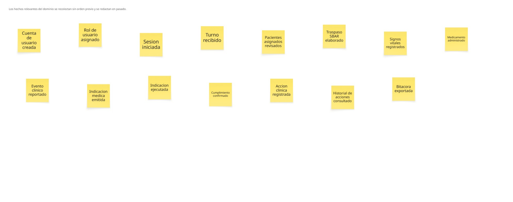
</p>

#### Paso 2: Timelines

Los eventos se ordenaron y se agruparon en cinco conjuntos según el momento del trabajo al que pertenecen: el acceso al sistema, el turno y su traspaso, el registro clínico durante la atención, las indicaciones médicas y la trazabilidad de lo registrado. Estas agrupaciones se mantienen durante el resto de la sesión y son las que en el paso diez se consolidan como bounded contexts.

<p align="center">
  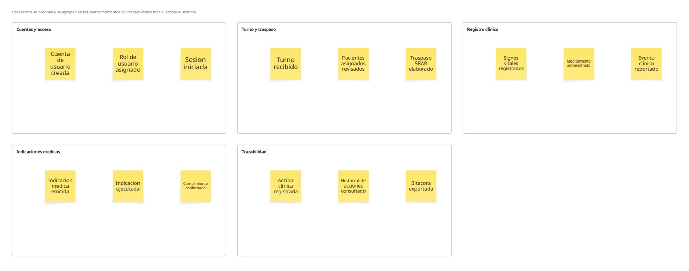
</p>

#### Paso 3: Pain Points

Sobre cada agrupación se marcaron, como rombos magenta, las preguntas que el proceso actual no resuelve. Corresponden uno a uno con hallazgos de las entrevistas: quién debería poder ver qué paciente, qué se pierde cuando el relevo es solo verbal, por qué se anota en papel y se transcribe al cierre, cómo confirma el médico que su indicación se ejecutó y quién registró un dato y en qué momento.

<p align="center">
  
</p>

#### Paso 4: Pivotal Points

Dentro de cada agrupación se señaló el momento que cambia la naturaleza del trabajo. En el turno, ese momento es el paso de recibir información a producirla; en el registro clínico, el paso de la rutina a la respuesta ante un evento; en las indicaciones, el paso de decidir a ejecutar. Estas divisiones anticipan la separación de responsabilidades que el paso diez formaliza.

<p align="center">
  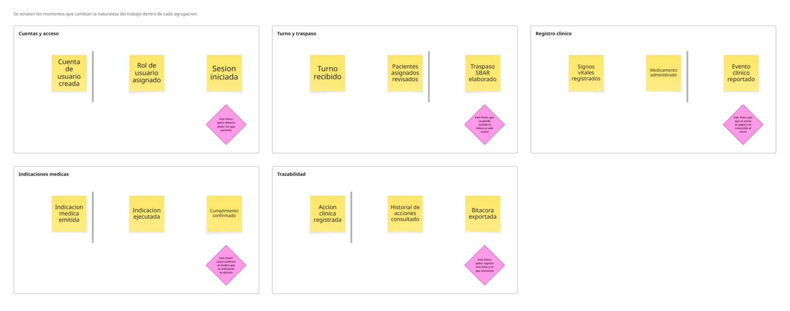
</p>

#### Paso 5: Commands

A la izquierda de cada evento se colocó la acción deliberada que lo provoca. El ejercicio dejó en claro que la mayor parte de los comandos recae sobre el personal de enfermería, mientras que el médico especialista interviene en un punto concreto, la emisión de la indicación. Esa asimetría explica el orden de priorización del Product Backlog del Capítulo III.

<p align="center">
  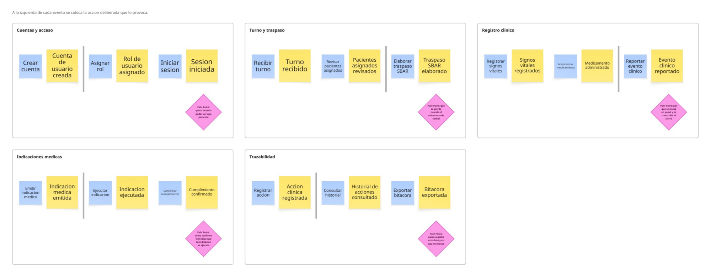
</p>

#### Paso 6: Policies

Se formularon las reglas del dominio que se disparan solas cuando ocurre un evento, sin que nadie las ordene. Entre ellas, que el acceso se limite a los pacientes del turno asignado, que un valor fuera de umbral genere alerta, que la ejecución de una indicación se notifique al médico que la emitió y que toda acción guarde responsable, fecha y hora sin que el profesional deba hacer nada adicional. Esta última sostiene el objetivo de trazabilidad declarado en BG-05.

<p align="center">
  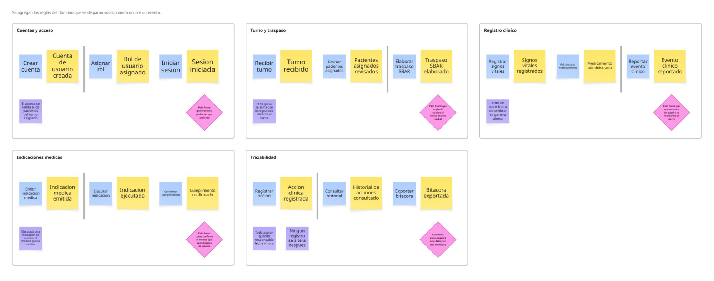
</p>

#### Paso 7: Read Models

Se identificó qué información necesita leer cada actor para decidir su siguiente acción. El ejercicio mostró que las vistas que requiere el médico especialista, el resumen clínico consolidado y el estado de las indicaciones vigentes, se construyen enteramente a partir de datos que produce el personal de enfermería. Sin ese registro previo, las vistas existen pero están vacías.

<p align="center">
  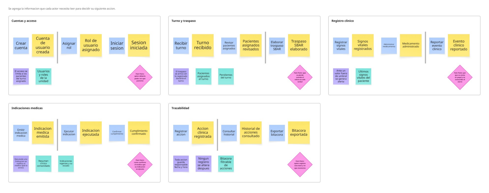
</p>

#### Paso 8: External Systems

Se incorporaron los sistemas y soportes ajenos a la plataforma que hoy intervienen en cada agrupación: el directorio de personal de la institución, la comunicación verbal en el relevo, los monitores biomédicos, la hoja de control en papel, el sistema de información hospitalaria, el registro de farmacia y los registros físicos del servicio. Su presencia confirma una decisión de alcance tomada en el Capítulo I: ClinicalSync no reemplaza el sistema hospitalario, convive con él.

<p align="center">
  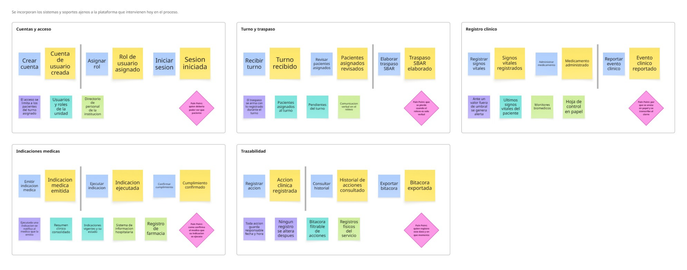
</p>

#### Paso 9: Aggregates

Sobre cada evento se marcó la entidad que protege la consistencia de su información. Resultaron ocho agregados: Usuario y Rol en el acceso; Turno y Traspaso SBAR en la gestión del relevo; Paciente y Registro Clínico en la atención; Indicación Médica en el ciclo de órdenes; y Bitácora de Auditoría en la trazabilidad. La Bitácora se modeló como agregado propio y no como atributo de los demás, porque su regla, que ninguna acción registrada pueda alterarse después, es distinta de la de cualquier otro agregado.

<p align="center">
  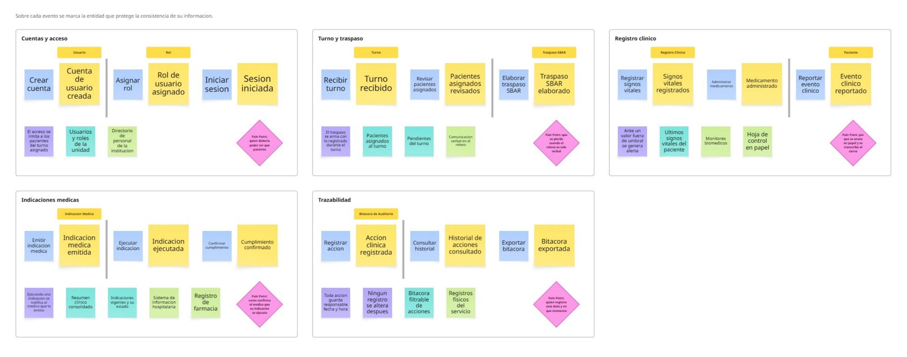
</p>

#### Paso 10: Bounded Contexts

Cada agrupación se consolidó como un contexto con vocabulario propio y se marcaron sus relaciones: Accounts and Access, Shift Management, Clinical Recording, Medical Orders y Traceability and Audit. Este frame constituye la vista final del Big Picture y es la entrada directa de la arquitectura orientada al dominio que se desarrolla en la sección 4.6.

<p align="center">
  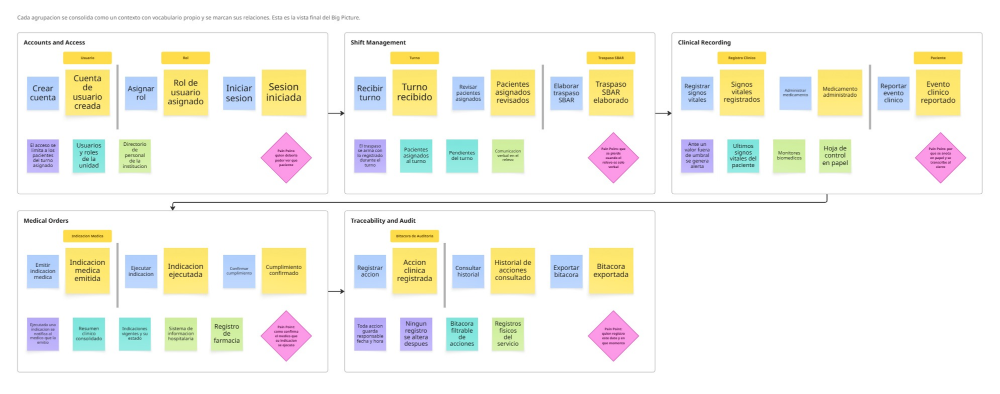
</p>

#### Conclusión del Big Picture Event Storming

El recorrido por los diez pasos deja una conclusión que condiciona el resto del proyecto: el dominio tiene una dependencia de sentido único. El personal de enfermería ejecuta la mayor parte de los comandos y produce los datos; el médico especialista los consume a través de read models que no existen si ese registro no ocurrió antes. Por eso los entregables dirigidos al personal de enfermería, el traspaso SBAR y el registro clínico, deben construirse antes que el resumen clínico y las alertas dirigidas al especialista.

La segunda conclusión es sobre el alcance. Los sistemas externos identificados en el paso ocho siguen presentes después de introducir la plataforma. ClinicalSync no los sustituye: se inserta entre ellos para que la información del turno deje de depender de la memoria y de la transcripción manual. Esa lectura es coherente con la delimitación del producto declarada en el Capítulo I y con la respuesta que la landing page ofrece en su sección de preguntas frecuentes.

### 2.5. Ubiquitous Language

El Ubiquitous Language establece el vocabulario común entre el equipo de desarrollo, los usuarios del dominio clínico y los artefactos del proyecto. Su función es evitar que un mismo concepto reciba nombres distintos según quién lo mencione, y que un mismo nombre designe cosas distintas según el contexto, ambos problemas frecuentes cuando un equipo técnico modela un dominio especializado del que no proviene.

Los términos recogidos aquí pertenecen al dominio del negocio, no a la implementación. Se priorizó el vocabulario efectivamente utilizado por el personal de enfermería y por los médicos especialistas durante las entrevistas, así como los conceptos que aparecieron en el Big Picture Event Storming. Cada término se presenta con su equivalente en inglés, que será el nombre empleado en el código y en la documentación técnica, de acuerdo con las convenciones establecidas para el proyecto.

#### Criterios de selección

- Relación directa con el dominio clínico cardiovascular y con el alcance definido para ClinicalSync.
- Uso recurrente en entrevistas, User Personas, User Task Matrix o Event Storming.
- Necesidad de precisión: se incluyen los términos cuya ambigüedad podría generar errores de modelado.
- Utilidad para la definición de bounded contexts, entidades y User Stories en los capítulos siguientes.
- Se excluyen conceptos técnicos de implementación y términos clínicos que no intervienen en el flujo modelado.

#### Glosario del dominio

##### Paciente y unidad asistencial

| Término (EN) | Equivalente (ES) | Definición |
|---|---|---|
| **Cardiovascular Patient** | Paciente cardiovascular | Persona con una condición del sistema cardiovascular que requiere vigilancia, registro y seguimiento clínico continuo. |
| **Cardiovascular Care Unit** | Unidad de cuidado cardiovascular | Área hospitalaria especializada en la atención y el monitoreo de pacientes con condiciones cardiovasculares. |
| **Assigned Patient** | Paciente asignado | Paciente que queda bajo la responsabilidad de un profesional durante un turno determinado. |
| **Patient Status** | Estado del paciente | Condición clínica actual del paciente, considerando signos vitales, evolución, eventos recientes y respuesta al tratamiento. |
| **Patient Priority** | Prioridad del paciente | Nivel de atención que requiere un paciente respecto de los demás, según su riesgo clínico. |

##### Turno y traspaso

| Término (EN) | Equivalente (ES) | Definición |
|---|---|---|
| **Clinical Shift** | Turno clínico | Periodo de trabajo durante el cual un profesional asume la responsabilidad asistencial sobre un conjunto de pacientes. |
| **Outgoing Shift** | Turno saliente | Equipo que finaliza su periodo de atención y entrega la información clínica al equipo siguiente. |
| **Incoming Shift** | Turno entrante | Equipo que inicia su periodo de atención y recibe la información del turno anterior. |
| **Shift Handover** | Traspaso de turno | Proceso mediante el cual el turno saliente transfiere al entrante la información clínica relevante de cada paciente. |
| **SBAR Report** | Reporte SBAR | Formato estructurado de comunicación clínica compuesto por situación, antecedentes, evaluación y recomendación. |
| **Situation** | Situación | Componente del SBAR que describe el motivo o el problema actual del paciente. |
| **Background** | Antecedentes | Componente del SBAR que resume la información previa relevante del caso. |
| **Assessment** | Evaluación | Componente del SBAR que expresa la valoración actual del profesional sobre el estado del paciente. |
| **Recommendation** | Recomendación | Componente del SBAR que indica la acción sugerida o el siguiente paso clínico. |
| **Handover Summary** | Resumen de traspaso | Información consolidada que se entrega al turno entrante para asegurar la continuidad de la atención. |
| **Continuity of Care** | Continuidad de atención | Mantenimiento coherente y seguro del cuidado del paciente entre turnos, profesionales y etapas clínicas. |

##### Registro clínico

| Término (EN) | Equivalente (ES) | Definición |
|---|---|---|
| **Clinical Record** | Registro clínico | Documentación formal de la información relevante del paciente generada durante la atención. |
| **Nursing Record** | Registro de enfermería | Registro elaborado por el personal de enfermería sobre cuidados, signos vitales, medicación, eventos y observaciones. |
| **Vital Signs** | Signos vitales | Parámetros fisiológicos básicos del paciente, tales como frecuencia cardíaca, presión arterial, frecuencia respiratoria, temperatura y saturación de oxígeno. |
| **Vital Signs Entry** | Toma de signos vitales | Registro puntual de los parámetros fisiológicos del paciente en un momento determinado. |
| **Medication Administration** | Administración de medicamento | Acción de suministrar un medicamento al paciente conforme a la indicación médica correspondiente. |
| **Clinical Note** | Nota clínica | Observación redactada por un profesional para dejar constancia de un hecho relevante no cubierto por los registros estructurados. |
| **Pending Documentation** | Documentación pendiente | Información clínica que ocurrió durante el turno pero que aún no ha sido registrada formalmente. |
| **Delayed Record** | Registro tardío | Registro efectuado con posterioridad al momento en que ocurrió la acción o el evento que documenta. |
| **Duplicate Record** | Registro duplicado | Información consignada en más de un soporte, lo que genera doble trabajo y riesgo de inconsistencia. |
| **Physical Record** | Registro físico | Anotación en papel utilizada como soporte temporal o complementario del registro digital. |

##### Vigilancia y eventos clínicos

| Término (EN) | Equivalente (ES) | Definición |
|---|---|---|
| **Patient Monitoring** | Monitoreo del paciente | Observación sistemática del estado del paciente con el fin de detectar cambios o riesgos clínicos. |
| **Clinical Evolution** | Evolución clínica | Secuencia de cambios observados en el estado del paciente durante un periodo determinado. |
| **Recent Evolution** | Evolución reciente | Conjunto de cambios clínicos ocurridos en el periodo inmediatamente anterior a la consulta o evaluación. |
| **Clinical Event** | Evento clínico | Situación relevante ocurrida durante la atención que debe registrarse, comunicarse o evaluarse. |
| **Critical Change** | Cambio crítico | Variación significativa del estado del paciente que puede requerir atención inmediata o decisión médica urgente. |
| **Clinical Deterioration** | Deterioro clínico | Empeoramiento del estado del paciente evidenciado por sus signos vitales, síntomas o respuesta al tratamiento. |
| **Clinical Alert** | Alerta clínica | Aviso generado ante un cambio, un riesgo o un evento relevante en el estado del paciente. |
| **Clinical Risk** | Riesgo clínico | Posibilidad de que una omisión, un retraso o un error de información afecte la seguridad del paciente. |

##### Indicaciones médicas

| Término (EN) | Equivalente (ES) | Definición |
|---|---|---|
| **Medical Indication** | Indicación médica | Orden emitida por el médico para ejecutar una acción clínica, administrar un medicamento o modificar un tratamiento. |
| **Updated Indication** | Indicación actualizada | Indicación modificada o añadida tras una nueva evaluación del paciente. |
| **Pending Indication** | Indicación pendiente | Indicación emitida cuya ejecución aún no ha sido realizada o confirmada. |
| **Indication Compliance** | Cumplimiento de indicación | Confirmación de que una indicación médica fue ejecutada, con constancia de responsable y momento. |
| **Clinical Decision** | Decisión clínica | Determinación adoptada por un profesional respecto del diagnóstico, tratamiento o seguimiento del paciente. |
| **Clinical Follow-up** | Seguimiento clínico | Evaluación posterior a una indicación, un evento o una intervención, para verificar su resultado. |

##### Trazabilidad y responsabilidad

| Término (EN) | Equivalente (ES) | Definición |
|---|---|---|
| **Clinical Traceability** | Trazabilidad clínica | Capacidad de determinar qué ocurrió, cuándo ocurrió, quién lo registró y qué modificaciones se realizaron. |
| **Responsible Staff** | Responsable clínico | Profesional de salud que ejecuta, registra o valida una acción clínica determinada. |
| **Audit Trail** | Bitácora de auditoría | Historial cronológico e inalterable de las operaciones realizadas sobre la información clínica. |
| **Timestamp** | Marca temporal | Fecha y hora exactas en que se produjo una acción o se registró un dato. |
| **Clinical Validation** | Validación clínica | Confirmación por parte de un profesional de que la información registrada es correcta y utilizable para decidir. |
| **Omission** | Omisión | Información o acción clínica que no fue registrada, comunicada o ejecutada oportunamente. |

##### Sistemas, soportes y carga de trabajo

| Término (EN) | Equivalente (ES) | Definición |
|---|---|---|
| **Hospital Information System** | Sistema de información hospitalaria | Plataforma institucional utilizada para registrar, consultar y administrar la información clínica y administrativa. |
| **Biomedical Monitor** | Monitor biomédico | Equipo que mide y despliega variables fisiológicas del paciente y emite alarmas ante valores fuera de rango. |
| **Clinical Dashboard** | Panel clínico | Vista organizada de la información clínica relevante, orientada a la interpretación rápida del estado del paciente. |
| **Information Fragmentation** | Fragmentación de información | Situación en la que la información clínica se distribuye entre múltiples fuentes, dificultando su consulta completa. |
| **Structured Communication** | Comunicación estructurada | Intercambio de información organizado bajo un formato definido, con el fin de reducir ambigüedad y omisiones. |
| **Operational Burden** | Carga operativa | Esfuerzo adicional generado por procesos manuales, duplicidad de registros o sistemas con exceso de pasos. |

#### Términos prioritarios del dominio

Aunque el glosario cubre el vocabulario completo del dominio modelado, los siguientes términos concentran el núcleo de la propuesta de valor de ClinicalSync y deben mantenerse estables a lo largo de todo el proyecto.

| Término | Razón de la priorización |
|---|---|
| **Shift Handover** | Es el momento del proceso donde se concentra el mayor riesgo de pérdida de información. |
| **SBAR Report** | Es la estructura sobre la que se construye la propuesta de traspaso del producto. |
| **Clinical Traceability** | Es el mecanismo que responde simultáneamente a las necesidades de ambos arquetipos. |
| **Vital Signs Entry** | Es la operación más frecuente del turno y la principal fuente de datos del sistema. |
| **Clinical Event** | Determina qué situaciones deben registrarse y comunicarse de forma prioritaria. |
| **Indication Compliance** | Cierra el ciclo entre la decisión médica y su ejecución operativa. |
| **Recent Evolution** | Es la unidad de información sobre la que se construye la vista consolidada del especialista. |
| **Information Fragmentation** | Nombra el problema central identificado en el Capítulo I y confirmado en el trabajo de campo. |

#### Relación con los demás artefactos del proyecto

| Artefacto | Relación con el Ubiquitous Language |
|---|---|
| **Entrevistas** | Aportan el vocabulario real de los usuarios y revelan las ambigüedades a resolver. |
| **User Personas** | Vinculan cada término con las necesidades del segmento que lo utiliza. |
| **User Task Matrix** | Relaciona los términos con las tareas concretas que los usuarios ejecutan. |
| **User Journey Mapping** | Sitúa los términos dentro del recorrido temporal del usuario. |
| **Big Picture Event Storming** | Emplea los términos para nombrar eventos, actores, problemas y oportunidades. |
| **User Stories (Capítulo III)** | Traduce los términos del dominio en necesidades funcionales verificables. |
| **Arquitectura de software (Capítulo IV)** | Utiliza los términos para delimitar bounded contexts, entidades y responsabilidades. |

#### Conclusión del Ubiquitous Language

El vocabulario definido en esta sección permite que el equipo discuta el producto en los mismos términos que emplean los profesionales del dominio, lo que reduce el margen de interpretación en la especificación de requisitos y en el modelado del software. Su adopción es una condición para que los artefactos de los capítulos siguientes sean consistentes entre sí.

Este glosario no es definitivo: se ampliará y precisará conforme avance el proyecto, en particular tras el Design-Level Event Storming del Capítulo IV, donde los términos aquí definidos se traducirán en agregados, entidades y comandos concretos del modelo de dominio.

---

## Capítulo III: Requirements Specification

Este capítulo traduce los hallazgos del Capítulo II en requisitos verificables. Las necesidades identificadas en las entrevistas, los artefactos de Needfinding y el Big Picture Event Storming se expresan aquí como Epics, User Stories y Technical Stories, se conectan con los objetivos de negocio mediante el Impact Mapping y se ordenan en un Product Backlog priorizado que guiará la implementación descrita en el Capítulo V.

### 3.1. User Stories

Esta sección presenta el conjunto de Epics, User Stories y Technical Stories definidos para ClinicalSync. Su elaboración parte de la evidencia recogida en el capítulo anterior: las tareas identificadas en la User Task Matrix, los puntos de fricción de los User Journey Maps, los problemas y oportunidades del Event Storming y el vocabulario fijado en el Ubiquitous Language.

Las User Stories expresan necesidades funcionales desde la perspectiva de los usuarios finales, es decir, el personal de enfermería cardiovascular, los médicos especialistas y los visitantes del sitio promocional. Las Technical Stories expresan las necesidades técnicas que sostienen esas funcionalidades, principalmente los recursos del RESTful API, la autenticación por roles y el despliegue de la solución.

Los criterios de aceptación se redactan en formato Gherkin, con la estructura Given – When – Then. Se mantienen en tiempo presente y tercera persona, se evita referirse a detalles específicos de la interfaz gráfica y cada condición se formula de manera comprobable. Los Epics no incluyen criterios de aceptación, ya que funcionan como agrupadores: la verificación se realiza sobre las historias que contienen.

| Epic ID | Nombre del Epic | Alcance |
|---|---|---|
| **EP-01** | Landing Page informativa | Presentación pública de la propuesta de valor y captación de interés institucional. |
| **EP-02** | Gestión de traspaso clínico SBAR | Registro, consulta y confirmación del relevo estructurado entre turnos. |
| **EP-03** | Registro clínico del paciente | Captura de signos vitales, medicación administrada y eventos clínicos durante el turno. |
| **EP-04** | Indicaciones médicas y cumplimiento | Emisión, consulta y confirmación de ejecución de las órdenes médicas. |
| **EP-05** | Soporte a la decisión clínica | Vista consolidada, evolución reciente, alertas y priorización de pacientes. |
| **EP-06** | Trazabilidad y auditoría clínica | Registro verificable de responsable, momento y tipo de cada acción. |
| **EP-07** | RESTful API y plataforma | Recursos del API, seguridad, documentación y despliegue de la solución. |

#### Cuadro de Epics, User Stories y Technical Stories

| Epic / Story ID | Título | Descripción | Criterios de Aceptación | Relacionado con (Epic ID) |
|---|---|---|---|---|
| **EP-01** | **Landing Page informativa** | Como visitante del sitio web, quiero conocer la propuesta de valor, el funcionamiento, los beneficios, los planes y los canales de contacto de ClinicalSync para evaluar si la solución responde a las necesidades de mi centro de salud. | — | — |
| **US-01** | Visualizar la landing page | Como visitante, quiero visualizar la landing page de ClinicalSync para conocer con rapidez la solución propuesta. | **Given** que el visitante accede a la dirección del sitio, **When** la página termina de cargar, **Then** el sistema muestra la información general de ClinicalSync. <br><br> **Given** que el visitante utiliza un navegador compatible, **When** ingresa al sitio, **Then** el contenido principal se muestra sin errores de carga. | EP-01 |
| **US-02** | Conocer la propuesta de valor | Como visitante, quiero conocer la propuesta de valor de ClinicalSync para entender qué problema clínico resuelve. | **Given** que el visitante se encuentra en la sección principal, **When** revisa el contenido destacado, **Then** el sistema comunica el enfoque en continuidad asistencial cardiovascular. <br><br> **Given** que el visitante recorre la sección, **When** llega a su final, **Then** el sistema ofrece una acción para conocer más sobre la solución. | EP-01 |
| **US-03** | Comprender el problema que resuelve la solución | Como visitante, quiero entender por qué existe ClinicalSync para reconocer el problema actual de información clínica dispersa. | **Given** que el visitante consulta la sección de problema, **When** lee su contenido, **Then** el sistema describe la fragmentación de información y la pérdida de datos entre turnos. <br><br> **Given** que la sección incluye datos de contexto, **When** el visitante los revisa, **Then** el sistema indica la fuente de cada dato presentado. | EP-01 |
| **US-04** | Revisar cómo funciona la plataforma | Como visitante, quiero conocer el funcionamiento de ClinicalSync en pasos simples para comprender el flujo general de uso. | **Given** que el visitante accede a la sección de funcionamiento, **When** la revisa, **Then** el sistema presenta el flujo en pasos ordenados y numerados. <br><br> **Given** que el visitante finaliza la lectura de los pasos, **When** continúa navegando, **Then** el sistema lo conduce a las características de la solución. | EP-01 |
| **US-05** | Visualizar las características clave | Como visitante, quiero conocer las características principales de ClinicalSync para evaluar si cubre las necesidades de un área cardiovascular. | **Given** que el visitante consulta la sección de características, **When** lee su contenido, **Then** el sistema presenta el traspaso SBAR, el registro de signos vitales, los eventos clínicos y la trazabilidad. <br><br> **Given** que el visitante selecciona una característica, **When** la despliega, **Then** el sistema muestra su descripción ampliada. | EP-01 |
| **US-06** | Revisar los beneficios según el perfil | Como visitante, quiero revisar los beneficios de ClinicalSync para comprender el valor que aporta a mi rol dentro del entorno clínico. | **Given** que el visitante consulta la sección de beneficios, **When** la revisa, **Then** el sistema diferencia los beneficios para personal de enfermería, médicos especialistas e institución. <br><br> **Given** que el visitante pertenece a uno de esos perfiles, **When** identifica su sección, **Then** el sistema presenta beneficios expresados en términos operativos. | EP-01 |
| **US-07** | Consultar los planes y el modelo de servicio | Como visitante con responsabilidad de decisión, quiero conocer los planes disponibles para estimar la viabilidad económica de la solución. | **Given** que el visitante accede a la sección de planes, **When** la revisa, **Then** el sistema muestra los planes disponibles con las funcionalidades incluidas en cada uno. <br><br> **Given** que el visitante selecciona un plan, **When** solicita más información, **Then** el sistema lo dirige al formulario de contacto con el plan preseleccionado. | EP-01 |
| **US-08** | Consultar las preguntas frecuentes | Como visitante, quiero revisar las preguntas frecuentes para resolver dudas sobre el alcance y el uso de la solución. | **Given** que el visitante accede a la sección de preguntas frecuentes, **When** selecciona una pregunta, **Then** el sistema despliega su respuesta. <br><br> **Given** que una respuesta está desplegada, **When** el visitante selecciona otra pregunta, **Then** el sistema mantiene la navegación sin recargar la página. | EP-01 |
| **US-09** | Conocer al equipo | Como visitante, quiero conocer al equipo detrás de ClinicalSync para identificar quiénes desarrollan la solución. | **Given** que el visitante accede a la sección del equipo, **When** la revisa, **Then** el sistema muestra a los integrantes con su rol dentro del proyecto. <br><br> **Given** que el visitante desea ampliar la información, **When** selecciona a un integrante, **Then** el sistema muestra su descripción profesional. | EP-01 |
| **US-10** | Solicitar información o una demostración | Como visitante interesado, quiero enviar mis datos mediante un formulario para solicitar información o una demostración de la plataforma. | **Given** que el visitante completa los campos obligatorios, **When** envía el formulario, **Then** el sistema confirma la recepción de la solicitud. <br><br> **Given** que uno o más campos obligatorios están vacíos o mal formados, **When** el visitante intenta enviar, **Then** el sistema señala los campos a corregir y no envía la solicitud. | EP-01 |
| **US-11** | Cambiar el idioma del sitio | Como visitante, quiero alternar el idioma del sitio entre español e inglés para revisar la información en el idioma de mi preferencia. | **Given** que el visitante se encuentra en cualquier sección, **When** selecciona otro idioma, **Then** el sistema traduce el contenido manteniendo la sección actual. <br><br> **Given** que el visitante ya seleccionó un idioma, **When** vuelve a ingresar al sitio, **Then** el sistema conserva esa preferencia. | EP-01 |
| **US-12** | Acceder desde dispositivos móviles | Como visitante, quiero acceder al sitio desde un dispositivo móvil para revisar la información desde cualquier lugar. | **Given** que el visitante ingresa desde una pantalla reducida, **When** la página carga, **Then** el sistema adapta la disposición del contenido sin desbordamiento horizontal. <br><br> **Given** que el visitante navega desde un dispositivo táctil, **When** utiliza los elementos interactivos, **Then** el sistema responde correctamente a la interacción táctil. | EP-01 |
| **EP-02** | **Gestión de traspaso clínico SBAR** | Como personal clínico, quiero estructurar la información del cambio de turno para reducir omisiones y asegurar la continuidad de la atención. | — | — |
| **US-13** | Registrar un traspaso SBAR | Como enfermero cardiovascular, quiero registrar el traspaso de un paciente usando la estructura SBAR para comunicar su estado al turno entrante. | **Given** que el enfermero completa las cuatro secciones del formato SBAR, **When** guarda el traspaso, **Then** el sistema lo asocia al paciente y al turno correspondiente. <br><br> **Given** que alguna de las cuatro secciones está vacía, **When** el enfermero intenta guardar, **Then** el sistema indica qué sección falta y no registra el traspaso. | EP-02 |
| **US-14** | Consultar el traspaso del turno anterior | Como enfermero entrante, quiero consultar el traspaso del turno saliente para continuar la atención sin perder información. | **Given** que existe un traspaso registrado para el paciente, **When** el enfermero accede a su ficha, **Then** el sistema muestra el traspaso más reciente con sus cuatro secciones. <br><br> **Given** que el enfermero tiene varios pacientes asignados, **When** consulta el listado de traspasos, **Then** el sistema muestra únicamente los correspondientes a esos pacientes. | EP-02 |
| **US-15** | Confirmar la recepción del traspaso | Como enfermero entrante, quiero confirmar que recibí el traspaso para dejar constancia de que asumo la responsabilidad del paciente. | **Given** que el enfermero consultó un traspaso, **When** confirma su recepción, **Then** el sistema registra la confirmación con su identidad y la hora. <br><br> **Given** que un traspaso no ha sido confirmado, **When** se consulta su estado, **Then** el sistema lo presenta como pendiente de recepción. | EP-02 |
| **US-16** | Generar el traspaso a partir de lo registrado | Como enfermero saliente, quiero que el traspaso se preconstruya con la información ya registrada durante mi turno para no redactarla nuevamente. | **Given** que el enfermero registró signos vitales, medicación y eventos durante el turno, **When** inicia un nuevo traspaso, **Then** el sistema precarga esa información en las secciones correspondientes. <br><br> **Given** que la información precargada requiere ajustes, **When** el enfermero la edita, **Then** el sistema conserva sus modificaciones al guardar. | EP-02 |
| **EP-03** | **Registro clínico del paciente** | Como personal de enfermería, quiero registrar la información clínica en el momento en que ocurre para evitar la duplicidad con anotaciones en papel y el registro tardío. | — | — |
| **US-17** | Consultar los pacientes asignados | Como enfermero, quiero ver los pacientes que tengo a cargo en mi turno para organizar mi trabajo desde el inicio de la guardia. | **Given** que el enfermero inicia sesión, **When** accede a su vista principal, **Then** el sistema muestra únicamente los pacientes asignados a su turno. <br><br> **Given** que un paciente presenta un estado crítico, **When** se muestra el listado, **Then** el sistema lo distingue visualmente del resto. | EP-03 |
| **US-18** | Registrar signos vitales | Como enfermero cardiovascular, quiero registrar los signos vitales del paciente para mantener actualizada su condición sin recurrir a anotaciones en papel. | **Given** que el enfermero completa los parámetros requeridos, **When** guarda el registro, **Then** el sistema lo asocia al paciente con la fecha y hora de la toma. <br><br> **Given** que un valor ingresado está fuera del rango fisiológico admitido, **When** el enfermero intenta guardar, **Then** el sistema solicita su confirmación antes de registrarlo. | EP-03 |
| **US-19** | Registrar la administración de un medicamento | Como enfermero, quiero dejar constancia del medicamento administrado para que el equipo conozca qué se aplicó, en qué dosis y a qué hora. | **Given** que el enfermero registra una administración, **When** la guarda, **Then** el sistema deja constancia del medicamento, la dosis, la hora y el responsable. <br><br> **Given** que la administración corresponde a una indicación vigente, **When** se registra, **Then** el sistema la vincula a esa indicación. | EP-03 |
| **US-20** | Registrar un evento clínico relevante | Como enfermero, quiero registrar los eventos clínicos ocurridos durante el turno para que queden documentados y disponibles para el equipo. | **Given** que el enfermero describe un evento clínico, **When** lo guarda, **Then** el sistema lo registra con su hora de ocurrencia y su responsable. <br><br> **Given** que el evento se clasifica como crítico, **When** se guarda, **Then** el sistema lo destaca en la vista del paciente. | EP-03 |
| **US-21** | Identificar la documentación pendiente | Como enfermero, quiero conocer qué información me falta registrar antes de cerrar mi turno para no entregar la guardia con datos incompletos. | **Given** que existen registros incompletos del turno, **When** el enfermero consulta su resumen de cierre, **Then** el sistema enumera los pendientes por paciente. <br><br> **Given** que no queda documentación pendiente, **When** se consulta el resumen, **Then** el sistema indica que el turno está completo. | EP-03 |
| **EP-04** | **Indicaciones médicas y cumplimiento** | Como equipo clínico, quiero que las indicaciones médicas y su ejecución queden registradas para cerrar el ciclo entre lo que se ordena y lo que efectivamente se realiza. | — | — |
| **US-22** | Emitir una indicación médica | Como médico especialista, quiero registrar una indicación para que el personal de enfermería la ejecute con la información necesaria. | **Given** que el médico completa los datos de la indicación, **When** la emite, **Then** el sistema la asocia al paciente y la deja visible para el personal de enfermería. <br><br> **Given** que la indicación reemplaza a una anterior, **When** se emite, **Then** el sistema conserva la anterior en el historial y marca la nueva como vigente. | EP-04 |
| **US-23** | Consultar las indicaciones vigentes | Como enfermero, quiero consultar las indicaciones activas de un paciente para ejecutar el tratamiento correcto y actualizado. | **Given** que el paciente tiene indicaciones registradas, **When** el enfermero accede a su ficha, **Then** el sistema muestra únicamente las vigentes. <br><br> **Given** que una indicación fue modificada, **When** el enfermero la consulta, **Then** el sistema señala que existe una versión previa. | EP-04 |
| **US-24** | Registrar el cumplimiento de una indicación | Como enfermero, quiero confirmar que ejecuté una indicación para dejar constancia de su cumplimiento. | **Given** que el enfermero ejecutó una indicación, **When** registra su cumplimiento, **Then** el sistema deja constancia del responsable y la hora de ejecución. <br><br> **Given** que una indicación fue cumplida, **When** se consulta su estado, **Then** el sistema la presenta como ejecutada. | EP-04 |
| **US-25** | Identificar las indicaciones pendientes | Como médico especialista, quiero saber qué indicaciones aún no se han ejecutado para tomar decisiones sobre información confirmada. | **Given** que existen indicaciones sin cumplimiento registrado, **When** el médico consulta al paciente, **Then** el sistema las presenta como pendientes. <br><br> **Given** que una indicación pendiente supera su plazo previsto, **When** se muestra el listado, **Then** el sistema la destaca sobre las demás. | EP-04 |
| **EP-05** | **Soporte a la decisión clínica** | Como médico especialista, quiero comprender el estado del paciente sin reconstruirlo manualmente desde varias fuentes para decidir con rapidez y con información completa. | — | — |
| **US-26** | Consultar el resumen clínico del paciente | Como médico especialista, quiero ver en una sola vista la información relevante del paciente para evaluar su estado sin recorrer varios módulos. | **Given** que el médico accede a un paciente, **When** se abre su ficha, **Then** el sistema muestra en una vista los últimos signos vitales, la medicación reciente, los eventos del periodo y las indicaciones vigentes. <br><br> **Given** que el médico necesita ampliar un dato del resumen, **When** lo selecciona, **Then** el sistema muestra su detalle completo. | EP-05 |
| **US-27** | Revisar la evolución reciente | Como médico especialista, quiero revisar cómo evolucionó el paciente en las últimas horas para identificar tendencias en su condición. | **Given** que existen registros de signos vitales del periodo, **When** el médico consulta la evolución, **Then** el sistema los presenta ordenados cronológicamente. <br><br> **Given** que el médico define un rango de tiempo, **When** aplica el filtro, **Then** el sistema muestra únicamente los registros de ese rango. | EP-05 |
| **US-28** | Identificar cambios críticos mediante alertas | Como profesional clínico, quiero que el sistema señale los cambios críticos del paciente para reaccionar oportunamente. | **Given** que un registro supera un umbral definido como crítico, **When** se guarda, **Then** el sistema genera una alerta visible en la vista del paciente. <br><br> **Given** que una alerta fue atendida, **When** el profesional la marca como revisada, **Then** el sistema deja constancia de quién la atendió y cuándo. | EP-05 |
| **US-29** | Priorizar los pacientes según su riesgo | Como profesional clínico, quiero que los pacientes se ordenen según su nivel de riesgo para atender primero los casos más delicados. | **Given** que existen pacientes con alertas activas, **When** se muestra el listado, **Then** el sistema los ubica antes que los pacientes estables. <br><br> **Given** que el estado de un paciente cambia, **When** se registra la variación, **Then** el sistema actualiza su posición en el listado. | EP-05 |
| **EP-06** | **Trazabilidad y auditoría clínica** | Como institución de salud, quiero que toda acción clínica quede registrada con su responsable y su momento para poder auditar la atención brindada. | — | — |
| **US-30** | Consultar la bitácora de acciones del paciente | Como coordinador clínico, quiero revisar el historial de acciones registradas sobre un paciente para verificar la continuidad de su atención. | **Given** que existen acciones registradas, **When** el coordinador consulta la bitácora, **Then** el sistema las presenta en orden cronológico con su tipo, responsable y hora. <br><br> **Given** que el coordinador filtra por tipo de acción o por rango de fechas, **When** aplica el filtro, **Then** el sistema muestra únicamente los registros correspondientes. | EP-06 |
| **US-31** | Identificar al responsable de un registro | Como profesional clínico, quiero saber quién realizó un registro determinado para confirmar su origen antes de tomar una decisión. | **Given** que el profesional consulta cualquier registro clínico, **When** revisa su detalle, **Then** el sistema muestra el responsable y la fecha y hora de la acción. <br><br> **Given** que un registro fue modificado posteriormente, **When** se consulta, **Then** el sistema indica que existe un historial de cambios. | EP-06 |
| **US-32** | Consultar el historial de cambios de un registro | Como coordinador clínico, quiero conocer las modificaciones aplicadas a un registro para verificar qué se cambió y quién lo hizo. | **Given** que un registro fue modificado, **When** el coordinador consulta su historial, **Then** el sistema muestra cada versión con su responsable y su momento. <br><br> **Given** que un registro nunca fue modificado, **When** se consulta su historial, **Then** el sistema muestra únicamente su versión original. | EP-06 |
| **EP-07** | **RESTful API y plataforma** | Como equipo de desarrollo, quiero disponer de un API REST documentada, segura y desplegada para sostener las funcionalidades de la aplicación web y la landing page. | — | — |
| **TS-01** | Autenticación y autorización por roles | Como desarrollador, quiero implementar autenticación y control de acceso por roles para que cada usuario acceda únicamente a lo que le corresponde. | **Given** que un usuario envía credenciales válidas, **When** el API las procesa, **Then** responde con un token de acceso y estado 200. <br><br> **Given** que un usuario solicita un recurso ajeno a su rol, **When** el API recibe la petición, **Then** responde con estado 403 y no expone el recurso. | EP-07 |
| **TS-02** | Gestión de pacientes mediante API | Como desarrollador, quiero exponer los recursos de pacientes para que la aplicación web consulte y administre su información. | **Given** que se solicita la lista de pacientes de un turno, **When** el API procesa la petición, **Then** responde con la colección correspondiente y estado 200. <br><br> **Given** que se solicita un paciente inexistente, **When** el API procesa la petición, **Then** responde con estado 404. | EP-07 |
| **TS-03** | Gestión de registros clínicos mediante API | Como desarrollador, quiero exponer los recursos de signos vitales, medicación y eventos clínicos para permitir su registro y consulta desde la aplicación. | **Given** que se envía un registro clínico válido, **When** el API lo procesa, **Then** lo persiste y responde con estado 201. <br><br> **Given** que el cuerpo de la petición omite un campo obligatorio, **When** el API la recibe, **Then** responde con estado 400 e indica el campo faltante. | EP-07 |
| **TS-04** | Gestión de traspasos SBAR mediante API | Como desarrollador, quiero exponer los recursos de traspaso de turno para permitir su creación, consulta y confirmación desde la aplicación. | **Given** que se envía un traspaso con sus cuatro secciones completas, **When** el API lo procesa, **Then** lo persiste y responde con estado 201. <br><br> **Given** que se confirma la recepción de un traspaso, **When** el API procesa la petición, **Then** actualiza su estado y responde con estado 200. | EP-07 |
| **TS-05** | Gestión de indicaciones médicas mediante API | Como desarrollador, quiero exponer los recursos de indicaciones médicas para soportar su emisión, consulta y registro de cumplimiento. | **Given** que se emite una indicación válida, **When** el API la procesa, **Then** la persiste como vigente y responde con estado 201. <br><br> **Given** que se registra el cumplimiento de una indicación, **When** el API lo procesa, **Then** actualiza su estado y conserva la indicación original. | EP-07 |
| **TS-06** | Registro automático de trazabilidad | Como desarrollador, quiero que el API registre automáticamente el responsable y el momento de cada operación para garantizar la trazabilidad sin depender del usuario. | **Given** que se ejecuta una operación de escritura autenticada, **When** el API la procesa, **Then** almacena el identificador del usuario y la marca temporal junto al registro. <br><br> **Given** que se consulta la bitácora de un recurso, **When** el API procesa la petición, **Then** responde con las entradas ordenadas cronológicamente. | EP-07 |
| **TS-07** | Manejo consistente de errores del API | Como desarrollador, quiero que el API responda los errores con una estructura uniforme para que el cliente pueda interpretarlos de manera predecible. | **Given** que ocurre un error en cualquier recurso, **When** el API construye la respuesta, **Then** utiliza el mismo formato de mensaje y el código HTTP correspondiente. <br><br> **Given** que se produce un error no controlado, **When** el API responde, **Then** no expone detalles internos de la implementación. | EP-07 |
| **TS-08** | Documentación del API con OpenAPI | Como desarrollador, quiero documentar el API siguiendo OpenAPI para que el equipo pueda consultar y probar los recursos disponibles. | **Given** que el servicio está en ejecución, **When** se accede a la ruta de documentación, **Then** el sistema muestra la especificación con todos los recursos publicados. <br><br> **Given** que se incorpora un recurso nuevo, **When** se actualiza el servicio, **Then** la documentación refleja ese recurso. | EP-07 |
| **TS-09** | Despliegue de la landing page y la aplicación web | Como desarrollador, quiero automatizar el despliegue para que la solución esté disponible públicamente y actualizada. | **Given** que se integran cambios en la rama principal, **When** se ejecuta el flujo de despliegue, **Then** el sitio publicado refleja esos cambios. <br><br> **Given** que la aplicación está publicada, **When** se solicitan sus recursos estáticos, **Then** el servidor los entrega sin errores de recurso no encontrado. | EP-07 |

En total se definieron 7 Epics, 32 User Stories y 9 Technical Stories. La cobertura responde a los hallazgos del capítulo anterior: EP-02 atiende el punto de mayor riesgo identificado en las entrevistas y en el Event Storming, que es la pérdida de información en el cambio de turno; EP-03 responde a la necesidad de registrar durante la atención y no al cierre del turno; EP-04 cierra el ciclo entre la indicación emitida y su ejecución confirmada; EP-05 atiende la fase más costosa del recorrido del médico especialista, que es la consolidación previa a la decisión; y EP-06 convierte la trazabilidad en una capacidad transversal y no en una característica aislada.

### 3.2. Impact Mapping

El Impact Mapping conecta los objetivos de negocio de ClinicalSync con los actores capaces de contribuir a ellos, los cambios de comportamiento que se espera provocar, los entregables digitales que los harían posibles y las User Stories que los materializan. Su utilidad está en verificar que cada historia del backlog persigue un objetivo declarado: si una historia no puede rastrearse hasta un Business Goal, es candidata a salir del alcance.

El artefacto responde a cuatro preguntas encadenadas:

| Elemento | Pregunta que responde |
|---|---|
| **Business Goal** | ¿Qué objetivo de negocio se busca alcanzar? |
| **Actor** | ¿Quién puede contribuir a alcanzarlo? |
| **Impact** | ¿Qué debería hacer ese actor, de forma distinta a hoy, para contribuir? |
| **Deliverable** | ¿Qué se puede construir para provocar ese cambio de comportamiento? |

#### Business Goals SMART

Los objetivos se formulan bajo criterios SMART, es decir, específicos, medibles, alcanzables, relevantes y acotados en el tiempo. Los plazos se definen respecto de la publicación de la solución.

| ID | Business Goal |
|---|---|
| **BG-01** | Conseguir que al menos **50 visitantes** soliciten información o una demostración a través de la landing page durante los primeros **4 meses** posteriores a su publicación. |
| **BG-02** | Lograr que al menos **3 áreas clínicas cardiovasculares** validen el flujo de traspaso SBAR digital en sesiones de prueba durante los primeros **6 meses** del proyecto. |
| **BG-03** | Reducir en **30%** el tiempo que un profesional emplea en reunir la información necesaria para evaluar a un paciente, medido en escenarios simulados, en un plazo de **6 meses**. |
| **BG-04** | Conseguir que al menos el **80%** del personal participante en las pruebas piloto registre signos vitales, eventos y traspasos en la plataforma sin recurrir a anotaciones en papel, durante un periodo de **3 meses**. |
| **BG-05** | Alcanzar un **95%** de acciones clínicas registradas con responsable, fecha, hora y tipo de acción completos durante las pruebas piloto, en un plazo de **6 meses**. |

#### Actores considerados

| Actor | Rol respecto de los objetivos |
|---|---|
| **Daniela Ríos** — personal de enfermería cardiovascular | Produce la información clínica del turno. Su adopción determina si el sistema contiene datos y si el traspaso deja de depender de la memoria. |
| **Dr. Alejandro Torres** — médico especialista cardiovascular | Consume y valida la información. Su adopción determina si la información registrada se traduce en decisiones más rápidas y mejor sustentadas. |
| **Coordinador o jefe de servicio** | Decide la incorporación de la herramienta en la unidad y responde por la trazabilidad del proceso. |
| **Visitante de la landing page** | Representa al decisor institucional que evalúa la solución antes de solicitar una demostración. |

#### Mapa de impacto

| Business Goal | Actor | Impact (cambio de comportamiento esperado) | Deliverable | User Stories |
|---|---|---|---|---|
| **BG-01** | Visitante de la landing page | Comprende la propuesta de valor sin explicación previa y solicita una demostración. | Landing page con problema, funcionamiento, características, beneficios, planes y formulario de contacto. | US-01, US-02, US-03, US-04, US-05, US-06, US-07 |
| **BG-01** | Visitante de la landing page | Resuelve sus dudas iniciales y confía en el equipo antes de contactar. | Sección de preguntas frecuentes, presentación del equipo y formulario de solicitud. | US-08, US-09, US-10 |
| **BG-01** | Visitante de la landing page | Accede a la información desde cualquier dispositivo y en su idioma. | Sitio adaptable e internacionalizado. | US-11, US-12 |
| **BG-02** | Personal de enfermería | Realiza el relevo sobre un formato estructurado en lugar de transmitirlo verbalmente. | Módulo de traspaso SBAR con secciones obligatorias. | US-13, US-16 |
| **BG-02** | Personal de enfermería | Consulta y confirma explícitamente el traspaso recibido al iniciar su turno. | Consulta de traspasos y confirmación de recepción. | US-14, US-15 |
| **BG-02** | Coordinador de servicio | Verifica que los traspasos se realizan y quedan documentados. | Bitácora de traspasos con estado y responsable. | US-30, US-31 |
| **BG-03** | Médico especialista | Evalúa al paciente desde una vista consolidada en lugar de reunir datos de varias fuentes. | Resumen clínico del paciente y vista de evolución reciente. | US-26, US-27 |
| **BG-03** | Médico especialista | Detecta antes los cambios críticos y prioriza a quién atender primero. | Alertas sobre umbrales y ordenamiento por riesgo. | US-28, US-29 |
| **BG-03** | Médico especialista | Confirma el cumplimiento de sus indicaciones sin consultar verbalmente al personal. | Ciclo de indicación, ejecución y confirmación. | US-22, US-23, US-24, US-25 |
| **BG-04** | Personal de enfermería | Registra durante la atención en lugar de anotar en papel y transcribir al cierre. | Registro rápido de signos vitales, medicación y eventos desde dispositivo portátil. | US-18, US-19, US-20 |
| **BG-04** | Personal de enfermería | Organiza su turno desde la plataforma y cierra la guardia sin documentación pendiente. | Vista de pacientes asignados y resumen de pendientes del turno. | US-17, US-21 |
| **BG-05** | Todo el equipo clínico | Deja constancia verificable de cada acción sin esfuerzo adicional de su parte. | Registro automático de responsable y marca temporal en cada operación. | US-31, US-32, TS-06 |
| **BG-05** | Coordinador de servicio | Audita la atención brindada a partir del historial del sistema y no de registros físicos. | Bitácora consultable y filtrable por paciente, tipo de acción y periodo. | US-30, US-32 |

<p align="center">
  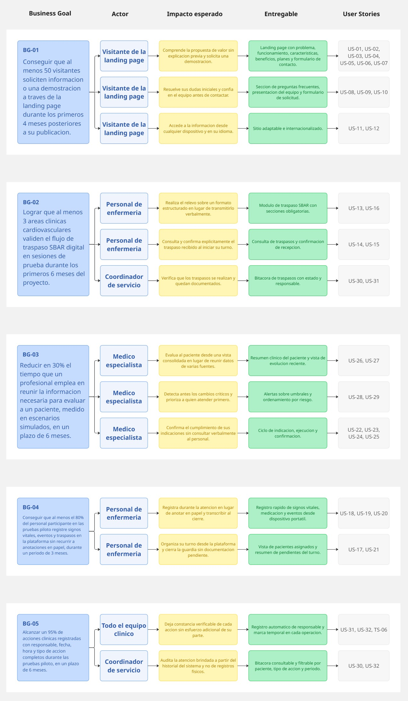
</p>

<p align="center">
  <em>Elaborado en Miro. Tablero del artefacto: <a href="https://miro.com/app/board/uXjVHl_mGsg=/">Impact Mapping ClinicalSync</a>.</em>
</p>

#### Conclusión del Impact Mapping

El mapa evidencia que los objetivos de ClinicalSync dependen de dos cambios de comportamiento distintos y secuenciales. El primero corresponde al personal de enfermería, que debe pasar del registro en papel al registro en la plataforma durante la atención; sin ese cambio, el sistema no contiene información y ningún otro objetivo es alcanzable. El segundo corresponde al médico especialista, que debe pasar de reconstruir el estado del paciente a consultarlo consolidado.

Esta dependencia tiene una consecuencia directa sobre la priorización: los entregables dirigidos a Daniela Ríos deben construirse antes que los dirigidos al Dr. Alejandro Torres, porque los segundos carecen de valor sin los datos que producen los primeros. El Product Backlog de la sección siguiente refleja ese orden.

### 3.3. Product Backlog

El Product Backlog ordena las User Stories y Technical Stories según la secuencia de entregas definida por el equipo. El orden no responde a la numeración de las historias ni únicamente a sus dependencias técnicas, sino al plan de construcción del producto: primero la landing page, luego la interfaz de la aplicación web, después los servicios que la sostienen y finalmente la solución integrada.

Esta secuencia obedece a que cada entrega debe ser demostrable por sí misma. La landing page se publica primero porque no depende de ninguna otra pieza y permite comenzar la captación de interés institucional. La interfaz de la aplicación web se construye a continuación sobre datos simulados, lo que permite validar los flujos clínicos con usuarios reales antes de invertir en la implementación de los servicios. El RESTful API se desarrolla después, ya con los flujos validados y los recursos claramente delimitados. La última entrega incorpora las funcionalidades que solo cobran sentido con la solución completa e integrada, como las alertas por umbrales o la bitácora de auditoría.

La estimación se expresa en Story Points siguiendo la sucesión de Fibonacci (1, 2, 3, 5, 8). El valor representa el esfuerzo relativo considerando complejidad, incertidumbre y volumen de trabajo, y no una cantidad de horas.

| Orden | Entrega | Story ID | Título | Descripción | Story Points |
|---:|---|---|---|---|---:|
| 1 | Entrega 1 — Landing Page | US-01 | Visualizar la landing page | Como visitante, quiero visualizar la landing page para conocer la solución propuesta. | 2 |
| 2 | Entrega 1 — Landing Page | US-02 | Conocer la propuesta de valor | Como visitante, quiero conocer la propuesta de valor para entender qué problema resuelve. | 2 |
| 3 | Entrega 1 — Landing Page | US-03 | Comprender el problema que resuelve la solución | Como visitante, quiero entender por qué existe ClinicalSync. | 2 |
| 4 | Entrega 1 — Landing Page | US-04 | Revisar cómo funciona la plataforma | Como visitante, quiero conocer el funcionamiento en pasos simples. | 2 |
| 5 | Entrega 1 — Landing Page | US-05 | Visualizar las características clave | Como visitante, quiero conocer las características principales de la solución. | 2 |
| 6 | Entrega 1 — Landing Page | US-06 | Revisar los beneficios según el perfil | Como visitante, quiero revisar los beneficios que aporta a mi rol. | 2 |
| 7 | Entrega 1 — Landing Page | US-07 | Consultar los planes y el modelo de servicio | Como visitante con responsabilidad de decisión, quiero conocer los planes disponibles. | 2 |
| 8 | Entrega 1 — Landing Page | US-08 | Consultar las preguntas frecuentes | Como visitante, quiero revisar las preguntas frecuentes para resolver dudas. | 1 |
| 9 | Entrega 1 — Landing Page | US-09 | Conocer al equipo | Como visitante, quiero conocer al equipo detrás de la solución. | 1 |
| 10 | Entrega 1 — Landing Page | US-10 | Solicitar información o una demostración | Como visitante interesado, quiero enviar mis datos para solicitar una demostración. | 3 |
| 11 | Entrega 1 — Landing Page | US-12 | Acceder desde dispositivos móviles | Como visitante, quiero acceder al sitio desde un dispositivo móvil. | 3 |
| 12 | Entrega 1 — Landing Page | US-11 | Cambiar el idioma del sitio | Como visitante, quiero alternar el idioma del sitio entre español e inglés. | 3 |
| 13 | Entrega 1 — Landing Page | TS-09 | Despliegue de la landing page y la aplicación web | Como desarrollador, quiero automatizar el despliegue para que la solución esté disponible y actualizada. | 3 |
| 14 | Entrega 2 — Frontend | US-17 | Consultar los pacientes asignados | Como enfermero, quiero ver los pacientes que tengo a cargo en mi turno para organizar mi trabajo. | 3 |
| 15 | Entrega 2 — Frontend | US-18 | Registrar signos vitales | Como enfermero cardiovascular, quiero registrar los signos vitales sin recurrir a anotaciones en papel. | 5 |
| 16 | Entrega 2 — Frontend | US-19 | Registrar la administración de un medicamento | Como enfermero, quiero dejar constancia del medicamento administrado, su dosis y su hora. | 3 |
| 17 | Entrega 2 — Frontend | US-20 | Registrar un evento clínico relevante | Como enfermero, quiero registrar los eventos ocurridos durante el turno para que queden documentados. | 3 |
| 18 | Entrega 2 — Frontend | US-13 | Registrar un traspaso SBAR | Como enfermero cardiovascular, quiero registrar el traspaso usando la estructura SBAR. | 5 |
| 19 | Entrega 2 — Frontend | US-14 | Consultar el traspaso del turno anterior | Como enfermero entrante, quiero consultar el traspaso del turno saliente para continuar la atención. | 3 |
| 20 | Entrega 2 — Frontend | US-15 | Confirmar la recepción del traspaso | Como enfermero entrante, quiero confirmar que recibí el traspaso para dejar constancia de mi responsabilidad. | 2 |
| 21 | Entrega 2 — Frontend | US-22 | Emitir una indicación médica | Como médico especialista, quiero registrar una indicación para que enfermería la ejecute. | 3 |
| 22 | Entrega 2 — Frontend | US-23 | Consultar las indicaciones vigentes | Como enfermero, quiero consultar las indicaciones activas para ejecutar el tratamiento correcto. | 3 |
| 23 | Entrega 2 — Frontend | US-24 | Registrar el cumplimiento de una indicación | Como enfermero, quiero confirmar que ejecuté una indicación para dejar constancia. | 3 |
| 24 | Entrega 2 — Frontend | US-26 | Consultar el resumen clínico del paciente | Como médico especialista, quiero ver en una sola vista la información relevante del paciente. | 8 |
| 25 | Entrega 2 — Frontend | US-27 | Revisar la evolución reciente | Como médico especialista, quiero revisar cómo evolucionó el paciente en las últimas horas. | 5 |
| 26 | Entrega 3 — Backend | TS-01 | Autenticación y autorización por roles | Como desarrollador, quiero implementar autenticación y control de acceso por roles. | 5 |
| 27 | Entrega 3 — Backend | TS-02 | Gestión de pacientes mediante API | Como desarrollador, quiero exponer los recursos de pacientes para la aplicación web. | 3 |
| 28 | Entrega 3 — Backend | TS-03 | Gestión de registros clínicos mediante API | Como desarrollador, quiero exponer los recursos de signos vitales, medicación y eventos clínicos. | 5 |
| 29 | Entrega 3 — Backend | TS-04 | Gestión de traspasos SBAR mediante API | Como desarrollador, quiero exponer los recursos de traspaso de turno. | 5 |
| 30 | Entrega 3 — Backend | TS-05 | Gestión de indicaciones médicas mediante API | Como desarrollador, quiero exponer los recursos de indicaciones médicas y su cumplimiento. | 5 |
| 31 | Entrega 3 — Backend | TS-06 | Registro automático de trazabilidad | Como desarrollador, quiero que el API registre responsable y marca temporal en cada operación. | 3 |
| 32 | Entrega 3 — Backend | TS-07 | Manejo consistente de errores del API | Como desarrollador, quiero que el API responda los errores con una estructura uniforme. | 2 |
| 33 | Entrega 3 — Backend | TS-08 | Documentación del API con OpenAPI | Como desarrollador, quiero documentar el API para que el equipo consulte y pruebe los recursos. | 3 |
| 34 | Entrega 4 — Aplicación completa | US-31 | Identificar al responsable de un registro | Como profesional clínico, quiero saber quién realizó un registro para confirmar su origen. | 2 |
| 35 | Entrega 4 — Aplicación completa | US-25 | Identificar las indicaciones pendientes | Como médico especialista, quiero saber qué indicaciones no se han ejecutado. | 2 |
| 36 | Entrega 4 — Aplicación completa | US-28 | Identificar cambios críticos mediante alertas | Como profesional clínico, quiero que el sistema señale los cambios críticos del paciente. | 5 |
| 37 | Entrega 4 — Aplicación completa | US-29 | Priorizar los pacientes según su riesgo | Como profesional clínico, quiero que los pacientes se ordenen según su nivel de riesgo. | 3 |
| 38 | Entrega 4 — Aplicación completa | US-16 | Generar el traspaso a partir de lo registrado | Como enfermero saliente, quiero que el traspaso se preconstruya con lo ya registrado en mi turno. | 5 |
| 39 | Entrega 4 — Aplicación completa | US-21 | Identificar la documentación pendiente | Como enfermero, quiero conocer qué me falta registrar antes de cerrar mi turno. | 3 |
| 40 | Entrega 4 — Aplicación completa | US-30 | Consultar la bitácora de acciones del paciente | Como coordinador clínico, quiero revisar el historial de acciones registradas sobre un paciente. | 5 |
| 41 | Entrega 4 — Aplicación completa | US-32 | Consultar el historial de cambios de un registro | Como coordinador clínico, quiero conocer las modificaciones aplicadas a un registro. | 3 |

#### Distribución por entrega

| Entrega | Alcance | Historias | Story Points |
|---|---|---:|---:|
| **Entrega 1 — Landing Page** | Sitio promocional público, adaptable, internacionalizado y desplegado. | 13 | 28 |
| **Entrega 2 — Frontend** | Interfaz de la aplicación web con los flujos clínicos operando sobre datos simulados. | 12 | 46 |
| **Entrega 3 — Backend** | RESTful API con seguridad, trazabilidad automática, manejo de errores y documentación. | 8 | 31 |
| **Entrega 4 — Aplicación completa** | Integración de frontend y backend, más las funcionalidades que requieren la solución completa. | 8 | 28 |
| **Total** | — | **41** | **133** |

#### Distribución por Epic

| Epic | Historias | Story Points |
|---|---:|---:|
| EP-01 Landing Page informativa | 12 | 25 |
| EP-02 Gestión de traspaso clínico SBAR | 4 | 15 |
| EP-03 Registro clínico del paciente | 5 | 17 |
| EP-04 Indicaciones médicas y cumplimiento | 4 | 11 |
| EP-05 Soporte a la decisión clínica | 4 | 21 |
| EP-06 Trazabilidad y auditoría clínica | 3 | 10 |
| EP-07 RESTful API y plataforma | 9 | 34 |
| **Total** | **41** | **133** |

#### Consideraciones sobre el orden

Dentro de la Entrega 1, las historias de contenido se ubican antes que la internacionalización y la adaptación a dispositivos móviles, porque estas últimas se aplican sobre secciones ya construidas. El despliegue cierra la entrega para que el sitio quede publicado y pueda iniciarse la medición del objetivo BG-01.

Dentro de la Entrega 2, el registro clínico precede al traspaso SBAR porque este último se construye sobre la información que aquel produce, y ambos preceden a las vistas del médico especialista, que consumen los datos generados por el personal de enfermería. Esta entrega opera con datos simulados, de modo que los flujos puedan validarse con usuarios antes de comprometer la implementación de los servicios.

La Entrega 3 comienza por la autenticación y los recursos de pacientes, ya que el resto de los recursos depende de ambos, y culmina con el manejo uniforme de errores y la documentación OpenAPI, que se definen una vez conocidos todos los recursos publicados.

La Entrega 4 agrupa lo que exige la solución integrada: las alertas y la priorización requieren datos reales fluyendo desde el API, la bitácora y el historial de cambios dependen de la trazabilidad implementada en TS-06, y la preconstrucción del traspaso requiere que el registro clínico esté persistido en el backend.

Este orden constituye la referencia directa para la conformación de los Sprint Backlogs del Capítulo V, donde se detallará qué historias entran en cada sprint según la capacidad real del equipo.

---

## Capítulo IV: Product Design
### 4.1. Style Guidelines

Las style guidelines fijan las decisiones visuales y de comunicación que ClinicalSync aplica de manera uniforme en todas sus interfaces. Su función no es decorativa: en un entorno clínico, una jerarquía visual clara y un uso consistente del color reducen el tiempo de interpretación y disminuyen el riesgo de que un profesional pase por alto un dato relevante durante una guardia.

Esta sección se organiza en dos niveles. Las directrices generales establecen la identidad de la solución, es decir, la paleta, la tipografía, el espaciado y la iconografía que la distinguen. Las directrices web traducen esa identidad a las particularidades del medio: comportamiento adaptable, componentes de interfaz, estados del sistema y criterios de accesibilidad. Ambos niveles rigen tanto para la landing page como para la aplicación web, de modo que el usuario perciba un mismo producto al pasar del sitio promocional a la herramienta clínica.

#### 4.1.1. General Style Guidelines

El diseño de estilo de ClinicalSync se fundamenta en transmitir seguridad, eficiencia y profesionalismo, valores indispensables para una solución digital orientada al sector salud. Este busca dar una identidad gráfica moderna, ordenada y amigable para el usuario con el propósito de mejorar la comunicación clínica y la comodidad de los pacientes.

* Colores: La paleta de colores emplea un azul noche (#172554) para transmitir autoridad clínica, un verde esmeralda (#10B981), siendo este un color con acento tecnológico para destacar acciones exitosas y confirmaciones de traspasos SBAR, un gris pálido (#64748B) para los textos secundarios y elementos inactivos, con esto estableciendo una jerarquía visual clara para el usuario. Por último, se emplea un blanco puro (#FFFFFF) para generar un mayor contraste y evitar la fatiga visual.

* Tipografia: Se utilizan fuentes de letras sans-serif debido a su simpleza, alta legibilidad, claridad y una apariencia profesional.

* Distribución y espaciado: La interfaz adopta una arquitectura de bloques bien definidos, con un espaciado consistente y una jerarquía visual estricta. La información se presenta de manera progresiva, permitiendo que el usuario identifique fácilmente el propósito de cada módulo.

* Iconografía: Se utilizan iconos minimalistas y universalmente reconocibles en el ámbito médico y de comunicación asistencial. Esto reduce la complejidad de interpretación y acelera el reconocimiento visual de los flujos de trabajo cardiovasculares.
  
#### 4.1.2. Web Style Guidelines

El diseño web de ClinicalSync se implementa como una solución digital orientada al sector salud, buscando que tanto la Landing Page como la Web App mantengan una experiencia uniforme, clara, responsiva y accesible. El objetivo es asegurar una interfaz confiable que facilite la interacción de visitantes, personal de enfermería cardiovascular y médicos especialistas.

* **Diseño adaptable:** La interfaz se ajusta a distintos dispositivos (Escritorio, Laptop o móvil), manteniendo consistencia visual entre la landing page y la web application. Esto permite que los usuarios puedan registrar información clínica y consultar traspasos SBAR desde cualquier entorno de trabajo hospitalario.
  
* **Componentes de interfaz:** Los botones principales utilizan los colores como verde esmeralda (#10B981) o azul noche (#172554) para resaltar acciones críticas como guardar un registro, mientras que los elementos secundarios mantienen un estilo neutral en gris pálido. Esto establece una jerarquía visual que permite identificar con rapidez las acciones prioritarias.
  
* **Notificaciones y estados:** Los mensajes del sistema utilizan convenciones visuales claras para comunicar el estado de una acción o proceso. Los estados positivos se muestran en verde para indicar un guardado exitoso, las advertencias en amarillo para señalar pendientes y los errores o alertas en rojo.
  
* **Tablas y dashboards:** Se prioriza una presentación clara y ordenada de la información dentro de tablas y paneles de control, facilitando la consulta rápida del historial clínico. La organización visual de los registros y signos vitales permite que el médico interprete la evolución del paciente de manera más eficiente y rápida.
  
* **Accesibilidad:** Se consideran contrastes adecuados entre la tipografía y los fondos, además de una disposición clara del contenido. Se busca mantener una navegación sencilla y legible que reduzca la fatiga visual del personal durante las guardias, fortaleciendo la usabilidad general de la web app.
  
### 4.2. Information Architecture

La arquitectura de información define cómo se organiza, se nombra, se busca y se recorre el contenido de ClinicalSync. Su propósito es que cada usuario encuentre lo que necesita en el menor número de pasos posible, criterio que no es estético sino operativo: en el Capítulo II quedó establecido que el personal de enfermería registra durante la atención y que el médico especialista pierde tiempo reconstruyendo el estado del paciente desde varias fuentes.

La solución comprende dos productos con audiencias y objetivos distintos, por lo que su arquitectura se define por separado.

| Producto | Audiencia | Objetivo de la arquitectura |
|---|---|---|
| **Landing Page** | Visitantes y decisores institucionales que aún no conocen el producto. | Conducir al visitante desde el problema hasta la solicitud de una demostración, en una lectura lineal y sin autenticación. |
| **Web Application** | Personal de enfermería cardiovascular y médicos especialistas, autenticados y con un rol asignado. | Minimizar los pasos de las tareas frecuentes del turno y permitir localizar información clínica en segundos. |

Las decisiones de esta sección se apoyan en tres insumos previos: el vocabulario fijado en el Ubiquitous Language (sección 2.5), que determina cómo se nombran los elementos de la interfaz; la User Task Matrix (sección 2.3.2), que indica qué tareas son más frecuentes y por lo tanto deben estar más accesibles; y las User Stories del Capítulo III, que delimitan qué contenido existe realmente en cada producto.

#### 4.2.1. Organization Systems

Los sistemas de organización determinan cómo se agrupa el contenido y bajo qué lógica se relaciona. ClinicalSync combina tres esquemas, cada uno aplicado donde resulta más natural para el usuario.

| Esquema de organización | Dónde se aplica | Justificación |
|---|---|---|
| **Secuencial (por pasos)** | Landing Page y formulario de traspaso SBAR. | El visitante necesita recorrer un argumento en orden: problema, solución, funcionamiento, beneficios y contacto. El traspaso SBAR es secuencial por definición del formato: situación, antecedentes, evaluación y recomendación. |
| **Jerárquico (de lo general a lo particular)** | Web Application. | El profesional parte de sus pacientes asignados, entra a un paciente y desde ahí accede a sus registros. Cada nivel acota el anterior. |
| **Cronológico** | Evolución clínica, eventos, bitácora de trazabilidad e historial de indicaciones. | En el dominio clínico el orden temporal es la relación más significativa entre registros: lo que importa es qué ocurrió antes y qué después. |
| **Matricial (por múltiples atributos)** | Listados filtrables de pacientes, eventos y bitácora. | Un mismo conjunto de registros debe poder recorrerse por paciente, por tipo de acción, por responsable o por rango de fechas, según lo que el profesional esté buscando. |

##### Organización de la Landing Page

El contenido se dispone en una sola página de desplazamiento vertical, con secciones autónomas y un orden argumental que va del problema a la acción:

1. Presentación y propuesta de valor.
2. El problema de la información clínica dispersa en unidades cardiovasculares.
3. Cómo funciona ClinicalSync, en pasos.
4. Características principales.
5. Beneficios, diferenciados por perfil.
6. Planes y modelo de servicio.
7. Preguntas frecuentes.
8. Equipo de desarrollo.
9. Formulario de contacto y solicitud de demostración.

La estructura es deliberadamente plana: no existen subpáginas, de modo que el visitante puede recorrer todo el argumento sin abandonar la página ni perder el contexto.

##### Organización de la Web Application

El contenido se organiza en cuatro niveles de profundidad. La restricción de diseño es que ninguna tarea de frecuencia muy alta según la User Task Matrix supere el segundo nivel.

| Nivel | Contenido | Ejemplo |
|---|---|---|
| **1. Turno** | Panel inicial con los pacientes asignados al profesional durante su turno. | Lista de pacientes con su estado y alertas activas. |
| **2. Paciente** | Ficha del paciente con su resumen clínico y accesos a cada tipo de registro. | Últimos signos vitales, indicaciones vigentes, eventos recientes. |
| **3. Tipo de registro** | Colección de un tipo específico dentro del paciente. | Historial de signos vitales, traspasos, medicación administrada. |
| **4. Registro individual** | Detalle de una entrada, con su responsable, su marca temporal y su historial de cambios. | Una toma de signos vitales puntual, un traspaso SBAR determinado. |

El agrupamiento responde al rol del usuario. El personal de enfermería accede a una organización centrada en la captura, donde las acciones de registro están disponibles desde el nivel del paciente sin navegación adicional. El médico especialista accede a una organización centrada en la consulta, donde el resumen clínico consolidado ocupa el nivel del paciente y los registros individuales quedan como profundización opcional.

#### 4.2.2. Labeling Systems

El sistema de etiquetado define cómo se nombran las secciones, las acciones y los datos en la interfaz. En ClinicalSync la regla de fondo es que **la interfaz usa el vocabulario del Ubiquitous Language definido en la sección 2.5**, no una traducción libre ni terminología técnica. Si el personal de enfermería dice "traspaso de turno", la aplicación no debe decir "transferencia de guardia" ni "handover".

##### Convenciones de etiquetado

| Convención | Regla | Ejemplo correcto | Ejemplo a evitar |
|---|---|---|---|
| **Idioma** | Toda la interfaz visible se rotula en español; el inglés queda reservado para el código y la documentación técnica. | Signos vitales | Vital Signs |
| **Consistencia con el dominio** | Cada etiqueta corresponde a un término del Ubiquitous Language. | Traspaso SBAR | Reporte de cambio |
| **Acciones en infinitivo** | Los botones nombran la acción que ejecutan. | Registrar signos vitales | Signos vitales |
| **Brevedad** | Las etiquetas de navegación no superan las tres palabras. | Mis pacientes | Listado de pacientes asignados al turno |
| **Sin abreviaturas ambiguas** | Solo se abrevia lo que es estándar del dominio clínico. | UCI, SBAR, FC | Trasp., Med. |
| **Estados explícitos** | Los estados se nombran con una palabra que el usuario pueda interpretar sin leyenda. | Pendiente, Confirmado, Vencido | Estado 1, Estado 2 |

##### Correspondencia entre el dominio y la interfaz

| Término del dominio (2.5) | Etiqueta en la interfaz | Dónde aparece |
|---|---|---|
| Assigned Patient | Mis pacientes | Navegación principal de la Web App |
| Patient Status | Estado del paciente | Ficha del paciente y listado del turno |
| Vital Signs | Signos vitales | Sección de registro y de historial |
| Clinical Event | Eventos clínicos | Sección de registro y de historial |
| Medication Administration | Medicación administrada | Sección de registro |
| Shift Handover | Traspaso de turno | Navegación principal |
| SBAR Report | Traspaso SBAR | Formulario y listado de traspasos |
| Situation / Background / Assessment / Recommendation | Situación / Antecedentes / Evaluación / Recomendación | Secciones del formulario SBAR |
| Medical Indication | Indicaciones médicas | Ficha del paciente |
| Indication Compliance | Cumplimiento | Acción y estado dentro de una indicación |
| Clinical Alert | Alertas | Distintivo en el listado del turno y en la ficha |
| Clinical Evolution | Evolución clínica | Vista de consulta del médico especialista |
| Audit Trail | Bitácora | Sección de auditoría del paciente |
| Responsible Staff | Registrado por | Pie de cada registro individual |
| Timestamp | Fecha y hora | Pie de cada registro individual |

##### Etiquetado de estados

Los estados se rotulan con una sola palabra y se refuerzan con el color definido por Johnny en las Web Style Guidelines (sección 4.1.2), nunca solo con color, para no depender de la percepción cromática del usuario.

| Estado | Etiqueta | Refuerzo visual | Dónde se usa |
|---|---|---|---|
| Registro guardado correctamente | Guardado | Verde esmeralda | Confirmación de cualquier registro |
| Traspaso emitido y aún no recibido | Pendiente | Amarillo | Listado de traspasos |
| Traspaso recibido por el turno entrante | Confirmado | Verde esmeralda | Listado de traspasos |
| Indicación emitida y no ejecutada | Pendiente | Amarillo | Indicaciones del paciente |
| Indicación fuera de su plazo previsto | Vencida | Rojo | Indicaciones del paciente |
| Paciente con alerta activa | Requiere atención | Rojo | Listado del turno |
| Documentación incompleta al cierre | Incompleto | Amarillo | Resumen de cierre de turno |

##### Etiquetado de la Landing Page

Las secciones del sitio promocional se rotulan con lenguaje orientado al visitante, que no conoce el producto ni su vocabulario interno. Se emplean los rótulos Inicio, El problema, Cómo funciona, Características, Beneficios, Planes, Preguntas frecuentes, Equipo y Contacto. Se evita nombrar módulos internos del sistema en esta capa, ya que para el visitante son conceptos sin referente.

Estos nueve rótulos no reciben el mismo tratamiento en la interfaz. Se distinguen dos niveles según su función dentro del recorrido del visitante:

| Nivel | Rótulos | Dónde aparecen | Criterio |
|---|---|---|---|
| **Primario** | El problema, Cómo funciona, Características, Planes, Contacto | Barra superior en escritorio, y menú desplegable en pantallas reducidas. | Corresponden a la secuencia del argumento: reconocer el problema, entender la solución, evaluarla y actuar. |
| **Secundario** | Inicio, Beneficios, Preguntas frecuentes, Equipo | Pie de página en escritorio, y menú desplegable en pantallas reducidas. | Amplían o cierran el argumento, pero no son necesarios para recorrerlo. "Inicio" además es redundante, ya que el logotipo cumple esa función. |

La distinción responde a una restricción de espacio verificada sobre la implementación: con los nueve rótulos en la barra superior, los enlaces ocupaban 812 de los 1200 píxeles del contenedor, sin margen suficiente para el logotipo, el selector de idioma y la acción principal. Reducida a cinco, la barra ocupa 376 píxeles. En pantallas reducidas la restricción no aplica, ya que el menú desplegable dispone de espacio vertical; por ello conserva los nueve rótulos.

#### 4.2.3. SEO Tags and Meta Tags

La estrategia de posicionamiento aplica únicamente a la Landing Page. La Web Application opera detrás de autenticación y maneja información clínica, por lo que **debe quedar explícitamente excluida de la indexación**: no existe beneficio en que un buscador alcance sus rutas y sí un riesgo de exposición.

##### Landing Page

| Etiqueta | Contenido propuesto |
|---|---|
| `<title>` | ClinicalSync — Traspaso de turno y trazabilidad clínica cardiovascular |
| `<meta name="description">` | Plataforma web que estandariza el traspaso de turno con SBAR, agiliza el registro de signos vitales y garantiza la trazabilidad de cada acción clínica en unidades cardiovasculares. |
| `<meta name="keywords">` | traspaso de turno, SBAR, registro clínico, signos vitales, trazabilidad clínica, unidad cardiovascular, UCI cardiovascular, software clínico |
| `<meta name="author">` | Digital Clinical System |
| `<meta name="robots">` | index, follow |
| `<meta http-equiv="Content-Language">` | es-PE |
| `<link rel="canonical">` | URL pública de la landing page |
| `<html lang>` | es, alternando a en cuando el visitante cambia el idioma |

##### Etiquetas Open Graph y Twitter Card

Se incorporan para que el enlace se previsualice correctamente cuando se comparta por mensajería o correo, que es la vía habitual por la que un contacto institucional recibe la referencia.

| Etiqueta | Contenido propuesto |
|---|---|
| `og:title` | ClinicalSync — Continuidad clínica en unidades cardiovasculares |
| `og:description` | Estandariza el traspaso SBAR, registra signos vitales en segundos y deja constancia de quién hizo qué y cuándo. |
| `og:type` | website |
| `og:url` | URL pública de la landing page |
| `og:image` | Imagen de previsualización de 1200 × 630 px |
| `og:locale` | es_PE, con `og:locale:alternate` en en_US |
| `twitter:card` | summary_large_image |

##### Reglas aplicadas

- El `title` se mantiene por debajo de 60 caracteres y la `description` entre 140 y 160, para que no se trunquen en los resultados de búsqueda.
- Cada sección de la landing usa un único `<h1>` y jerarquiza el resto con `<h2>` y `<h3>`, sin saltar niveles.
- Toda imagen lleva `alt` descriptivo, lo que sirve simultáneamente al posicionamiento y a la accesibilidad comprometida en la sección 4.1.2.
- Las dos versiones de idioma se declaran con `hreflang`, en coherencia con la historia US-11 del backlog.
- Se publica un `sitemap.xml` con las secciones de la landing y un `robots.txt` que permite el rastreo del sitio promocional.

##### Exclusión de la Web Application

```
User-agent: *
Allow: /
Disallow: /app/
Disallow: /api/
Sitemap: https://<dominio>/sitemap.xml
```

Adicionalmente, las vistas de la aplicación incluyen `<meta name="robots" content="noindex, nofollow">`, de modo que la exclusión no dependa únicamente del `robots.txt`, que es una convención que los rastreadores pueden ignorar.

#### 4.2.4. Searching Systems

Las necesidades de búsqueda son distintas en cada producto y deben resolverse con mecanismos proporcionales a su complejidad real.

##### Landing Page

No incorpora un buscador. El contenido cabe en una sola página y un motor de búsqueda añadiría un elemento que el visitante no espera. La localización de contenido se resuelve con la navegación ancla descrita en 4.2.5 y con la sección de preguntas frecuentes, que agrupa las dudas más habituales.

##### Web Application

La búsqueda es una necesidad operativa concreta: durante el turno el profesional necesita llegar a un paciente o a un registro sin recorrer listados. Los mecanismos previstos son tres, en orden de inmediatez.

| Mecanismo | Qué resuelve | Dónde opera | Historia relacionada |
|---|---|---|---|
| **Búsqueda por paciente** | Localizar a un paciente por nombre o número de historia clínica. | Barra superior, disponible desde cualquier vista. | US-17 |
| **Filtros sobre listados** | Acotar un conjunto de registros por uno o más atributos. | Listado del turno, traspasos, indicaciones, eventos y bitácora. | US-14, US-23, US-27, US-30 |
| **Ordenamiento** | Reorganizar un listado ya acotado. | Todos los listados. | US-29 |

##### Criterios de filtrado por vista

| Vista | Filtros disponibles |
|---|---|
| Pacientes del turno | Estado del paciente, presencia de alertas activas, indicaciones pendientes |
| Traspasos de turno | Paciente, turno, estado (pendiente o confirmado), rango de fechas |
| Signos vitales | Paciente, rango de fechas, parámetro |
| Eventos clínicos | Paciente, criticidad, responsable, rango de fechas |
| Indicaciones médicas | Paciente, estado (vigente, pendiente, cumplida, vencida), médico emisor |
| Bitácora de auditoría | Paciente, tipo de acción, responsable, rango de fechas |

##### Comportamiento de la búsqueda

- Los resultados se muestran mientras el usuario escribe, a partir del tercer carácter, para reducir el número de interacciones.
- La búsqueda ignora mayúsculas y tildes, de modo que "Muñoz" y "munoz" devuelvan el mismo resultado.
- El alcance respeta el rol y el turno: un profesional no obtiene resultados de pacientes que no tiene asignados.
- Cuando no hay coincidencias, el sistema indica el criterio aplicado y ofrece limpiar los filtros, en lugar de mostrar un listado vacío sin explicación.
- Los filtros activos permanecen visibles, para que el usuario no interprete un listado filtrado como el conjunto completo. Esta regla es deliberada: en un contexto clínico, creer que se está viendo la totalidad de los registros cuando en realidad hay un filtro aplicado constituye un riesgo, no solo una molestia.

#### 4.2.5. Navigation Systems

El sistema de navegación define cómo el usuario se desplaza entre los contenidos organizados en 4.2.1. ClinicalSync emplea navegación global, local y contextual, y su diseño responde a una restricción tomada de la User Task Matrix: **las tareas de frecuencia muy alta deben alcanzarse en un máximo de dos interacciones desde el punto de entrada.**

##### Navegación de la Landing Page

Al tratarse de una página única, la navegación es de tipo ancla: cada elemento del menú desplaza a la sección correspondiente sin recargar.

```
Landing Page
├── Barra superior (fija al desplazar) — navegación primaria
│   ├── El problema
│   ├── Cómo funciona
│   ├── Características
│   ├── Planes
│   ├── Contacto
│   ├── Selector de idioma (ES / EN)
│   └── [Solicitar demostración]  ← acción principal, destacada
│
├── Menú desplegable (pantallas reducidas) — los nueve destinos
│   ├── Inicio
│   ├── El problema
│   ├── Cómo funciona
│   ├── Características
│   ├── Beneficios
│   ├── Planes
│   ├── Preguntas frecuentes
│   ├── Equipo
│   └── Contacto
│
└── Pie de página — navegación secundaria
    ├── Secciones: los nueve destinos
    ├── Equipo
    ├── Repositorio del proyecto
    └── Informe del proyecto
```

La barra permanece fija durante el desplazamiento para que la acción principal esté siempre disponible, sin obligar al visitante a volver al inicio. En pantallas reducidas el menú colapsa en un icono desplegable, conforme a la historia US-12.

La barra superior presenta únicamente los cinco destinos primarios definidos en la sección 4.2.2. Los cuatro restantes permanecen en el documento y se ocultan mediante hoja de estilos a partir del punto de quiebre de escritorio, de modo que el menú desplegable de pantallas reducidas conserve los nueve destinos sin duplicar el marcado. Esta decisión evita que el visitante en móvil pierda accesos que sí existen en el sitio.

##### Navegación de la Web Application

La navegación global se presenta en una barra lateral persistente cuyo contenido **depende del rol del usuario**. Esto responde directamente a la conclusión de la sección 2.3.1: el personal de enfermería produce información y el médico especialista la consume, de modo que una navegación idéntica para ambos obligaría a uno de los dos perfiles a atravesar opciones que no utiliza.

```
Web Application
├── Barra superior (persistente)
│   ├── Buscar paciente
│   ├── Alertas activas
│   └── Perfil y cierre de sesión
│
├── Barra lateral — perfil Enfermería
│   ├── Mis pacientes          ← vista de inicio
│   ├── Traspaso de turno
│   │   ├── Recibir traspaso
│   │   └── Entregar traspaso
│   ├── Indicaciones pendientes
│   └── Cierre de turno
│
├── Barra lateral — perfil Médico especialista
│   ├── Mis pacientes          ← vista de inicio
│   ├── Evolución clínica
│   ├── Indicaciones
│   └── Bitácora
│
└── Dentro de un paciente (navegación local por pestañas)
    ├── Resumen
    ├── Signos vitales
    ├── Medicación
    ├── Eventos clínicos
    ├── Indicaciones
    ├── Traspasos
    └── Bitácora
```

##### Tipos de navegación empleados

| Tipo | Implementación | Función |
|---|---|---|
| **Global** | Barra lateral persistente, adaptada al rol. | Acceso a las áreas principales desde cualquier punto. |
| **Local** | Pestañas dentro de la ficha del paciente. | Desplazamiento entre los tipos de registro sin abandonar el paciente. |
| **Contextual** | Acciones de registro ubicadas dentro de la vista donde el dato se consulta. | Permite registrar en el momento y en el lugar donde surge la necesidad, sin navegar a otro módulo. |
| **Suplementaria** | Ruta de migas y botón de retorno. | Indica dónde está el usuario dentro de la jerarquía y cómo volver. |

##### Ruta de migas

Presente en todas las vistas de la Web Application a partir del segundo nivel, refleja la jerarquía definida en 4.2.1:

```
Mis pacientes  ›  Rosa Medina (Cama 4)  ›  Signos vitales  ›  Registro del 12/09 14:30
```

##### Verificación de la restricción de dos interacciones

| Tarea (frecuencia muy alta según 2.3.2) | Recorrido | Interacciones |
|---|---|---|
| Consultar los pacientes asignados | Es la vista de inicio tras iniciar sesión | 0 |
| Registrar signos vitales | Paciente → Registrar signos vitales | 2 |
| Registrar administración de medicamento | Paciente → Registrar medicación | 2 |
| Consultar el traspaso del turno anterior | Traspaso de turno → Recibir traspaso | 2 |
| Consultar el resumen clínico del paciente | Paciente → Resumen (pestaña activa por defecto) | 1 |
| Revisar indicaciones vigentes | Paciente → Indicaciones | 2 |

Ninguna de las tareas críticas supera las dos interacciones, lo que cumple el criterio establecido al inicio de esta sección y responde a la exigencia recogida en las entrevistas: que la herramienta sea al menos tan rápida como la anotación en papel a la que busca reemplazar.

##### Consideraciones de accesibilidad en la navegación

En coherencia con lo comprometido en la sección 4.1.2, la navegación es operable por teclado en su totalidad, con un orden de tabulación que sigue el orden visual. El elemento activo se identifica con un indicador de foco visible y no únicamente por color. Se incluye un enlace para saltar al contenido principal, de modo que quien navegue con lector de pantalla no deba recorrer la barra lateral en cada vista.

### 4.3. Landing Page UI Design

El diseño de la landing page traduce la arquitectura de información definida en la sección 4.2 y las directrices visuales de la sección 4.1 en una propuesta concreta de interfaz. El objetivo del sitio es que un visitante del sector salud comprenda en una sola lectura qué problema resuelve ClinicalSync y encuentre sin esfuerzo la manera de solicitar una demostración.

El diseño se desarrolla en dos etapas sucesivas. Los wireframes definen la estructura y la jerarquía de cada sección sin comprometer decisiones visuales, lo que permite validar el orden del argumento antes de invertir en el acabado. Los mock-ups incorporan la paleta, la tipografía y los componentes definidos en las style guidelines, y representan el resultado visual esperado de la landing una vez implementada.

#### 4.3.1. Landing Page Wireframe

<p align="center">
  
</p>


<p align="center">
  
</p>


<p align="center">
  
</p>


<p align="center">
  
</p>


#### 4.3.2. Landing Page Mock-up

Los mock-ups que se presentan a continuación corresponden al diseño vigente de la landing page, el mismo que fue implementado y desplegado durante el Sprint 1. Sustituyen a las versiones preliminares elaboradas al inicio de la etapa de diseño, que representaban un alcance de producto distinto al definido en el Capítulo II. El diseño mostrado aplica la paleta, la tipografía y los componentes documentados en la sección 4.1 sobre la estructura de contenido establecida en la sección 4.2.

**Versión de escritorio, 1440 px.** Recorrido completo del sitio en el orden definido por la arquitectura de información: presentación, problema, cómo funciona, características, beneficios, planes, preguntas frecuentes, equipo y contacto.

<p align="center">
  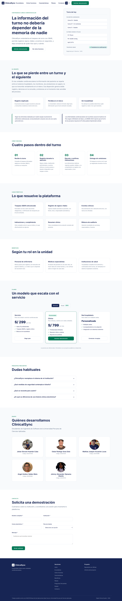
</p>

**Versión móvil, 390 px.** Comportamiento adaptable del mismo diseño. De izquierda a derecha: pantalla de presentación, menú de navegación desplegado, sección de características y formulario de solicitud de demostración.

<p align="center">
  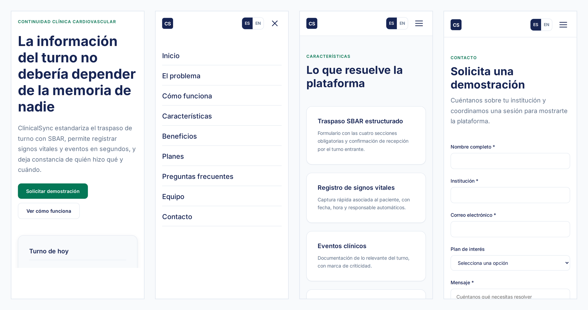
</p>

### 4.4. Web Applications UX/UI Design

La Web Application de ClinicalSync fue diseñada para centralizar y apoyar los flujos clínicos relacionados con el registro, consulta y trazabilidad de la información en áreas cardiovasculares. La experiencia de usuario prioriza la claridad visual, la reducción de la carga operativa y el acceso ágil a las acciones principales, respondiendo a la necesidad del personal de enfermería y de los médicos especialistas de interactuar en entornos de alta presión donde el tiempo y la precisión son críticos.

Los wireframes, wireflows, mock-ups y diagramas de flujo de usuario se organizan alrededor de los módulos principales de la plataforma, adaptados a los distintos roles: el dashboard clínico (Mis pacientes), el monitoreo de signos vitales, los traspasos de turno estructurados mediante la metodología SBAR, el registro de eventos clínicos, la bitácora y la elección de planes de suscripción. Estos artefactos permiten evidenciar la relación entre las User Stories, los flujos de interacción y la implementación final de la Web Application.

#### 4.4.1. Web Applications Wireframes
<p align="center">
  
</p>

<p align="center">
  
</p>

<p align="center">
  
</p>

<p align="center">
  
</p>

<p align="center">
  
</p>

<p align="center">
  
</p>

<p align="center">
  
</p>

<p align="center">
  
</p>

<p align="center">
  
</p>

<p align="center">
  
</p>

<p align="center">
  
</p>

#### 4.4.2. Web Applications Wireflow Diagrams

##### User Goal 1

El usuario (nuevo profesional de enfermería) busca crear su cuenta ingresando sus datos personales y credenciales para acceder al sistema con su identidad verificada ante el CGE.

* **Happy path:** los datos están completos, el correo es válido y la colegiatura se verifica ante el CGE → el sistema crea la cuenta, envía código de verificación y redirige al siguiente paso.

* **Unhappy path:** hay campos incompletos, formato de correo/contraseña inválido, colegiatura no verificada o correo ya registrado → el sistema detiene el registro y solicita corregir el campo indicado.

<p align="center">
  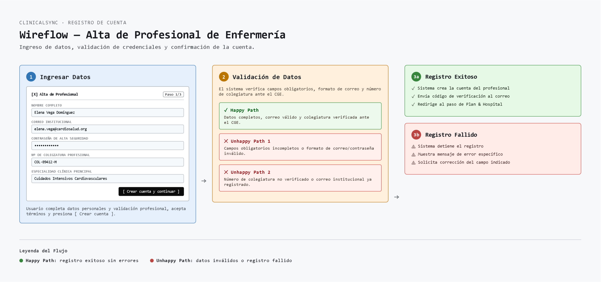
</p>

##### User Goal 2

El usuario (institución o profesional interesado) busca seleccionar un plan, ingresar sus datos de pago y completar la transacción de forma segura para activar su suscripción.

* **Happy path:** la tarjeta es válida, hay fondos disponibles y la transacción es autorizada → el sistema aprueba el pago, genera número de transacción/factura y activa la suscripción.

* **Unhappy path:** los datos están incompletos o con formato inválido, o la pasarela rechaza la transacción (fondos insuficientes/tarjeta bloqueada) → el sistema detiene el flujo, muestra el error y solicita otro método o corrección.

<p align="center">
  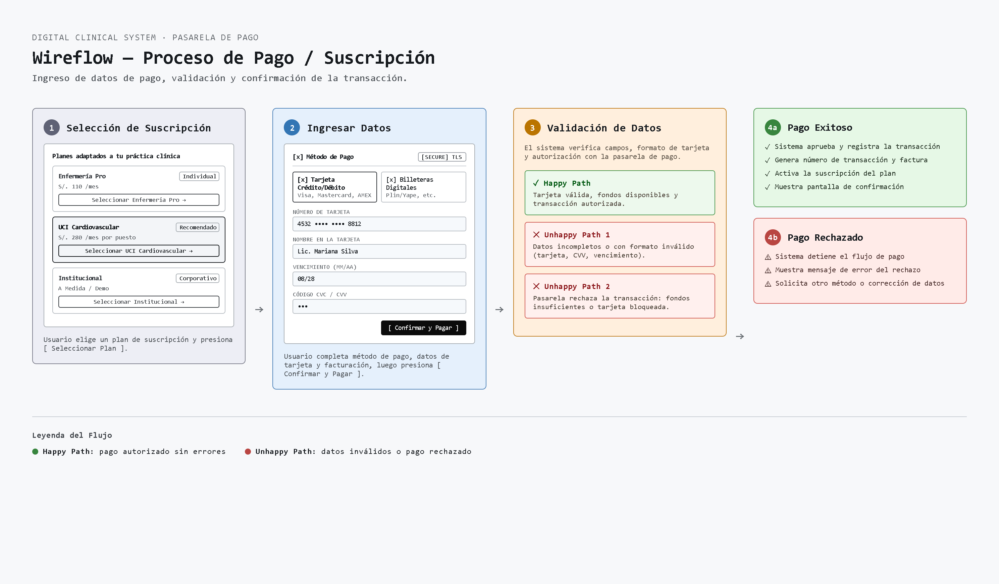
</p>

##### User Goal 3

El usuario (enfermería/médicos) busca registrar rápidamente los signos vitales y datos básicos de un paciente desde el dashboard para mantener su estado clínico actualizado.

* **Happy path:** los valores están completos y dentro de rangos clínicos permitidos → el sistema guarda el registro, actualiza la tarjeta/gráficos y confirma.

* **Unhappy path:** falta un campo obligatorio o hay valores fuera de rango → el sistema detiene el flujo, muestra el error específico y solicita corrección.

<p align="center">
  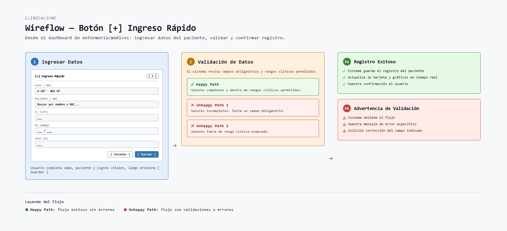
</p>

##### User Goal 4

El usuario (enfermera responsable) busca acceder a los módulos clave de la pantalla de monitoreo de un paciente para hacer seguimiento continuo de su evolución y documentar la atención.

* Este wireflow no tiene happy/unhappy path explícito, ya que no es un flujo de validación secuencial: es un mapa de navegación con 4 accesos independientes (ingreso rápido, tendencias, historial validado y reportes) que el usuario puede usar en cualquier orden desde la misma pantalla.

<p align="center">
  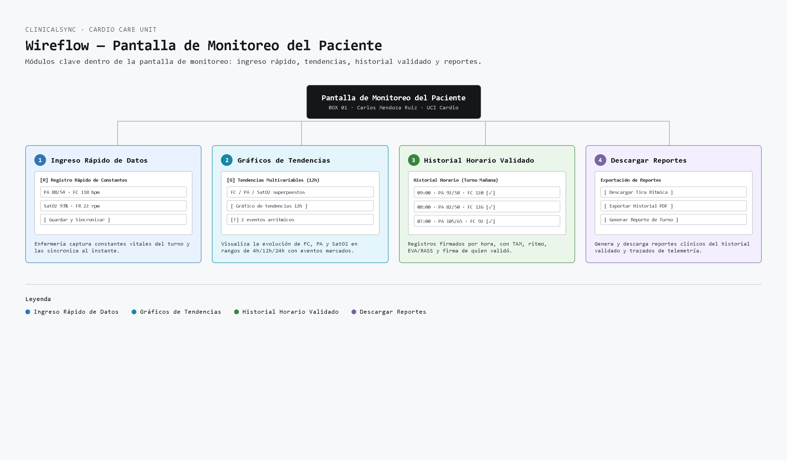
</p>

##### User Goal 5

El usuario (enfermera de guardia) busca completar y enviar el reporte SBAR de un paciente para transferir la responsabilidad clínica a la siguiente guardia de forma clara y trazable.

* **Happy path:** completa los 4 campos SBAR y la prioridad → el sistema registra el traspaso, notifica a la guardia entrante y actualiza la auditoría.

* **Unhappy path:** faltan campos del SBAR o no se selecciona prioridad/método → el sistema detiene el envío y pide completar el formulario (también existe la ruta alterna de guardar como borrador sin validar todo).

<p align="center">
  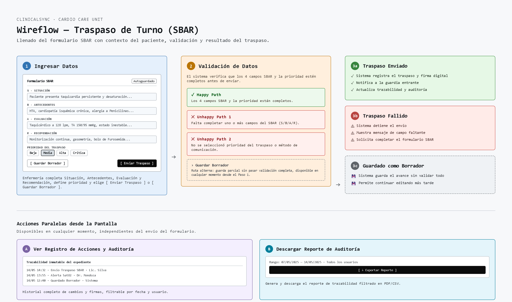
</p>

#### 4.4.3. Web Applications Mock-ups

* **Traspaso de Turno (SBAR)**

Pantalla donde la enfermera/médico saliente documenta el estado del paciente usando el formato SBAR (Situación, Antecedentes, Evaluación, Recomendación) para transferir la responsabilidad clínica a la guardia entrante de forma estructurada y con trazabilidad.

<p align="center">
  
</p>

<p align="center">
  
</p>

* **Pantalla de Monitoreo del Paciente**

Vista individual y detallada de un paciente específico, que agrupa el registro de constantes, las tendencias multivariables, el historial horario validado y la exportación de reportes clínicos.

<p align="center">
  
</p>

<p align="center">
  
</p>

* **Dashboard UCI Cardiovascular (pantalla principal)**

Vista general de la guardia de enfermería en la UCI Cardio: muestra el estado de todos los pacientes ocupando camas (críticos, en vigilancia, estables), alertas prioritarias del turno y accesos rápidos para registrar signos vitales, eventos o generar reportes.

<p align="center">
  
</p>

<p align="center">
  
</p>

* **Selección de Suscripción**

Pantalla donde el usuario compara los planes disponibles (Enfermería Pro, UCI Cardiovascular, Institucional) con sus precios y características, y elige el que mejor se ajusta a su práctica clínica para continuar con la compra.

<p align="center">
  
</p>

<p align="center">
  
</p>

* **Alta de Profesional de Enfermería**

Formulario de registro donde un nuevo profesional crea su cuenta en el sistema, ingresando sus datos personales y credenciales profesionales (colegiatura, correo institucional) para validar su identidad ante el CGE.

<p align="center">
  
</p>

* **Proceso de Pago**

Flujo de checkout donde el usuario ingresa su método y datos de pago (tarjeta o billetera digital), y el sistema valida y confirma la transacción para activar la suscripción elegida.

<p align="center">
  
</p>

<p align="center">
  
</p>

#### 4.4.4. Web Applications User Flow Diagrams

En esta sección se presenta el diagrama de flujo de usuario general de ClinicalSync, que detalla la lógica de navegación desde el acceso al sistema hasta las principales ramas de uso según el tipo de usuario: Personal Clínico (enfermería/médicos) y Director/Gestor. El diagrama comienza con el punto de decisión de acceso (usuario nuevo vs. usuario existente) y se ramifica en dos flujos diferenciados: uno clínico, centrado en el Dashboard de guardia, la atención de alertas, el registro de signos vitales, la selección de cama del paciente, el monitoreo completo y el traspaso de turno (SBAR); y otro administrativo, centrado en el Panel de Administración, la gestión del plan institucional y la auditoría de trazabilidad. Cada rama incluye rutas de retorno ("Volver") que permiten al usuario regresar a su pantalla base sin perder el contexto, reflejando así la navegación real dentro del sistema y su consistencia con los wireflows detallados previamente para cada proceso.

<p align="center">
  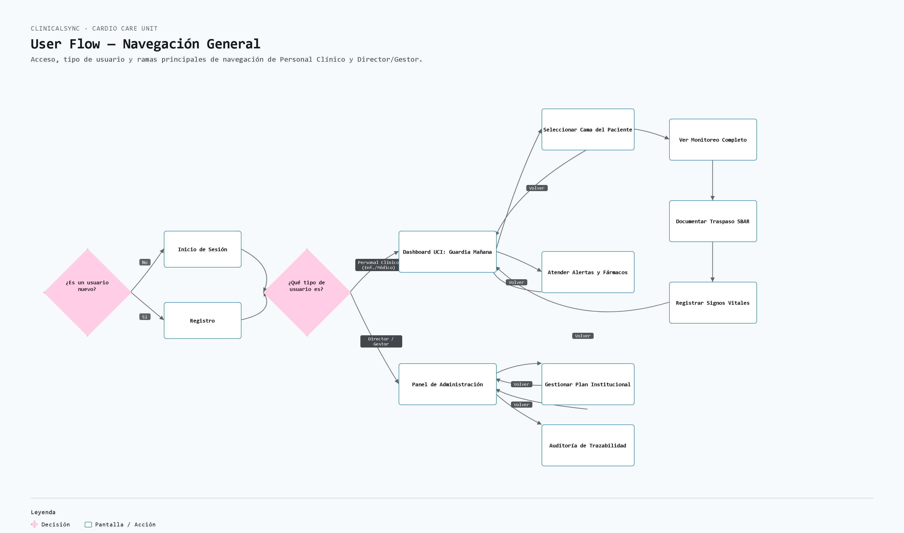
</p>

### 4.5. Web Applications Prototyping

Esta sección presenta la evidencia del prototipo de ClinicalSync correspondiente al **Sprint 1**, que constituye la primera entrega del proyecto. El alcance comprometido para este sprint fue la Landing Page desarrollada y publicada en un entorno de producción, junto con el prototipo navegable de la Web Application en Figma.

La evidencia se presenta en formato de video, donde se recorren ambos productos mostrando su contenido y su comportamiento. Esta decisión responde a la naturaleza de lo prototipado: la Landing Page es un producto funcional y desplegado, por lo que su demostración requiere navegarlo en vivo, mientras que la Web Application se encuentra en etapa de prototipo de interfaz y se recorre sobre Figma.

| Producto | Estado en el Sprint 1 | Soporte de la demostración |
|---|---|---|
| **Landing Page** | Desarrollada, desplegada y accesible públicamente. | Navegación sobre el sitio publicado, en escritorio y en móvil. |
| **Web Application** | Prototipo de interfaz navegable. | Recorrido sobre el prototipo de Figma, en escritorio y en móvil. |

#### Video de demostración del prototipo

**Enlace al video:** [prototipo_landingPage_&AppWeb.mp4](https://upcedupe-my.sharepoint.com/:v:/g/personal/u202212214_upc_edu_pe/IQAmN4M8YXNQRK6D-wRvo-fTAe7cW2snJ1KUCGJQwgQPtHs?nav=eyJyZWZlcnJhbEluZm8iOnsicmVmZXJyYWxBcHAiOiJPbmVEcml2ZUZvckJ1c2luZXNzIiwicmVmZXJyYWxBcHBQbGF0Zm9ybSI6IldlYiIsInJlZmVycmFsTW9kZSI6InZpZXciLCJyZWZlcnJhbFZpZXciOiJNeUZpbGVzTGlua0NvcHkifX0&e=XswRDv)

**Contenido del video:**

En la primera parte se recorre la **Landing Page desplegada** en `https://clinicalsync-landing.vercel.app/`, mostrando sus nueve secciones en el orden en que el visitante las encuentra: la portada con la propuesta de valor, la exposición del problema de la información clínica dispersa, el funcionamiento de la plataforma en cuatro pasos, las características, los beneficios diferenciados por perfil, los planes, las preguntas frecuentes, el equipo y el formulario de contacto. Se demuestra además el cambio de idioma entre español e inglés y el comportamiento adaptable del sitio, alternando entre la vista de escritorio y la de dispositivo móvil.

<p align="center">
  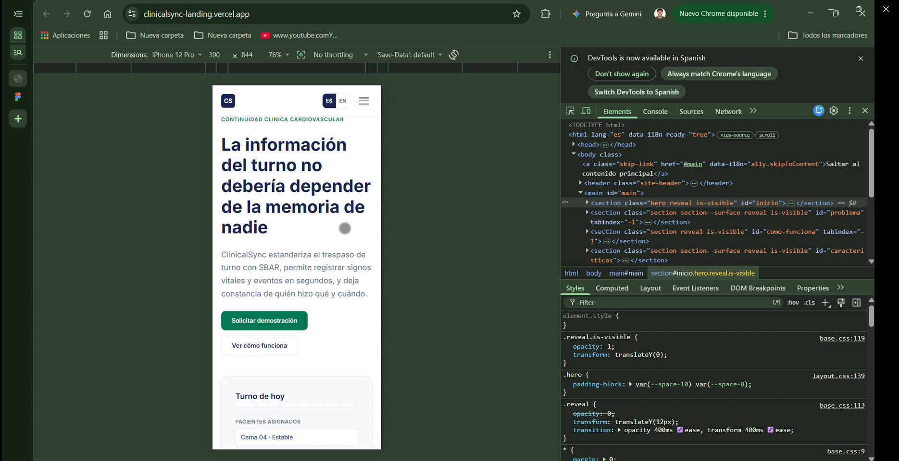
</p>

*Fotograma del video: comprobación del comportamiento adaptable de la Landing Page sobre el sitio publicado, emulando un dispositivo móvil de 390 px de ancho desde las herramientas de desarrollo del navegador.*

En la segunda parte se recorre el **prototipo de la Web Application en Figma**, mostrando las pantallas diseñadas para los flujos clínicos definidos en el Capítulo III: la vista de pacientes asignados al turno, el registro de signos vitales y eventos clínicos, el formulario de traspaso SBAR, la gestión de indicaciones médicas y el resumen clínico dirigido al médico especialista. El recorrido se realiza tanto en la versión de escritorio como en la de móvil, en coherencia con el requisito de diseño adaptable establecido para ambos productos.

#### Enlaces a los productos prototipados

| Recurso | Enlace |
|---|---|
| Landing Page desplegada | [https://clinicalsync-landing.vercel.app/](https://clinicalsync-landing.vercel.app/) |
| Repositorio de la Landing Page | [https://github.com/Digital-Clinical-Systems/Landing-Page](https://github.com/Digital-Clinical-Systems/Landing-Page) |
| Video de la demostración | [Ver en Microsoft Stream](https://upcedupe-my.sharepoint.com/:v:/g/personal/u202212214_upc_edu_pe/IQAmN4M8YXNQRK6D-wRvo-fTAe7cW2snJ1KUCGJQwgQPtHs?nav=eyJyZWZlcnJhbEluZm8iOnsicmVmZXJyYWxBcHAiOiJPbmVEcml2ZUZvckJ1c2luZXNzIiwicmVmZXJyYWxBcHBQbGF0Zm9ybSI6IldlYiIsInJlZmVycmFsTW9kZSI6InZpZXciLCJyZWZlcnJhbFZpZXciOiJNeUZpbGVzTGlua0NvcHkifX0&e=XswRDv) |

#### Relación con el Product Backlog

El alcance demostrado en este video corresponde a la **Entrega 1** del Product Backlog definido en la sección 3.3, que agrupa las doce historias de usuario de la Landing Page más el despliegue del sitio. Con la publicación en producción quedan cubiertas las historias US-01 a US-12 y la historia técnica TS-09, incluidas las relativas a internacionalización y acceso desde dispositivos móviles.

El prototipo de la Web Application anticipa las entregas siguientes, correspondientes al frontend de la aplicación y a los servicios que lo sostienen, cuyo detalle se desarrolla en el Capítulo V.

### 4.6. Domain-Driven Software Architecture
A partir de lo que trabajamos en el Big Picture Event Storming, en esta sección detallamos el diseño de nuestra arquitectura usando Domain-Driven Design (DDD). Aquí definimos los Bounded Contexts, los agregados, eventos y comandos, y finalmente mostramos la estructura del sistema aplicando el Modelo C4.
#### 4.6.1. Design-Level Event Storming
Para bajar al detalle técnico, armamos una sesión de Design-Level Event Storming. Esto nos sirvió para pasar del flujo general del negocio a los componentes reales de software, identificando qué comandos disparan qué eventos y en qué contextos viven.

**Objetivo de la sesión**
Nos enfocamos en desglosar el flujo clínico de la UCI Cardiovascular en eventos concretos, agrupar las responsabilidades en Bounded Contexts y definir las reglas (políticas) que el sistema ClinicalSync debe respetar de manera interna.

**Paso 1: Recolección de Domain Events**
Primero identificamos los eventos de dominio clave para el negocio, redactándolos siempre en pasado. Los eventos detectados para ClinicalSync fueron:

- Información clínica entregada al nuevo turno
- Turno anterior finalizado
- Pacientes asignados revisados
- Estado inicial del paciente verificado
- Signos vitales registrados
- Signos vitales monitoreados
- Medicamento administrado
- Indicación médica revisada
- Evolución reciente del paciente revisada
- Evolución posterior monitoreada
- Evento clínico relevante detectado
- Cambio crítico identificado
- Médico informado sobre cambio clínico
- Cumplimiento de indicación registrado
- Medicación e indicaciones validadas
- Información clínica consultada por el médico
- Nueva indicación médica registrada
- Indicación ejecutada por enfermería

**Paso 2: Identificación de Bounded Contexts**
Luego agrupamos estos eventos para separar correctamente las responsabilidades de la plataforma:

*   **BC-01: Security & Shared Kernel (IAM) Context — Subdominio Genérico**
    Se encarga de la seguridad y de que solo el personal autorizado acceda al sistema.
    *Domain Events clave:* Usuario autenticado, Rol asignado, Sesión iniciada.

*   **BC-02: Patients Context — Subdominio de Soporte**
    Maneja los datos básicos y la admisión de los pacientes. Actúa como el directorio maestro.
    *Domain Events clave:* Paciente admitido, Datos demográficos registrados, Estado actualizado.

*   **BC-03: Vital Signs Context — Core Domain**
    Es el núcleo de ClinicalSync. Aquí se registran y evalúan los signos vitales en tiempo real.
    *Domain Events clave:* Signos vitales registrados, Nivel de riesgo clínico evaluado.

*   **BC-04: Critical Events & Alerts Context — Core Domain**
    Controla el ciclo de vida de las alertas médicas cuando hay anomalías.
    *Domain Events clave:* Alerta crítica generada, Alerta atendida, Alerta resuelta.

*   **BC-05: Handover (SBAR) Context — Trazabilidad Clínica**
    Se encarga de estructurar y guardar los traspasos de turno usando el modelo SBAR.
    *Domain Events clave:* Entrega SBAR registrada, Turno finalizado, Acuse de recibo confirmado.

*   **BC-06: Audit Logs Context — Subdominio de Soporte**
    Guarda un registro inmutable de todo lo que hacen los usuarios para mantener la trazabilidad.
    *Domain Events clave:* Log de auditoría creado, Operación clínica registrada.

*   **BC-07: Physicians & Treatments Context — Subdominio de Soporte**
    Administra el catálogo de médicos y el historial cronológico de los tratamientos.
    *Domain Events clave:* Médico asignado, Tratamiento prescrito, Historial actualizado.

**Paso 3: Identificación de Comandos y Políticas**
- **Comandos identificados:** Registrar signos vitales, Iniciar entrega de turno SBAR, Reportar evento clínico crítico, Prescribir tratamiento.
- **Políticas de dominio:** 
  - Cuando un signo vital supera un umbral de riesgo → generar alerta crítica de inmediato.
  - Cuando se inicia el cambio de turno → generar un resumen estructurado del SBAR.

**Paso 4: Modelos de Lectura**
Para que los usuarios puedan interactuar con esta data, identificamos estas vistas:
- Dashboard de monitoreo de constantes vitales.
- Vista de entrega de turno (SBAR).
- Historial de eventos y auditoría.

#### 4.6.2. Software Architecture Context Diagram
Este diagrama muestra una vista de alto nivel de ClinicalSync. Aquí identificamos a los actores principales (enfermeros, médicos y auditores) y cómo interactúan con el sistema sin entrar en detalles técnicos.

<p align="center">
  
</p>

*Muestra la interacción directa de los roles clínicos con la plataforma.*


#### 4.6.3. Software Architecture Container Diagrams
Haciendo un poco de zoom, en este diagrama separamos las unidades de despliegue. Tenemos nuestra Single Page Application (SPA) para el frontend, el backend que expone el RESTful API y nuestra base de datos relacional.

<p align="center">
  
</p>

*Detalla la comunicación JSON/HTTPS entre la Web App y el API, y la persistencia hacia MySQL 8.x.*

#### 4.6.4. Software Architecture Components Diagrams

Aquí mostramos cómo está estructurado el Backend API por dentro. Separamos la lógica en componentes basados en nuestros Bounded Contexts, cada uno con sus propios servicios y controladores REST.

<p align="center">
  
</p>

*Muestra las interacciones internas (mediante interfaces de Java y Domain Events) entre los componentes del sistema.*

### 4.7. Software Object-Oriented Design

El diseño orientado a objetos traduce los bounded contexts identificados en la sección 4.6 a una estructura de clases implementable. Es el punto donde el modelo del dominio deja de ser un mapa conceptual y pasa a definir entidades, agregados, objetos de valor y relaciones concretas que el equipo escribirá en código durante el Capítulo V.

El criterio que guía este diseño es mantener la lógica de negocio clínica aislada de la infraestructura, de modo que reglas como la validación de un traspaso SBAR o el cálculo del nivel de riesgo de un paciente residan en el dominio y no queden dispersas en la capa de presentación o de persistencia. El vocabulario de las clases conserva los términos fijados en el Ubiquitous Language de la sección 2.5, con el fin de que el código sea legible para cualquier integrante del equipo sin necesidad de un diccionario intermedio.

#### 4.7.1. Class Diagrams
Basándonos en los Bounded Contexts, armamos el diagrama de clases del dominio. El objetivo es mantener una alta cohesión y aislar la lógica de negocio clínica de la infraestructura.

Para implementar DDD correctamente, utilizamos herencia desde un `AbstractDomainAggregateRoot` del *Shared Kernel* para poder lanzar eventos de dominio. También definimos Value Objects (como `BloodPressure` para encapsular la presión sistólica y diastólica) y las enumeraciones para estandarizar estados (`RiskLevel`, `HandoverStatus`, etc.). 

El modelo de traspasos SBAR mantiene la trazabilidad exigiendo el ID del enfermero que recibe el turno (`incomingNurseId`), y el sistema de auditoría es robusto mediante el uso de la clase inmutable `AuditLog`.

<p align="center">
  
</p>

*Detalla los paquetes de dominio de cada contexto y las relaciones estructurales entre las entidades.*

### 4.8. Database Design

El diseño de base de datos define cómo persiste la información del modelo de dominio descrito en la sección 4.7. Las decisiones de esta sección responden a dos exigencias que el Capítulo II identificó como críticas: la trazabilidad completa de cada acción clínica, con su responsable y su marca temporal, y la posibilidad de reconstruir la evolución de un paciente en orden cronológico.

El esquema se organiza siguiendo los bounded contexts del dominio, manteniendo integridad referencial estricta entre las entidades relacionadas. La tabla de auditoría recibe un tratamiento particular: se diseña como append-only, es decir, admite únicamente inserciones y no permite modificar ni eliminar registros existentes. Esta restricción es deliberada, ya que una bitácora que puede alterarse no constituye evidencia válida para efectos de auditoría clínica.

#### 4.8.1. Database Diagrams
Para la persistencia relacional usamos MySQL con Spring Data JPA. El esquema refleja nuestros contextos y mantiene una integridad referencial estricta:

*   **patients:** Tabla central con los datos y ubicación del paciente.
*   **vital_sign_records:** Guarda el monitoreo continuo de biomarcadores y calcula el nivel de riesgo.
*   **alerts:** Maneja el ciclo de vida de los eventos críticos y los responsables de su atención.
*   **handovers:** Guarda la estructura del SBAR entre los profesionales.
*   **audit_logs:** Implementamos esta tabla como *append-only* (solo inserciones) para guardar la metadata en JSON y cumplir con las normativas de trazabilidad hospitalaria.
*   **physicians y patient_treatments:** Soportan el historial de atenciones y prescripciones médicas.

<p align="center">
  
</p>

*Muestra las tablas físicas, tipos de datos y relaciones de llave foránea de la base de datos.*

---

## Capítulo V: Product Implementation, Validation & Deployment
### 5.1. Software Configuration Management

En esta sección se describe la gestión de la configuración del software utilizado en el proyecto de ClinicalSync, la cual tiene como objetivo garantizar la trazabilidad y digitalización de procesos vitales durante la estadía de un paciente en un hospital cardiovascular.
Desde registro de pacientes hasta generación de alertas y traspasos SBAR. Esta gestión permite mantener la integridad, trazabilidad y consistencia del código fuente, así como coordinar de manera eficiente el trabajo colaborativo del equipo.

El Software Configuration Management en ClinicalSync se basa en el uso de herramientas de control de versiones y buenas prácticas profesionales de desarrollo que permiten administrar
las distintas versiones del sistema a lo largo del tiempo. Esto incluye la organización de los repositorios del proyecto, la definición de estrategias de ramificación, la gestión
de cambios mediante commits bien documentados y la integración del trabajo realizado por los diferentes miembros del equipo.


#### 5.1.1. Software Development Environment Configuration

En esta sección se describen las herramientas utilizadas por el equipo encargado de desarrollar ClinicalSync para colaborar de manera efectiva durante todo el ciclo de vida del producto digital. Estas herramientas han sido seleccionadas estratégicamente con el objetivo de optimizar la comunicación, organización, diseño, desarrollo, despliegue y documentación del sistema, permitiendo un trabajo colaborativo eficiente y escalable.

Las herramientas se organizan según las principales actividades del ciclo de vida del software: gestión del proyecto y requisitos, diseño UX/UI, desarrollo de software, despliegue y documentación técnica.

### Project Management y Requirements Management

- [**Jira Software**](https://www.atlassian.com/es/software/jira): Es la herramienta principal utilizada para la gestión del proyecto bajo un enfoque ágil. Permite organizar tareas en tableros, listas y tarjetas, facilitando el seguimiento del avance del Sprint, la asignación de actividades y el control del backlog del producto ClinicalSync. Gracias a su interfaz visual, el equipo puede mantener una visión clara del progreso del proyecto.

- [**Google Docs & Google Workspace**](https://docs.google.com/): Google Drive y Google Docs se utilizan como plataforma de almacenamiento y colaboración en la nube. Estas herramientas permiten al equipo crear, editar y compartir documentos en tiempo real, facilitando la elaboración de historias de usuario, informes, entregables y documentación general del proyecto.

### Product UX/UI Design

- [**Figma**](https://www.figma.com/): Es la herramienta principal utilizada para el diseño de la interfaz de usuario de ClinicalSync. Se emplea para crear wireframes, prototipos y diseños finales de la Landing Page. Su funcionalidad colaborativa permite que todo el equipo partícipe en el proceso de diseño de forma simultánea, asegurando coherencia visual y funcional.

- [**UXPressia**](https://uxpressia.com/): Se utiliza para la etapa de Needfinding y análisis centrado en el usuario. Permitió desarrollar los User Personas, así como elaborar el User Journey Mapping, Empathy Mapping e Impact Mapping, facilitando la identificación de necesidades, comportamientos, puntos de dolor y objetivos de los usuarios para estructurar de manera más precisa el diseño y enfoque del sistema.

- [**dbdiagram**](https://dbdiagram.io/): Se utiliza como herramienta de apoyo para la creación de diagramas de base de datos. Permite visualizar y diseñar la estructura de la base de datos de forma colaborativa.


### Software Development

- [**Webstorm**](https://code.visualstudio.com/) / [**VS Code**]: Editor de código utilizado para el desarrollo de la Landing Page de ClinicalSync. Permite trabajar de manera eficiente con tecnologías como HTML, CSS y JavaScript, ofreciendo soporte para extensiones, terminal integrada y herramientas de depuración.

- [**IntelliJ IDEA**](https://www.jetbrains.com/idea/): Entorno de desarrollo integrado utilizado para la construcción del Server Side Software (RESTful API) implementado con Spring Boot y Java.

- [**Git**](https://git-scm.com/): Es el sistema de control de versiones utilizado para gestionar el código fuente del proyecto. Permite llevar un registro de los cambios realizados, trabajar de forma colaborativa y mantener un historial organizado del desarrollo del sistema.

- [**GitHub**](https://github.com/): Es la plataforma utilizada para alojar el repositorio del proyecto ClinicalSync. Facilita la colaboración entre los miembros del equipo, la revisión de código y la integración continua del desarrollo.


### Software Deployment

- [**Vercel**](https://vercel.com/): Es el servicio utilizado para desplegar la Landing Page de ClinicalSync. Se conectó mediante la GitHub App de Vercel al repositorio `Digital-Clinical-Systems/Landing-Page`, de modo que cada integración a la rama `main` genera automáticamente un nuevo despliegue en producción bajo un subdominio HTTPS gestionado por la plataforma.

- [**Firebase Hosting**](https://firebase.google.com/):  Es una plataforma en la nube prevista para el despliegue de la Frontend Web Application en etapas posteriores del proyecto. A la fecha de esta entrega aún no se ha utilizado, ya que el alcance comprometido corresponde únicamente a la Landing Page.

- [**Swagger / OpenAPI**](https://swagger.io/): Herramienta utilizada para la documentación interactiva y estandarizada del RESTful API.

El uso de estos entornos nos permitió mantener una estructura de trabajo clara, con seguimiento de cambios y separación
entre documentación e implementación. Asimismo, se facilita la revisión de avances por parte de los integrantes y se asegura
coherencia entre la propuesta del informe y el producto a desarrollar.


#### 5.1.2. Source Code Management

En esta sección se describe la gestión del código fuente del proyecto ClinicalSync, el cual se ha implementado utilizando GitHub como plataforma principal de control de versiones. 
Este sistema permite al equipo trabajar de forma colaborativa, mantener un historial completo de cambios y asegurar la correcta integración de las funcionalidades desarrolladas durante el proyecto.

El repositorio principal del proyecto es el siguiente:

- **Informe Repository**: [https://github.com/Digital-Clinical-Systems/Informe.git](https://github.com/Digital-Clinical-Systems/Informe.git)
- **Landing Page Repository**: [https://github.com/Digital-Clinical-Systems/Landing-Page](https://github.com/Digital-Clinical-Systems/Landing-Page)
- **Frontend Web App Repository**: [https://github.com/Digital-Clinical-Systems/FrontClinicalSync](https://github.com/Digital-Clinical-Systems/FrontClinicalSync)
- **Backend (Web Services) Repository**: [https://github.com/Digital-Clinical-Systems/BackClinicalSync](https://github.com/Digital-Clinical-Systems/BackClinicalSync)

### GitFlow Workflow implementado

El equipo ha adoptado la metodología GitFlow como modelo de control de versiones, lo cual permite separar el desarrollo de nuevas funcionalidades, la integración de cambios y la preparación de versiones estables.

Las ramas principales utilizadas son:

- **main**: rama principal que contiene la versión estable del proyecto.
- **develop**: rama de integración donde se consolidan todas las funcionalidades completadas antes de ser llevadas a producción.
- **feature/**: ramas utilizadas para el desarrollo de funcionalidades específicas del sistema.
- **release/** : Ramas utilizadas para preparar versiones finales para despliegue y corregir errores críticos en producción, respectivamente.

### Feature Branches utilizados en el proyecto

El desarrollo de la Landing Page de ClinicalSync se ha organizado mediante ramas feature específicas por componente funcional:

- feature/hero → sección principal de presentación
- feature/benefits → sección de beneficios del sistema
- feature/call-to-action → botones y acciones de conversión
- feature/characteristic → características del producto
- feature/footer → pie de página del sistema
- feature/how-it-works → explicación del funcionamiento de ClinicalSync
- feature/pricing → sección de planes o precios
- feature/team → sección de equipo desarrollador

Esta organización permite un desarrollo modular, donde cada funcionalidad se implementa de forma independiente antes de integrarse a la rama develop.


### Convención de ramas

El proyecto sigue la siguiente convención de nomenclatura:

- feature/nombre-descriptivo → nuevas funcionalidades
- develop → integración de funcionalidades
- main → versión estable del sistema

### Semantic Versioning

Aunque en esta primera etapa se ha trabajado principalmente en la Landing Page, el proyecto adopta el estándar de versionado semántico:

MAJOR.MINOR.PATCH

- MAJOR: cambios estructurales grandes
- MINOR: nuevas funcionalidades
- PATCH: corrección de errores

Versión actual del proyecto: v1.0.0 (Landing Page inicial)

### Conventional Commits

Para mantener un historial claro de cambios, el equipo utiliza Conventional Commits en todos los commits del repositorio.

##### Tipos de commits utilizados:

- `feat`: Nueva funcionalidad
- `fix`: Corrección de errores
- `docs`: Cambios en documentación
- `style`: Cambios en formato/estilo sin afectar la lógica
- `refactor`: Reestructuración del código sin cambio funcional
- `test`: Cambios en tests
- `build`: Cambios que afectan al sistema de compilación o dependencias
- `ci`: Configuraciones de integración continua
- `chore`: Tareas menores de mantenimiento
- `perf`: Mejoras de rendimiento
- `revert`: Reversión de un commit anterior


#### 5.1.3. Source Code Style Guide & Conventions

Con el objetivo de mantener un código legible, limpio, coherente y fácilmente mantenible, el proyecto **ClinicalSync** adopta un conjunto de guías de estilo y convenciones estándar para todos los lenguajes utilizados en la solución. 
Estas buenas prácticas permiten asegurar consistencia entre los miembros del equipo, mejorar la calidad del código y facilitar su escalabilidad en futuras iteraciones.

Como regla principal, **todas las variables, funciones, clases, componentes y archivos se nombran estrictamente en idioma inglés**, evitando el uso del "spanglish", traducciones incorrectas (como *deployar*, *aplicativo*) o nomenclatura en español en la lógica interna del software.

### HTML / CSS (Landing Page y vistas estáticas)

**Guía adoptada:** Google HTML/CSS Style Guide y W3C Standards

### HTML
- Se utiliza una estructura semántica clara usando etiquetas como `header`, `main`, `section`, `article` y `footer`.
- El código HTML se escribe con indentación de 2 espacios.
- Todas las etiquetas deben cerrarse correctamente.
- Se utilizan comillas dobles para atributos HTML.
- Se evita el uso de estilos inline para mantener separación entre estructura y diseño.

### CSS
- Se utiliza la metodología BEM (Block Element Modifier) para la nomenclatura de clases:
    - Ejemplo: `btn--primary`
- Se prioriza el uso de clases reutilizables.
- Se evita la duplicación de estilos.
- Se aplican variables CSS para colores, espaciados y medidas globales.
- Se organiza el CSS de forma modular por componentes o secciones.


### AngularJS (Frontend Web Application)

**Guías adoptadas:** *Angular Coding Style Guide* y *Google TypeScript Style Guide*.

### Nomenclatura
- `camelCase` para variables, funciones, métodos y propiedades.
- `PascalCase` para clases, interfaces, componentes y enumeraciones (`enums`).
- `UPPER_SNAKE_CASE` para constantes globales.
- `kebab-case` para nombres de archivos y carpetas (ej. `patient-list.component.ts`).
- Prefijo `_` para propiedades privadas y *signals* privados.

### Buenas prácticas
- Clean Architecture junto con Domain-Driven Design (DDD): Separación lógica en capas (`application`, `domain`, `infrastructure` y `presentation`).
- Inyección de dependencias: Uso de `@Injectable()` y la función `inject()` de Angular para la gestión ágil de dependencias.
- Patrón Assembler/Mapper: Conversión de DTOs a entidades de dominio para no acoplar la respuesta del API directamente a la vista.
- Manejo de estado reactivo: Uso de *Signals* nativos para el control del estado en los componentes.
- Lógica derivada: Uso de `computed` *signals* para variables que dependen reactivamente de otros estados.
- Seguridad en la navegación: Implementación de *Route Guards* para la protección de acceso a rutas privadas o clínicas.

### Estilo de código
- Declaración de variables: Uso estricto de `const` (por defecto) y `let` (solo si mutará). Prohibido el uso de `var`.
- Reusabilidad: Código altamente modular, priorizando componentes "tontos" (Dumb/Presentational Components) y servicios "inteligentes" (Smart Services).
- Manejo de errores estructurado: Uso de bloques `try/catch` o el operador `catchError` de RxJS con mensajes descriptivos y amigables para el usuario.
- Sintaxis moderna: Uso de operadores ternarios y *optional chaining* (`?.`) para simplificar validaciones y evitar errores en consola.
- Seguridad de tipos: Habilitación estricta de *TypeScript Strict Mode* para garantizar la máxima seguridad y detección de errores durante la compilación.


### Java / Spring Boot (RESTful API Backend)

**Guía adoptada:** *Google Java Style Guide* y convenciones de *Spring Boot Features*.

### Nomenclatura
- `camelCase` para variables, métodos, atributos y parámetros.
- `PascalCase` para clases, interfaces, registros (*records*) y enumeraciones.
- `UPPER_SNAKE_CASE` para constantes (`static final`).
- `kebab-case` para las rutas (URLs) de los endpoints REST (ej. `/api/v1/vital-signs`).
- Minúsculas (sin guiones ni mayúsculas) para la estructura de paquetes (ej. `com.carelabs.pulsereport.patient`).

### Buenas prácticas
- Domain-Driven Design (DDD): Organización del código fuente en paquetes alineados con *Bounded Contexts*.
- Arquitectura en capas: Separación lógica estricta en `Controller` (Presentación), `Service` (Aplicación/Lógica de Negocio), `Repository` (Infraestructura) y `Domain Model`.
- Inyección de dependencias: Uso de inyección por constructor mediante anotaciones estándar de Spring (`@RestController`, `@Service`, `@Repository`).
- Patrón DTO y Assembler/Mapper: Conversión entre DTOs y Entidades para evitar exponer el modelo de dominio y la persistencia directamente en la API.
- Persistencia Relacional: Uso de JPA/Hibernate para el mapeo objeto-relacional (ORM).
- Respuestas estandarizadas: Uso consistente de `ResponseEntity` para manejar y estructurar los códigos de estado HTTP y el cuerpo de las respuestas.

### Estilo de código
- Inmutabilidad: Preferencia por variables `final` y uso de Java *Records* para la creación concisa de DTOs inmutables.
- Código modular y aplicación de principios SOLID.
- Manejo de errores estructurado: Excepciones centralizadas globales mediante `@ControllerAdvice` y `@ExceptionHandler` para retornar mensajes de error consistentes (400, 404, 500).
- Seguridad contra nulos: Uso de `Optional<T>` en las consultas de base de datos y flujos lógicos para evitar `NullPointerException`.
- Validación de datos: Implementación de *Jakarta Bean Validation* (`@Valid`, `@NotNull`, `@NotBlank`, etc.) para sanitizar el *request body* directamente en los controladores.

### Convenciones generales del proyecto ClinicalSync

- Todo el código está escrito en inglés.
- Se aplica el principio SOLID.
- Se sigue el principio DRY.
- Se prioriza la legibilidad sobre la complejidad.

### Gherkin (Especificaciones)

Para la definición de criterios de aceptación en historias de usuario se utiliza Gherkin:

- Given / When / Then
- Lenguaje claro y entendible por el negocio

### Ejemplos:

```gherkin
Given a patient is registered in the system
When vital signs are recorded outside the normal range
Then the system generates an automatic alert

Given I am on the patient view
When I record vital signs data
Then it is saved correctly in the medical record

Given I complete the SBAR form
When I save the shift handover
Then it is stored with the date, time, and responsible user

Given a critical clinical event occurs
When the system records it
Then it is logged in the audit log with full details
```


#### 5.1.4. Software Deployment Configuration

En esta sección el equipo especifica la configuración del despliegue de la solución **ClinicalSync**, incluyendo los procedimientos necesarios para que,
a partir de los repositorios de código fuente, se pueda realizar la publicación exitosa de los productos digitales que componen el sistema: Landing Page, Frontend Web Application y Web Services (Backend).

La solución se encuentra estructurada bajo una arquitectura desacoplada, donde cada componente es desplegado de manera 
independiente utilizando plataformas especializadas en la nube, lo que permite mejorar la escalabilidad, disponibilidad y mantenimiento del sistema.


### Componentes de Despliegue

- **Landing Page**: desplegada en Vercel, con integración continua desde GitHub.
- **Frontend Web Application (Angular)**: desplegada en Firebase Hosting.
- **Web Services RESTful API (Backend)**: desplegado en un Cloud Provider (Render / Heroku).

### 1. Control de Versiones

El proyecto utiliza **Git** como sistema de control de versiones y **GitHub** como plataforma para la gestión de repositorios.

### Estrategia de ramas

- `main`: contiene la versión estable lista para producción.
- `develop`: integra las funcionalidades en desarrollo.
- `feature/*`: ramas destinadas al desarrollo de nuevas funcionalidades.


### 2. Despliegue de Landing Page (Vercel)

La Landing Page es un sitio estático responsivo construido con HTML5, CSS3 y JavaScript, sin framework ni proceso de compilación. Por esa razón se despliega directamente como contenido estático, sin comando de build ni directorio de salida.

Se seleccionó **Vercel** por tres razones: publica sitios estáticos sin configuración adicional, permite integración continua desde GitHub sin intervención manual, y conserva el historial de despliegues, de modo que es posible revertir a una versión anterior si una publicación introduce un error.

#### Pasos de despliegue

**1. Preparar el repositorio**

El código fuente reside en el repositorio `Digital-Clinical-Systems/Landing-Page`, con el archivo `index.html` en la raíz.

- `git add .`
- `git commit -m "feat: add landing page sections"`
- `git push origin main`

**2. Instalar la GitHub App de Vercel en la organización**

- Acceder a `https://github.com/apps/vercel` y seleccionar **Configure**.
- Elegir la organización **Digital-Clinical-Systems**.
- En permisos de repositorio, marcar **Only select repositories** y autorizar únicamente `Landing-Page`.

Este paso requiere rol de *owner* en la organización. En caso contrario, GitHub genera una solicitud que un owner debe aprobar.

**3. Crear el proyecto en Vercel**

- Acceder a `https://vercel.com` e iniciar sesión con la cuenta de GitHub.
- Seleccionar **Add New → Project** e importar el repositorio `Landing-Page`.
- Configuración del proyecto:
    - **Framework Preset**: Other
    - **Root Directory**: `./`
    - **Build Command**: vacío
    - **Output Directory**: vacío

**4. Configurar la caché de recursos estáticos**

Se incluye un archivo `vercel.json` en la raíz del repositorio que define las cabeceras de caché para los recursos estáticos:

```json
{
  "headers": [
    {
      "source": "/assets/(.*)",
      "headers": [
        { "key": "Cache-Control", "value": "public, max-age=31536000, immutable" }
      ]
    }
  ]
}
```

**5. Verificar la publicación**

El sitio queda disponible en `https://clinicalsync-landing.vercel.app/`. A partir de ese momento, cada integración a la rama `main` dispara un despliegue automático sin intervención manual.

#### Despliegue alternativo mediante la CLI

Cuando no es posible instalar la GitHub App, Vercel admite el despliegue directo desde la línea de comandos. Este método no habilita la integración continua, por lo que cada actualización requiere ejecutar nuevamente el comando de producción:

- `npx vercel` para crear y vincular el proyecto.
- `npx vercel --prod` para publicar en producción.

#### Resultado

Publicación automática bajo un subdominio HTTPS gestionado por Vercel, con historial de despliegues y posibilidad de revertir a una versión anterior desde el panel de la plataforma.


### 3. Despliegue del Frontend Web Application (Angular en Firebase Hosting)

La aplicación es una *Single Page Application* (SPA) desarrollada en Angular 17+ y se despliega utilizando Firebase Hosting.

### Pasos de despliegue

#### 1. Subir el proyecto al repositorio
- `git add .`
- `git commit -m "deploy frontend"`
- `git push origin main`

#### 2. Configurar en Firebase
- Acceder a: https://firebase.google.com/
- Iniciar Sesión y dirigirse a 'Ir a Consola'.
- Seleccionar **Crear un proyecto de Firebase nuevo → Escribir el nombre del proyecto (`clinicalsync-frontend`) → Crear Proyecto**.
- Instalar Firebase CLI: `npm install -g firebase-tools`
- Iniciar sesión en Firebase CLI: `firebase login`
- Inicializar el proyecto: `firebase init`
    - Seleccionar **Hosting**.
    - Seleccionar el proyecto creado en Firebase.
    - Configurar el directorio público: `dist/browser` (o `dist/`).
    - Configurar como SPA: Sí.
    - Por el momento decimos que no se configure GitHub Action para despliegue automático.

#### 3. Configurar variables de entorno
- Configurar el archivo `environment.prod.ts` para apuntar a la URL pública del RESTful API:
  - `apiBaseUrl: 'https://<backend-url>'`

#### 4. Configurar el build
- **Build command**:
  - `ng build`
- **Publish directory**:
  - `dist/browser`

#### 5. Ejecutar Despliegue
- Ejecutamos el comando de compilación: `ng build`
- Ejecutamos el comando de publicación: `firebase deploy --only hosting`
- Firebase genera una URL pública accesible.


### 4. Despliegue de los Web Services RESTful API (Cloud Provider)

El backend desarrollado en Spring Boot y documentado con OpenAPI (Swagger) ha sido configurado para su despliegue continuo en un servicio Platform as a Service (PaaS) como Render o Heroku.

### Pasos de despliegue

#### 1. Configurar credenciales y entorno
- Ajustar la configuración del archivo `application-prod.properties`.
- Inyectar dinámicamente las credenciales de entorno para la conexión segura a la base de datos (MySQL gestionado en la nube).

#### 2. Construcción del artefacto
- Empaquetar y construir el archivo `.jar` usando Maven ejecutando el comando:
  - `mvn clean package -DskipTests`

#### 3. Publicación en el servicio Cloud
- Vincular el repositorio (rama `main`) al servicio PaaS (ej. Render/Heroku) para disparar el despliegue de la imagen/artefacto.
- El Cloud Provider asigna los recursos, levanta el servidor y genera una URL HTTPS pública.

#### 4. Documentación desplegada
- Una vez levantado el servidor, la documentación estandarizada Swagger UI queda expuesta públicamente.
- **Ruta de acceso:** `https://<backend-url>/swagger-ui.html`


### 5. Integración de Componentes

El sistema funciona de la siguiente manera:

- La **Landing Page** actúa como punto de entrada y promoción, redirigiendo al usuario mediante llamados a la acción (CTA) hacia el frontend.
- El **Frontend** (SPA en Angular) gestiona la experiencia de usuario y consume los servicios expuestos por el backend.
- El **Backend** (Spring Boot RESTful API) procesa la lógica de negocio, se conecta a la base de datos MySQL en la nube para persistir la información y devuelve las respuestas estructuradas al frontend.

### 6. Consideraciones de Despliegue

- Uso obligatorio de variables de entorno para configuraciones sensibles (credenciales de BD, tokens, URIs).
- Separación de entornos (desarrollo y producción).
- Evitar exponer credenciales dentro del código fuente bajo ninguna circunstancia.
- Verificación de URLs públicas y endpoints de Swagger después de cada despliegue.
- Mantener compatibilidad entre versiones de frontend y backend, respetando el control de versiones semántico.


### 5.2. Landing Page, Services & Applications Implementation
#### 5.2.1. Sprint 1

El Sprint 1 se enfocó en el desarrollo e implementación de la Landing Page de ClinicalSync, la cual representa el primer punto de contacto entre la solución y los usuarios potenciales.
Este sprint tuvo como objetivo establecer una presencia digital sólida que comunique de manera clara la propuesta de valor del producto.

Durante este sprint, se desarrollaron e integraron las secciones principales de la Landing Page, incluyendo presentación del producto, funcionalidades clave, llamadas a la acción, equipo desarrollador, sectores beneficiados, 
preguntas frecuentes, equipo y sección de contacto, siguiendo la arquitectura de información definida en la sección 4.2 y las directrices visuales de la sección 4.1. Asimismo, se priorizó la usabilidad, accesibilidad y coherencia visual, con el fin de ofrecer una experiencia atractiva y profesional.


##### 5.2.1.1. Sprint Planning 1

<table>
  <tr> <th colspan="5">Sprint #</th> <th colspan="9">Sprint 1</th> </tr> 
  <tr> <td colspan="13">Sprint Planning Background</td> </tr> 
  <tr> <td colspan="5">Date</td> <td colspan="8">15-04-2026</td> </tr> 
  <tr> <td colspan="5">Time</td> <td colspan="8">09:30 AM</td> </tr> 
  <tr> <td colspan="5">Location</td> <td colspan="8">Reunión remota (Discord)</td> </tr> 
  <tr> <td colspan="5">Prepared By</td> <td colspan="8">Sosa Soto, Oskar Rodrigo</td> </tr> 
  <tr> <td colspan="5">Attendees (to planning meeting)</td> <td colspan="8">Sosa Soto, Oskar Rodrigo / Acuache Lucas, Mathias Joaquin / Valdez Melo, Angel Andres / Huamán Cuba, Johan Giovani / Ojanama Abanto, Johnny Alexander</td> </tr> 
  <tr> <td colspan="5">Sprint n-1 Review Summary</td> <td colspan="8">No aplica - Este es el primer Sprint del proyecto</td> </tr> 
  <tr> <td colspan="5">Sprint n-1 Retrospective Summary</td> <td colspan="8">No aplica - Este es el primer Sprint del proyecto</td> </tr> 
  <tr> <td colspan="13">Sprint Goal & User Stories</td> </tr> 
  <tr> <td colspan="5">Sprint 1 Goal</td> <td colspan="8"> <strong>"Our focus is on delivering a fully functional and user-friendly Landing Page for ClinicalSync, accompanied by complete and well-structured documentation. We believe this will provide an engaging first impression and clearly communicate the value proposition of our solution for enhancing clinical processes in cardiovascular nursing. This will be validated when the Landing Page is successfully deployed and accessible online, with all core sections working correctly, and all corresponding documentation completed."</strong> </td> </tr> 
  <tr> <td colspan="5">Sprint 1 Velocity</td> <td colspan="8">28 Story Points</td> </tr> 
  <tr> <td colspan="5">Sum of Story Points</td> <td colspan="8">28 Story Points</td> </tr> 
</table>


##### 5.2.1.2. Aspect Leaders and Collaborators

<div align="center">
  <table style="width:100%; border-collapse: collapse; font-family: Arial, sans-serif; font-size: 13px; text-align: center;">
    <thead>
      <tr style="background-color: #f2f2f2;">
        <th style="border: 1px solid #dddddd; padding: 10px;">Team Member (Last Name, First Name)</th>
        <th style="border: 1px solid #dddddd; padding: 10px;">GitHub Username</th>
        <th style="border: 1px solid #dddddd; padding: 10px;">Diseño del Layout Principal (L/C)</th>
        <th style="border: 1px solid #dddddd; padding: 10px;">Navegacion e Internacionalización (L/C)</th>
        <th style="border: 1px solid #dddddd; padding: 10px;">Secciones Informativas y CTA (L/C)</th>
        <th style="border: 1px solid #dddddd; padding: 10px;">Despliegue y GitFlow (L/C)</th>
      </tr>
    </thead>
    <tbody>
      <tr>
        <td style="border: 1px solid #dddddd; padding: 8px;">Sosa Soto, Oskar Rodrigo</td>
        <td style="border: 1px solid #dddddd; padding: 8px;">YakuzaMeen</td>
        <td style="border: 1px solid #dddddd; padding: 8px; font-weight: bold;">L</td>
        <td style="border: 1px solid #dddddd; padding: 8px;">C</td>
        <td style="border: 1px solid #dddddd; padding: 8px;">C</td>
        <td style="border: 1px solid #dddddd; padding: 8px; font-weight: bold;">L</td>
      </tr>
      <tr>
        <td style="border: 1px solid #dddddd; padding: 8px;">Acuache Lucas, Mathias Joaquin</td>
        <td style="border: 1px solid #dddddd; padding: 8px;">MathiasA25</td>
        <td style="border: 1px solid #dddddd; padding: 8px;">C</td>
        <td style="border: 1px solid #dddddd; padding: 8px;">C</td>
        <td style="border: 1px solid #dddddd; padding: 8px; font-weight: bold;">L</td>
        <td style="border: 1px solid #dddddd; padding: 8px;">C</td>
      </tr>
      <tr>
        <td style="border: 1px solid #dddddd; padding: 8px;">Valdez Melo, Angel Andres</td>
        <td style="border: 1px solid #dddddd; padding: 8px;">AngelValdezM</td>
        <td style="border: 1px solid #dddddd; padding: 8px; font-weight: bold;">L</td>
        <td style="border: 1px solid #dddddd; padding: 8px;">C</td>
        <td style="border: 1px solid #dddddd; padding: 8px;">L</td>
        <td style="border: 1px solid #dddddd; padding: 8px;">C</td>
      </tr>
      <tr>
        <td style="border: 1px solid #dddddd; padding: 8px;">Huamán Cuba, Johan Giovani</td>
        <td style="border: 1px solid #dddddd; padding: 8px;">Johancuba</td>
        <td style="border: 1px solid #dddddd; padding: 8px;">C</td>
        <td style="border: 1px solid #dddddd; padding: 8px;">C</td>
        <td style="border: 1px solid #dddddd; padding: 8px; font-weight: bold;">L</td>
        <td style="border: 1px solid #dddddd; padding: 8px;">C</td>
      </tr>
      <tr>
        <td style="border: 1px solid #dddddd; padding: 8px;">Ojanama Abanto, Johnny Alexander</td>
        <td style="border: 1px solid #dddddd; padding: 8px;">JohnnyGZ41</td>
        <td style="border: 1px solid #dddddd; padding: 8px;">C</td>
        <td style="border: 1px solid #dddddd; padding: 8px; font-weight: bold;">L</td>
        <td style="border: 1px solid #dddddd; padding: 8px;">C</td>
        <td style="border: 1px solid #dddddd; padding: 8px;">C</td>
      </tr>
    </tbody>
  </table>
</div>

##### 5.2.1.3. Sprint Backlog 1

<table>
  <thead>
    <tr>
      <th align="left">Sprint #</th>
      <th align="left" colspan="7">Sprint 1</th>
    </tr>
    <tr>
      <th align="left" colspan="2">User Story</th>
      <th align="left" colspan="6">Work-Item / Task</th>
    </tr>
    <tr>
      <th align="left">Id</th>
      <th align="left">Title</th>
      <th align="left">Id</th>
      <th align="left">Title</th>
      <th align="left">Description</th>
      <th align="left">Estimation<br>(Hours)</th>
      <th align="left">Assigned To</th>
      <th align="left">Status<br>(To-do / In-Process / To-Review / Done)</th>
    </tr>
  </thead>
  <tbody>
    <tr>
      <td>US-01</td>
      <td>Visualizar la landing page</td>
      <td rowspan="3">T-01.1</td>
      <td rowspan="3">Estructura Base y Hero Section</td>
      <td rowspan="3">Maquetar la estructura HTML/CSS base, implementar la propuesta de valor y explicar el problema.</td>
      <td rowspan="3">6</td>
      <td rowspan="3">Sosa Soto, Oskar Rodrigo</td>
      <td rowspan="3">Done</td>
    </tr>
    <tr>
      <td>US-02</td>
      <td>Conocer la propuesta de valor</td>
    </tr>
    <tr>
      <td>US-03</td>
      <td>Comprender el problema que resuelve la solución</td>
    </tr>
    <tr>
      <td>US-04</td>
      <td>Revisar cómo funciona la plataforma</td>
      <td rowspan="3">T-02.1</td>
      <td rowspan="3">Componentes Funcionales</td>
      <td rowspan="3">Desarrollar componentes gráficos para explicar el funcionamiento, características clave y beneficios.</td>
      <td rowspan="3">8</td>
      <td rowspan="3">Valdez Melo, Angel Andres</td>
      <td rowspan="3">Done</td>
    </tr>
    <tr>
      <td>US-05</td>
      <td>Visualizar las características clave</td>
    </tr>
    <tr>
      <td>US-06</td>
      <td>Revisar los beneficios según el perfil</td>
    </tr>
    <tr>
      <td>US-07</td>
      <td>Consultar los planes y el modelo de servicio</td>
      <td rowspan="2">T-03.1</td>
      <td rowspan="2">Planes y FAQs</td>
      <td rowspan="2">Implementar tarjetas de precios y sección de preguntas frecuentes tipo acordeón.</td>
      <td rowspan="2">5</td>
      <td rowspan="2">Acuache Lucas, Mathias Joaquin</td>
      <td rowspan="2">Done</td>
    </tr>
    <tr>
      <td>US-08</td>
      <td>Consultar las preguntas frecuentes</td>
    </tr>
    <tr>
      <td>US-09</td>
      <td>Conocer al equipo</td>
      <td rowspan="2">T-04.1</td>
      <td rowspan="2">Equipo y Contacto</td>
      <td rowspan="2">Diseñar tarjetas del equipo y formulario de contacto con validaciones básicas.</td>
      <td rowspan="2">6</td>
      <td rowspan="2">Huamán Cuba, Johan Giovani</td>
      <td rowspan="2">Done</td>
    </tr>
    <tr>
      <td>US-10</td>
      <td>Solicitar información o una demostración</td>
    </tr>
    <tr>
      <td>US-11</td>
      <td>Cambiar el idioma del sitio</td>
      <td>T-05.1</td>
      <td>Sistema de Internacionalización (i18n)</td>
      <td>Configurar sistema para cambio de idioma entre ES y EN en todos los textos de la página.</td>
      <td>5</td>
      <td>Ojanama Abanto, Johnny Alexander</td>
      <td>Done</td>
    </tr>
    <tr>
      <td>US-12</td>
      <td>Acceder desde dispositivos móviles</td>
      <td>T-06.1</td>
      <td>Ajustes Responsivos</td>
      <td>Refinar Media Queries para asegurar la correcta visualización en móviles y tablets.</td>
      <td>4</td>
      <td>Acuache Lucas, Mathias Joaquin</td>
      <td>Done</td>
    </tr>
    <tr>
      <td>TS-09</td>
      <td>Despliegue de la landing page y la web app</td>
      <td>T-07.1</td>
      <td>GitFlow y despliegue en Vercel</td>
      <td>Configuración inicial del repositorio, ramas y automatización del despliegue continuo en Vercel.</td>
      <td>4</td>
      <td>Sosa Soto, Oskar Rodrigo</td>
      <td>Done</td>
    </tr>
  </tbody>
</table>

### Estados de las tareas
- **To-do**: Pendiente
- **InProcess**: En desarrollo
- **ToReview**: En revisión
- **Done**: Finalizado


##### 5.2.1.4. Development Evidence for Sprint Review

**Repositorio del Informe**

La siguiente tabla registra los commits realizados sobre el repositorio `Digital-Clinical-Systems/Informe` durante el Sprint 1. El trabajo se organiza en una rama `feature/report-chapter-N` por cada capítulo del informe, y cada commit corresponde, por regla general, a una sección o título completado, siguiendo la convención de Conventional Commits descrita en la sección 5.1.3. El historial conserva también los commits iniciales, anteriores a la adopción de esa convención, y los generados automáticamente por la interfaz web de GitHub al subir archivos o integrar ramas, que no se reescribieron para mantener la trazabilidad real del trabajo.

| Repository | Branch | Commit Id | Commit Message | Commit Message Body | Commited on (Date) |
| :--- | :--- | :--- | :--- | :--- | :--- |
| Digital-Clinical-Systems/Informe | feature/report-chapter-1 | 90d6431 | Initial commit | - | 2026-08-27 |
| Digital-Clinical-Systems/Informe | feature/report-chapter-1 | e3932a3 | docs(readme): add initial report skeleton | - | 2026-08-28 |
| Digital-Clinical-Systems/Informe | feature/report-chapter-1 | 6d0e1cf | Antecedentes y problemática completed | - | 2026-08-28 |
| Digital-Clinical-Systems/Informe | feature/report-chapter-1 | 1ec8a66 | docs(readme): add Lean UX Process/Problem Statements and Target Segments | - | 2026-08-30 |
| Digital-Clinical-Systems/Informe | feature/report-chapter-1 | 45d85db | docs: add description and solution startup, student profile and 1.2.2.2 until 1.2.2.4 | - | 2026-08-30 |
| Digital-Clinical-Systems/Informe | feature/report-chapter-1 | d4dc8b5 | docs(readme): add Background and problems | - | 2026-08-28 |
| Digital-Clinical-Systems/Informe | feature/report-chapter-1 | 9b1afe5 | docs(readme): add Lean UX Process/Problem Statements and Target Segments | - | 2026-08-30 |
| Digital-Clinical-Systems/Informe | feature/report-chapter-1 | ce43085 | add(readme): add Startup Description, student profile and Lean UX Assumptions/Hypothesis/Canvas | - | 2026-08-30 |
| Digital-Clinical-Systems/Informe | feature/report-chapter-1 | f6327d3 | docs(readme):startup profile and Lean UX Assupmtions, Hypothesis Statements and Lean UX Canvas | - | 2026-08-30 |
| Digital-Clinical-Systems/Informe | feature/report-chapter-1 | dd9a671 | docs(report): update team member | - | 2026-08-31 |
| Digital-Clinical-Systems/Informe | feature/report-chapter-1 | 602dc47 | docs(readme): add Oskar Profile | - | 2026-09-01 |
| Digital-Clinical-Systems/Informe | feature/report-chapter-1 | 864f330 | docs(readme): add Mathias profile | - | 2026-09-01 |
| Digital-Clinical-Systems/Informe | feature/report-chapter-1 | 562da42 | docs(readme): add Angel profile | - | 2026-09-01 |
| Digital-Clinical-Systems/Informe | feature/report-chapter-1 | 6e471d5 | docs(repo): add gitattributes to normalize line endings | Evita que un guardado desde Windows convierta el README a CRLF y genere diffs de archivo completo sin cambios reales de texto. Co-Authored-By: Claude Opus 5 <noreply@anthropic.com> Claude-Session: https://claude.ai/code/session_01MxkF92yAvH9PuSppDQj2i9 | 2026-09-02 |
| Digital-Clinical-Systems/Informe | feature/report-chapter-1 | 3e34913 | docs(assets): rename Assets to assets and group photos under chapter-1 | Unifica la capitalizacion con feature/report-chapter-2, que ya usa assets/chapter-2. GitHub distingue mayusculas de minusculas, por lo que mantener Assets y assets en ramas distintas habria producido dos carpetas separadas al mergear y roto los enlaces de una de ellas. Co-Authored-By: Claude Opus 5 <noreply@anthropic.com> Claude-Session: https://claude.ai/code/session_01MxkF92yAvH9PuSppDQj2i9 | 2026-09-02 |
| Digital-Clinical-Systems/Informe | feature/report-chapter-1 | 375f371 | docs(readme): add Johnny profile | - | 2026-09-03 |
| Digital-Clinical-Systems/Informe | feature/report-chapter-1 | 9f6388a | docs(readme): fix team member photo rendering in profiles table | - | 2026-09-04 |
| Digital-Clinical-Systems/Informe | feature/report-chapter-1 | c98f26f | docs(readme):add Mathias profile in members | - | 2026-09-04 |
| Digital-Clinical-Systems/Informe | feature/report-chapter-1 | 2dcb5ae | docs(readme): add Angel profile in members | - | 2026-09-05 |
| Digital-Clinical-Systems/Informe | feature/report-chapter-1 | 7d642d4 | docs(readme): fix product name in chapter 1 | - | 2026-09-06 |
| Digital-Clinical-Systems/Informe | feature/report-chapter-1 | 8e6ba16 | docs(readme): update student information and profile picture of Johan | - | 2026-09-07 |
| Digital-Clinical-Systems/Informe | feature/report-chapter-1 | f55e640 | Add files via upload | - | 2026-09-07 |
| Digital-Clinical-Systems/Informe | feature/report-chapter-1 | 14038d1 | docs(readme): add my student outcome | - | 2026-09-13 |
| Digital-Clinical-Systems/Informe | feature/report-chapter-1 | c1e110b | docs(readme): fix student outcome table error | - | 2026-09-13 |
| Digital-Clinical-Systems/Informe | feature/report-chapter-1 | fbe0ac4 | docs(readme): add jhonny profile | - | 2026-09-16 |
| Digital-Clinical-Systems/Informe | feature/report-chapter-1 | 0129861 | docs(readme): add section introductions and fix structural issues in chapter 1 | - | 2026-09-17 |
| Digital-Clinical-Systems/Informe | feature/report-chapter-1 | dabcde7 | docs(assets): add UPC logo referenced in the report header | - | 2026-09-17 |
| Digital-Clinical-Systems/Informe | feature/report-chapter-1 | a4415d7 | docs(readme): fix duplicated table of contents entries and heading levels in chapter 1 | - | 2026-09-17 |
| Digital-Clinical-Systems/Informe | feature/report-chapter-2 | 7ec61f6 | docs(readme): add competitive analysis and strategies against competitors | - | 2026-08-31 |
| Digital-Clinical-Systems/Informe | feature/report-chapter-2 | efe10dd | docs(readme): add competitive analysis and strategies against competitors | - | 2026-08-31 |
| Digital-Clinical-Systems/Informe | feature/report-chapter-2 | 34e55f3 | docs(readme): add interview design, records and analysis | - | 2026-08-31 |
| Digital-Clinical-Systems/Informe | feature/report-chapter-2 | d6d6770 | docs(readme): add interview design, records and analysis | - | 2026-08-31 |
| Digital-Clinical-Systems/Informe | feature/report-chapter-2 | d4d30b8 | docs(readme): add needfinding artifacts: user personas, task matrix, journey and empathy maps | - | 2026-08-31 |
| Digital-Clinical-Systems/Informe | feature/report-chapter-2 | d4969de | docs(readme): add needfinding artifacts: user personas, task matrix, journey and empathy maps | - | 2026-08-31 |
| Digital-Clinical-Systems/Informe | feature/report-chapter-2 | a3280f2 | docs(readme): add big picture event storming | - | 2026-08-31 |
| Digital-Clinical-Systems/Informe | feature/report-chapter-2 | 2a12869 | docs(readme): add big picture event storming | - | 2026-08-31 |
| Digital-Clinical-Systems/Informe | feature/report-chapter-2 | e60886c | docs(readme): add ubiquitous language | - | 2026-08-31 |
| Digital-Clinical-Systems/Informe | feature/report-chapter-2 | 98554cf | docs(readme): add ubiquitous language | - | 2026-08-31 |
| Digital-Clinical-Systems/Informe | feature/report-chapter-2 | ba4cc7d | docs(readme): Remove image from competitive analysis | - | 2026-09-01 |
| Digital-Clinical-Systems/Informe | feature/report-chapter-2 | b7ea11b | docs(assets): Create chapter-2 | - | 2026-09-01 |
| Digital-Clinical-Systems/Informe | feature/report-chapter-2 | 9dee1c0 | docs(assets): Create chapter-1 | - | 2026-09-01 |
| Digital-Clinical-Systems/Informe | feature/report-chapter-2 | 0375d6d | Delete assets/chapter-2 | - | 2026-09-01 |
| Digital-Clinical-Systems/Informe | feature/report-chapter-2 | b55a2d7 | Delete assets/chapter-1 | - | 2026-09-01 |
| Digital-Clinical-Systems/Informe | feature/report-chapter-2 | dc88f33 | docs(assets): Create chapter-1 readme | - | 2026-09-01 |
| Digital-Clinical-Systems/Informe | feature/report-chapter-2 | a81c226 | docs(assets): Create chapter-2 readme | - | 2026-09-01 |
| Digital-Clinical-Systems/Informe | feature/report-chapter-2 | 25ee5f5 | Add files via upload | - | 2026-09-01 |
| Digital-Clinical-Systems/Informe | feature/report-chapter-2 | dcb1ba5 | Add files via upload | - | 2026-09-01 |
| Digital-Clinical-Systems/Informe | feature/report-chapter-2 | a2b655f | Add files via upload | - | 2026-09-01 |
| Digital-Clinical-Systems/Informe | feature/report-chapter-2 | 11351d9 | Add files via upload | - | 2026-09-01 |
| Digital-Clinical-Systems/Informe | feature/report-chapter-2 | 0835c98 | docs(readme): add images for nurses and doctors in Step 3 - Event Storming | - | 2026-09-01 |
| Digital-Clinical-Systems/Informe | feature/report-chapter-2 | a11042f | Merge pull request #1 from Digital-Clinical-Systems/main | assets | 2026-09-01 |
| Digital-Clinical-Systems/Informe | feature/report-chapter-2 | cba550a | docs(readme): add interview record of Samuel Akerman for nursing segment | Primera entrevista del segmento de enfermeria cardiovascular: datos del entrevistado, enlace al video y resumen de respuestas. Pendientes el timing, la duracion y la captura del video. Co-Authored-By: Claude Opus 5 <noreply@anthropic.com> Claude-Session: https://claude.ai/code/session_01MxkF92yAvH9PuSppDQj2i9 | 2026-09-02 |
| Digital-Clinical-Systems/Informe | feature/report-chapter-2 | 0f610d9 | docs(readme): add timing, duration and screenshot for Samuel Akerman interview | Co-Authored-By: Claude Opus 5 <noreply@anthropic.com> Claude-Session: https://claude.ai/code/session_01MxkF92yAvH9PuSppDQj2i9 | 2026-09-02 |
| Digital-Clinical-Systems/Informe | feature/report-chapter-2 | 92d1ba4 | docs(readme): add interview record of Bruno Elescano for nursing segment 1 | - | 2026-09-05 |
| Digital-Clinical-Systems/Informe | feature/report-chapter-2 | e8aa9da | docs(readme): add interview record of Nathalia Davila for nursing segment 1 | - | 2026-09-06 |
| Digital-Clinical-Systems/Informe | feature/report-chapter-2 | 02e5fa5 | dosc(readme): add screenshot for Nathalia Davila interview | - | 2026-09-06 |
| Digital-Clinical-Systems/Informe | feature/report-chapter-2 | d052f80 | docs(readme): add enterview 1 of objective segment 2 | - | 2026-09-08 |
| Digital-Clinical-Systems/Informe | feature/report-chapter-2 | aa8f1bf | docs(readme): add name of link in enterview 1 of objetive segment 2 | - | 2026-09-08 |
| Digital-Clinical-Systems/Informe | feature/report-chapter-2 | 11345eb | Add files via upload | - | 2026-09-08 |
| Digital-Clinical-Systems/Informe | feature/report-chapter-2 | ad97490 | Merge branch 'feature/report-chapter-2' of https://github.com/Digital-Clinical-Systems/Informe into feature/report-chapter-2 | - | 2026-09-10 |
| Digital-Clinical-Systems/Informe | feature/report-chapter-2 | c75b6f0 | docs(readme): add interview 2 of segment 2 | - | 2026-09-10 |
| Digital-Clinical-Systems/Informe | feature/report-chapter-2 | f3f4d53 | docs(repo): add gitattributes to normalize line endings | - | 2026-09-11 |
| Digital-Clinical-Systems/Informe | feature/report-chapter-2 | 8c9392b | Merge branch 'feature/report-chapter-2' of https://github.com/Digital-Clinical-Systems/Informe into feature/report-chapter-2 | - | 2026-09-11 |
| Digital-Clinical-Systems/Informe | feature/report-chapter-2 | 726a0d6 | docs(readme): remove details of Interview 3 from Chapter II | - | 2026-09-12 |
| Digital-Clinical-Systems/Informe | feature/report-chapter-2 | 9ecfb37 | docs(readme): Add segment 2 interview 2 info | - | 2026-09-15 |
| Digital-Clinical-Systems/Informe | feature/report-chapter-2 | 9f27adf | docs(readme): fix Brenda Rios Information | - | 2026-09-15 |
| Digital-Clinical-Systems/Informe | feature/report-chapter-2 | 2728e25 | docs(readme): Add image to interview 2 | - | 2026-09-15 |
| Digital-Clinical-Systems/Informe | feature/report-chapter-2 | 22ceaac | docs(readme): update Big Picture Event Storming section for clarity | - | 2026-09-16 |
| Digital-Clinical-Systems/Informe | feature/report-chapter-2 | 8d04600 | Redocs(assets): rename event-storming-step-4.png to big-picture-event-storming.png | - | 2026-09-16 |
| Digital-Clinical-Systems/Informe | feature/report-chapter-2 | ca418a7 | docs(readme): revise Big Picture Event Storming details and insights | - | 2026-09-16 |
| Digital-Clinical-Systems/Informe | feature/report-chapter-2 | d23133b | Redocs(assets): rename big-picture-event-storming.png to event-storming-step-4.png | - | 2026-09-16 |
| Digital-Clinical-Systems/Informe | feature/report-chapter-2 | e5dae3b | docs(readme): add interview 2 image | - | 2026-09-17 |
| Digital-Clinical-Systems/Informe | feature/report-chapter-2 | 7c3e816 | docs(readme): complete interview analysis with findings from registered interviews | - | 2026-09-17 |
| Digital-Clinical-Systems/Informe | feature/report-chapter-3 | dca7203 | docs(readme): Add Epic 01 and Epic 02 with their respective User Stories and Technical Stories | - | 2026-09-02 |
| Digital-Clinical-Systems/Informe | feature/report-chapter-3 | 6cd7155 | docs(readme): add User Stories | - | 2026-09-02 |
| Digital-Clinical-Systems/Informe | feature/report-chapter-3 | 1be8d6a | docs(readme): add Impact Mapping | - | 2026-09-02 |
| Digital-Clinical-Systems/Informe | feature/report-chapter-3 | 227e0d7 | docs(readme): add Product Backlog | - | 2026-09-02 |
| Digital-Clinical-Systems/Informe | feature/report-chapter-3 | ecd9072 | docs(repo): add gitattributes to normalize line endings | - | 2026-09-11 |
| Digital-Clinical-Systems/Informe | feature/report-chapter-3 | 3b8ff6c | docs(readme): add impact mapping diagram | - | 2026-09-17 |
| Digital-Clinical-Systems/Informe | feature/report-chapter-4 | 8c8406b | docs(readme): Add General Style Guidelines | - | 2026-09-08 |
| Digital-Clinical-Systems/Informe | feature/report-chapter-4 | 27b48ed | docs(readme): Add web style guidelines & fix 4.1.1 and 4.1.2. grammar | - | 2026-09-08 |
| Digital-Clinical-Systems/Informe | feature/report-chapter-4 | 9b17ead | docs(repo): add gitattributes to normalize line endings | - | 2026-09-11 |
| Digital-Clinical-Systems/Informe | feature/report-chapter-4 | 2006b98 | docs(readme): add Information Architecture | - | 2026-09-12 |
| Digital-Clinical-Systems/Informe | feature/report-chapter-4 | 88e4d03 | docs(readme): add introduction of 4.6. domain-driven software | - | 2026-09-12 |
| Digital-Clinical-Systems/Informe | feature/report-chapter-4 | 957369d | docs(readme): add 4.6.1. Design-Level Event Storming section | - | 2026-09-12 |
| Digital-Clinical-Systems/Informe | feature/report-chapter-4 | 8b91196 | docs(readme): add 4.6.2. Software Architecture Context Diagram section | - | 2026-09-12 |
| Digital-Clinical-Systems/Informe | feature/report-chapter-4 | 0ea7e58 | docs(readme): add 4.6.3. Software Architecture Container Diagramssection | - | 2026-09-12 |
| Digital-Clinical-Systems/Informe | feature/report-chapter-4 | 7093d96 | docs(readme): add 4.6.4. Software Architecture Components Diagrams section | - | 2026-09-12 |
| Digital-Clinical-Systems/Informe | feature/report-chapter-4 | de10870 | docs(readme): add 4.7.1. Class Diagrams section | - | 2026-09-12 |
| Digital-Clinical-Systems/Informe | feature/report-chapter-4 | 0045ae9 | docs(readme): add 4.8.1. Database Diagrams section | - | 2026-09-12 |
| Digital-Clinical-Systems/Informe | feature/report-chapter-4 | 6a4b6d8 | docs(assets): add README file for chapter 4 directory | - | 2026-09-12 |
| Digital-Clinical-Systems/Informe | feature/report-chapter-4 | 8661593 | docs(add): Landing page wireframes and mockups | - | 2026-09-12 |
| Digital-Clinical-Systems/Informe | feature/report-chapter-4 | c03c44a | Add files via upload | - | 2026-09-12 |
| Digital-Clinical-Systems/Informe | feature/report-chapter-4 | 44cdd94 | docs(readme): Add Web Application Wireframes and Mock-Ups | - | 2026-09-13 |
| Digital-Clinical-Systems/Informe | feature/report-chapter-4 | 5ebf226 | docs(readme) : add 4.4 web applications ux ui design section | - | 2026-09-14 |
| Digital-Clinical-Systems/Informe | feature/report-chapter-4 | 258e6e4 | docs(readme) : add 4.4.2. Web Applications Wireflow Diagrams | - | 2026-09-14 |
| Digital-Clinical-Systems/Informe | feature/report-chapter-4 | 0b52458 | docs(readme): add information Web Applications Mock-ups | - | 2026-09-14 |
| Digital-Clinical-Systems/Informe | feature/report-chapter-4 | d976bbd | docs(readme): add 4.4.4. Web Applications User Flow Diagrams | - | 2026-09-14 |
| Digital-Clinical-Systems/Informe | feature/report-chapter-4 | 2304caa | docs(readme): add section introductions for chapter 4 | - | 2026-09-15 |
| Digital-Clinical-Systems/Informe | feature/report-chapter-4 | e201536 | docs(readme): enhance chapter 4 with detailed navigation structure and label distinctions | - | 2026-09-17 |
| Digital-Clinical-Systems/Informe | feature/report-chapter-4 | 790c7d8 | docs(readme): add web applications prototyping evidence for sprint 1 | - | 2026-09-17 |
| Digital-Clinical-Systems/Informe | feature/report-chapter-4 | 8982b51 | docs(readme): add web applications prototyping evidence for sprint 1 | - | 2026-09-17 |
| Digital-Clinical-Systems/Informe | feature/report-chapter-4 | 038bc6e | docs(readme): update landing page mock-up with implemented design | - | 2026-09-17 |
| Digital-Clinical-Systems/Informe | feature/report-chapter-4 | 9d535a1 | docs(readme): fix heading levels in web applications wireflow diagrams | - | 2026-09-17 |
| Digital-Clinical-Systems/Informe | feature/report-chapter-5 | 0b85bdc | docs(readme): add description of 5.1 and 5.1.1 | - | 2026-09-01 |
| Digital-Clinical-Systems/Informe | feature/report-chapter-5 | 819f0a1 | docs(readme): add 5.1.2. Source Code Management | - | 2026-09-01 |
| Digital-Clinical-Systems/Informe | feature/report-chapter-5 | 0495ef9 | docs(readme):  add 5.1.3. Source Code Style Guide & Conventions | - | 2026-09-01 |
| Digital-Clinical-Systems/Informe | feature/report-chapter-5 | 22c9078 | docs(readme):  add  5.1.4. Software Deployment Configuration | Added detailed deployment configuration for ClinicalSync solution, including steps for deploying Landing Page, Frontend Web Application, and Web Services. | 2026-09-01 |
| Digital-Clinical-Systems/Informe | feature/report-chapter-5 | 9fdf3fe | docs(readme): add 5.2. Landing Page, Services & Applications Implementation. | - | 2026-09-01 |
| Digital-Clinical-Systems/Informe | feature/report-chapter-5 | 2f6899d | doc(readme): revise sprint 1 planning information | - | 2026-09-09 |
| Digital-Clinical-Systems/Informe | feature/report-chapter-5 | 5c882d2 | docs(readme): revise Sprint 1- 5.2.1.3. user stories and task statuses | - | 2026-09-09 |
| Digital-Clinical-Systems/Informe | feature/report-chapter-5 | 9d6e426 | docs(readme): delete sections on interviews and video | - | 2026-09-09 |
| Digital-Clinical-Systems/Informe | feature/report-chapter-5 | c4439bc | docs(repo): add gitattributes to normalize line endings | - | 2026-09-11 |
| Digital-Clinical-Systems/Informe | feature/report-chapter-5 | f1c82dd | docs(readme): add development evidence tables for sprint review | - | 2026-09-17 |
| Digital-Clinical-Systems/Informe | feature/report-chapter-5 | 5aa100b | docs(assets): add landing page screenshots for sprint 1 | - | 2026-09-17 |
| Digital-Clinical-Systems/Informe | feature/report-chapter-5 | 839721f | Implement code changes to enhance functionality and improve performance | - | 2026-09-17 |

**Repositorio de la Landing Page**

La siguiente tabla registra los commits correspondientes al desarrollo de la Landing Page, realizados sobre la rama `main` del repositorio `Digital-Clinical-Systems/Landing-Page`. Cada commit corresponde a una sección o funcionalidad completada, conforme a la convención de Conventional Commits descrita en la sección 5.1.3.

| Repository | Branch | Commit Id | Commit Message | Commit Message Body | Commited on (Date) |
| :--- | :--- | :--- | :--- | :--- | :--- |
| Digital-Clinical-Systems/Landing-Page | main | 9631bd4 | docs: add project context and content specification | - | 2026-09-15 |
| Digital-Clinical-Systems/Landing-Page | main | 4ed5a0c | docs: add project context, content spec and i18n dictionaries | - | 2026-09-15 |
| Digital-Clinical-Systems/Landing-Page | main | 6f72e6b | feat: add folder structure, CSS variables and nav bar with mobile menu | - | 2026-09-15 |
| Digital-Clinical-Systems/Landing-Page | main | aa328ff | feat: enhance hero section with patient and vital signs display | - | 2026-09-16 |
| Digital-Clinical-Systems/Landing-Page | main | 11c4a5e | feat: add problem section with cards and data callouts | - | 2026-09-16 |
| Digital-Clinical-Systems/Landing-Page | main | c19ff11 | feat: add numbered steps section with cards for user guidance (How it works) | - | 2026-09-16 |
| Digital-Clinical-Systems/Landing-Page | main | 3b8405c | feat: add features section with detailed cards for platform capabilities | - | 2026-09-16 |
| Digital-Clinical-Systems/Landing-Page | main | 30f0205 | feat: add benefits section with role-specific cards for users | - | 2026-09-16 |
| Digital-Clinical-Systems/Landing-Page | main | de6caaf | feat: implement pricing toggle functionality and add pricing section with plans | - | 2026-09-16 |
| Digital-Clinical-Systems/Landing-Page | main | 5714333 | feat: add FAQ section with accordion functionality for common questions | - | 2026-09-16 |
| Digital-Clinical-Systems/Landing-Page | main | 98bc354 | feat: add team section with member profiles and images | - | 2026-09-16 |
| Digital-Clinical-Systems/Landing-Page | main | f1dd44a | feat: add contact form section with validation and success message | - | 2026-09-16 |
| Digital-Clinical-Systems/Landing-Page | main | 235d7cf | feat: add footer section with branding, navigation links, and academic information | - | 2026-09-16 |
| Digital-Clinical-Systems/Landing-Page | main | ccf46a2 | feat: add alt text for team member photos and update localization files | - | 2026-09-16 |
| Digital-Clinical-Systems/Landing-Page | main | c2d8b28 | feat: enhance accessibility by adding role attributes to error messages in contact form | - | 2026-09-16 |
| Digital-Clinical-Systems/Landing-Page | main | 052a06d | feat: add Open Graph meta tags and keywords for improved SEO and social sharing | - | 2026-09-16 |
| Digital-Clinical-Systems/Landing-Page | main | ce5b9d0 | feat: add robots.txt and sitemap.xml for SEO optimization | - | 2026-09-16 |
| Digital-Clinical-Systems/Landing-Page | main | ed27b89 | feat: add scroll reveal animation for sections and update navigation visibility | - | 2026-09-17 |

##### 5.2.1.5. Execution Evidence for Sprint Review

**Resumen de logros del Sprint**

Durante este Sprint el equipo desarrolló, validó y publicó la Landing Page de ClinicalSync. El trabajo comprendió la traducción de la arquitectura de información definida en la sección 4.2 y de las directrices visuales de la sección 4.1 a una implementación funcional en HTML5, CSS3 y JavaScript, sin framework ni proceso de compilación, conforme a lo establecido para este entregable.

Los hitos alcanzados fueron los siguientes:

- Implementación de las nueve secciones de contenido definidas en la arquitectura de información.
- Internacionalización completa entre español e inglés, con la preferencia del visitante almacenada localmente, cubriendo la historia US-11.
- Diseño adaptable verificado desde 320 px hasta anchos de escritorio, sin desplazamiento horizontal en ningún punto, cubriendo la historia US-12.
- Incorporación de los meta tags, el archivo `robots.txt` y el `sitemap.xml` especificados en la sección 4.2.3.
- Publicación en producción con integración continua desde la rama `main`.

**Capturas de las vistas implementadas**

Las siguientes capturas corresponden al sitio publicado en `https://clinicalsync-landing.vercel.app/`, tomadas a 1440 px de ancho en su versión en español. Cada una se acompaña de su propósito dentro del recorrido del visitante y de la historia de usuario que satisface.

**A. Portada y propuesta de valor**

<p align="center">
  
</p>

*Presenta la propuesta de valor de ClinicalSync y sitúa de inmediato el problema que resuelve: la dependencia de la memoria del profesional para transmitir la información del turno. Incluye las dos acciones principales, solicitar una demostración y conocer el funcionamiento, junto con el selector de idioma. El panel lateral anticipa la interfaz de la aplicación mostrando pacientes asignados, últimos signos vitales y un traspaso SBAR pendiente de confirmación. Corresponde a las historias US-01 y US-02.*

**B. El problema**

<p align="center">
  
</p>

*Desarrolla la problemática identificada en el Capítulo I: la dispersión de la información clínica entre el sistema hospitalario, los monitores, las anotaciones en papel y la comunicación verbal. Se organiza en tres puntos —registro duplicado, pérdida en el relevo y ausencia de trazabilidad— y cierra con el contexto epidemiológico citando al MINSA y la ENDES 2024. Atiende al visitante que aún no ha reconocido la necesidad. Corresponde a la historia US-03.*

**C. Cómo funciona**

<p align="center">
  
</p>

*Describe el uso de la plataforma en cuatro pasos ordenados dentro del turno: recibir el traspaso, registrar durante la atención, ejecutar y confirmar indicaciones, y entregar el turno a partir de lo ya registrado. Permite al visitante comprender el flujo sin necesidad de una demostración. Corresponde a la historia US-04.*

**D. Características**

<p align="center">
  
</p>

*Enumera las seis capacidades del producto: traspaso SBAR estructurado, registro de signos vitales, eventos clínicos, indicaciones y cumplimiento, resumen clínico y bitácora de auditoría. Cada una corresponde a un epic del Capítulo III. Atiende al visitante que evalúa si la solución cubre sus necesidades operativas. Corresponde a la historia US-05.*

**E. Beneficios**

<p align="center">
  
</p>

*Diferencia el valor aportado según el perfil del visitante: personal de enfermería, médicos especialistas e instituciones de salud. Esta separación responde a la conclusión de la sección 2.3.1, según la cual ambos perfiles se relacionan con la información de manera opuesta. Corresponde a la historia US-06.*

**F. Planes**

<p align="center">
  
</p>

*Presenta el modelo de servicio en tres niveles, según el tamaño del establecimiento, con alternancia entre facturación mensual y anual. Se indica expresamente que los precios son referenciales por tratarse de un proyecto académico en desarrollo. Atiende al visitante con capacidad de decisión sobre la contratación. Corresponde a la historia US-07.*

**G. Preguntas frecuentes**

<p align="center">
  
</p>

*Resuelve las cuatro dudas más frecuentes del visitante institucional: si la solución reemplaza el sistema existente, qué medidas de seguridad contempla el diseño, qué se requiere para utilizarla y en qué se diferencia de una historia clínica electrónica. Las respuestas describen decisiones de diseño y no afirman certificaciones que el proyecto no posee. Corresponde a la historia US-08.*

**H. Equipo**

<p align="center">
  
</p>

*Presenta a los cinco integrantes del equipo con su rol dentro del proyecto, identificando a los responsables del desarrollo de la solución. Corresponde a la historia US-09.*

**I. Contacto**

<p align="center">
  
</p>

*Cierra el recorrido con el formulario de solicitud de demostración, que valida los campos obligatorios y el formato del correo antes de permitir el envío, y confirma la recepción en pantalla. Corresponde a la historia US-10.*

##### 5.2.1.6. Services Documentation Evidence for Sprint Review

En esta sección se presenta la documentación relacionada con los servicios que serán ofrecidos a través de la plataforma web de ClinicalSync. 
Estos servicios incluirán funcionalidades como el registro de pacientes y citas, traspasos SBAR, generación de alertas ante fluctuaciones cardiovasculares inusuales del paciente y registro de los signos vitales del paciente.

Durante el presente Sprint 1, el enfoque del equipo estuvo centrado exclusivamente en el diseño y desarrollo de la Landing Page del producto, 
con el objetivo de definir la propuesta de valor, los segmentos de usuarios y la experiencia inicial del sistema. Debido a este alcance, 
no se implementaron ni desplegaron servicios web funcionales, por lo que no se cuenta aún con endpoints operativos ni documentación técnica asociada 
a su consumo.


##### 5.2.1.7. Software Deployment Evidence for Sprint Review

En esta sección se describe el proceso de publicación de la Landing Page en un entorno de producción y se presentan las evidencias que acreditan su disponibilidad para los usuarios finales.

**URL pública de la Landing Page:** [https://clinicalsync-landing.vercel.app/](https://clinicalsync-landing.vercel.app/)

**Repositorio del código fuente:** [https://github.com/Digital-Clinical-Systems/Landing-Page](https://github.com/Digital-Clinical-Systems/Landing-Page)

El procedimiento seguido fue el siguiente:

1. El desarrollo se realizó sobre el repositorio `Digital-Clinical-Systems/Landing-Page`, integrando cada sección completada a la rama `main` mediante commits independientes, conforme a la convención descrita en la sección 5.1.3.

2. Se instaló la GitHub App de Vercel en la organización, autorizando el acceso únicamente al repositorio de la Landing Page.

3. Se importó el repositorio como proyecto en Vercel bajo el nombre `clinicalsync-landing`. Al tratarse de un sitio estático sin proceso de compilación, no se configuró comando de build ni directorio de salida.

4. Vercel generó el despliegue en producción y quedó establecida la integración continua: cada integración posterior a `main` publica automáticamente una nueva versión, conservando el historial de despliegues anteriores.

**Verificación del despliegue.** Se comprobó sobre el sitio publicado que la navegación responde correctamente, que el cambio de idioma opera entre español e inglés, que el diseño se adapta sin desplazamiento horizontal en anchos de escritorio y de móvil, y que las cabeceras de caché definidas en `vercel.json` se aplican efectivamente en producción.

<p align="center">
  
</p>

*Vista completa de la Landing Page publicada, capturada a 1440 px de ancho.*

<p align="center">
  
  
</p>

*Comportamiento adaptable a 390 px de ancho. A la izquierda, la portada; a la derecha, el menú desplegable, que conserva los nueve destinos de navegación conforme a lo definido en la sección 4.2.5.*

##### 5.2.1.8. Team Collaboration Insights during Sprint

La herramienta de Insights de GitHub demuestra que todos los miembros del equipo (Oskar, Mathias, Angel, Johan y Johnny) han colaborado activamente mediante la subida de commits. Las labores fueron distribuidas de forma equitativa para garantizar que el Layout, la Navegación, el Diseño Responsivo, la Internacionalización y el despliegue de la Landing Page se completaran en los tiempos estimados del Sprint.

<p align="center">
  
</p>


---

## Conclusiones
### Conclusiones y recomendaciones

**Sobre el Problem Statement.** El diagnóstico formulado en la sección 1.2.2.1 se sostuvo con evidencia propia: las cinco entrevistas registradas en la sección 2.2.2 y analizadas en la 2.2.3 confirmaron los tres problemas que motivaron el proyecto. El registro duplicado entre papel y sistema, la transmisión verbal del relevo sin un formato común y la imposibilidad de determinar quién registró un dato y en qué momento aparecieron de forma espontánea en el discurso de los entrevistados, sin que el guion los indujera. Lo que todavía no puede afirmarse es el criterio de éxito enunciado en ese mismo Problem Statement. La reducción medible del tiempo de traspaso, la eliminación de los registros físicos duplicados y la adopción diaria de la plataforma exigen el producto en operación dentro de una unidad clínica, condición que esta entrega no alcanza porque su alcance comprometido fue la Landing Page.

**Sobre los assumptions.** Los supuestos declarados en la sección 1.2.2.2 se contrastaron parcialmente. Los relativos a la agilidad del registro durante la atención y a la necesidad del especialista de consultar información consolidada encontraron respaldo directo en las entrevistas. En cambio, el supuesto de que el personal aceptaría incorporar un sistema nuevo siempre que reduzca la carga manual quedó sin verificar: los entrevistados describieron su situación actual, no su disposición a cambiar de herramienta. El equipo asume esta limitación de forma explícita y la traslada como criterio de diseño, no como hallazgo. En la misma línea, el análisis de la sección 2.2.3 dejó constancia de que un porcentaje de mención inferior al 100% indica que una característica no fue mencionada, no que haya sido rechazada, y esa distinción se mantuvo al interpretar los resultados.

**Sobre los Hypothesis Statements.** De las siete hipótesis formuladas en la sección 1.2.2.3, solo la sexta cuenta con un producto construido y publicado: la Landing Page está desplegada en producción y es verificable en su URL. Aun así, su criterio de éxito, que un prospecto resuma el propósito de la plataforma con su propio vocabulario y localice el llamado a la acción sin ayuda, no ha sido probado con usuarios reales, porque esa comprobación corresponde a las Validation Interviews de la sección 5.3, previstas para una entrega posterior. Las hipótesis 1 a 5 dependen de la aplicación web, que a la fecha existe como prototipo de interfaz y no como software ejecutable, de modo que ninguna puede darse por validada ni por refutada. La séptima requiere contrastar la propuesta con un coordinador o jefe de servicio, perfil que el equipo identificó como actor en el Impact Mapping pero que no ha sido entrevistado.

**Sobre el proceso de trabajo.** El equipo concluye que organizar el informe con una rama por capítulo permitió avanzar en paralelo, pero trasladó al momento de la integración el costo de mantener la coherencia entre secciones. Durante esa integración se detectaron y corrigieron incoherencias que ninguna rama podía ver por sí sola: artefactos de diseño que describían un producto de alcance distinto al definido en el Capítulo II y evidencias de despliegue que no correspondían a la plataforma efectivamente utilizada. La lección que el equipo extrae es que el documento y el producto deben revisarse juntos y no por separado, porque un informe internamente consistente puede seguir describiendo algo que no se construyó.

**Recomendaciones y roadmap.** El siguiente incremento debe construir los módulos de los que depende todo lo demás. El Impact Mapping de la sección 3.2 muestra que el personal de enfermería produce la información que el médico especialista consume, por lo que el traspaso SBAR y el registro de signos vitales deben implementarse antes que el resumen clínico y las alertas: sin datos capturados, las vistas dirigidas al especialista carecen de contenido. El orden recomendado para los siguientes sprints es la aplicación web de frontend, los servicios web que la respalden y, por último, la autenticación y el control de acceso por rol. En paralelo, se recomienda aprovechar que la Landing Page ya está publicada para ejecutar las entrevistas de validación de la hipótesis 6 antes de invertir más esfuerzo en la captación, y actualizar el prototipo de Figma para que refleje lo efectivamente implementado, de modo que el diseño deje de ir por detrás del código.

### Video About-the-Team

---

## Bibliografía

---

## Anexos
### Anexo A. Videos de Exposiciones
*(Incluir de forma progresiva el título e hipervínculo al video de Exposición en Microsoft Stream para cada entrega AV1, TB1, AV2, TB2).*
