<div align="center">
  
  <br>
  <h3>Universidad Peruana de Ciencias Aplicadas</h3>
  <h4>Facultad de Ingeniería</h4>
  <h4>Carrera de Ingeniería de Software</h4>
  <br>
  <h4>Ciclo 2026-20</h4>
  <br>
  <h4>1ASI0729 - Desarrollo de Aplicaciones Open Source</h4>
  <h4>NRC: [Ingresar NRC]</h4>
  <h4>Profesor: [Ingresar Nombre del Profesor]</h4>
  <br>
  <h2>Informe de Trabajo Final</h2>
  <br>
  <h3>Startup: [Nuevo Nombre de la Startup]</h3>
  <h3>Producto: [Nuevo Nombre del Producto]</h3>
  <br>
  <h4>Integrantes:</h4>
  <ul style="list-style-type: none; padding: 0;">
    <li>[Código 1] - [Apellidos, Nombres 1]</li>
    <li>[Código 2] - [Apellidos, Nombres 2]</li>
    <li>[Código 3] - [Apellidos, Nombres 3]</li>
    <li>[Código 4] - [Apellidos, Nombres 4]</li>
  </ul>
  <br>
  <h4>[Mes], [Año]</h4>
</div>

---

## Registro de Versiones del Informe

| Versión | Fecha | Autor | Descripción de modificación |
|---------|-------|-------|-----------------------------|
| 1.0     | [Fecha] | [Autor] | Versión inicial del documento (Estructura base) |

---

## Project Report Collaboration Insights

URL del repositorio: `[URL del Repositorio de GitHub para el Informe]`

*(En esta sección se explicará cómo se han desarrollado las actividades de elaboración del informe y se presentarán capturas de los analíticos de colaboración y commits en GitHub).*

---

## Contenido

- [Registro de Versiones del Informe](#registro-de-versiones-del-informe)
- [Project Report Collaboration Insights](#project-report-collaboration-insights)
- [Contenido](#contenido)
- [Student Outcome](#student-outcome)
- [Capítulo I: Introducción](#capítulo-i-introducción)
  - [1.1. Startup Profile](#11-startup-profile)
    - [1.1.1. Descripción de la Startup](#111-descripción-de-la-startup)
    - [1.1.2. Perfiles de integrantes del equipo](#112-perfiles-de-integrantes-del-equipo)
  - [1.2. Solution Profile](#12-solution-profile)
    - [1.2.1 Antecedentes y problemática](#121-antecedentes-y-problemática)
    - [1.2.2 Lean UX Process](#122-lean-ux-process)
      - [1.2.2.1. Lean UX Problem Statements](#1221-lean-ux-problem-statements)
      - [1.2.2.2. Lean UX Assumptions](#1222-lean-ux-assumptions)
      - [1.2.2.3. Lean UX Hypothesis Statements](#1223-lean-ux-hypothesis-statements)
      - [1.2.2.4. Lean UX Canvas](#1224-lean-ux-canvas)
  - [1.3. Segmentos objetivo](#13-segmentos-objetivo)
- [Capítulo II: Requirements Elicitation \& Analysis](#capítulo-ii-requirements-elicitation--analysis)
  - [2.1. Competidores](#21-competidores)
    - [2.1.1. Análisis competitivo](#211-análisis-competitivo)
    - [2.1.2. Estrategias y tácticas frente a competidores](#212-estrategias-y-tácticas-frente-a-competidores)
  - [2.2. Entrevistas](#22-entrevistas)
    - [2.2.1. Diseño de entrevistas](#221-diseño-de-entrevistas)
    - [2.2.2. Registro de entrevistas](#222-registro-de-entrevistas)
    - [2.2.3. Análisis de entrevistas](#223-análisis-de-entrevistas)
  - [2.3. Needfinding](#23-needfinding)
    - [2.3.1. User Personas](#231-user-personas)
    - [2.3.2. User Task Matrix](#232-user-task-matrix)
    - [2.3.3. User Journey Mapping](#233-user-journey-mapping)
    - [2.3.4. Empathy Mapping](#234-empathy-mapping)
  - [2.4. Big Picture Event Storming](#24-big-picture-event-storming)
  - [2.5. Ubiquitous Language](#25-ubiquitous-language)
- [Capítulo III: Requirements Specification](#capítulo-iii-requirements-specification)
  - [3.1. User Stories](#31-user-stories)
  - [3.2. Impact Mapping](#32-impact-mapping)
  - [3.3. Product Backlog](#33-product-backlog)
- [Capítulo IV: Product Design](#capítulo-iv-product-design)
  - [4.1. Style Guidelines](#41-style-guidelines)
    - [4.1.1. General Style Guidelines](#411-general-style-guidelines)
    - [4.1.2. Web Style Guidelines](#412-web-style-guidelines)
  - [4.2. Information Architecture](#42-information-architecture)
    - [4.2.1. Organization Systems](#421-organization-systems)
    - [4.2.2. Labeling Systems](#422-labeling-systems)
    - [4.2.3. SEO Tags and Meta Tags](#423-seo-tags-and-meta-tags)
    - [4.2.4. Searching Systems](#424-searching-systems)
    - [4.2.5. Navigation Systems](#425-navigation-systems)
  - [4.3. Landing Page UI Design](#43-landing-page-ui-design)
    - [4.3.1. Landing Page Wireframe](#431-landing-page-wireframe)
    - [4.3.2. Landing Page Mock-up](#432-landing-page-mock-up)
  - [4.4. Web Applications UX/UI Design](#44-web-applications-uxui-design)
    - [4.4.1. Web Applications Wireframes](#441-web-applications-wireframes)
    - [4.4.2. Web Applications Wireflow Diagrams](#442-web-applications-wireflow-diagrams)
    - [4.4.3. Web Applications Mock-ups](#443-web-applications-mock-ups)
    - [4.4.4. Web Applications User Flow Diagrams](#444-web-applications-user-flow-diagrams)
  - [4.5. Web Applications Prototyping](#45-web-applications-prototyping)
  - [4.6. Domain-Driven Software Architecture](#46-domain-driven-software-architecture)
    - [4.6.1. Design-Level Event Storming](#461-design-level-event-storming)
    - [4.6.2. Software Architecture Context Diagram](#462-software-architecture-context-diagram)
    - [4.6.3. Software Architecture Container Diagrams](#463-software-architecture-container-diagrams)
    - [4.6.4. Software Architecture Components Diagrams](#464-software-architecture-components-diagrams)
  - [4.7. Software Object-Oriented Design](#47-software-object-oriented-design)
    - [4.7.1. Class Diagrams](#471-class-diagrams)
  - [4.8. Database Design](#48-database-design)
    - [4.8.1. Database Diagrams](#481-database-diagrams)
- [Capítulo V: Product Implementation, Validation \& Deployment](#capítulo-v-product-implementation-validation--deployment)
  - [5.1. Software Configuration Management](#51-software-configuration-management)
    - [5.1.1. Software Development Environment Configuration](#511-software-development-environment-configuration)
  - [Project Management y Requirements Management](#project-management-y-requirements-management)
  - [Product UX/UI Design](#product-uxui-design)
  - [Software Development](#software-development)
  - [Software Deployment](#software-deployment)
    - [5.1.2. Source Code Management](#512-source-code-management)
  - [GitFlow Workflow implementado](#gitflow-workflow-implementado)
  - [Feature Branches utilizados en el proyecto](#feature-branches-utilizados-en-el-proyecto)
  - [Convención de ramas](#convención-de-ramas)
  - [Semantic Versioning](#semantic-versioning)
  - [Conventional Commits](#conventional-commits)
      - [Tipos de commits utilizados:](#tipos-de-commits-utilizados)
    - [5.1.3. Source Code Style Guide \& Conventions](#513-source-code-style-guide--conventions)
  - [HTML / CSS (Landing Page y vistas estáticas)](#html--css-landing-page-y-vistas-estáticas)
  - [HTML](#html)
  - [CSS](#css)
  - [AngularJS (Frontend Web Application)](#angularjs-frontend-web-application)
  - [Nomenclatura](#nomenclatura)
  - [Buenas prácticas](#buenas-prácticas)
  - [Estilo de código](#estilo-de-código)
  - [Java / Spring Boot (RESTful API Backend)](#java--spring-boot-restful-api-backend)
  - [Nomenclatura](#nomenclatura-1)
  - [Buenas prácticas](#buenas-prácticas-1)
  - [Estilo de código](#estilo-de-código-1)
  - [Convenciones generales del proyecto ClinicalSync](#convenciones-generales-del-proyecto-clinicalsync)
  - [Gherkin (Especificaciones)](#gherkin-especificaciones)
  - [Ejemplos:](#ejemplos)
    - [5.1.4. Software Deployment Configuration](#514-software-deployment-configuration)
  - [Componentes de Despliegue](#componentes-de-despliegue)
  - [1. Control de Versiones](#1-control-de-versiones)
  - [Estrategia de ramas](#estrategia-de-ramas)
  - [2. Despliegue de Landing Page (Vercel)](#2-despliegue-de-landing-page-vercel)
    - [Pasos de despliegue](#pasos-de-despliegue)
    - [Despliegue alternativo mediante la CLI](#despliegue-alternativo-mediante-la-cli)
    - [Resultado](#resultado)
  - [3. Despliegue del Frontend Web Application (Angular en Firebase Hosting)](#3-despliegue-del-frontend-web-application-angular-en-firebase-hosting)
  - [Pasos de despliegue](#pasos-de-despliegue-1)
    - [1. Subir el proyecto al repositorio](#1-subir-el-proyecto-al-repositorio)
    - [2. Configurar en Firebase](#2-configurar-en-firebase)
    - [3. Configurar variables de entorno](#3-configurar-variables-de-entorno)
    - [4. Configurar el build](#4-configurar-el-build)
    - [5. Ejecutar Despliegue](#5-ejecutar-despliegue)
  - [4. Despliegue de los Web Services RESTful API (Cloud Provider)](#4-despliegue-de-los-web-services-restful-api-cloud-provider)
  - [Pasos de despliegue](#pasos-de-despliegue-2)
    - [1. Configurar credenciales y entorno](#1-configurar-credenciales-y-entorno)
    - [2. Construcción del artefacto](#2-construcción-del-artefacto)
    - [3. Publicación en el servicio Cloud](#3-publicación-en-el-servicio-cloud)
    - [4. Documentación desplegada](#4-documentación-desplegada)
  - [5. Integración de Componentes](#5-integración-de-componentes)
  - [6. Consideraciones de Despliegue](#6-consideraciones-de-despliegue)
  - [5.2. Landing Page, Services \& Applications Implementation](#52-landing-page-services--applications-implementation)
    - [5.2.1. Sprint 1](#521-sprint-1)
      - [5.2.1.1. Sprint Planning 1](#5211-sprint-planning-1)
      - [5.2.1.2. Aspect Leaders and Collaborators](#5212-aspect-leaders-and-collaborators)
      - [5.2.1.3. Sprint Backlog 1](#5213-sprint-backlog-1)
        - [Estados de las tareas](#estados-de-las-tareas)
      - [5.2.1.4. Development Evidence for Sprint Review](#5214-development-evidence-for-sprint-review)
      - [5.2.1.5. Execution Evidence for Sprint Review](#5215-execution-evidence-for-sprint-review)
      - [5.2.1.6. Services Documentation Evidence for Sprint Review](#5216-services-documentation-evidence-for-sprint-review)
      - [5.2.1.7. Software Deployment Evidence for Sprint Review](#5217-software-deployment-evidence-for-sprint-review)
      - [5.2.1.8. Team Collaboration Insights during Sprint](#5218-team-collaboration-insights-during-sprint)
- [Conclusiones](#conclusiones)
  - [Conclusiones y recomendaciones](#conclusiones-y-recomendaciones)
  - [Video About-the-Team](#video-about-the-team)
- [Bibliografía](#bibliografía)
- [Anexos](#anexos)
  - [Anexo A. Videos de Exposiciones](#anexo-a-videos-de-exposiciones)

---

## Student Outcome
**ABET - EAC - Student Outcome 3**
**Criterio:** Capacidad de comunicarse efectivamente con un rango de audiencias.

El curso contribuye al cumplimiento del Student Outcome ABET. En el siguiente cuadro se describe las acciones realizadas y enunciados de conclusiones por parte del grupo, que permiten sustentar el haber alcanzado el logro.

| Criterio específico | Acciones realizadas | Conclusiones |
|---------------------|---------------------|--------------|
| Comunica oralmente con efectividad a diferentes rangos de audiencia. | **[Apellidos, Nombres 1]**<br>AV1: [Acción 1]<br>AV2: [Acción 2] | *(Conclusión grupal sobre la mejora en comunicación oral y medios audiovisuales)* |
| Comunica por escrito con efectividad a diferentes rangos de audiencia. | **[Apellidos, Nombres 1]**<br>AV1: [Acción 1]<br>AV2: [Acción 2] | *(Conclusión grupal sobre redacción técnica, calidad de entregables e idioma)* |

---

## Capítulo I: Introducción
### 1.1. Startup Profile
#### 1.1.1. Descripción de la Startup
#### 1.1.2. Perfiles de integrantes del equipo
### 1.2. Solution Profile
#### 1.2.1 Antecedentes y problemática
#### 1.2.2 Lean UX Process
##### 1.2.2.1. Lean UX Problem Statements
##### 1.2.2.2. Lean UX Assumptions
##### 1.2.2.3. Lean UX Hypothesis Statements
##### 1.2.2.4. Lean UX Canvas
### 1.3. Segmentos objetivo

---

## Capítulo II: Requirements Elicitation & Analysis
### 2.1. Competidores
#### 2.1.1. Análisis competitivo
#### 2.1.2. Estrategias y tácticas frente a competidores
### 2.2. Entrevistas
#### 2.2.1. Diseño de entrevistas
#### 2.2.2. Registro de entrevistas
#### 2.2.3. Análisis de entrevistas
### 2.3. Needfinding
#### 2.3.1. User Personas
#### 2.3.2. User Task Matrix
#### 2.3.3. User Journey Mapping
#### 2.3.4. Empathy Mapping
### 2.4. Big Picture Event Storming
### 2.5. Ubiquitous Language

---

## Capítulo III: Requirements Specification
### 3.1. User Stories
### 3.2. Impact Mapping
### 3.3. Product Backlog

---

## Capítulo IV: Product Design
### 4.1. Style Guidelines
#### 4.1.1. General Style Guidelines
#### 4.1.2. Web Style Guidelines
### 4.2. Information Architecture
#### 4.2.1. Organization Systems
#### 4.2.2. Labeling Systems
#### 4.2.3. SEO Tags and Meta Tags
#### 4.2.4. Searching Systems
#### 4.2.5. Navigation Systems
### 4.3. Landing Page UI Design
#### 4.3.1. Landing Page Wireframe
#### 4.3.2. Landing Page Mock-up
### 4.4. Web Applications UX/UI Design
#### 4.4.1. Web Applications Wireframes
#### 4.4.2. Web Applications Wireflow Diagrams
#### 4.4.3. Web Applications Mock-ups
#### 4.4.4. Web Applications User Flow Diagrams
### 4.5. Web Applications Prototyping
### 4.6. Domain-Driven Software Architecture
#### 4.6.1. Design-Level Event Storming
#### 4.6.2. Software Architecture Context Diagram
#### 4.6.3. Software Architecture Container Diagrams
#### 4.6.4. Software Architecture Components Diagrams
### 4.7. Software Object-Oriented Design
#### 4.7.1. Class Diagrams
### 4.8. Database Design
#### 4.8.1. Database Diagrams

---

## Capítulo V: Product Implementation, Validation & Deployment
### 5.1. Software Configuration Management

En esta sección se describe la gestión de la configuración del software utilizado en el proyecto de ClinicalSync, la cual tiene como objetivo garantizar la trazabilidad y digitalización de procesos vitales durante la estadía de un paciente en un hospital cardiovascular.
Desde registro de pacientes hasta generación de alertas y traspasos SBAR. Esta gestión permite mantener la integridad, trazabilidad y consistencia del código fuente, así como coordinar de manera eficiente el trabajo colaborativo del equipo.

El Software Configuration Management en ClinicalSync se basa en el uso de herramientas de control de versiones y buenas prácticas profesionales de desarrollo que permiten administrar
las distintas versiones del sistema a lo largo del tiempo. Esto incluye la organización de los repositorios del proyecto, la definición de estrategias de ramificación, la gestión
de cambios mediante commits bien documentados y la integración del trabajo realizado por los diferentes miembros del equipo.


#### 5.1.1. Software Development Environment Configuration

En esta sección se describen las herramientas utilizadas por el equipo encargado de desarrollar ClinicalSync para colaborar de manera efectiva durante todo el ciclo de vida del producto digital. Estas herramientas han sido seleccionadas estratégicamente con el objetivo de optimizar la comunicación, organización, diseño, desarrollo, despliegue y documentación del sistema, permitiendo un trabajo colaborativo eficiente y escalable.

Las herramientas se organizan según las principales actividades del ciclo de vida del software: gestión del proyecto y requisitos, diseño UX/UI, desarrollo de software, despliegue y documentación técnica.

### Project Management y Requirements Management

- [**Jira Software**](https://www.atlassian.com/es/software/jira): Es la herramienta principal utilizada para la gestión del proyecto bajo un enfoque ágil. Permite organizar tareas en tableros, listas y tarjetas, facilitando el seguimiento del avance del Sprint, la asignación de actividades y el control del backlog del producto ClinicalSync. Gracias a su interfaz visual, el equipo puede mantener una visión clara del progreso del proyecto.

- [**Google Docs & Google Workspace**](https://docs.google.com/): Google Drive y Google Docs se utilizan como plataforma de almacenamiento y colaboración en la nube. Estas herramientas permiten al equipo crear, editar y compartir documentos en tiempo real, facilitando la elaboración de historias de usuario, informes, entregables y documentación general del proyecto.

### Product UX/UI Design

- [**Figma**](https://www.figma.com/): Es la herramienta principal utilizada para el diseño de la interfaz de usuario de ClinicalSync. Se emplea para crear wireframes, prototipos y diseños finales de la Landing Page. Su funcionalidad colaborativa permite que todo el equipo partícipe en el proceso de diseño de forma simultánea, asegurando coherencia visual y funcional.

- [**UXPressia**](https://uxpressia.com/): Se utiliza para la etapa de Needfinding y análisis centrado en el usuario. Permitió desarrollar los User Personas, así como elaborar el User Journey Mapping, Empathy Mapping e Impact Mapping, facilitando la identificación de necesidades, comportamientos, puntos de dolor y objetivos de los usuarios para estructurar de manera más precisa el diseño y enfoque del sistema.

- [**dbdiagram**](https://dbdiagram.io/): Se utiliza como herramienta de apoyo para la creación de diagramas de base de datos. Permite visualizar y diseñar la estructura de la base de datos de forma colaborativa.


### Software Development

- [**Webstorm**](https://code.visualstudio.com/) / [**VS Code**]: Editor de código utilizado para el desarrollo de la Landing Page de ClinicalSync. Permite trabajar de manera eficiente con tecnologías como HTML, CSS y JavaScript, ofreciendo soporte para extensiones, terminal integrada y herramientas de depuración.

- [**IntelliJ IDEA**](https://www.jetbrains.com/idea/): Entorno de desarrollo integrado utilizado para la construcción del Server Side Software (RESTful API) implementado con Spring Boot y Java.

- [**Git**](https://git-scm.com/): Es el sistema de control de versiones utilizado para gestionar el código fuente del proyecto. Permite llevar un registro de los cambios realizados, trabajar de forma colaborativa y mantener un historial organizado del desarrollo del sistema.

- [**GitHub**](https://github.com/): Es la plataforma utilizada para alojar el repositorio del proyecto ClinicalSync. Facilita la colaboración entre los miembros del equipo, la revisión de código y la integración continua del desarrollo.


### Software Deployment

- [**Vercel**](https://vercel.com/): Es el servicio utilizado para desplegar la Landing Page de ClinicalSync. Se conectó mediante la GitHub App de Vercel al repositorio `Digital-Clinical-Systems/Landing-Page`, de modo que cada integración a la rama `main` genera automáticamente un nuevo despliegue en producción bajo un subdominio HTTPS gestionado por la plataforma.

- [**Firebase Hosting**](https://firebase.google.com/):  Es una plataforma en la nube prevista para el despliegue de la Frontend Web Application en etapas posteriores del proyecto. A la fecha de esta entrega aún no se ha utilizado, ya que el alcance comprometido corresponde únicamente a la Landing Page.

- [**Swagger / OpenAPI**](https://swagger.io/): Herramienta utilizada para la documentación interactiva y estandarizada del RESTful API.

El uso de estos entornos nos permitió mantener una estructura de trabajo clara, con seguimiento de cambios y separación
entre documentación e implementación. Asimismo, se facilita la revisión de avances por parte de los integrantes y se asegura
coherencia entre la propuesta del informe y el producto a desarrollar.


#### 5.1.2. Source Code Management

En esta sección se describe la gestión del código fuente del proyecto ClinicalSync, el cual se ha implementado utilizando GitHub como plataforma principal de control de versiones. 
Este sistema permite al equipo trabajar de forma colaborativa, mantener un historial completo de cambios y asegurar la correcta integración de las funcionalidades desarrolladas durante el proyecto.

El repositorio principal del proyecto es el siguiente:

- **Informe Repository**: [https://github.com/Digital-Clinical-Systems/Informe.git](https://github.com/Digital-Clinical-Systems/Informe.git)
- **Landing Page Repository**: [https://github.com/Digital-Clinical-Systems/Landing-Page](https://github.com/Digital-Clinical-Systems/Landing-Page)
- **Frontend Web App Repository**: [https://github.com/Digital-Clinical-Systems/FrontClinicalSync](https://github.com/Digital-Clinical-Systems/FrontClinicalSync)
- **Backend (Web Services) Repository**: [https://github.com/Digital-Clinical-Systems/BackClinicalSync](https://github.com/Digital-Clinical-Systems/BackClinicalSync)

### GitFlow Workflow implementado

El equipo ha adoptado la metodología GitFlow como modelo de control de versiones, lo cual permite separar el desarrollo de nuevas funcionalidades, la integración de cambios y la preparación de versiones estables.

Las ramas principales utilizadas son:

- **main**: rama principal que contiene la versión estable del proyecto.
- **develop**: rama de integración donde se consolidan todas las funcionalidades completadas antes de ser llevadas a producción.
- **feature/**: ramas utilizadas para el desarrollo de funcionalidades específicas del sistema.
- **release/** : Ramas utilizadas para preparar versiones finales para despliegue y corregir errores críticos en producción, respectivamente.

### Feature Branches utilizados en el proyecto

El desarrollo de la Landing Page de ClinicalSync se ha organizado mediante ramas feature específicas por componente funcional:

- feature/hero → sección principal de presentación
- feature/benefits → sección de beneficios del sistema
- feature/call-to-action → botones y acciones de conversión
- feature/characteristic → características del producto
- feature/footer → pie de página del sistema
- feature/how-it-works → explicación del funcionamiento de ClinicalSync
- feature/pricing → sección de planes o precios
- feature/team → sección de equipo desarrollador

Esta organización permite un desarrollo modular, donde cada funcionalidad se implementa de forma independiente antes de integrarse a la rama develop.


### Convención de ramas

El proyecto sigue la siguiente convención de nomenclatura:

- feature/nombre-descriptivo → nuevas funcionalidades
- develop → integración de funcionalidades
- main → versión estable del sistema

### Semantic Versioning

Aunque en esta primera etapa se ha trabajado principalmente en la Landing Page, el proyecto adopta el estándar de versionado semántico:

MAJOR.MINOR.PATCH

- MAJOR: cambios estructurales grandes
- MINOR: nuevas funcionalidades
- PATCH: corrección de errores

Versión actual del proyecto: v1.0.0 (Landing Page inicial)

### Conventional Commits

Para mantener un historial claro de cambios, el equipo utiliza Conventional Commits en todos los commits del repositorio.

##### Tipos de commits utilizados:

- `feat`: Nueva funcionalidad
- `fix`: Corrección de errores
- `docs`: Cambios en documentación
- `style`: Cambios en formato/estilo sin afectar la lógica
- `refactor`: Reestructuración del código sin cambio funcional
- `test`: Cambios en tests
- `build`: Cambios que afectan al sistema de compilación o dependencias
- `ci`: Configuraciones de integración continua
- `chore`: Tareas menores de mantenimiento
- `perf`: Mejoras de rendimiento
- `revert`: Reversión de un commit anterior


#### 5.1.3. Source Code Style Guide & Conventions

Con el objetivo de mantener un código legible, limpio, coherente y fácilmente mantenible, el proyecto **ClinicalSync** adopta un conjunto de guías de estilo y convenciones estándar para todos los lenguajes utilizados en la solución. 
Estas buenas prácticas permiten asegurar consistencia entre los miembros del equipo, mejorar la calidad del código y facilitar su escalabilidad en futuras iteraciones.

Como regla principal, **todas las variables, funciones, clases, componentes y archivos se nombran estrictamente en idioma inglés**, evitando el uso del "spanglish", traducciones incorrectas (como *deployar*, *aplicativo*) o nomenclatura en español en la lógica interna del software.

### HTML / CSS (Landing Page y vistas estáticas)

**Guía adoptada:** Google HTML/CSS Style Guide y W3C Standards

### HTML
- Se utiliza una estructura semántica clara usando etiquetas como `header`, `main`, `section`, `article` y `footer`.
- El código HTML se escribe con indentación de 2 espacios.
- Todas las etiquetas deben cerrarse correctamente.
- Se utilizan comillas dobles para atributos HTML.
- Se evita el uso de estilos inline para mantener separación entre estructura y diseño.

### CSS
- Se utiliza la metodología BEM (Block Element Modifier) para la nomenclatura de clases:
    - Ejemplo: `btn--primary`
- Se prioriza el uso de clases reutilizables.
- Se evita la duplicación de estilos.
- Se aplican variables CSS para colores, espaciados y medidas globales.
- Se organiza el CSS de forma modular por componentes o secciones.


### AngularJS (Frontend Web Application)

**Guías adoptadas:** *Angular Coding Style Guide* y *Google TypeScript Style Guide*.

### Nomenclatura
- `camelCase` para variables, funciones, métodos y propiedades.
- `PascalCase` para clases, interfaces, componentes y enumeraciones (`enums`).
- `UPPER_SNAKE_CASE` para constantes globales.
- `kebab-case` para nombres de archivos y carpetas (ej. `patient-list.component.ts`).
- Prefijo `_` para propiedades privadas y *signals* privados.

### Buenas prácticas
- Clean Architecture junto con Domain-Driven Design (DDD): Separación lógica en capas (`application`, `domain`, `infrastructure` y `presentation`).
- Inyección de dependencias: Uso de `@Injectable()` y la función `inject()` de Angular para la gestión ágil de dependencias.
- Patrón Assembler/Mapper: Conversión de DTOs a entidades de dominio para no acoplar la respuesta del API directamente a la vista.
- Manejo de estado reactivo: Uso de *Signals* nativos para el control del estado en los componentes.
- Lógica derivada: Uso de `computed` *signals* para variables que dependen reactivamente de otros estados.
- Seguridad en la navegación: Implementación de *Route Guards* para la protección de acceso a rutas privadas o clínicas.

### Estilo de código
- Declaración de variables: Uso estricto de `const` (por defecto) y `let` (solo si mutará). Prohibido el uso de `var`.
- Reusabilidad: Código altamente modular, priorizando componentes "tontos" (Dumb/Presentational Components) y servicios "inteligentes" (Smart Services).
- Manejo de errores estructurado: Uso de bloques `try/catch` o el operador `catchError` de RxJS con mensajes descriptivos y amigables para el usuario.
- Sintaxis moderna: Uso de operadores ternarios y *optional chaining* (`?.`) para simplificar validaciones y evitar errores en consola.
- Seguridad de tipos: Habilitación estricta de *TypeScript Strict Mode* para garantizar la máxima seguridad y detección de errores durante la compilación.


### Java / Spring Boot (RESTful API Backend)

**Guía adoptada:** *Google Java Style Guide* y convenciones de *Spring Boot Features*.

### Nomenclatura
- `camelCase` para variables, métodos, atributos y parámetros.
- `PascalCase` para clases, interfaces, registros (*records*) y enumeraciones.
- `UPPER_SNAKE_CASE` para constantes (`static final`).
- `kebab-case` para las rutas (URLs) de los endpoints REST (ej. `/api/v1/vital-signs`).
- Minúsculas (sin guiones ni mayúsculas) para la estructura de paquetes (ej. `com.carelabs.pulsereport.patient`).

### Buenas prácticas
- Domain-Driven Design (DDD): Organización del código fuente en paquetes alineados con *Bounded Contexts*.
- Arquitectura en capas: Separación lógica estricta en `Controller` (Presentación), `Service` (Aplicación/Lógica de Negocio), `Repository` (Infraestructura) y `Domain Model`.
- Inyección de dependencias: Uso de inyección por constructor mediante anotaciones estándar de Spring (`@RestController`, `@Service`, `@Repository`).
- Patrón DTO y Assembler/Mapper: Conversión entre DTOs y Entidades para evitar exponer el modelo de dominio y la persistencia directamente en la API.
- Persistencia Relacional: Uso de JPA/Hibernate para el mapeo objeto-relacional (ORM).
- Respuestas estandarizadas: Uso consistente de `ResponseEntity` para manejar y estructurar los códigos de estado HTTP y el cuerpo de las respuestas.

### Estilo de código
- Inmutabilidad: Preferencia por variables `final` y uso de Java *Records* para la creación concisa de DTOs inmutables.
- Código modular y aplicación de principios SOLID.
- Manejo de errores estructurado: Excepciones centralizadas globales mediante `@ControllerAdvice` y `@ExceptionHandler` para retornar mensajes de error consistentes (400, 404, 500).
- Seguridad contra nulos: Uso de `Optional<T>` en las consultas de base de datos y flujos lógicos para evitar `NullPointerException`.
- Validación de datos: Implementación de *Jakarta Bean Validation* (`@Valid`, `@NotNull`, `@NotBlank`, etc.) para sanitizar el *request body* directamente en los controladores.

### Convenciones generales del proyecto ClinicalSync

- Todo el código está escrito en inglés.
- Se aplica el principio SOLID.
- Se sigue el principio DRY.
- Se prioriza la legibilidad sobre la complejidad.

### Gherkin (Especificaciones)

Para la definición de criterios de aceptación en historias de usuario se utiliza Gherkin:

- Given / When / Then
- Lenguaje claro y entendible por el negocio

### Ejemplos:

```gherkin
Given a patient is registered in the system
When vital signs are recorded outside the normal range
Then the system generates an automatic alert

Given I am on the patient view
When I record vital signs data
Then it is saved correctly in the medical record

Given I complete the SBAR form
When I save the shift handover
Then it is stored with the date, time, and responsible user

Given a critical clinical event occurs
When the system records it
Then it is logged in the audit log with full details
```


#### 5.1.4. Software Deployment Configuration

En esta sección el equipo especifica la configuración del despliegue de la solución **ClinicalSync**, incluyendo los procedimientos necesarios para que,
a partir de los repositorios de código fuente, se pueda realizar la publicación exitosa de los productos digitales que componen el sistema: Landing Page, Frontend Web Application y Web Services (Backend).

La solución se encuentra estructurada bajo una arquitectura desacoplada, donde cada componente es desplegado de manera 
independiente utilizando plataformas especializadas en la nube, lo que permite mejorar la escalabilidad, disponibilidad y mantenimiento del sistema.


### Componentes de Despliegue

- **Landing Page**: desplegada en Vercel, con integración continua desde GitHub.
- **Frontend Web Application (Angular)**: desplegada en Firebase Hosting.
- **Web Services RESTful API (Backend)**: desplegado en un Cloud Provider (Render / Heroku).

### 1. Control de Versiones

El proyecto utiliza **Git** como sistema de control de versiones y **GitHub** como plataforma para la gestión de repositorios.

### Estrategia de ramas

- `main`: contiene la versión estable lista para producción.
- `develop`: integra las funcionalidades en desarrollo.
- `feature/*`: ramas destinadas al desarrollo de nuevas funcionalidades.


### 2. Despliegue de Landing Page (Vercel)

La Landing Page es un sitio estático responsivo construido con HTML5, CSS3 y JavaScript, sin framework ni proceso de compilación. Por esa razón se despliega directamente como contenido estático, sin comando de build ni directorio de salida.

Se seleccionó **Vercel** por tres razones: publica sitios estáticos sin configuración adicional, permite integración continua desde GitHub sin intervención manual, y conserva el historial de despliegues, de modo que es posible revertir a una versión anterior si una publicación introduce un error.

#### Pasos de despliegue

**1. Preparar el repositorio**

El código fuente reside en el repositorio `Digital-Clinical-Systems/Landing-Page`, con el archivo `index.html` en la raíz.

- `git add .`
- `git commit -m "feat: add landing page sections"`
- `git push origin main`

**2. Instalar la GitHub App de Vercel en la organización**

- Acceder a `https://github.com/apps/vercel` y seleccionar **Configure**.
- Elegir la organización **Digital-Clinical-Systems**.
- En permisos de repositorio, marcar **Only select repositories** y autorizar únicamente `Landing-Page`.

Este paso requiere rol de *owner* en la organización. En caso contrario, GitHub genera una solicitud que un owner debe aprobar.

**3. Crear el proyecto en Vercel**

- Acceder a `https://vercel.com` e iniciar sesión con la cuenta de GitHub.
- Seleccionar **Add New → Project** e importar el repositorio `Landing-Page`.
- Configuración del proyecto:
    - **Framework Preset**: Other
    - **Root Directory**: `./`
    - **Build Command**: vacío
    - **Output Directory**: vacío

**4. Configurar la caché de recursos estáticos**

Se incluye un archivo `vercel.json` en la raíz del repositorio que define las cabeceras de caché para los recursos estáticos:

```json
{
  "headers": [
    {
      "source": "/assets/(.*)",
      "headers": [
        { "key": "Cache-Control", "value": "public, max-age=31536000, immutable" }
      ]
    }
  ]
}
```

**5. Verificar la publicación**

El sitio queda disponible en `https://clinicalsync-landing.vercel.app/`. A partir de ese momento, cada integración a la rama `main` dispara un despliegue automático sin intervención manual.

#### Despliegue alternativo mediante la CLI

Cuando no es posible instalar la GitHub App, Vercel admite el despliegue directo desde la línea de comandos. Este método no habilita la integración continua, por lo que cada actualización requiere ejecutar nuevamente el comando de producción:

- `npx vercel` para crear y vincular el proyecto.
- `npx vercel --prod` para publicar en producción.

#### Resultado

Publicación automática bajo un subdominio HTTPS gestionado por Vercel, con historial de despliegues y posibilidad de revertir a una versión anterior desde el panel de la plataforma.


### 3. Despliegue del Frontend Web Application (Angular en Firebase Hosting)

La aplicación es una *Single Page Application* (SPA) desarrollada en Angular 17+ y se despliega utilizando Firebase Hosting.

### Pasos de despliegue

#### 1. Subir el proyecto al repositorio
- `git add .`
- `git commit -m "deploy frontend"`
- `git push origin main`

#### 2. Configurar en Firebase
- Acceder a: https://firebase.google.com/
- Iniciar Sesión y dirigirse a 'Ir a Consola'.
- Seleccionar **Crear un proyecto de Firebase nuevo → Escribir el nombre del proyecto (`clinicalsync-frontend`) → Crear Proyecto**.
- Instalar Firebase CLI: `npm install -g firebase-tools`
- Iniciar sesión en Firebase CLI: `firebase login`
- Inicializar el proyecto: `firebase init`
    - Seleccionar **Hosting**.
    - Seleccionar el proyecto creado en Firebase.
    - Configurar el directorio público: `dist/browser` (o `dist/`).
    - Configurar como SPA: Sí.
    - Por el momento decimos que no se configure GitHub Action para despliegue automático.

#### 3. Configurar variables de entorno
- Configurar el archivo `environment.prod.ts` para apuntar a la URL pública del RESTful API:
  - `apiBaseUrl: 'https://<backend-url>'`

#### 4. Configurar el build
- **Build command**:
  - `ng build`
- **Publish directory**:
  - `dist/browser`

#### 5. Ejecutar Despliegue
- Ejecutamos el comando de compilación: `ng build`
- Ejecutamos el comando de publicación: `firebase deploy --only hosting`
- Firebase genera una URL pública accesible.


### 4. Despliegue de los Web Services RESTful API (Cloud Provider)

El backend desarrollado en Spring Boot y documentado con OpenAPI (Swagger) ha sido configurado para su despliegue continuo en un servicio Platform as a Service (PaaS) como Render o Heroku.

### Pasos de despliegue

#### 1. Configurar credenciales y entorno
- Ajustar la configuración del archivo `application-prod.properties`.
- Inyectar dinámicamente las credenciales de entorno para la conexión segura a la base de datos (MySQL gestionado en la nube).

#### 2. Construcción del artefacto
- Empaquetar y construir el archivo `.jar` usando Maven ejecutando el comando:
  - `mvn clean package -DskipTests`

#### 3. Publicación en el servicio Cloud
- Vincular el repositorio (rama `main`) al servicio PaaS (ej. Render/Heroku) para disparar el despliegue de la imagen/artefacto.
- El Cloud Provider asigna los recursos, levanta el servidor y genera una URL HTTPS pública.

#### 4. Documentación desplegada
- Una vez levantado el servidor, la documentación estandarizada Swagger UI queda expuesta públicamente.
- **Ruta de acceso:** `https://<backend-url>/swagger-ui.html`


### 5. Integración de Componentes

El sistema funciona de la siguiente manera:

- La **Landing Page** actúa como punto de entrada y promoción, redirigiendo al usuario mediante llamados a la acción (CTA) hacia el frontend.
- El **Frontend** (SPA en Angular) gestiona la experiencia de usuario y consume los servicios expuestos por el backend.
- El **Backend** (Spring Boot RESTful API) procesa la lógica de negocio, se conecta a la base de datos MySQL en la nube para persistir la información y devuelve las respuestas estructuradas al frontend.

### 6. Consideraciones de Despliegue

- Uso obligatorio de variables de entorno para configuraciones sensibles (credenciales de BD, tokens, URIs).
- Separación de entornos (desarrollo y producción).
- Evitar exponer credenciales dentro del código fuente bajo ninguna circunstancia.
- Verificación de URLs públicas y endpoints de Swagger después de cada despliegue.
- Mantener compatibilidad entre versiones de frontend y backend, respetando el control de versiones semántico.


### 5.2. Landing Page, Services & Applications Implementation
#### 5.2.1. Sprint 1

El Sprint 1 se enfocó en el desarrollo e implementación de la Landing Page de ClinicalSync, la cual representa el primer punto de contacto entre la solución y los usuarios potenciales.
Este sprint tuvo como objetivo establecer una presencia digital sólida que comunique de manera clara la propuesta de valor del producto.

Durante este sprint, se desarrollaron e integraron las secciones principales de la Landing Page, incluyendo presentación del producto, funcionalidades clave, llamadas a la acción, equipo desarrollador, sectores beneficiados, 
preguntas frecuentes, equipo y sección de contacto, siguiendo la arquitectura de información definida en la sección 4.2 y las directrices visuales de la sección 4.1. Asimismo, se priorizó la usabilidad, accesibilidad y coherencia visual, con el fin de ofrecer una experiencia atractiva y profesional.


##### 5.2.1.1. Sprint Planning 1

<table>
  <tr> <th colspan="5">Sprint #</th> <th colspan="9">Sprint 1</th> </tr> 
  <tr> <td colspan="13">Sprint Planning Background</td> </tr> 
  <tr> <td colspan="5">Date</td> <td colspan="8">15-04-2026</td> </tr> 
  <tr> <td colspan="5">Time</td> <td colspan="8">09:30 AM</td> </tr> 
  <tr> <td colspan="5">Location</td> <td colspan="8">Reunión remota (Discord)</td> </tr> 
  <tr> <td colspan="5">Prepared By</td> <td colspan="8">Sosa Soto, Oskar Rodrigo</td> </tr> 
  <tr> <td colspan="5">Attendees (to planning meeting)</td> <td colspan="8">Sosa Soto, Oskar Rodrigo / Acuache Lucas, Mathias Joaquin / Valdez Melo, Angel Andres / Huamán Cuba, Johan Giovani / Ojanama Abanto, Johnny Alexander</td> </tr> 
  <tr> <td colspan="5">Sprint n-1 Review Summary</td> <td colspan="8">No aplica - Este es el primer Sprint del proyecto</td> </tr> 
  <tr> <td colspan="5">Sprint n-1 Retrospective Summary</td> <td colspan="8">No aplica - Este es el primer Sprint del proyecto</td> </tr> 
  <tr> <td colspan="13">Sprint Goal & User Stories</td> </tr> 
  <tr> <td colspan="5">Sprint 1 Goal</td> <td colspan="8"> <strong>"Our focus is on delivering a fully functional and user-friendly Landing Page for ClinicalSync, accompanied by complete and well-structured documentation. We believe this will provide an engaging first impression and clearly communicate the value proposition of our solution for enhancing clinical processes in cardiovascular nursing. This will be validated when the Landing Page is successfully deployed and accessible online, with all core sections working correctly, and all corresponding documentation completed."</strong> </td> </tr> 
  <tr> <td colspan="5">Sprint 1 Velocity</td> <td colspan="8">28 Story Points</td> </tr> 
  <tr> <td colspan="5">Sum of Story Points</td> <td colspan="8">28 Story Points</td> </tr> 
</table>


##### 5.2.1.2. Aspect Leaders and Collaborators

<div align="center">
  <table style="width:100%; border-collapse: collapse; font-family: Arial, sans-serif; font-size: 13px; text-align: center;">
    <thead>
      <tr style="background-color: #f2f2f2;">
        <th style="border: 1px solid #dddddd; padding: 10px;">Team Member (Last Name, First Name)</th>
        <th style="border: 1px solid #dddddd; padding: 10px;">GitHub Username</th>
        <th style="border: 1px solid #dddddd; padding: 10px;">Diseño del Layout Principal (L/C)</th>
        <th style="border: 1px solid #dddddd; padding: 10px;">Navegacion e Internacionalización (L/C)</th>
        <th style="border: 1px solid #dddddd; padding: 10px;">Secciones Informativas y CTA (L/C)</th>
        <th style="border: 1px solid #dddddd; padding: 10px;">Despliegue y GitFlow (L/C)</th>
      </tr>
    </thead>
    <tbody>
      <tr>
        <td style="border: 1px solid #dddddd; padding: 8px;">Sosa Soto, Oskar Rodrigo</td>
        <td style="border: 1px solid #dddddd; padding: 8px;">YakuzaMeen</td>
        <td style="border: 1px solid #dddddd; padding: 8px; font-weight: bold;">L</td>
        <td style="border: 1px solid #dddddd; padding: 8px;">C</td>
        <td style="border: 1px solid #dddddd; padding: 8px;">C</td>
        <td style="border: 1px solid #dddddd; padding: 8px; font-weight: bold;">L</td>
      </tr>
      <tr>
        <td style="border: 1px solid #dddddd; padding: 8px;">Acuache Lucas, Mathias Joaquin</td>
        <td style="border: 1px solid #dddddd; padding: 8px;">MathiasA25</td>
        <td style="border: 1px solid #dddddd; padding: 8px;">C</td>
        <td style="border: 1px solid #dddddd; padding: 8px;">C</td>
        <td style="border: 1px solid #dddddd; padding: 8px; font-weight: bold;">L</td>
        <td style="border: 1px solid #dddddd; padding: 8px;">C</td>
      </tr>
      <tr>
        <td style="border: 1px solid #dddddd; padding: 8px;">Valdez Melo, Angel Andres</td>
        <td style="border: 1px solid #dddddd; padding: 8px;">AngelValdezM</td>
        <td style="border: 1px solid #dddddd; padding: 8px; font-weight: bold;">L</td>
        <td style="border: 1px solid #dddddd; padding: 8px;">C</td>
        <td style="border: 1px solid #dddddd; padding: 8px;">L</td>
        <td style="border: 1px solid #dddddd; padding: 8px;">C</td>
      </tr>
      <tr>
        <td style="border: 1px solid #dddddd; padding: 8px;">Huamán Cuba, Johan Giovani</td>
        <td style="border: 1px solid #dddddd; padding: 8px;">Johancuba</td>
        <td style="border: 1px solid #dddddd; padding: 8px;">C</td>
        <td style="border: 1px solid #dddddd; padding: 8px;">C</td>
        <td style="border: 1px solid #dddddd; padding: 8px; font-weight: bold;">L</td>
        <td style="border: 1px solid #dddddd; padding: 8px;">C</td>
      </tr>
      <tr>
        <td style="border: 1px solid #dddddd; padding: 8px;">Ojanama Abanto, Johnny Alexander</td>
        <td style="border: 1px solid #dddddd; padding: 8px;">JohnnyGZ41</td>
        <td style="border: 1px solid #dddddd; padding: 8px;">C</td>
        <td style="border: 1px solid #dddddd; padding: 8px; font-weight: bold;">L</td>
        <td style="border: 1px solid #dddddd; padding: 8px;">C</td>
        <td style="border: 1px solid #dddddd; padding: 8px;">C</td>
      </tr>
    </tbody>
  </table>
</div>

##### 5.2.1.3. Sprint Backlog 1

<table>
  <thead>
    <tr>
      <th align="left">Sprint #</th>
      <th align="left" colspan="7">Sprint 1</th>
    </tr>
    <tr>
      <th align="left" colspan="2">User Story</th>
      <th align="left" colspan="6">Work-Item / Task</th>
    </tr>
    <tr>
      <th align="left">Id</th>
      <th align="left">Title</th>
      <th align="left">Id</th>
      <th align="left">Title</th>
      <th align="left">Description</th>
      <th align="left">Estimation<br>(Hours)</th>
      <th align="left">Assigned To</th>
      <th align="left">Status<br>(To-do / In-Process / To-Review / Done)</th>
    </tr>
  </thead>
  <tbody>
    <tr>
      <td>US-01</td>
      <td>Visualizar la landing page</td>
      <td rowspan="3">T-01.1</td>
      <td rowspan="3">Estructura Base y Hero Section</td>
      <td rowspan="3">Maquetar la estructura HTML/CSS base, implementar la propuesta de valor y explicar el problema.</td>
      <td rowspan="3">6</td>
      <td rowspan="3">Sosa Soto, Oskar Rodrigo</td>
      <td rowspan="3">Done</td>
    </tr>
    <tr>
      <td>US-02</td>
      <td>Conocer la propuesta de valor</td>
    </tr>
    <tr>
      <td>US-03</td>
      <td>Comprender el problema que resuelve la solución</td>
    </tr>
    <tr>
      <td>US-04</td>
      <td>Revisar cómo funciona la plataforma</td>
      <td rowspan="3">T-02.1</td>
      <td rowspan="3">Componentes Funcionales</td>
      <td rowspan="3">Desarrollar componentes gráficos para explicar el funcionamiento, características clave y beneficios.</td>
      <td rowspan="3">8</td>
      <td rowspan="3">Valdez Melo, Angel Andres</td>
      <td rowspan="3">Done</td>
    </tr>
    <tr>
      <td>US-05</td>
      <td>Visualizar las características clave</td>
    </tr>
    <tr>
      <td>US-06</td>
      <td>Revisar los beneficios según el perfil</td>
    </tr>
    <tr>
      <td>US-07</td>
      <td>Consultar los planes y el modelo de servicio</td>
      <td rowspan="2">T-03.1</td>
      <td rowspan="2">Planes y FAQs</td>
      <td rowspan="2">Implementar tarjetas de precios y sección de preguntas frecuentes tipo acordeón.</td>
      <td rowspan="2">5</td>
      <td rowspan="2">Acuache Lucas, Mathias Joaquin</td>
      <td rowspan="2">Done</td>
    </tr>
    <tr>
      <td>US-08</td>
      <td>Consultar las preguntas frecuentes</td>
    </tr>
    <tr>
      <td>US-09</td>
      <td>Conocer al equipo</td>
      <td rowspan="2">T-04.1</td>
      <td rowspan="2">Equipo y Contacto</td>
      <td rowspan="2">Diseñar tarjetas del equipo y formulario de contacto con validaciones básicas.</td>
      <td rowspan="2">6</td>
      <td rowspan="2">Huamán Cuba, Johan Giovani</td>
      <td rowspan="2">Done</td>
    </tr>
    <tr>
      <td>US-10</td>
      <td>Solicitar información o una demostración</td>
    </tr>
    <tr>
      <td>US-11</td>
      <td>Cambiar el idioma del sitio</td>
      <td>T-05.1</td>
      <td>Sistema de Internacionalización (i18n)</td>
      <td>Configurar sistema para cambio de idioma entre ES y EN en todos los textos de la página.</td>
      <td>5</td>
      <td>Ojanama Abanto, Johnny Alexander</td>
      <td>Done</td>
    </tr>
    <tr>
      <td>US-12</td>
      <td>Acceder desde dispositivos móviles</td>
      <td>T-06.1</td>
      <td>Ajustes Responsivos</td>
      <td>Refinar Media Queries para asegurar la correcta visualización en móviles y tablets.</td>
      <td>4</td>
      <td>Acuache Lucas, Mathias Joaquin</td>
      <td>Done</td>
    </tr>
    <tr>
      <td>TS-09</td>
      <td>Despliegue de la landing page y la web app</td>
      <td>T-07.1</td>
      <td>GitFlow y despliegue en Vercel</td>
      <td>Configuración inicial del repositorio, ramas y automatización del despliegue continuo en Vercel.</td>
      <td>4</td>
      <td>Sosa Soto, Oskar Rodrigo</td>
      <td>Done</td>
    </tr>
  </tbody>
</table>

### Estados de las tareas
- **To-do**: Pendiente
- **InProcess**: En desarrollo
- **ToReview**: En revisión
- **Done**: Finalizado


##### 5.2.1.4. Development Evidence for Sprint Review

**Repositorio del Informe**

La siguiente tabla registra los commits realizados sobre el repositorio `Digital-Clinical-Systems/Informe` durante el Sprint 1. El trabajo se organiza en una rama `feature/report-chapter-N` por cada capítulo del informe, y cada commit corresponde, por regla general, a una sección o título completado, siguiendo la convención de Conventional Commits descrita en la sección 5.1.3. El historial conserva también los commits iniciales, anteriores a la adopción de esa convención, y los generados automáticamente por la interfaz web de GitHub al subir archivos o integrar ramas, que no se reescribieron para mantener la trazabilidad real del trabajo.

| Repository | Branch | Commit Id | Commit Message | Commit Message Body | Commited on (Date) |
| :--- | :--- | :--- | :--- | :--- | :--- |
| Digital-Clinical-Systems/Informe | feature/report-chapter-1 | 90d6431 | Initial commit | - | 2026-08-27 |
| Digital-Clinical-Systems/Informe | feature/report-chapter-1 | e3932a3 | docs(readme): add initial report skeleton | - | 2026-08-28 |
| Digital-Clinical-Systems/Informe | feature/report-chapter-1 | 6d0e1cf | Antecedentes y problemática completed | - | 2026-08-28 |
| Digital-Clinical-Systems/Informe | feature/report-chapter-1 | 1ec8a66 | docs(readme): add Lean UX Process/Problem Statements and Target Segments | - | 2026-08-30 |
| Digital-Clinical-Systems/Informe | feature/report-chapter-1 | 45d85db | docs: add description and solution startup, student profile and 1.2.2.2 until 1.2.2.4 | - | 2026-08-30 |
| Digital-Clinical-Systems/Informe | feature/report-chapter-1 | d4dc8b5 | docs(readme): add Background and problems | - | 2026-08-28 |
| Digital-Clinical-Systems/Informe | feature/report-chapter-1 | 9b1afe5 | docs(readme): add Lean UX Process/Problem Statements and Target Segments | - | 2026-08-30 |
| Digital-Clinical-Systems/Informe | feature/report-chapter-1 | ce43085 | add(readme): add Startup Description, student profile and Lean UX Assumptions/Hypothesis/Canvas | - | 2026-08-30 |
| Digital-Clinical-Systems/Informe | feature/report-chapter-1 | f6327d3 | docs(readme):startup profile and Lean UX Assupmtions, Hypothesis Statements and Lean UX Canvas | - | 2026-08-30 |
| Digital-Clinical-Systems/Informe | feature/report-chapter-1 | dd9a671 | docs(report): update team member | - | 2026-08-31 |
| Digital-Clinical-Systems/Informe | feature/report-chapter-1 | 602dc47 | docs(readme): add Oskar Profile | - | 2026-09-01 |
| Digital-Clinical-Systems/Informe | feature/report-chapter-1 | 864f330 | docs(readme): add Mathias profile | - | 2026-09-01 |
| Digital-Clinical-Systems/Informe | feature/report-chapter-1 | 562da42 | docs(readme): add Angel profile | - | 2026-09-01 |
| Digital-Clinical-Systems/Informe | feature/report-chapter-1 | 6e471d5 | docs(repo): add gitattributes to normalize line endings | Evita que un guardado desde Windows convierta el README a CRLF y genere diffs de archivo completo sin cambios reales de texto. Co-Authored-By: Claude Opus 5 <noreply@anthropic.com> Claude-Session: https://claude.ai/code/session_01MxkF92yAvH9PuSppDQj2i9 | 2026-09-02 |
| Digital-Clinical-Systems/Informe | feature/report-chapter-1 | 3e34913 | docs(assets): rename Assets to assets and group photos under chapter-1 | Unifica la capitalizacion con feature/report-chapter-2, que ya usa assets/chapter-2. GitHub distingue mayusculas de minusculas, por lo que mantener Assets y assets en ramas distintas habria producido dos carpetas separadas al mergear y roto los enlaces de una de ellas. Co-Authored-By: Claude Opus 5 <noreply@anthropic.com> Claude-Session: https://claude.ai/code/session_01MxkF92yAvH9PuSppDQj2i9 | 2026-09-02 |
| Digital-Clinical-Systems/Informe | feature/report-chapter-1 | 375f371 | docs(readme): add Johnny profile | - | 2026-09-03 |
| Digital-Clinical-Systems/Informe | feature/report-chapter-1 | 9f6388a | docs(readme): fix team member photo rendering in profiles table | - | 2026-09-04 |
| Digital-Clinical-Systems/Informe | feature/report-chapter-1 | c98f26f | docs(readme):add Mathias profile in members | - | 2026-09-04 |
| Digital-Clinical-Systems/Informe | feature/report-chapter-1 | 2dcb5ae | docs(readme): add Angel profile in members | - | 2026-09-05 |
| Digital-Clinical-Systems/Informe | feature/report-chapter-1 | 7d642d4 | docs(readme): fix product name in chapter 1 | - | 2026-09-06 |
| Digital-Clinical-Systems/Informe | feature/report-chapter-1 | 8e6ba16 | docs(readme): update student information and profile picture of Johan | - | 2026-09-07 |
| Digital-Clinical-Systems/Informe | feature/report-chapter-1 | f55e640 | Add files via upload | - | 2026-09-07 |
| Digital-Clinical-Systems/Informe | feature/report-chapter-1 | 14038d1 | docs(readme): add my student outcome | - | 2026-09-13 |
| Digital-Clinical-Systems/Informe | feature/report-chapter-1 | c1e110b | docs(readme): fix student outcome table error | - | 2026-09-13 |
| Digital-Clinical-Systems/Informe | feature/report-chapter-1 | fbe0ac4 | docs(readme): add jhonny profile | - | 2026-09-16 |
| Digital-Clinical-Systems/Informe | feature/report-chapter-1 | 0129861 | docs(readme): add section introductions and fix structural issues in chapter 1 | - | 2026-09-17 |
| Digital-Clinical-Systems/Informe | feature/report-chapter-1 | dabcde7 | docs(assets): add UPC logo referenced in the report header | - | 2026-09-17 |
| Digital-Clinical-Systems/Informe | feature/report-chapter-1 | a4415d7 | docs(readme): fix duplicated table of contents entries and heading levels in chapter 1 | - | 2026-09-17 |
| Digital-Clinical-Systems/Informe | feature/report-chapter-2 | 7ec61f6 | docs(readme): add competitive analysis and strategies against competitors | - | 2026-08-31 |
| Digital-Clinical-Systems/Informe | feature/report-chapter-2 | efe10dd | docs(readme): add competitive analysis and strategies against competitors | - | 2026-08-31 |
| Digital-Clinical-Systems/Informe | feature/report-chapter-2 | 34e55f3 | docs(readme): add interview design, records and analysis | - | 2026-08-31 |
| Digital-Clinical-Systems/Informe | feature/report-chapter-2 | d6d6770 | docs(readme): add interview design, records and analysis | - | 2026-08-31 |
| Digital-Clinical-Systems/Informe | feature/report-chapter-2 | d4d30b8 | docs(readme): add needfinding artifacts: user personas, task matrix, journey and empathy maps | - | 2026-08-31 |
| Digital-Clinical-Systems/Informe | feature/report-chapter-2 | d4969de | docs(readme): add needfinding artifacts: user personas, task matrix, journey and empathy maps | - | 2026-08-31 |
| Digital-Clinical-Systems/Informe | feature/report-chapter-2 | a3280f2 | docs(readme): add big picture event storming | - | 2026-08-31 |
| Digital-Clinical-Systems/Informe | feature/report-chapter-2 | 2a12869 | docs(readme): add big picture event storming | - | 2026-08-31 |
| Digital-Clinical-Systems/Informe | feature/report-chapter-2 | e60886c | docs(readme): add ubiquitous language | - | 2026-08-31 |
| Digital-Clinical-Systems/Informe | feature/report-chapter-2 | 98554cf | docs(readme): add ubiquitous language | - | 2026-08-31 |
| Digital-Clinical-Systems/Informe | feature/report-chapter-2 | ba4cc7d | docs(readme): Remove image from competitive analysis | - | 2026-09-01 |
| Digital-Clinical-Systems/Informe | feature/report-chapter-2 | b7ea11b | docs(assets): Create chapter-2 | - | 2026-09-01 |
| Digital-Clinical-Systems/Informe | feature/report-chapter-2 | 9dee1c0 | docs(assets): Create chapter-1 | - | 2026-09-01 |
| Digital-Clinical-Systems/Informe | feature/report-chapter-2 | 0375d6d | Delete assets/chapter-2 | - | 2026-09-01 |
| Digital-Clinical-Systems/Informe | feature/report-chapter-2 | b55a2d7 | Delete assets/chapter-1 | - | 2026-09-01 |
| Digital-Clinical-Systems/Informe | feature/report-chapter-2 | dc88f33 | docs(assets): Create chapter-1 readme | - | 2026-09-01 |
| Digital-Clinical-Systems/Informe | feature/report-chapter-2 | a81c226 | docs(assets): Create chapter-2 readme | - | 2026-09-01 |
| Digital-Clinical-Systems/Informe | feature/report-chapter-2 | 25ee5f5 | Add files via upload | - | 2026-09-01 |
| Digital-Clinical-Systems/Informe | feature/report-chapter-2 | dcb1ba5 | Add files via upload | - | 2026-09-01 |
| Digital-Clinical-Systems/Informe | feature/report-chapter-2 | a2b655f | Add files via upload | - | 2026-09-01 |
| Digital-Clinical-Systems/Informe | feature/report-chapter-2 | 11351d9 | Add files via upload | - | 2026-09-01 |
| Digital-Clinical-Systems/Informe | feature/report-chapter-2 | 0835c98 | docs(readme): add images for nurses and doctors in Step 3 - Event Storming | - | 2026-09-01 |
| Digital-Clinical-Systems/Informe | feature/report-chapter-2 | a11042f | Merge pull request #1 from Digital-Clinical-Systems/main | assets | 2026-09-01 |
| Digital-Clinical-Systems/Informe | feature/report-chapter-2 | cba550a | docs(readme): add interview record of Samuel Akerman for nursing segment | Primera entrevista del segmento de enfermeria cardiovascular: datos del entrevistado, enlace al video y resumen de respuestas. Pendientes el timing, la duracion y la captura del video. Co-Authored-By: Claude Opus 5 <noreply@anthropic.com> Claude-Session: https://claude.ai/code/session_01MxkF92yAvH9PuSppDQj2i9 | 2026-09-02 |
| Digital-Clinical-Systems/Informe | feature/report-chapter-2 | 0f610d9 | docs(readme): add timing, duration and screenshot for Samuel Akerman interview | Co-Authored-By: Claude Opus 5 <noreply@anthropic.com> Claude-Session: https://claude.ai/code/session_01MxkF92yAvH9PuSppDQj2i9 | 2026-09-02 |
| Digital-Clinical-Systems/Informe | feature/report-chapter-2 | 92d1ba4 | docs(readme): add interview record of Bruno Elescano for nursing segment 1 | - | 2026-09-05 |
| Digital-Clinical-Systems/Informe | feature/report-chapter-2 | e8aa9da | docs(readme): add interview record of Nathalia Davila for nursing segment 1 | - | 2026-09-06 |
| Digital-Clinical-Systems/Informe | feature/report-chapter-2 | 02e5fa5 | dosc(readme): add screenshot for Nathalia Davila interview | - | 2026-09-06 |
| Digital-Clinical-Systems/Informe | feature/report-chapter-2 | d052f80 | docs(readme): add enterview 1 of objective segment 2 | - | 2026-09-08 |
| Digital-Clinical-Systems/Informe | feature/report-chapter-2 | aa8f1bf | docs(readme): add name of link in enterview 1 of objetive segment 2 | - | 2026-09-08 |
| Digital-Clinical-Systems/Informe | feature/report-chapter-2 | 11345eb | Add files via upload | - | 2026-09-08 |
| Digital-Clinical-Systems/Informe | feature/report-chapter-2 | ad97490 | Merge branch 'feature/report-chapter-2' of https://github.com/Digital-Clinical-Systems/Informe into feature/report-chapter-2 | - | 2026-09-10 |
| Digital-Clinical-Systems/Informe | feature/report-chapter-2 | c75b6f0 | docs(readme): add interview 2 of segment 2 | - | 2026-09-10 |
| Digital-Clinical-Systems/Informe | feature/report-chapter-2 | f3f4d53 | docs(repo): add gitattributes to normalize line endings | - | 2026-09-11 |
| Digital-Clinical-Systems/Informe | feature/report-chapter-2 | 8c9392b | Merge branch 'feature/report-chapter-2' of https://github.com/Digital-Clinical-Systems/Informe into feature/report-chapter-2 | - | 2026-09-11 |
| Digital-Clinical-Systems/Informe | feature/report-chapter-2 | 726a0d6 | docs(readme): remove details of Interview 3 from Chapter II | - | 2026-09-12 |
| Digital-Clinical-Systems/Informe | feature/report-chapter-2 | 9ecfb37 | docs(readme): Add segment 2 interview 2 info | - | 2026-09-15 |
| Digital-Clinical-Systems/Informe | feature/report-chapter-2 | 9f27adf | docs(readme): fix Brenda Rios Information | - | 2026-09-15 |
| Digital-Clinical-Systems/Informe | feature/report-chapter-2 | 2728e25 | docs(readme): Add image to interview 2 | - | 2026-09-15 |
| Digital-Clinical-Systems/Informe | feature/report-chapter-2 | 22ceaac | docs(readme): update Big Picture Event Storming section for clarity | - | 2026-09-16 |
| Digital-Clinical-Systems/Informe | feature/report-chapter-2 | 8d04600 | Redocs(assets): rename event-storming-step-4.png to big-picture-event-storming.png | - | 2026-09-16 |
| Digital-Clinical-Systems/Informe | feature/report-chapter-2 | ca418a7 | docs(readme): revise Big Picture Event Storming details and insights | - | 2026-09-16 |
| Digital-Clinical-Systems/Informe | feature/report-chapter-2 | d23133b | Redocs(assets): rename big-picture-event-storming.png to event-storming-step-4.png | - | 2026-09-16 |
| Digital-Clinical-Systems/Informe | feature/report-chapter-2 | e5dae3b | docs(readme): add interview 2 image | - | 2026-09-17 |
| Digital-Clinical-Systems/Informe | feature/report-chapter-2 | 7c3e816 | docs(readme): complete interview analysis with findings from registered interviews | - | 2026-09-17 |
| Digital-Clinical-Systems/Informe | feature/report-chapter-3 | dca7203 | docs(readme): Add Epic 01 and Epic 02 with their respective User Stories and Technical Stories | - | 2026-09-02 |
| Digital-Clinical-Systems/Informe | feature/report-chapter-3 | 6cd7155 | docs(readme): add User Stories | - | 2026-09-02 |
| Digital-Clinical-Systems/Informe | feature/report-chapter-3 | 1be8d6a | docs(readme): add Impact Mapping | - | 2026-09-02 |
| Digital-Clinical-Systems/Informe | feature/report-chapter-3 | 227e0d7 | docs(readme): add Product Backlog | - | 2026-09-02 |
| Digital-Clinical-Systems/Informe | feature/report-chapter-3 | ecd9072 | docs(repo): add gitattributes to normalize line endings | - | 2026-09-11 |
| Digital-Clinical-Systems/Informe | feature/report-chapter-3 | 3b8ff6c | docs(readme): add impact mapping diagram | - | 2026-09-17 |
| Digital-Clinical-Systems/Informe | feature/report-chapter-4 | 8c8406b | docs(readme): Add General Style Guidelines | - | 2026-09-08 |
| Digital-Clinical-Systems/Informe | feature/report-chapter-4 | 27b48ed | docs(readme): Add web style guidelines & fix 4.1.1 and 4.1.2. grammar | - | 2026-09-08 |
| Digital-Clinical-Systems/Informe | feature/report-chapter-4 | 9b17ead | docs(repo): add gitattributes to normalize line endings | - | 2026-09-11 |
| Digital-Clinical-Systems/Informe | feature/report-chapter-4 | 2006b98 | docs(readme): add Information Architecture | - | 2026-09-12 |
| Digital-Clinical-Systems/Informe | feature/report-chapter-4 | 88e4d03 | docs(readme): add introduction of 4.6. domain-driven software | - | 2026-09-12 |
| Digital-Clinical-Systems/Informe | feature/report-chapter-4 | 957369d | docs(readme): add 4.6.1. Design-Level Event Storming section | - | 2026-09-12 |
| Digital-Clinical-Systems/Informe | feature/report-chapter-4 | 8b91196 | docs(readme): add 4.6.2. Software Architecture Context Diagram section | - | 2026-09-12 |
| Digital-Clinical-Systems/Informe | feature/report-chapter-4 | 0ea7e58 | docs(readme): add 4.6.3. Software Architecture Container Diagramssection | - | 2026-09-12 |
| Digital-Clinical-Systems/Informe | feature/report-chapter-4 | 7093d96 | docs(readme): add 4.6.4. Software Architecture Components Diagrams section | - | 2026-09-12 |
| Digital-Clinical-Systems/Informe | feature/report-chapter-4 | de10870 | docs(readme): add 4.7.1. Class Diagrams section | - | 2026-09-12 |
| Digital-Clinical-Systems/Informe | feature/report-chapter-4 | 0045ae9 | docs(readme): add 4.8.1. Database Diagrams section | - | 2026-09-12 |
| Digital-Clinical-Systems/Informe | feature/report-chapter-4 | 6a4b6d8 | docs(assets): add README file for chapter 4 directory | - | 2026-09-12 |
| Digital-Clinical-Systems/Informe | feature/report-chapter-4 | 8661593 | docs(add): Landing page wireframes and mockups | - | 2026-09-12 |
| Digital-Clinical-Systems/Informe | feature/report-chapter-4 | c03c44a | Add files via upload | - | 2026-09-12 |
| Digital-Clinical-Systems/Informe | feature/report-chapter-4 | 44cdd94 | docs(readme): Add Web Application Wireframes and Mock-Ups | - | 2026-09-13 |
| Digital-Clinical-Systems/Informe | feature/report-chapter-4 | 5ebf226 | docs(readme) : add 4.4 web applications ux ui design section | - | 2026-09-14 |
| Digital-Clinical-Systems/Informe | feature/report-chapter-4 | 258e6e4 | docs(readme) : add 4.4.2. Web Applications Wireflow Diagrams | - | 2026-09-14 |
| Digital-Clinical-Systems/Informe | feature/report-chapter-4 | 0b52458 | docs(readme): add information Web Applications Mock-ups | - | 2026-09-14 |
| Digital-Clinical-Systems/Informe | feature/report-chapter-4 | d976bbd | docs(readme): add 4.4.4. Web Applications User Flow Diagrams | - | 2026-09-14 |
| Digital-Clinical-Systems/Informe | feature/report-chapter-4 | 2304caa | docs(readme): add section introductions for chapter 4 | - | 2026-09-15 |
| Digital-Clinical-Systems/Informe | feature/report-chapter-4 | e201536 | docs(readme): enhance chapter 4 with detailed navigation structure and label distinctions | - | 2026-09-17 |
| Digital-Clinical-Systems/Informe | feature/report-chapter-4 | 790c7d8 | docs(readme): add web applications prototyping evidence for sprint 1 | - | 2026-09-17 |
| Digital-Clinical-Systems/Informe | feature/report-chapter-4 | 8982b51 | docs(readme): add web applications prototyping evidence for sprint 1 | - | 2026-09-17 |
| Digital-Clinical-Systems/Informe | feature/report-chapter-4 | 038bc6e | docs(readme): update landing page mock-up with implemented design | - | 2026-09-17 |
| Digital-Clinical-Systems/Informe | feature/report-chapter-4 | 9d535a1 | docs(readme): fix heading levels in web applications wireflow diagrams | - | 2026-09-17 |
| Digital-Clinical-Systems/Informe | feature/report-chapter-5 | 0b85bdc | docs(readme): add description of 5.1 and 5.1.1 | - | 2026-09-01 |
| Digital-Clinical-Systems/Informe | feature/report-chapter-5 | 819f0a1 | docs(readme): add 5.1.2. Source Code Management | - | 2026-09-01 |
| Digital-Clinical-Systems/Informe | feature/report-chapter-5 | 0495ef9 | docs(readme):  add 5.1.3. Source Code Style Guide & Conventions | - | 2026-09-01 |
| Digital-Clinical-Systems/Informe | feature/report-chapter-5 | 22c9078 | docs(readme):  add  5.1.4. Software Deployment Configuration | Added detailed deployment configuration for ClinicalSync solution, including steps for deploying Landing Page, Frontend Web Application, and Web Services. | 2026-09-01 |
| Digital-Clinical-Systems/Informe | feature/report-chapter-5 | 9fdf3fe | docs(readme): add 5.2. Landing Page, Services & Applications Implementation. | - | 2026-09-01 |
| Digital-Clinical-Systems/Informe | feature/report-chapter-5 | 2f6899d | doc(readme): revise sprint 1 planning information | - | 2026-09-09 |
| Digital-Clinical-Systems/Informe | feature/report-chapter-5 | 5c882d2 | docs(readme): revise Sprint 1- 5.2.1.3. user stories and task statuses | - | 2026-09-09 |
| Digital-Clinical-Systems/Informe | feature/report-chapter-5 | 9d6e426 | docs(readme): delete sections on interviews and video | - | 2026-09-09 |
| Digital-Clinical-Systems/Informe | feature/report-chapter-5 | c4439bc | docs(repo): add gitattributes to normalize line endings | - | 2026-09-11 |
| Digital-Clinical-Systems/Informe | feature/report-chapter-5 | f1c82dd | docs(readme): add development evidence tables for sprint review | - | 2026-09-17 |
| Digital-Clinical-Systems/Informe | feature/report-chapter-5 | 5aa100b | docs(assets): add landing page screenshots for sprint 1 | - | 2026-09-17 |
| Digital-Clinical-Systems/Informe | feature/report-chapter-5 | 839721f | Implement code changes to enhance functionality and improve performance | - | 2026-09-17 |

**Repositorio de la Landing Page**

La siguiente tabla registra los commits correspondientes al desarrollo de la Landing Page, realizados sobre la rama `main` del repositorio `Digital-Clinical-Systems/Landing-Page`. Cada commit corresponde a una sección o funcionalidad completada, conforme a la convención de Conventional Commits descrita en la sección 5.1.3.

| Repository | Branch | Commit Id | Commit Message | Commit Message Body | Commited on (Date) |
| :--- | :--- | :--- | :--- | :--- | :--- |
| Digital-Clinical-Systems/Landing-Page | main | 9631bd4 | docs: add project context and content specification | - | 2026-09-15 |
| Digital-Clinical-Systems/Landing-Page | main | 4ed5a0c | docs: add project context, content spec and i18n dictionaries | - | 2026-09-15 |
| Digital-Clinical-Systems/Landing-Page | main | 6f72e6b | feat: add folder structure, CSS variables and nav bar with mobile menu | - | 2026-09-15 |
| Digital-Clinical-Systems/Landing-Page | main | aa328ff | feat: enhance hero section with patient and vital signs display | - | 2026-09-16 |
| Digital-Clinical-Systems/Landing-Page | main | 11c4a5e | feat: add problem section with cards and data callouts | - | 2026-09-16 |
| Digital-Clinical-Systems/Landing-Page | main | c19ff11 | feat: add numbered steps section with cards for user guidance (How it works) | - | 2026-09-16 |
| Digital-Clinical-Systems/Landing-Page | main | 3b8405c | feat: add features section with detailed cards for platform capabilities | - | 2026-09-16 |
| Digital-Clinical-Systems/Landing-Page | main | 30f0205 | feat: add benefits section with role-specific cards for users | - | 2026-09-16 |
| Digital-Clinical-Systems/Landing-Page | main | de6caaf | feat: implement pricing toggle functionality and add pricing section with plans | - | 2026-09-16 |
| Digital-Clinical-Systems/Landing-Page | main | 5714333 | feat: add FAQ section with accordion functionality for common questions | - | 2026-09-16 |
| Digital-Clinical-Systems/Landing-Page | main | 98bc354 | feat: add team section with member profiles and images | - | 2026-09-16 |
| Digital-Clinical-Systems/Landing-Page | main | f1dd44a | feat: add contact form section with validation and success message | - | 2026-09-16 |
| Digital-Clinical-Systems/Landing-Page | main | 235d7cf | feat: add footer section with branding, navigation links, and academic information | - | 2026-09-16 |
| Digital-Clinical-Systems/Landing-Page | main | ccf46a2 | feat: add alt text for team member photos and update localization files | - | 2026-09-16 |
| Digital-Clinical-Systems/Landing-Page | main | c2d8b28 | feat: enhance accessibility by adding role attributes to error messages in contact form | - | 2026-09-16 |
| Digital-Clinical-Systems/Landing-Page | main | 052a06d | feat: add Open Graph meta tags and keywords for improved SEO and social sharing | - | 2026-09-16 |
| Digital-Clinical-Systems/Landing-Page | main | ce5b9d0 | feat: add robots.txt and sitemap.xml for SEO optimization | - | 2026-09-16 |
| Digital-Clinical-Systems/Landing-Page | main | ed27b89 | feat: add scroll reveal animation for sections and update navigation visibility | - | 2026-09-17 |

##### 5.2.1.5. Execution Evidence for Sprint Review

**Resumen de logros del Sprint**

Durante este Sprint el equipo desarrolló, validó y publicó la Landing Page de ClinicalSync. El trabajo comprendió la traducción de la arquitectura de información definida en la sección 4.2 y de las directrices visuales de la sección 4.1 a una implementación funcional en HTML5, CSS3 y JavaScript, sin framework ni proceso de compilación, conforme a lo establecido para este entregable.

Los hitos alcanzados fueron los siguientes:

- Implementación de las nueve secciones de contenido definidas en la arquitectura de información.
- Internacionalización completa entre español e inglés, con la preferencia del visitante almacenada localmente, cubriendo la historia US-11.
- Diseño adaptable verificado desde 320 px hasta anchos de escritorio, sin desplazamiento horizontal en ningún punto, cubriendo la historia US-12.
- Incorporación de los meta tags, el archivo `robots.txt` y el `sitemap.xml` especificados en la sección 4.2.3.
- Publicación en producción con integración continua desde la rama `main`.

**Capturas de las vistas implementadas**

Las siguientes capturas corresponden al sitio publicado en `https://clinicalsync-landing.vercel.app/`, tomadas a 1440 px de ancho en su versión en español. Cada una se acompaña de su propósito dentro del recorrido del visitante y de la historia de usuario que satisface.

**A. Portada y propuesta de valor**

<p align="center">
  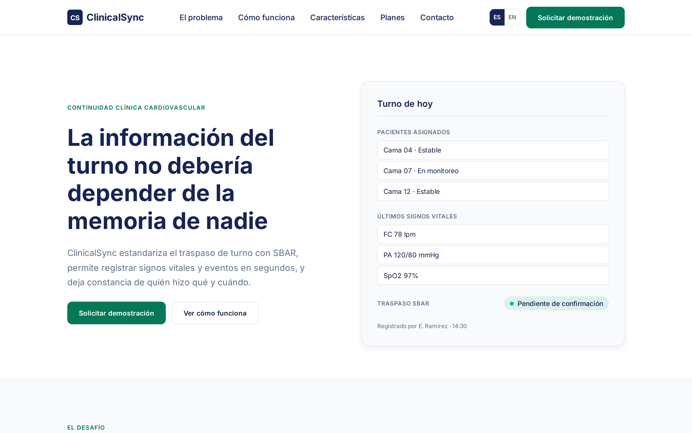
</p>

*Presenta la propuesta de valor de ClinicalSync y sitúa de inmediato el problema que resuelve: la dependencia de la memoria del profesional para transmitir la información del turno. Incluye las dos acciones principales, solicitar una demostración y conocer el funcionamiento, junto con el selector de idioma. El panel lateral anticipa la interfaz de la aplicación mostrando pacientes asignados, últimos signos vitales y un traspaso SBAR pendiente de confirmación. Corresponde a las historias US-01 y US-02.*

**B. El problema**

<p align="center">
  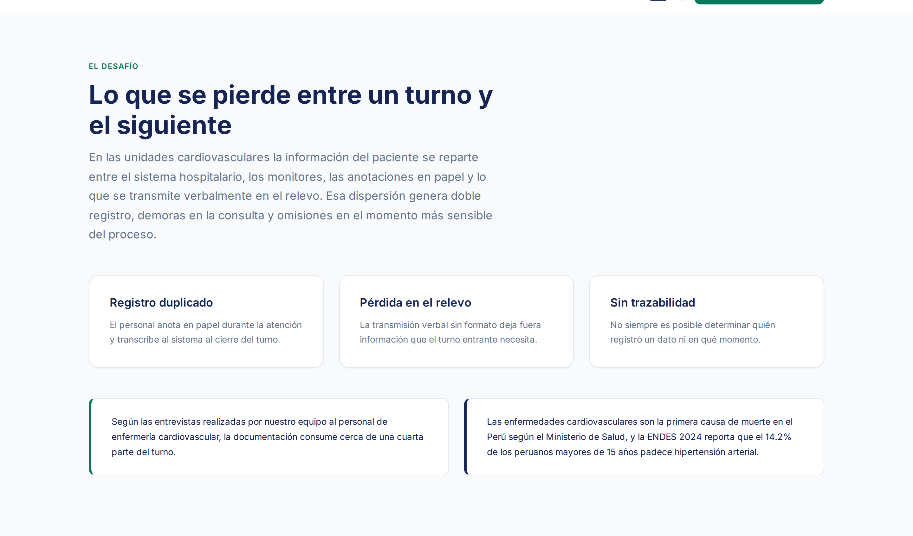
</p>

*Desarrolla la problemática identificada en el Capítulo I: la dispersión de la información clínica entre el sistema hospitalario, los monitores, las anotaciones en papel y la comunicación verbal. Se organiza en tres puntos —registro duplicado, pérdida en el relevo y ausencia de trazabilidad— y cierra con el contexto epidemiológico citando al MINSA y la ENDES 2024. Atiende al visitante que aún no ha reconocido la necesidad. Corresponde a la historia US-03.*

**C. Cómo funciona**

<p align="center">
  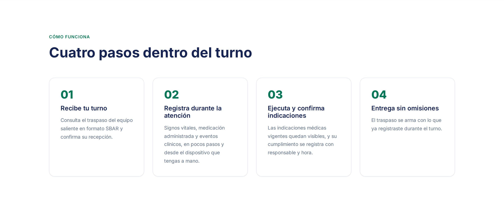
</p>

*Describe el uso de la plataforma en cuatro pasos ordenados dentro del turno: recibir el traspaso, registrar durante la atención, ejecutar y confirmar indicaciones, y entregar el turno a partir de lo ya registrado. Permite al visitante comprender el flujo sin necesidad de una demostración. Corresponde a la historia US-04.*

**D. Características**

<p align="center">
  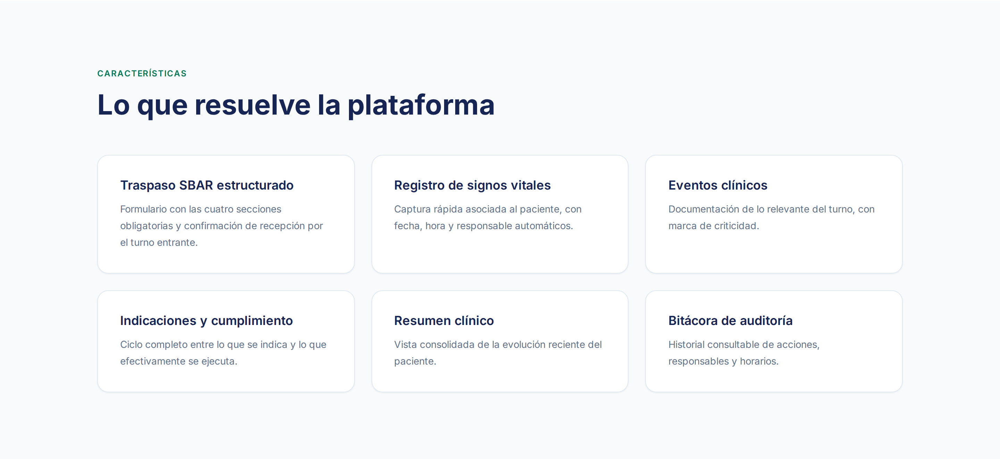
</p>

*Enumera las seis capacidades del producto: traspaso SBAR estructurado, registro de signos vitales, eventos clínicos, indicaciones y cumplimiento, resumen clínico y bitácora de auditoría. Cada una corresponde a un epic del Capítulo III. Atiende al visitante que evalúa si la solución cubre sus necesidades operativas. Corresponde a la historia US-05.*

**E. Beneficios**

<p align="center">
  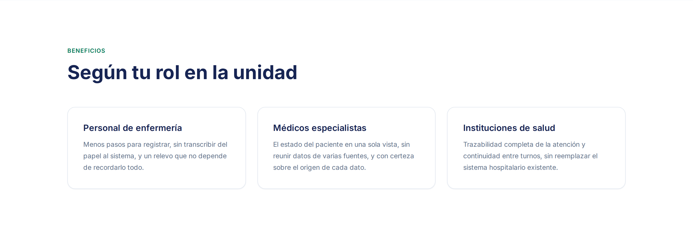
</p>

*Diferencia el valor aportado según el perfil del visitante: personal de enfermería, médicos especialistas e instituciones de salud. Esta separación responde a la conclusión de la sección 2.3.1, según la cual ambos perfiles se relacionan con la información de manera opuesta. Corresponde a la historia US-06.*

**F. Planes**

<p align="center">
  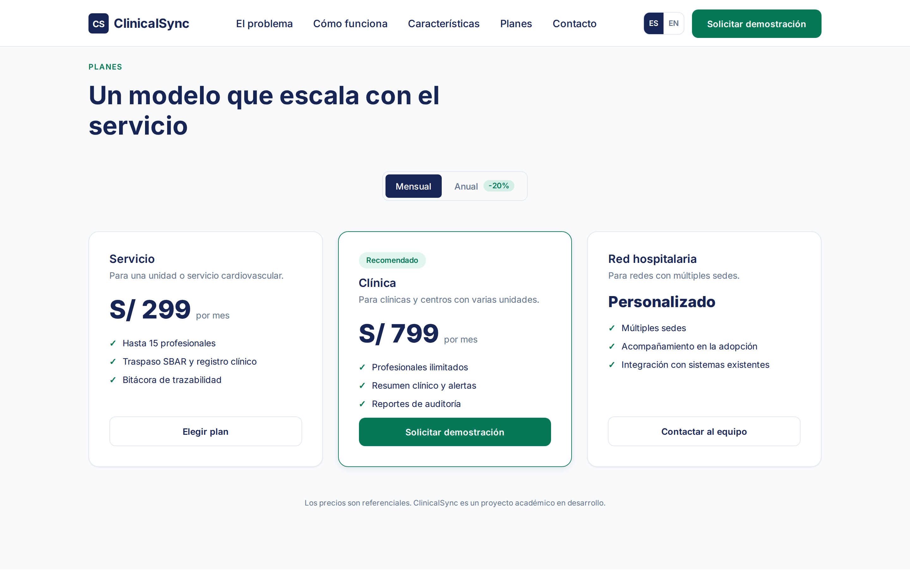
</p>

*Presenta el modelo de servicio en tres niveles, según el tamaño del establecimiento, con alternancia entre facturación mensual y anual. Se indica expresamente que los precios son referenciales por tratarse de un proyecto académico en desarrollo. Atiende al visitante con capacidad de decisión sobre la contratación. Corresponde a la historia US-07.*

**G. Preguntas frecuentes**

<p align="center">
  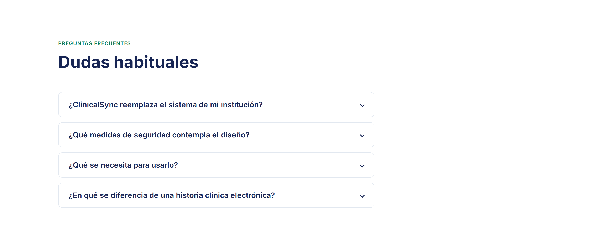
</p>

*Resuelve las cuatro dudas más frecuentes del visitante institucional: si la solución reemplaza el sistema existente, qué medidas de seguridad contempla el diseño, qué se requiere para utilizarla y en qué se diferencia de una historia clínica electrónica. Las respuestas describen decisiones de diseño y no afirman certificaciones que el proyecto no posee. Corresponde a la historia US-08.*

**H. Equipo**

<p align="center">
  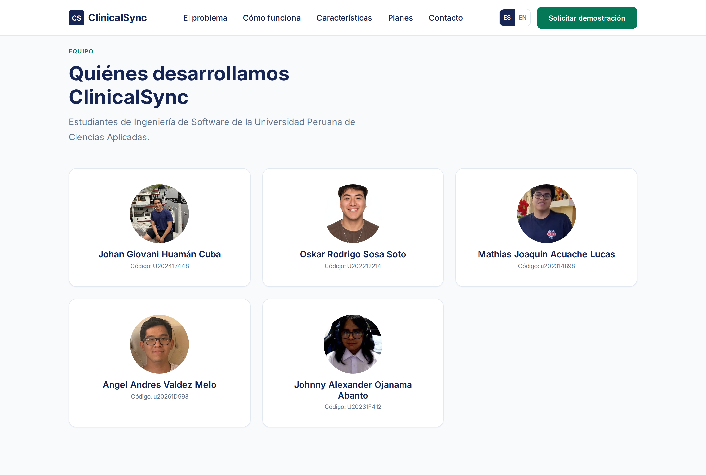
</p>

*Presenta a los cinco integrantes del equipo con su rol dentro del proyecto, identificando a los responsables del desarrollo de la solución. Corresponde a la historia US-09.*

**I. Contacto**

<p align="center">
  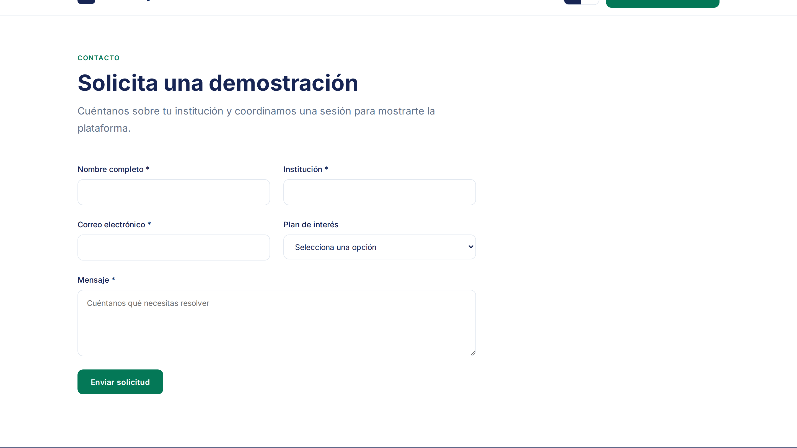
</p>

*Cierra el recorrido con el formulario de solicitud de demostración, que valida los campos obligatorios y el formato del correo antes de permitir el envío, y confirma la recepción en pantalla. Corresponde a la historia US-10.*

##### 5.2.1.6. Services Documentation Evidence for Sprint Review

En esta sección se presenta la documentación relacionada con los servicios que serán ofrecidos a través de la plataforma web de ClinicalSync. 
Estos servicios incluirán funcionalidades como el registro de pacientes y citas, traspasos SBAR, generación de alertas ante fluctuaciones cardiovasculares inusuales del paciente y registro de los signos vitales del paciente.

Durante el presente Sprint 1, el enfoque del equipo estuvo centrado exclusivamente en el diseño y desarrollo de la Landing Page del producto, 
con el objetivo de definir la propuesta de valor, los segmentos de usuarios y la experiencia inicial del sistema. Debido a este alcance, 
no se implementaron ni desplegaron servicios web funcionales, por lo que no se cuenta aún con endpoints operativos ni documentación técnica asociada 
a su consumo.


##### 5.2.1.7. Software Deployment Evidence for Sprint Review

En esta sección se describe el proceso de publicación de la Landing Page en un entorno de producción y se presentan las evidencias que acreditan su disponibilidad para los usuarios finales.

**URL pública de la Landing Page:** [https://clinicalsync-landing.vercel.app/](https://clinicalsync-landing.vercel.app/)

**Repositorio del código fuente:** [https://github.com/Digital-Clinical-Systems/Landing-Page](https://github.com/Digital-Clinical-Systems/Landing-Page)

El procedimiento seguido fue el siguiente:

1. El desarrollo se realizó sobre el repositorio `Digital-Clinical-Systems/Landing-Page`, integrando cada sección completada a la rama `main` mediante commits independientes, conforme a la convención descrita en la sección 5.1.3.

2. Se instaló la GitHub App de Vercel en la organización, autorizando el acceso únicamente al repositorio de la Landing Page.

3. Se importó el repositorio como proyecto en Vercel bajo el nombre `clinicalsync-landing`. Al tratarse de un sitio estático sin proceso de compilación, no se configuró comando de build ni directorio de salida.

4. Vercel generó el despliegue en producción y quedó establecida la integración continua: cada integración posterior a `main` publica automáticamente una nueva versión, conservando el historial de despliegues anteriores.

**Verificación del despliegue.** Se comprobó sobre el sitio publicado que la navegación responde correctamente, que el cambio de idioma opera entre español e inglés, que el diseño se adapta sin desplazamiento horizontal en anchos de escritorio y de móvil, y que las cabeceras de caché definidas en `vercel.json` se aplican efectivamente en producción.

<p align="center">
  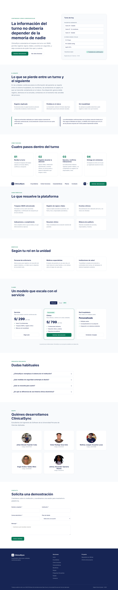
</p>

*Vista completa de la Landing Page publicada, capturada a 1440 px de ancho.*

<p align="center">
  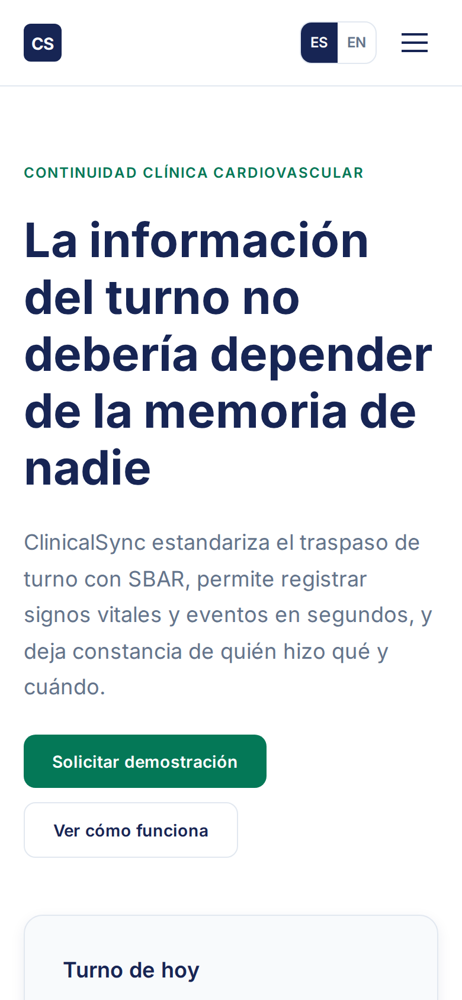
  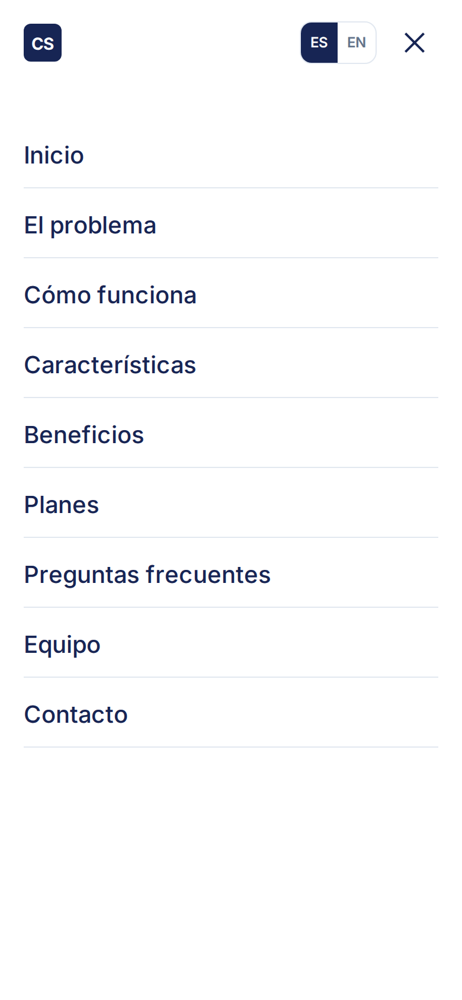
</p>

*Comportamiento adaptable a 390 px de ancho. A la izquierda, la portada; a la derecha, el menú desplegable, que conserva los nueve destinos de navegación conforme a lo definido en la sección 4.2.5.*

##### 5.2.1.8. Team Collaboration Insights during Sprint

La herramienta de Insights de GitHub demuestra que todos los miembros del equipo (Oskar, Mathias, Angel, Johan y Johnny) han colaborado activamente mediante la subida de commits. Las labores fueron distribuidas de forma equitativa para garantizar que el Layout, la Navegación, el Diseño Responsivo, la Internacionalización y el despliegue de la Landing Page se completaran en los tiempos estimados del Sprint.

<p align="center">
  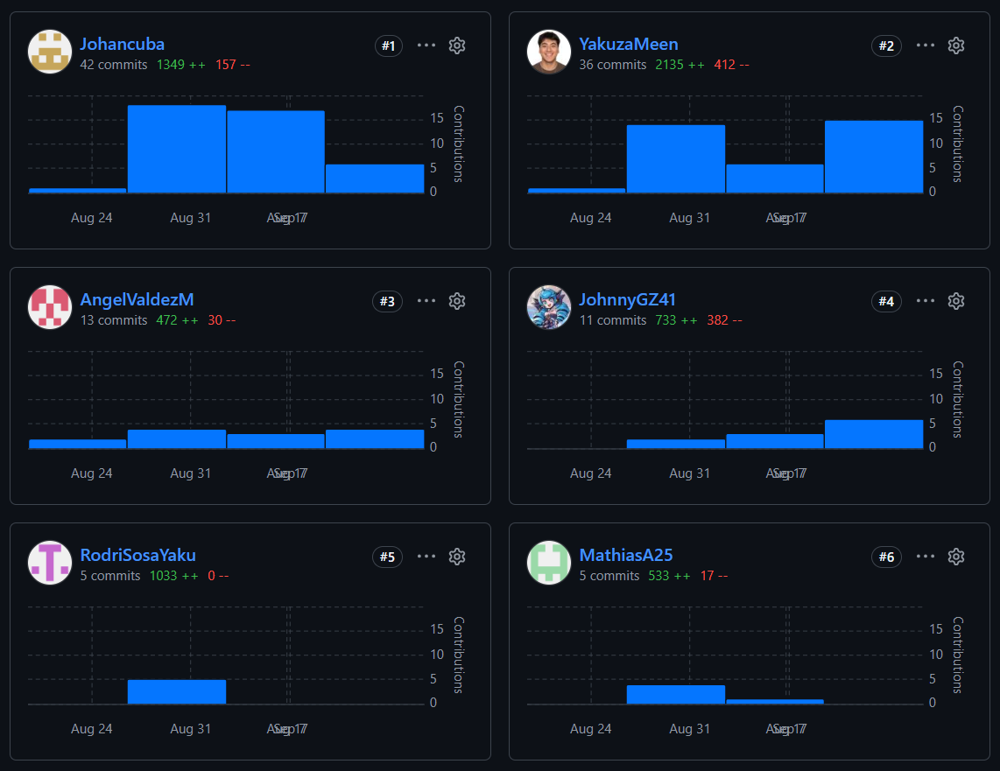
</p>


---

## Conclusiones
### Conclusiones y recomendaciones
### Video About-the-Team

---

## Bibliografía

---

## Anexos
### Anexo A. Videos de Exposiciones
*(Incluir de forma progresiva el título e hipervínculo al video de Exposición en Microsoft Stream para cada entrega AV1, TB1, AV2, TB2).*
