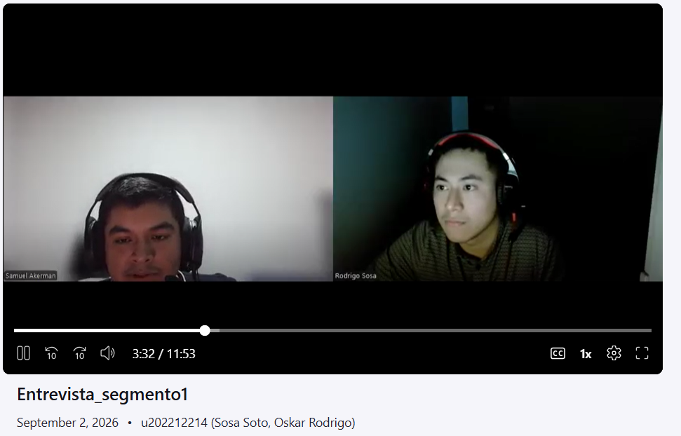
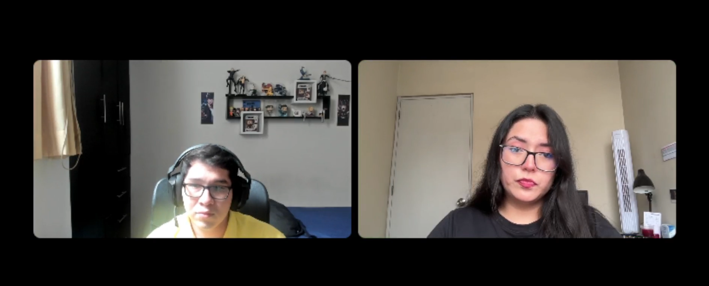
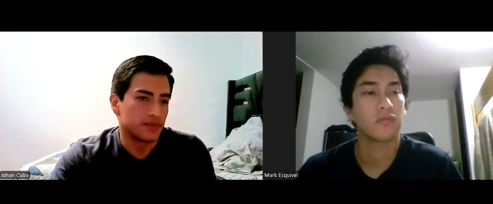

  
   
  <h3>Universidad Peruana de Ciencias Aplicadas</h3>
  <h4>Facultad de Ingeniería</h4>
  <h4>Carrera de Ingeniería de Software</h4>
   
  <h4>Ciclo 2026-20</h4>
   
  <h4>1ASI0729 - Desarrollo de Aplicaciones Open Source</h4>
  <h4>NRC: [Ingresar NRC]</h4>
  <h4>Profesor: [Ingresar Nombre del Profesor]</h4>
   
  <h2>Informe de Trabajo Final</h2>
   
  <h3>Startup: [Nuevo Nombre de la Startup]</h3>
  <h3>Producto: [Nuevo Nombre del Producto]</h3>
   
  <h4>Integrantes:</h4>
  <ul style="list-style-type: none; padding: 0;">
    <li>[Código 1] - [Apellidos, Nombres 1]</li>
    <li>[Código 2] - [Apellidos, Nombres 2]</li>
    <li>[Código 3] - [Apellidos, Nombres 3]</li>
    <li>[Código 4] - [Apellidos, Nombres 4]</li>
  </ul>
   
  <h4>[Mes], [Año]</h4>

---

## Registro de Versiones del Informe

| Versión | Fecha | Autor | Descripción de modificación |
|---------|-------|-------|-----------------------------|
| 1.0     | [Fecha] | [Autor] | Versión inicial del documento (Estructura base) |

---

## Project Report Collaboration Insights

URL del repositorio: `[URL del Repositorio de GitHub para el Informe]`

*(En esta sección se explicará cómo se han desarrollado las actividades de elaboración del informe y se presentarán capturas de los analíticos de colaboración y commits en GitHub).*

---

## Contenido

* [Registro de Versiones del Informe](#registro-de-versiones-del-informe)
* [Project Report Collaboration Insights](#project-report-collaboration-insights)
* [Student Outcome](#student-outcome)
* [Capítulo I: Introducción](#capítulo-i-introducción)
  * [1.1. Startup Profile](#11-startup-profile)
    * [1.1.1. Descripción de la Startup](#111-descripción-de-la-startup)
    * [1.1.2. Perfiles de integrantes del equipo](#112-perfiles-de-integrantes-del-equipo)
  * [1.2. Solution Profile](#12-solution-profile)
    * [1.2.1 Antecedentes y problemática](#121-antecedentes-y-problemática)
    * [1.2.2 Lean UX Process](#122-lean-ux-process)
      * [1.2.2.1. Lean UX Problem Statements](#1221-lean-ux-problem-statements)
      * [1.2.2.2. Lean UX Assumptions](#1222-lean-ux-assumptions)
      * [1.2.2.3. Lean UX Hypothesis Statements](#1223-lean-ux-hypothesis-statements)
      * [1.2.2.4. Lean UX Canvas](#1224-lean-ux-canvas)
  * [1.3. Segmentos objetivo](#13-segmentos-objetivo)
* [Capítulo II: Requirements Elicitation & Analysis](#capítulo-ii-requirements-elicitation--analysis)
  * [2.1. Competidores](#21-competidores)
    * [2.1.1. Análisis competitivo](#211-análisis-competitivo)
    * [2.1.2. Estrategias y tácticas frente a competidores](#212-estrategias-y-tácticas-frente-a-competidores)
  * [2.2. Entrevistas](#22-entrevistas)
    * [2.2.1. Diseño de entrevistas](#221-diseño-de-entrevistas)
    * [2.2.2. Registro de entrevistas](#222-registro-de-entrevistas)
    * [2.2.3. Análisis de entrevistas](#223-análisis-de-entrevistas)
  * [2.3. Needfinding](#23-needfinding)
    * [2.3.1. User Personas](#231-user-personas)
    * [2.3.2. User Task Matrix](#232-user-task-matrix)
    * [2.3.3. User Journey Mapping](#233-user-journey-mapping)
    * [2.3.4. Empathy Mapping](#234-empathy-mapping)
  * [2.4. Big Picture Event Storming](#24-big-picture-event-storming)
  * [2.5. Ubiquitous Language](#25-ubiquitous-language)
* [Capítulo III: Requirements Specification](#capítulo-iii-requirements-specification)
  * [3.1. User Stories](#31-user-stories)
  * [3.2. Impact Mapping](#32-impact-mapping)
  * [3.3. Product Backlog](#33-product-backlog)
* [Capítulo IV: Product Design](#capítulo-iv-product-design)
  * [4.1. Style Guidelines](#41-style-guidelines)
    * [4.1.1. General Style Guidelines](#411-general-style-guidelines)
    * [4.1.2. Web Style Guidelines](#412-web-style-guidelines)
  * [4.2. Information Architecture](#42-information-architecture)
    * [4.2.1. Organization Systems](#421-organization-systems)
    * [4.2.2. Labeling Systems](#422-labeling-systems)
    * [4.2.3. SEO Tags and Meta Tags](#423-seo-tags-and-meta-tags)
    * [4.2.4. Searching Systems](#424-searching-systems)
    * [4.2.5. Navigation Systems](#425-navigation-systems)
  * [4.3. Landing Page UI Design](#43-landing-page-ui-design)
    * [4.3.1. Landing Page Wireframe](#431-landing-page-wireframe)
    * [4.3.2. Landing Page Mock-up](#432-landing-page-mock-up)
  * [4.4. Web Applications UX/UI Design](#44-web-applications-uxui-design)
    * [4.4.1. Web Applications Wireframes](#441-web-applications-wireframes)
    * [4.4.2. Web Applications Wireflow Diagrams](#442-web-applications-wireflow-diagrams)
    * [4.4.3. Web Applications Mock-ups](#443-web-applications-mock-ups)
    * [4.4.4. Web Applications User Flow Diagrams](#444-web-applications-user-flow-diagrams)
  * [4.5. Web Applications Prototyping](#45-web-applications-prototyping)
  * [4.6. Domain-Driven Software Architecture](#46-domain-driven-software-architecture)
    * [4.6.1. Design-Level Event Storming](#461-design-level-event-storming)
    * [4.6.2. Software Architecture Context Diagram](#462-software-architecture-context-diagram)
    * [4.6.3. Software Architecture Container Diagrams](#463-software-architecture-container-diagrams)
    * [4.6.4. Software Architecture Components Diagrams](#464-software-architecture-components-diagrams)
  * [4.7. Software Object-Oriented Design](#47-software-object-oriented-design)
    * [4.7.1. Class Diagrams](#471-class-diagrams)
  * [4.8. Database Design](#48-database-design)
    * [4.8.1. Database Diagrams](#481-database-diagrams)
* [Capítulo V: Product Implementation, Validation & Deployment](#capítulo-v-product-implementation-validation--deployment)
  * [5.1. Software Configuration Management](#51-software-configuration-management)
    * [5.1.1. Software Development Environment Configuration](#511-software-development-environment-configuration)
    * [5.1.2. Source Code Management](#512-source-code-management)
    * [5.1.3. Source Code Style Guide & Conventions](#513-source-code-style-guide--conventions)
    * [5.1.4. Software Deployment Configuration](#514-software-deployment-configuration)
  * [5.2. Landing Page, Services & Applications Implementation](#52-landing-page-services--applications-implementation)
    * [5.2.1. Sprint 1](#521-sprint-1)
      * [5.2.1.1. Sprint Planning 1](#5211-sprint-planning-1)
      * [5.2.1.2. Aspect Leaders and Collaborators](#5212-aspect-leaders-and-collaborators)
      * [5.2.1.3. Sprint Backlog 1](#5213-sprint-backlog-1)
      * [5.2.1.4. Development Evidence for Sprint Review](#5214-development-evidence-for-sprint-review)
      * [5.2.1.5. Execution Evidence for Sprint Review](#5215-execution-evidence-for-sprint-review)
      * [5.2.1.6. Services Documentation Evidence for Sprint Review](#5216-services-documentation-evidence-for-sprint-review)
      * [5.2.1.7. Software Deployment Evidence for Sprint Review](#5217-software-deployment-evidence-for-sprint-review)
      * [5.2.1.8. Team Collaboration Insights during Sprint](#5218-team-collaboration-insights-during-sprint)
  * [5.3. Validation Interviews](#53-validation-interviews)
    * [5.3.1. Diseño de Entrevistas](#531-diseño-de-entrevistas)
    * [5.3.2. Registro de Entrevistas](#532-registro-de-entrevistas)
    * [5.3.3. Evaluaciones según heurísticas](#533-evaluaciones-según-heurísticas)
  * [5.4. Video About-the-Product](#54-video-about-the-product)
* [Conclusiones](#conclusiones)
  * [Conclusiones y recomendaciones](#conclusiones-y-recomendaciones)
  * [Video About-the-Team](#video-about-the-team)
* [Bibliografía](#bibliografía)
* [Anexos](#anexos)

---

## Student Outcome
**ABET - EAC - Student Outcome 3**
**Criterio:** Capacidad de comunicarse efectivamente con un rango de audiencias.

El curso contribuye al cumplimiento del Student Outcome ABET. En el siguiente cuadro se describe las acciones realizadas y enunciados de conclusiones por parte del grupo, que permiten sustentar el haber alcanzado el logro.

| Criterio específico | Acciones realizadas | Conclusiones |
|---------------------|---------------------|--------------|
| Comunica oralmente con efectividad a diferentes rangos de audiencia. | **[Apellidos, Nombres 1]** AV1: [Acción 1] AV2: [Acción 2] | *(Conclusión grupal sobre la mejora en comunicación oral y medios audiovisuales)* |
| Comunica por escrito con efectividad a diferentes rangos de audiencia. | **[Apellidos, Nombres 1]** AV1: [Acción 1] AV2: [Acción 2] | *(Conclusión grupal sobre redacción técnica, calidad de entregables e idioma)* |

---

## Capítulo I: Introducción
### 1.1. Startup Profile
#### 1.1.1. Descripción de la Startup
#### 1.1.2. Perfiles de integrantes del equipo
### 1.2. Solution Profile
#### 1.2.1 Antecedentes y problemática
#### 1.2.2 Lean UX Process
##### 1.2.2.1. Lean UX Problem Statements
##### 1.2.2.2. Lean UX Assumptions
##### 1.2.2.3. Lean UX Hypothesis Statements
##### 1.2.2.4. Lean UX Canvas
### 1.3. Segmentos objetivo

---

## Capítulo II: Requirements Elicitation & Analysis

En este capítulo se documenta el proceso de elicitación y análisis de requisitos de ClinicalSync, la plataforma web desarrollada por Digital Clinical System para dar soporte a la continuidad asistencial en áreas cardiovasculares. El objetivo es pasar de la problemática planteada en el Capítulo I a un conjunto de hallazgos verificables que sustenten las decisiones de producto, diseño y arquitectura de los capítulos siguientes.

El capítulo se organiza en cinco bloques: el estudio del panorama competitivo, el trabajo de campo mediante entrevistas a representantes de los segmentos objetivo, los artefactos de Needfinding que traducen esos hallazgos en arquetipos y recorridos, el Big Picture Event Storming que modela el dominio clínico completo y, finalmente, el Ubiquitous Language que fija el vocabulario común del equipo.

### 2.1. Competidores

El posicionamiento de ClinicalSync exige entender contra qué compite realmente. La plataforma no pretende sustituir el sistema de información hospitalaria (HIS) ni la historia clínica electrónica institucional: se plantea como una capa complementaria y especializada que resuelve tres necesidades concretas del área cardiovascular, a saber, el traspaso estructurado de turno bajo el modelo SBAR, el registro ágil de signos vitales y eventos clínicos, y la trazabilidad verificable de responsables, fechas y acciones.

Por esa razón el mapa competitivo no se limita a fabricantes de historia clínica electrónica. ClinicalSync compite, en distintos grados, con cuatro familias de soluciones: las herramientas especializadas en traspaso clínico estructurado, las plataformas de comunicación y colaboración clínica, los sistemas de monitoreo centralizado de pacientes y las suites de historia clínica electrónica. A ellas se suma el sustituto más extendido en la práctica peruana, que es la combinación de registro en papel, hojas de cálculo y reporte verbal.

Los competidores seleccionados para el análisis son los siguientes:

| Competidor | Tipo de competencia | Justificación de la selección |
|---|---|---|
| **I-PASS Institute — Herramienta de traspaso escrito y plataforma eVIEW** | Competidor directo | Es la referencia internacional en traspaso clínico estructurado. Ofrece una metodología de handoff (Illness severity, Patient summary, Action list, Situation awareness, Synthesis by receiver) junto con una herramienta de traspaso escrito que se despliega dentro del EHR nativo de la institución. Compite directamente con el eje central de ClinicalSync, que es estandarizar y dejar registro del cambio de turno, aunque su alcance se concentra en el handoff y no en el registro continuo de signos vitales ni en el seguimiento cardiovascular. |
| **Stryker Vocera Platform** | Competidor directo | Plataforma de comunicación y colaboración clínica que combina un dispositivo vestible activado por voz con mensajería segura, notificaciones enriquecidas con contexto del paciente y un middleware de integración con sistemas clínicos. Compite directamente en la coordinación del equipo asistencial y en la entrega de alertas al profesional correcto, pero su producto resuelve la transmisión del mensaje y no la estructura ni la persistencia del contenido clínico traspasado. |
| **GE HealthCare CARESCAPE Central Station** | Competidor directo | Estación central de monitoreo que concentra las camas de una unidad, gestiona alarmas, detecta arritmias y cambios del segmento ST, conserva histórico de eventos y permite enviar reportes al EMR. Compite directamente en el pilar de vigilancia de signos vitales y alertas cardiovasculares, aunque es una solución de hardware biomédico atada a la cama del paciente y no cubre el traspaso de turno ni el registro narrativo de eventos clínicos. |
| **Oracle Health (Cerner Millennium)** | Competidor indirecto | Suite de historia clínica electrónica y gestión hospitalaria de alcance integral, con módulos clínicos, administrativos y de reportería. Compite indirectamente porque cubre el registro y la consulta de información del paciente, pero su amplitud funcional y su costo la orientan a la institución completa y no a los flujos rápidos y específicos de una unidad cardiovascular. |
| **Nubimed** | Competidor indirecto | Software de historia clínica electrónica en la nube, configurable por especialidad, con agenda, firma digital, facturación, integración con CIE-10 y vademécum, y comercializado en el mercado hispanohablante bajo modelo de suscripción. Compite indirectamente porque representa la alternativa SaaS accesible a la que puede recurrir una clínica mediana, aunque está orientada a consulta ambulatoria y no al trabajo por turnos en hospitalización o UCI. |
| **SIHCE y RENHICE (Ministerio de Salud del Perú)** | Competidor indirecto | El Sistema de Información de Historia Clínica Electrónica del MINSA y el Registro Nacional de Historias Clínicas Electrónicas constituyen la infraestructura pública peruana de información clínica. Compite indirectamente porque en establecimientos públicos ya ocupa el espacio del registro obligatorio del paciente; sin embargo, su diseño responde a fines de registro nacional e interoperabilidad, no a la operación minuto a minuto de un turno cardiovascular. |
| **Métodos tradicionales: papel, hojas de cálculo, mensajería informal y reporte verbal** | Sustituto actual | No constituyen un producto digital, pero son la forma real en que hoy se resuelve buena parte del problema en muchos servicios: cuadernos de enfermería, kardex impreso, archivos de Excel, grupos de mensajería y reporte oral en el cambio de guardia. Es el sustituto con mayor participación efectiva y, por lo tanto, el punto de comparación más honesto para medir la adopción de ClinicalSync. |

  

#### 2.1.1. Análisis competitivo

El siguiente análisis compara a ClinicalSync frente a los competidores identificados en términos de perfil, estrategia de marketing, características de producto, costos, canales de distribución y análisis SWOT.

**Pregunta guía del análisis:**
¿Cómo puede ClinicalSync diferenciarse de las soluciones de traspaso clínico, comunicación hospitalaria, monitoreo centralizado e historia clínica electrónica disponibles hoy, para cubrir de manera más eficiente las necesidades operativas del personal de enfermería y de los médicos especialistas en unidades cardiovasculares?

| Dimensión | Criterio | ClinicalSync (Digital Clinical System) | I-PASS Institute | Stryker Vocera Platform | GE HealthCare CARESCAPE Central Station | Oracle Health (Cerner Millennium) | Nubimed | SIHCE / RENHICE (MINSA) | Métodos tradicionales |
|---|---|---|---|---|---|---|---|---|---|
| **Perfil** | **Overview** | Plataforma web complementaria para unidades cardiovasculares. Centraliza pacientes, signos vitales, eventos clínicos, traspasos SBAR, alertas y bitácora de trazabilidad, con landing page y API REST propia. | Metodología de traspaso estructurado más capacitación, coaching y una herramienta de handoff escrito que se configura dentro del EHR de la institución. | Plataforma de comunicación clínica basada en dispositivo vestible con control por voz, mensajería segura y enrutamiento de notificaciones con contexto del paciente. | Estación central de monitoreo que agrupa las camas de una unidad, gestiona alarmas y arritmias, y conserva histórico de eventos fisiológicos. | Suite integral de historia clínica electrónica y gestión hospitalaria para toda la institución. | Historia clínica electrónica en la nube, configurable por especialidad, orientada a clínicas y consultorios. | Infraestructura pública peruana de historia clínica electrónica y registro nacional interoperable. | Conjunto de prácticas manuales: cuaderno de enfermería, kardex impreso, hojas de cálculo y reporte verbal en el relevo. |
| **Perfil** | **Ventaja competitiva** | Resuelve un problema acotado y de alto costo clínico: la pérdida de información en el cambio de turno cardiovascular. Combina estructura SBAR, registro rápido y trazabilidad en una sola herramienta ligera y de adopción corta. | Respaldo académico y evidencia acumulada sobre reducción de daño evitable asociado a traspasos, con una metodología reconocida y ampliamente publicada. | Manos libres real: el profesional se comunica sin dejar la atención del paciente, y las alertas llegan al responsable correcto con contexto. | Precisión clínica del monitoreo continuo y capacidad de detectar deterioro fisiológico antes de que sea evidente para el equipo. | Cobertura funcional completa del ciclo asistencial y administrativo, con un ecosistema maduro de integraciones. | Costo de entrada bajo, despliegue rápido y configuración por especialidad sin necesidad de proyecto de TI. | Cobertura normativa y alcance nacional, con obligatoriedad progresiva en establecimientos públicos. | Costo cero, disponibilidad inmediata y cero curva de aprendizaje. |
| **Perfil de Marketing** | **Mercado objetivo** | Clínicas privadas, hospitales, unidades de cuidados intensivos cardiovasculares, hospitalización cardiológica y servicios de emergencia en Perú y la región. | Hospitales, sistemas de salud, programas de residencia médica y aseguradoras de responsabilidad profesional, principalmente en Estados Unidos y Canadá. | Hospitales y redes de salud que buscan reemplazar buscapersonas y canales dispersos por una plataforma unificada de comunicación. | Unidades críticas, cardiología, telemetría y emergencia que requieren vigilancia continua a nivel de cama. | Grandes redes hospitalarias y sistemas de salud con capacidad de inversión y equipos de TI propios. | Clínicas medianas, centros especializados y consultorios del mercado hispanohablante. | Establecimientos de salud del sistema público peruano. | Servicios que aún no han digitalizado el flujo de turno o que usan el papel como respaldo del sistema digital. |
| **Perfil de Marketing** | **Estrategias de marketing** | Landing page centrada en el problema del traspaso de turno, con propuesta de valor, módulos, beneficios, planes y llamados a la acción para solicitar demostración. Difusión académica y validación con profesionales del sector. | Posicionamiento basado en evidencia científica, publicaciones revisadas por pares, casos institucionales y programas de certificación. | Marketing B2B enfocado en seguridad del personal, reducción de la fatiga por interrupciones y casos de éxito hospitalarios. | Venta consultiva a través de fuerza comercial biomédica e integradores, apoyada en especificaciones técnicas y certificaciones. | Venta empresarial de ciclo largo, con licenciamiento, consultoría de implantación y acompañamiento posventa. | Marketing digital autoservicio, prueba gratuita, contenido para profesionales independientes y precios publicados. | Comunicación institucional, normativa y programas de despliegue estatal. | No aplica. |
| **Perfil de Producto** | **Productos y servicios** | Aplicación web responsiva, API REST documentada con OpenAPI, autenticación por roles, gestión de pacientes, registro de signos vitales, eventos clínicos, traspaso SBAR, alertas visuales y bitácora de auditoría. | Herramienta de traspaso escrito integrada al EHR, plataforma de capacitación virtual, coaching y gestión del programa de mejora. | Dispositivo vestible con pantalla táctil, mensajería y llamadas por voz, botón de emergencia y middleware de integración con sistemas clínicos. | Monitores de cabecera, estación central, algoritmos de arritmia y segmento ST, gestión de alarmas y exportación de reportes al EMR. | Módulos clínicos, de enfermería, farmacia, laboratorio, imágenes, facturación y analítica institucional. | Historia clínica configurable, agenda, firma digital, facturación, inventario y funciones asistidas por IA. | Registro de atenciones, historia clínica electrónica pública e interoperabilidad entre establecimientos. | Formatos impresos, cuadernos, plantillas de hoja de cálculo y comunicación verbal o por mensajería. |
| **Perfil de Producto** | **Precios y costos** | Modelo SaaS por planes escalonados según tamaño del servicio, con costo de entrada bajo frente a soluciones empresariales. | Licenciamiento institucional por programa, que incluye capacitación y acompañamiento; requiere contar previamente con un EHR. | Licenciamiento por usuario más inversión en dispositivos e infraestructura inalámbrica hospitalaria. | Inversión de capital elevada en hardware por cama, más licenciamiento y contrato de mantenimiento biomédico. | Licenciamiento empresarial de alto costo, con proyecto de implantación y soporte plurianual. | Suscripción mensual accesible por profesional o por clínica. | Sin costo directo para el establecimiento público; el costo es institucional y de despliegue. | Sin costo monetario visible, pero con alto costo oculto en horas de trabajo duplicado. |
| **Perfil de Producto** | **Canales de distribución** | Landing page pública, aplicación web desplegada en la nube y API documentada, accesible desde navegador en computadora, tablet o teléfono. | Contratación institucional directa y despliegue de plantillas dentro del EHR existente. | Venta directa e integradores; uso mediante dispositivo vestible y aplicación móvil complementaria. | Venta directa e integradores biomédicos; consulta desde la estación central y los monitores de cabecera. | Venta directa corporativa con socios de implantación certificados. | Autoservicio en la web, con registro y prueba en línea. | Despliegue institucional coordinado por el MINSA. | No aplica. |
| **Análisis SWOT** | **Fortalezas** | Enfoque específico en el problema del traspaso cardiovascular, baja complejidad de uso, trazabilidad visible, tiempo corto de adopción y coherencia entre landing page y aplicación. | Metodología validada, evidencia publicada y fuerte reconocimiento en seguridad del paciente. | Comunicación en tiempo real sin ocupar las manos, integración amplia con sistemas clínicos y adopción consolidada en hospitales. | Alta confiabilidad clínica, detección temprana de deterioro y continuidad del monitoreo sin intervención humana. | Cobertura funcional total, madurez del producto y respaldo corporativo. | Precio accesible, rapidez de puesta en marcha y flexibilidad de configuración. | Alcance nacional, respaldo normativo e interoperabilidad entre establecimientos. | Disponibilidad inmediata, flexibilidad total y familiaridad del personal. |
| **Análisis SWOT** | **Debilidades** | Producto emergente, sin base instalada, con integraciones clínicas aún por construir y necesidad de validación con más instituciones. | Depende de que la institución ya cuente con un EHR compatible; no cubre registro continuo de signos vitales ni seguimiento cardiovascular. | Resuelve la transmisión del mensaje pero no estructura ni conserva el contenido clínico del traspaso; requiere inversión en dispositivos. | Es hardware atado a la cama: no modela el traspaso de turno ni el registro narrativo de eventos, y su costo limita su alcance. | Complejidad de uso, exceso de pasos operativos para tareas rápidas y costo prohibitivo para servicios pequeños. | Orientada a consulta ambulatoria; no contempla trabajo por turnos, relevos ni vigilancia continua en unidades críticas. | Diseñada para registro e interoperabilidad, no para la operación rápida del turno; adopción desigual entre establecimientos. | Genera duplicidad, omisiones, ilegibilidad y ausencia total de trazabilidad. |
| **Análisis SWOT** | **Oportunidades** | Posicionarse como capa complementaria y de bajo riesgo sobre el HIS existente, y crecer desde un MVP validado hacia integraciones con monitores y EHR. | Ampliar su alcance hacia el traspaso de enfermería y hacia mercados fuera de Norteamérica. | Incorporar estructura clínica al contenido que hoy solo transporta. | Extender la explotación de sus datos hacia flujos de trabajo asistenciales fuera de la cama. | Modularizar su oferta para servicios que no requieren la suite completa. | Especializarse en escenarios de hospitalización y trabajo por turnos. | Habilitar interoperabilidad con soluciones complementarias de terceros. | Ser reemplazados de forma progresiva por herramientas de adopción sencilla. |
| **Análisis SWOT** | **Amenazas** | Que un competidor consolidado incorpore traspaso SBAR estructurado en su producto, y la resistencia institucional a sumar una herramienta más al ecosistema existente. | Que los fabricantes de EHR integren de forma nativa el traspaso estructurado y reduzcan la necesidad de un tercero. | La competencia de plataformas de mensajería clínica basadas únicamente en software y sin costo de hardware. | La migración del monitoreo hacia soluciones de software y dispositivos de menor costo. | La presión regulatoria y la aparición de alternativas modulares más económicas. | La entrada de competidores locales con mejor conocimiento del contexto regulatorio peruano. | Las limitaciones presupuestales y los ritmos de despliegue del sector público. | La obligatoriedad progresiva del registro electrónico en el marco normativo peruano. |
| **Análisis SWOT** | **Oportunidad concreta para ClinicalSync** | — | Cubrir el traspaso de enfermería cardiovascular con un formato SBAR propio, sin exigir un EHR previo. | Aportar la estructura y la persistencia que la mensajería no ofrece, quedando como registro auditable del traspaso. | Actuar como capa de software que da continuidad narrativa a los datos fisiológicos que el monitor produce. | Ofrecer un flujo ligero para las tareas frecuentes del turno, sin competir por reemplazar el HIS. | Atender el escenario de hospitalización y unidades críticas que Nubimed no cubre. | Complementar el registro obligatorio con la operación diaria del turno cardiovascular. | Sustituir el cuaderno y la hoja de cálculo con una herramienta igual de rápida pero trazable. |

Del análisis se desprende que ClinicalSync no compite por cobertura funcional ni por precisión de instrumentación, terrenos donde Oracle Health y GE HealthCare tienen una ventaja estructural difícil de disputar. Tampoco compite por prestigio metodológico frente a I-PASS ni por infraestructura de comunicación frente a Vocera. Su espacio está en la intersección que ninguno de ellos ocupa por completo: una herramienta ligera que estructura el traspaso de turno cardiovascular, registra signos vitales y eventos con pocos pasos, y deja constancia auditable de quién hizo qué y cuándo, sin exigir a la institución un proyecto de implantación ni la sustitución de sus sistemas actuales.

Un hallazgo relevante del análisis es que el competidor más fuerte de ClinicalSync no es un producto digital sino el sustituto tradicional. El cuaderno de enfermería y la hoja de cálculo siguen siendo rápidos, flexibles y gratuitos, y cualquier solución que pretenda desplazarlos debe igualar esa rapidez antes de ofrecer cualquier beneficio adicional. Esta conclusión condiciona directamente las decisiones de diseño de los capítulos siguientes.

#### 2.1.2. Estrategias y tácticas frente a competidores

A partir del análisis anterior, Digital Clinical System define un conjunto de estrategias orientadas a competir por especialización y simplicidad, evitando la confrontación directa con soluciones de alcance institucional. Cada estrategia se acompaña de tácticas concretas y de su fundamento en el panorama competitivo estudiado.

| Estrategia | Tácticas propuestas | Fundamento en el análisis competitivo |
|---|---|---|
| **Especialización en el traspaso de turno cardiovascular** | Construir el producto alrededor del formulario SBAR, con campos guiados, validación de secciones obligatorias y generación automática del resumen de relevo. | I-PASS demuestra que el traspaso estructurado tiene valor probado, pero exige un EHR previo y se orienta al ámbito médico anglosajón. ClinicalSync puede ocupar ese espacio en enfermería cardiovascular sin ese prerrequisito. |
| **Estructurar el contenido, no solo transportarlo** | Persistir cada traspaso como un registro consultable, versionado y asociado al paciente, y no como un mensaje efímero. | Vocera resuelve la comunicación en tiempo real, pero el contenido no queda estructurado ni auditable. Ese vacío es la ventaja de ClinicalSync. |
| **Complementariedad con el monitoreo biomédico** | Diseñar el registro de signos vitales para convivir con los monitores existentes, permitiendo el ingreso manual rápido y dejando abierta la integración futura. | CARESCAPE genera datos fisiológicos de alta calidad pero no los conecta con el relevo ni con la narrativa clínica del turno. |
| **Complementariedad con el HIS institucional** | Comunicar desde la landing page que ClinicalSync no reemplaza la historia clínica oficial y que puede operar junto al SIHCE o al sistema de la institución. | Reduce la principal objeción de compra frente a Oracle Health y frente al marco normativo peruano, y baja el riesgo percibido de adopción. |
| **Competir contra el papel en rapidez, no en funciones** | Fijar un objetivo explícito de pasos y de tiempo para las tareas frecuentes del turno, y validarlo en pruebas de usabilidad con personal real. | El sustituto tradicional es el competidor con mayor participación efectiva; si la herramienta no es tan rápida como el cuaderno, no será adoptada. |
| **Trazabilidad visible como argumento de venta** | Mostrar de forma explícita responsable, fecha, hora y tipo de acción en cada registro clínico relevante, y ofrecer una vista de bitácora consultable. | Es la carencia más evidente de los métodos tradicionales y un requisito recurrente para auditoría y control de calidad asistencial. |
| **Diseño para el contexto peruano** | Considerar el idioma, la terminología local, la conectividad variable de los establecimientos y la coexistencia con el registro obligatorio del MINSA. | Los competidores internacionales no están diseñados para este contexto, y Nubimed no cubre el trabajo por turnos en unidades críticas. |
| **Precio accesible y escalonado** | Ofrecer planes por tamaño de servicio, de manera que una unidad pueda iniciar sin comprometer un presupuesto institucional. | Frente al licenciamiento empresarial de Oracle Health y a la inversión en hardware de GE HealthCare, el costo de entrada bajo es una barrera de adopción menos. |
| **Validación temprana con usuarios del dominio** | Realizar entrevistas, pruebas de navegación y evaluación heurística con personal de enfermería y médicos especialistas antes de ampliar el alcance funcional. | Permite ajustar el producto sobre evidencia real y no sobre supuestos del equipo, reduciendo el riesgo de construir funcionalidades que nadie usa. |
| **Crecimiento gradual desde un MVP acotado** | Priorizar traspaso SBAR, signos vitales, eventos clínicos y trazabilidad, y postergar reportería avanzada e integraciones hasta contar con adopción. | Evita sobredimensionar el producto frente a competidores consolidados y concentra el esfuerzo en el núcleo que define la propuesta de valor. |

En conclusión, la estrategia de ClinicalSync se sostiene en cuatro pilares: especialización en el flujo cardiovascular, simplicidad medible frente al papel, trazabilidad visible y complementariedad explícita con los sistemas ya instalados. La oportunidad no está en sustituir a los competidores analizados, sino en cubrir con claridad el espacio operativo que hoy queda repartido entre la historia clínica electrónica, el monitor de cabecera, la mensajería del equipo y el cuaderno de enfermería.

### 2.2. Entrevistas

Esta sección documenta el trabajo de campo realizado con representantes de los segmentos objetivo de ClinicalSync. El propósito de las entrevistas es contrastar la problemática planteada en el Capítulo I con la experiencia real de quienes trabajan a diario en unidades cardiovasculares, e identificar necesidades, frustraciones, hábitos tecnológicos y expectativas que no serían visibles desde el análisis documental.

La evidencia recolectada sustenta directamente los artefactos de Needfinding de la sección 2.3, el modelado del dominio de la sección 2.4 y la especificación de requisitos del Capítulo III. Por ello, el diseño de las preguntas se orientó a obtener descripciones de situaciones concretas y no valoraciones generales sobre la conveniencia de digitalizar procesos clínicos.

Se definieron dos segmentos de entrevista, correspondientes a los segmentos objetivo establecidos en la sección 1.3, con tres entrevistas por segmento.

| Segmento | Perfil de los entrevistados | Entrevistas previstas |
|---|---|---|
| Segmento 1: Personal de enfermería cardiovascular | Enfermeros y enfermeras de UCI cardiovascular, hospitalización cardiológica y emergencia, con responsabilidad sobre monitoreo, registro y relevo de turno. | 3 |
| Segmento 2: Médicos especialistas cardiovasculares | Cardiólogos, intensivistas y cirujanos cardiovasculares responsables de consultar, validar e interpretar información clínica para tomar decisiones. | 3 |
| **Total** | — | **6** |

#### 2.2.1. Diseño de entrevistas

El diseño de las entrevistas se elaboró con enfoque exploratorio y cualitativo. Se emplearon preguntas abiertas, redactadas en lenguaje no técnico, orientadas a que el entrevistado describiera su práctica actual antes de opinar sobre cualquier solución propuesta. Las preguntas se organizaron en principales, que abordan el núcleo del problema y se formulan a todos los entrevistados del segmento, y complementarias, que profundizan en hábitos tecnológicos y en información necesaria para construir los arquetipos de usuario.

##### Segmento objetivo 1: Personal de enfermería cardiovascular

###### Descripción del segmento

Este segmento agrupa a profesionales de enfermería que trabajan en unidades de cuidados intensivos cardiovasculares, hospitalización cardiológica, emergencia y áreas de telemetría. Sus responsabilidades incluyen el monitoreo continuo del paciente, el control y registro de signos vitales, la administración de medicamentos según indicación médica, el reporte de eventos clínicos y la entrega de información al equipo entrante al finalizar el turno.

Es el segmento que genera la mayor parte de la información clínica operativa y, al mismo tiempo, el que trabaja bajo mayor presión de tiempo. Cualquier herramienta dirigida a este perfil compite directamente con la rapidez del papel, por lo que interesa conocer con precisión cuántos pasos y cuánto tiempo demanda hoy cada tarea de registro.

###### Información principal a recolectar

- Forma actual de registrar información clínica durante el turno.
- Herramientas y soportes utilizados, tanto digitales como físicos.
- Momento y frecuencia con que se realiza el registro respecto de la atención.
- Dificultades concretas con los sistemas disponibles.
- Mecánica real del cambio de turno y qué información se transmite.
- Situaciones en que se perdió u omitió información clínica.
- Tiempo estimado dedicado a documentación durante la jornada.
- Motivos por los que se recurre a registros físicos complementarios.
- Percepción sobre la trazabilidad de las acciones realizadas.
- Condiciones bajo las cuales adoptaría una nueva herramienta digital.

###### Información complementaria para construir arquetipos

| Característica | Información a recolectar |
|---|---|
| Rango de edad | Rango etario del entrevistado. |
| Distrito o zona | Lugar de residencia o referencia geográfica. |
| Ocupación | Rol y especialidad dentro del servicio. |
| Experiencia laboral | Años de ejercicio profesional en el sector salud. |
| Área de trabajo | UCI cardiovascular, hospitalización, emergencia, telemetría u otra. |
| Tipo de establecimiento | Hospital público, clínica privada, instituto especializado. |
| Modalidad de turno | Diurno, nocturno, rotativo, guardias. |
| Nivel tecnológico | Básico, intermedio o avanzado. |
| Dispositivos utilizados | Computadora fija, laptop, tablet, teléfono. |
| Objetivos | Qué busca lograr durante su turno. |
| Frustraciones | Qué le hace perder tiempo o le genera riesgo. |
| Canales digitales | Sistemas institucionales, hojas de cálculo, mensajería, aplicaciones. |

###### Preguntas principales

1. ¿Podría describirme cómo transcurre un turno suyo desde que llega hasta que se retira?
2. ¿En qué momento del turno registra la información clínica del paciente y en qué soporte lo hace?
3. ¿Qué sistema o herramienta usa su institución para el registro clínico y qué opinión tiene de él?
4. ¿Utiliza además algún registro en papel o personal? ¿Por qué motivo?
5. ¿Cómo se realiza el cambio de turno en su servicio y qué información se transmite?
6. ¿Ha ocurrido que un dato importante no llegue al turno siguiente? ¿Podría contarme qué pasó?
7. ¿Cuánto tiempo de su turno calcula que dedica a documentar?
8. ¿Qué parte del registro clínico le resulta más lenta o más engorrosa?
9. Si necesita saber qué pasó con un paciente en las últimas horas, ¿dónde lo consulta y cuánto le toma?
10. ¿Qué debería tener una herramienta digital para que usted la usara durante el turno y no después?

###### Preguntas complementarias

1. ¿Qué situaciones del turno le generan mayor estrés o mayor riesgo de error?
2. ¿Utiliza el teléfono o alguna tablet durante su jornada? ¿Para qué?
3. ¿Qué tan cómodo se siente aprendiendo a usar sistemas nuevos?
4. ¿Prefiere registrar desde una computadora fija o desde un dispositivo que pueda llevar consigo?
5. ¿Qué información considera imprescindible comunicar en un relevo, aunque falte tiempo?
6. ¿Le ha ocurrido que le pregunten quién registró o quién administró algo y no haya forma de saberlo?
7. ¿Considera que la digitalización del registro mejora o entorpece la atención al paciente?

##### Segmento objetivo 2: Médicos especialistas cardiovasculares

###### Descripción del segmento

Este segmento agrupa a cardiólogos, médicos intensivistas y cirujanos cardiovasculares responsables del diagnóstico, la prescripción y el seguimiento de pacientes de alto riesgo. A diferencia del segmento anterior, su relación con la información clínica es predominantemente de consulta, validación e interpretación, más que de registro.

Su necesidad central es acceder con rapidez a una visión consolidada y confiable de la evolución reciente del paciente, con certeza sobre el origen, el momento y el responsable de cada dato. Cualquier herramienta dirigida a este perfil es rechazada si incrementa su carga administrativa.

###### Información principal a recolectar

- Forma actual de acceder a la información clínica del paciente.
- Fuentes que debe consultar para formarse una idea completa del caso.
- Tiempo y esfuerzo que demanda consolidar esa información.
- Dificultades relacionadas con información incompleta, tardía o dispersa.
- Situaciones en que la falta de información retrasó o condicionó una decisión.
- Mecánica de comunicación con el personal de enfermería.
- Importancia atribuida a la trazabilidad de responsables y horarios.
- Limitaciones percibidas en los sistemas hospitalarios actuales.
- Expectativas respecto de una herramienta digital especializada.

###### Información complementaria para construir arquetipos

| Característica | Información a recolectar |
|---|---|
| Rango de edad | Rango etario del entrevistado. |
| Distrito o zona | Lugar de residencia o referencia geográfica. |
| Ocupación | Especialidad médica y subespecialidad. |
| Experiencia laboral | Años de ejercicio profesional. |
| Área de trabajo | UCI cardiovascular, cirugía, hospitalización, emergencia, consulta externa. |
| Tipo de establecimiento | Hospital público, clínica privada, instituto especializado. |
| Nivel tecnológico | Básico, intermedio o avanzado. |
| Dispositivos utilizados | Computadora institucional, laptop, tablet, teléfono. |
| Objetivos | Qué necesita resolver al evaluar a un paciente. |
| Frustraciones | Qué le impide decidir con rapidez y seguridad. |
| Canales digitales | Sistemas hospitalarios, monitores, reportes impresos, mensajería. |

###### Preguntas principales

1. Cuando evalúa a un paciente cardiovascular, ¿qué información necesita revisar antes de decidir?
2. ¿De dónde obtiene esa información hoy y cuántas fuentes distintas debe consultar?
3. ¿Cuánto tiempo le toma formarse una idea completa del estado actual de un paciente?
4. ¿Ha tenido que tomar una decisión con información incompleta? ¿Podría describir la situación?
5. ¿Cómo se entera de que ocurrió un evento clínico relevante durante un turno en el que usted no estuvo?
6. ¿Cómo es la comunicación con el personal de enfermería respecto de indicaciones y su cumplimiento?
7. ¿Le resulta posible saber quién registró un dato, en qué momento y si una indicación fue ejecutada?
8. ¿Qué limitaciones concretas identifica en el sistema que usa su institución?
9. ¿Qué información querría ver reunida en una sola pantalla al abrir el caso de un paciente?
10. ¿Bajo qué condiciones incorporaría una herramienta adicional a su práctica diaria?

###### Preguntas complementarias

1. ¿Con qué frecuencia consulta información clínica fuera del establecimiento o desde un dispositivo móvil?
2. ¿Qué tipo de reporte o resumen consulta con mayor frecuencia?
3. ¿Qué tan crítica es la velocidad de acceso a la información en una urgencia cardiovascular?
4. ¿Qué situaciones considera de mayor riesgo por ausencia o retraso de información?
5. ¿Qué opinión le merecen las alertas automáticas en sistemas clínicos?
6. ¿Qué condiciones debería cumplir una herramienta digital para que el equipo la acepte?

##### Buenas prácticas aplicadas en el diseño

- Se formularon preguntas abiertas orientadas a la descripción de situaciones concretas y no a respuestas cerradas.
- Se evitó mencionar ClinicalSync en las primeras preguntas para no inducir respuestas favorables.
- Se priorizó el relato de experiencias vividas por encima de opiniones generales sobre tecnología.
- Se separaron preguntas principales y complementarias para conducir la conversación sin rigidez.
- Se recolectó información objetiva y subjetiva, necesaria para la construcción de arquetipos.
- Se solicitó consentimiento para grabar y se explicó el uso académico de la información.
- Se mantuvo la trazabilidad entre cada hallazgo y su origen, de modo que los artefactos posteriores puedan sustentarse en evidencia.

#### 2.2.2. Registro de entrevistas

Las entrevistas fueron grabadas en video previo consentimiento de los participantes y se organizaron por segmento objetivo. Cada registro incluye los datos generales del entrevistado, la captura del video, el enlace de acceso, el timing dentro de la grabación consolidada, la duración y un resumen descriptivo de las respuestas obtenidas.

> Nota para el equipo: las celdas marcadas entre corchetes deben completarse con los datos reales de cada entrevista. Las capturas se colocan en assets/chapter-2/ respetando los nombres de archivo indicados en cada etiqueta de imagen.

##### Segmento objetivo 1: Personal de enfermería cardiovascular

###### Entrevista 1

<table border="1">
  <tr>
    <td width="40%">
      <b>Nombres y apellidos:</b> [Nombres y apellidos] 
      <b>Edad:</b> [Edad] años 
      <b>Distrito:</b> [Distrito] 
      <b>Ocupación:</b> [Rol y especialidad] 
      <b>Área de trabajo:</b> [Área] 
      <b>Timing:</b> [hh:mm:ss - hh:mm:ss] 
      <b>Duración:</b> [mm:ss] 
      <b>Entrevistador:</b> [Integrante del equipo]
    </td>
    <td align="center">
      
    </td>
  </tr>
  <tr>
    <td colspan="2">
      <b>Enlace:</b> <a href="[URL del video en Microsoft Stream]">[URL del video en Microsoft Stream]</a>
        
      <b>Resumen:</b> [Descripción de cómo el entrevistado realiza hoy el registro clínico durante el turno, qué herramientas utiliza y qué dificultades encuentra.]
        
      [Descripción de la mecánica del cambio de turno en su servicio, situaciones de pérdida u omisión de información y motivos por los que recurre a registros complementarios.]
        
      [Condiciones bajo las que adoptaría una herramienta digital y funcionalidades que considera indispensables.]
    </td>
  </tr>
</table>

###### Entrevista 2

<table border="1">
  <tr>
    <td width="40%">
      <b>Nombres y apellidos:</b> [Nombres y apellidos] 
      <b>Edad:</b> [Edad] años 
      <b>Distrito:</b> [Distrito] 
      <b>Ocupación:</b> [Rol y especialidad] 
      <b>Área de trabajo:</b> [Área] 
      <b>Timing:</b> [hh:mm:ss - hh:mm:ss] 
      <b>Duración:</b> [mm:ss] 
      <b>Entrevistador:</b> [Integrante del equipo]
    </td>
    <td align="center">
      
    </td>
  </tr>
  <tr>
    <td colspan="2">
      <b>Enlace:</b> <a href="[URL del video en Microsoft Stream]">[URL del video en Microsoft Stream]</a>
        
      <b>Resumen:</b> [Descripción de cómo el entrevistado realiza hoy el registro clínico durante el turno, qué herramientas utiliza y qué dificultades encuentra.]
        
      [Descripción de la mecánica del cambio de turno en su servicio, situaciones de pérdida u omisión de información y motivos por los que recurre a registros complementarios.]
        
      [Condiciones bajo las que adoptaría una herramienta digital y funcionalidades que considera indispensables.]
    </td>
  </tr>
</table>

###### Entrevista 3

<table border="1">
  <tr>
    <td width="40%">
      <b>Nombres y apellidos:</b> [Nombres y apellidos] 
      <b>Edad:</b> [Edad] años 
      <b>Distrito:</b> [Distrito] 
      <b>Ocupación:</b> [Rol y especialidad] 
      <b>Área de trabajo:</b> [Área] 
      <b>Timing:</b> [hh:mm:ss - hh:mm:ss] 
      <b>Duración:</b> [mm:ss] 
      <b>Entrevistador:</b> [Integrante del equipo]
    </td>
    <td align="center">
      
    </td>
  </tr>
  <tr>
    <td colspan="2">
      <b>Enlace:</b> <a href="[URL del video en Microsoft Stream]">[URL del video en Microsoft Stream]</a>
        
      <b>Resumen:</b> [Descripción de cómo el entrevistado realiza hoy el registro clínico durante el turno, qué herramientas utiliza y qué dificultades encuentra.]
        
      [Descripción de la mecánica del cambio de turno en su servicio, situaciones de pérdida u omisión de información y motivos por los que recurre a registros complementarios.]
        
      [Condiciones bajo las que adoptaría una herramienta digital y funcionalidades que considera indispensables.]
    </td>
  </tr>
</table>

##### Segmento objetivo 2: Médicos especialistas cardiovasculares

###### Entrevista 1

<table border="1">
  <tr>
    <td width="40%">
      <b>Nombres y apellidos:</b> [Nombres y apellidos] 
      <b>Edad:</b> [Edad] años 
      <b>Distrito:</b> [Distrito] 
      <b>Ocupación:</b> [Especialidad médica] 
      <b>Área de trabajo:</b> [Área] 
      <b>Timing:</b> [hh:mm:ss - hh:mm:ss] 
      <b>Duración:</b> [mm:ss] 
      <b>Entrevistador:</b> [Integrante del equipo]
    </td>
    <td align="center">
      
    </td>
  </tr>
  <tr>
    <td colspan="2">
      <b>Enlace:</b> <a href="[URL del video en Microsoft Stream]">[URL del video en Microsoft Stream]</a>
        
      <b>Resumen:</b> [Descripción de cómo accede hoy a la información clínica, cuántas fuentes debe consultar y cuánto tiempo le demanda.]
        
      [Situaciones en que la información incompleta o tardía condicionó una decisión, y cómo se comunica con el personal de enfermería.]
        
      [Expectativas sobre trazabilidad, visualización consolidada y condiciones para incorporar una herramienta adicional.]
    </td>
  </tr>
</table>

###### Entrevista 2

<table border="1">
  <tr>
    <td width="40%">
      <b>Nombres y apellidos:</b> [Nombres y apellidos] 
      <b>Edad:</b> [Edad] años 
      <b>Distrito:</b> [Distrito] 
      <b>Ocupación:</b> [Especialidad médica] 
      <b>Área de trabajo:</b> [Área] 
      <b>Timing:</b> [hh:mm:ss - hh:mm:ss] 
      <b>Duración:</b> [mm:ss] 
      <b>Entrevistador:</b> [Integrante del equipo]
    </td>
    <td align="center">
      
    </td>
  </tr>
  <tr>
    <td colspan="2">
      <b>Enlace:</b> <a href="[URL del video en Microsoft Stream]">[URL del video en Microsoft Stream]</a>
        
      <b>Resumen:</b> [Descripción de cómo accede hoy a la información clínica, cuántas fuentes debe consultar y cuánto tiempo le demanda.]
        
      [Situaciones en que la información incompleta o tardía condicionó una decisión, y cómo se comunica con el personal de enfermería.]
        
      [Expectativas sobre trazabilidad, visualización consolidada y condiciones para incorporar una herramienta adicional.]
    </td>
  </tr>
</table>

###### Entrevista 3

<table border="1">
  <tr>
    <td width="40%">
      <b>Nombres y apellidos:</b> [Nombres y apellidos] 
      <b>Edad:</b> [Edad] años 
      <b>Distrito:</b> [Distrito] 
      <b>Ocupación:</b> [Especialidad médica] 
      <b>Área de trabajo:</b> [Área] 
      <b>Timing:</b> [hh:mm:ss - hh:mm:ss] 
      <b>Duración:</b> [mm:ss] 
      <b>Entrevistador:</b> [Integrante del equipo]
    </td>
    <td align="center">
      
    </td>
  </tr>
  <tr>
    <td colspan="2">
      <b>Enlace:</b> <a href="[URL del video en Microsoft Stream]">[URL del video en Microsoft Stream]</a>
        
      <b>Resumen:</b> [Descripción de cómo accede hoy a la información clínica, cuántas fuentes debe consultar y cuánto tiempo le demanda.]
        
      [Situaciones en que la información incompleta o tardía condicionó una decisión, y cómo se comunica con el personal de enfermería.]
        
      [Expectativas sobre trazabilidad, visualización consolidada y condiciones para incorporar una herramienta adicional.]
    </td>
  </tr>
</table>

#### 2.2.3. Análisis de entrevistas

El análisis de entrevistas organiza los hallazgos en tres niveles. En primer lugar, las características objetivas, que corresponden a hechos verificables sobre el contexto de trabajo del entrevistado. En segundo lugar, las características subjetivas, que recogen percepciones, prioridades y frustraciones. Finalmente, la interpretación del segmento, que sintetiza los patrones recurrentes y su implicancia para el diseño de ClinicalSync.

Los porcentajes se calculan sobre el total de entrevistas efectivamente registradas en la sección anterior. Se reporta la evidencia tal como fue expresada por los participantes, sin extrapolar hallazgos a partir de un único testimonio.

> Nota para el equipo: las columnas de evidencia y porcentaje deben completarse una vez transcritas las seis entrevistas. El criterio es contar en cuántas entrevistas del segmento aparece explícitamente la característica.

##### Resumen de entrevistas analizadas

| Segmento | Entrevistados | Cantidad |
|---|---|---|
| Personal de enfermería cardiovascular | [Nombres de los tres entrevistados] | 3 |
| Médicos especialistas cardiovasculares | [Nombres de los tres entrevistados] | 3 |
| **Total** | — | **6** |

##### Segmento objetivo 1: Personal de enfermería cardiovascular

###### Análisis de características objetivas

| Característica objetiva | Evidencia identificada | Porcentaje |
|---|---|---|
| Ejerce en unidad cardiovascular, UCI, hospitalización cardiológica o emergencia | [Presente en N de 3 entrevistas] | [%] |
| Trabaja bajo modalidad de turnos rotativos o guardias | [Presente en N de 3 entrevistas] | [%] |
| Utiliza un sistema digital institucional para el registro clínico | [Presente en N de 3 entrevistas] | [%] |
| Recurre además a registros físicos o anotaciones personales | [Presente en N de 3 entrevistas] | [%] |
| Participa directamente en el proceso de cambio de turno | [Presente en N de 3 entrevistas] | [%] |
| Registra signos vitales de forma periódica durante el turno | [Presente en N de 3 entrevistas] | [%] |
| Administra medicamentos y deja constancia de la administración | [Presente en N de 3 entrevistas] | [%] |
| Utiliza dispositivos móviles o tablets durante la jornada | [Presente en N de 3 entrevistas] | [%] |
| Ha experimentado pérdida u omisión de información en un relevo | [Presente en N de 3 entrevistas] | [%] |

###### Análisis de características subjetivas

| Característica subjetiva | Evidencia identificada | Porcentaje |
|---|---|---|
| Considera lentos o poco prácticos los sistemas actuales | [Presente en N de 3 entrevistas] | [%] |
| Prioriza la rapidez del registro por encima de la cantidad de funciones | [Presente en N de 3 entrevistas] | [%] |
| Manifiesta preocupación por omitir información en el cambio de turno | [Presente en N de 3 entrevistas] | [%] |
| Percibe la documentación como una carga que compite con la atención directa | [Presente en N de 3 entrevistas] | [%] |
| Valora positivamente un formato estructurado para el relevo | [Presente en N de 3 entrevistas] | [%] |
| Considera útil registrar desde un dispositivo portátil y no solo desde una computadora fija | [Presente en N de 3 entrevistas] | [%] |
| Muestra apertura a una herramienta nueva si reduce trabajo en lugar de sumarlo | [Presente en N de 3 entrevistas] | [%] |

###### Interpretación del segmento

[Redactar a partir de la evidencia recolectada. Se espera desarrollar: cómo se organiza realmente el registro durante el turno; qué papel cumple el registro físico complementario y por qué persiste; en qué momentos del turno se concentra la fricción; qué tan estructurado es hoy el cambio de guardia; y qué condiciones mínimas debería cumplir ClinicalSync para que el personal lo use durante el turno y no al final de él.]

##### Segmento objetivo 2: Médicos especialistas cardiovasculares

###### Análisis de características objetivas

| Característica objetiva | Evidencia identificada | Porcentaje |
|---|---|---|
| Ejerce una especialidad cardiovascular o de cuidados intensivos | [Presente en N de 3 entrevistas] | [%] |
| Consulta información clínica generada por el personal de enfermería | [Presente en N de 3 entrevistas] | [%] |
| Debe recurrir a más de una fuente para reconstruir el estado del paciente | [Presente en N de 3 entrevistas] | [%] |
| Utiliza el sistema hospitalario institucional para la consulta clínica | [Presente en N de 3 entrevistas] | [%] |
| Consulta monitores biomédicos o reportes impresos como fuente complementaria | [Presente en N de 3 entrevistas] | [%] |
| Emite indicaciones médicas que ejecuta el personal de enfermería | [Presente en N de 3 entrevistas] | [%] |
| Ha enfrentado dificultades para identificar responsables u horarios de un registro | [Presente en N de 3 entrevistas] | [%] |
| Requiere acceder a información clínica en situaciones de urgencia | [Presente en N de 3 entrevistas] | [%] |

###### Análisis de características subjetivas

| Característica subjetiva | Evidencia identificada | Porcentaje |
|---|---|---|
| Identifica la fragmentación de la información como principal obstáculo | [Presente en N de 3 entrevistas] | [%] |
| Considera crítica la velocidad de acceso a la información | [Presente en N de 3 entrevistas] | [%] |
| Atribuye alta importancia a la trazabilidad de acciones y responsables | [Presente en N de 3 entrevistas] | [%] |
| Rechaza herramientas que incrementen su carga administrativa | [Presente en N de 3 entrevistas] | [%] |
| Valora una vista consolidada de la evolución reciente del paciente | [Presente en N de 3 entrevistas] | [%] |
| Considera necesaria una comunicación más estructurada con enfermería | [Presente en N de 3 entrevistas] | [%] |
| Manifiesta interés en alertas sobre cambios críticos del paciente | [Presente en N de 3 entrevistas] | [%] |

###### Interpretación del segmento

[Redactar a partir de la evidencia recolectada. Se espera desarrollar: cuántas fuentes debe consolidar el especialista y cuánto tiempo le demanda; qué consecuencias concretas tuvo en su práctica la información incompleta o tardía; qué peso real le asigna a la trazabilidad frente a otras necesidades; y qué debería mostrarse en una vista consolidada para que resulte útil en el momento de decidir.]

##### Comparación entre segmentos

| Hallazgo | Personal de enfermería cardiovascular | Médicos especialistas cardiovasculares | Implicancia para ClinicalSync |
|---|---|---|---|
| Relación con la información clínica | Predominantemente de producción: registra durante la atención. | Predominantemente de consumo: consulta, valida e interpreta. | El producto necesita flujos diferenciados por rol, con una vista de captura rápida y una vista de lectura consolidada. |
| Momento de mayor fricción | El registro durante la atención y la entrega del turno. | La reconstrucción del estado del paciente antes de decidir. | Las decisiones de diseño deben optimizar la captura para un perfil y la síntesis para el otro. |
| Efecto de la información dispersa | Genera duplicidad de trabajo y uso de registros físicos. | Genera demora en la decisión y riesgo de decidir con datos incompletos. | Centralizar la información relevante del paciente cardiovascular es un requisito compartido. |
| Necesidad de trazabilidad | Identificar responsables y eventos ocurridos en el turno. | Validar el origen, el momento y el cumplimiento de una indicación. | Registrar responsable, fecha, hora y tipo de acción en cada operación relevante. |
| Percepción de los sistemas actuales | Lentos frente al ritmo del turno. | Dispersos y con exceso de pasos para una consulta puntual. | La simplicidad y el número de pasos son criterios de aceptación, no aspectos secundarios. |
| Disposición a adoptar la herramienta | Condicionada a que reduzca trabajo, no que lo agregue. | Condicionada a que no incremente la carga administrativa. | El MVP debe demostrar ahorro de tiempo antes de incorporar funcionalidades adicionales. |

##### Conclusiones generales del análisis

[Redactar una vez completadas las seis entrevistas. Las conclusiones deben señalar los patrones comunes a ambos segmentos, las diferencias relevantes entre ellos, qué supuestos del Lean UX Canvas del Capítulo I quedaron confirmados y cuáles fueron matizados o refutados por la evidencia, y qué prioridades funcionales se derivan para el producto.]

Los hallazgos de esta sección constituyen la base directa de los artefactos de Needfinding que se desarrollan a continuación, y deben mantenerse trazables hacia las User Stories del Capítulo III.

### 2.3. Needfinding
#### 2.3.1. User Personas
#### 2.3.2. User Task Matrix
#### 2.3.3. User Journey Mapping
#### 2.3.4. Empathy Mapping
### 2.4. Big Picture Event Storming
### 2.5. Ubiquitous Language

---

## Capítulo III: Requirements Specification
### 3.1. User Stories
### 3.2. Impact Mapping
### 3.3. Product Backlog

---

## Capítulo IV: Product Design
### 4.1. Style Guidelines
#### 4.1.1. General Style Guidelines
#### 4.1.2. Web Style Guidelines
### 4.2. Information Architecture
#### 4.2.1. Organization Systems
#### 4.2.2. Labeling Systems
#### 4.2.3. SEO Tags and Meta Tags
#### 4.2.4. Searching Systems
#### 4.2.5. Navigation Systems
### 4.3. Landing Page UI Design
#### 4.3.1. Landing Page Wireframe
#### 4.3.2. Landing Page Mock-up
### 4.4. Web Applications UX/UI Design
#### 4.4.1. Web Applications Wireframes
#### 4.4.2. Web Applications Wireflow Diagrams
#### 4.4.3. Web Applications Mock-ups
#### 4.4.4. Web Applications User Flow Diagrams
### 4.5. Web Applications Prototyping
### 4.6. Domain-Driven Software Architecture
#### 4.6.1. Design-Level Event Storming
#### 4.6.2. Software Architecture Context Diagram
#### 4.6.3. Software Architecture Container Diagrams
#### 4.6.4. Software Architecture Components Diagrams
### 4.7. Software Object-Oriented Design
#### 4.7.1. Class Diagrams
### 4.8. Database Design
#### 4.8.1. Database Diagrams

---

## Capítulo V: Product Implementation, Validation & Deployment
### 5.1. Software Configuration Management
#### 5.1.1. Software Development Environment Configuration
#### 5.1.2. Source Code Management
#### 5.1.3. Source Code Style Guide & Conventions
#### 5.1.4. Software Deployment Configuration
### 5.2. Landing Page, Services & Applications Implementation
#### 5.2.1. Sprint 1
##### 5.2.1.1. Sprint Planning 1
##### 5.2.1.2. Aspect Leaders and Collaborators
##### 5.2.1.3. Sprint Backlog 1
##### 5.2.1.4. Development Evidence for Sprint Review
##### 5.2.1.5. Execution Evidence for Sprint Review
##### 5.2.1.6. Services Documentation Evidence for Sprint Review
##### 5.2.1.7. Software Deployment Evidence for Sprint Review
##### 5.2.1.8. Team Collaboration Insights during Sprint
*(Nota: Repetir esta estructura para Sprint 2, 3, y 4 según corresponda cada hito de evaluación)*
### 5.3. Validation Interviews
#### 5.3.1. Diseño de Entrevistas
#### 5.3.2. Registro de Entrevistas
#### 5.3.3. Evaluaciones según heurísticas
### 5.4. Video About-the-Product

---

## Conclusiones
### Conclusiones y recomendaciones
### Video About-the-Team

---

## Bibliografía

---

## Anexos
### Anexo A. Videos de Exposiciones
*(Incluir de forma progresiva el título e hipervínculo al video de Exposición en Microsoft Stream para cada entrega AV1, TB1, AV2, TB2).*
