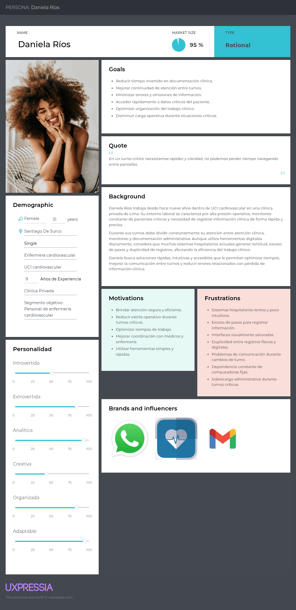
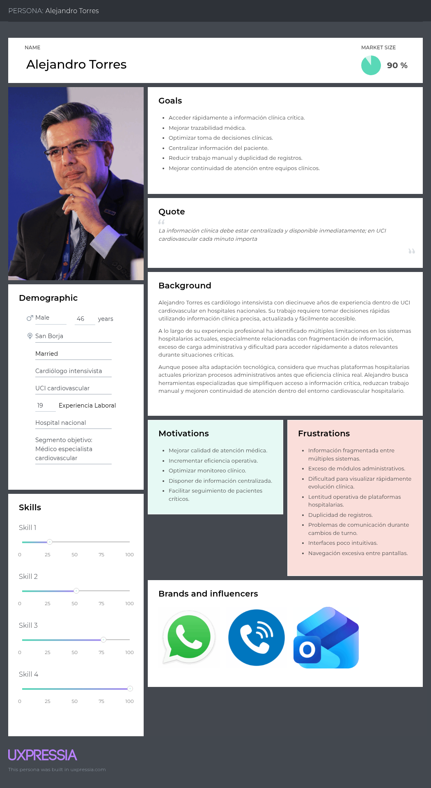
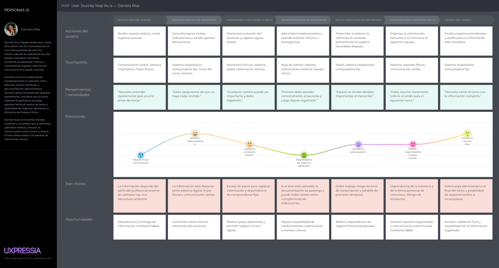
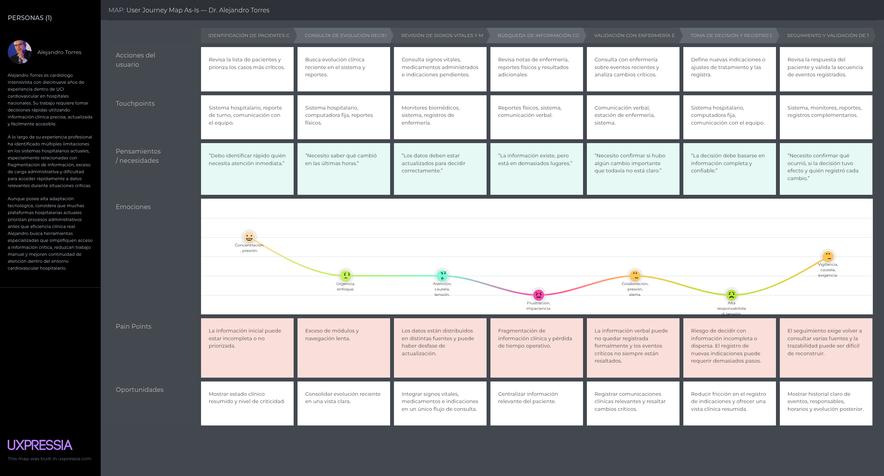
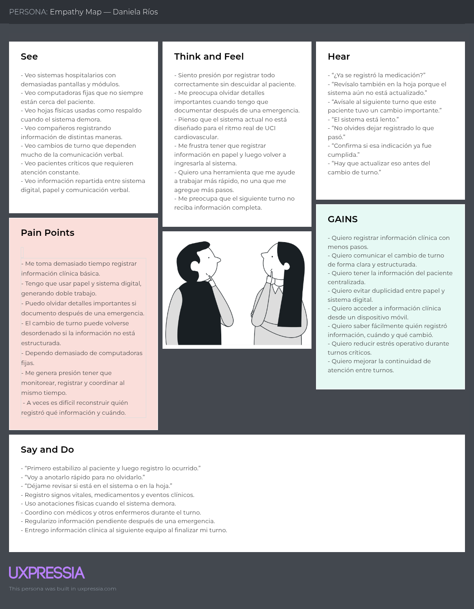
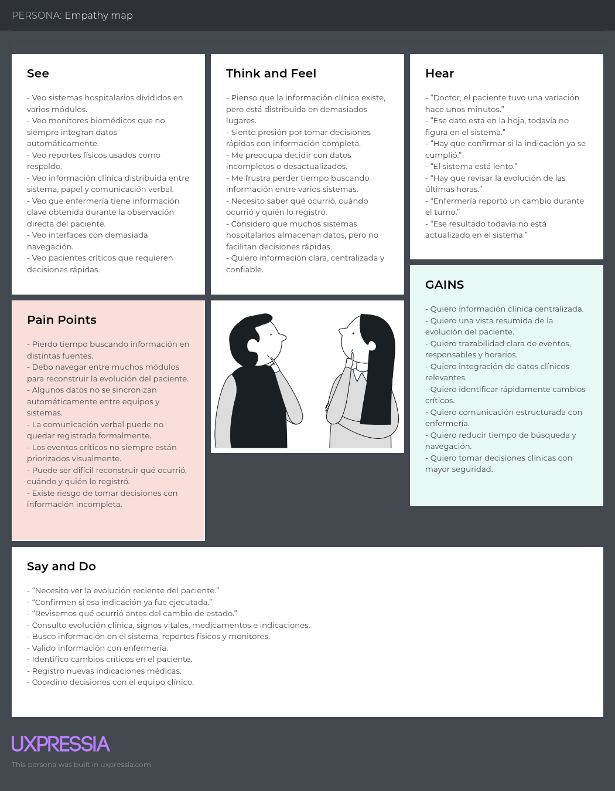
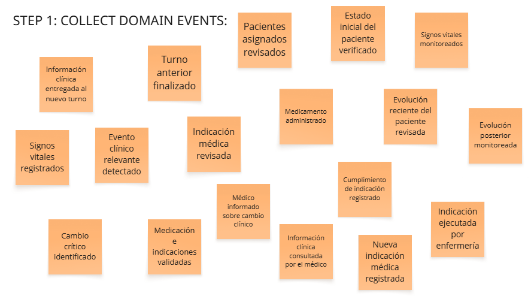
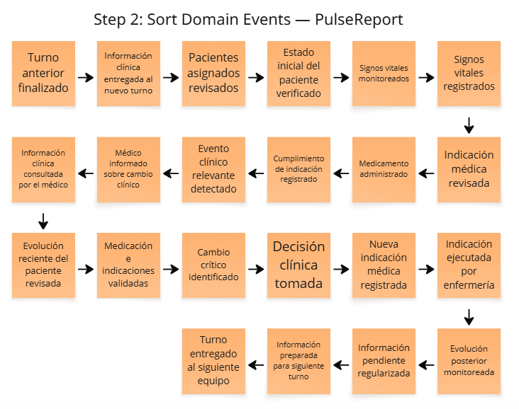
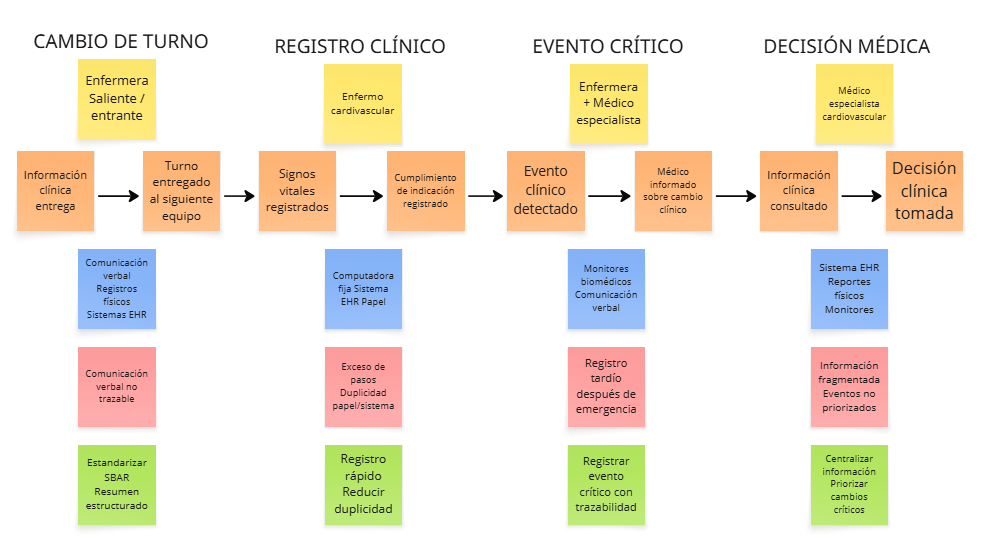

  
   
  <h3>Universidad Peruana de Ciencias Aplicadas</h3>
  <h4>Facultad de Ingeniería</h4>
  <h4>Carrera de Ingeniería de Software</h4>
   
  <h4>Ciclo 2026-20</h4>
   
  <h4>1ASI0729 - Desarrollo de Aplicaciones Open Source</h4>
  <h4>NRC: [Ingresar NRC]</h4>
  <h4>Profesor: [Ingresar Nombre del Profesor]</h4>
   
  <h2>Informe de Trabajo Final</h2>
   
  <h3>Startup: [Nuevo Nombre de la Startup]</h3>
  <h3>Producto: [Nuevo Nombre del Producto]</h3>
   
  <h4>Integrantes:</h4>
  <ul style="list-style-type: none; padding: 0;">
    <li>[Código 1] - [Apellidos, Nombres 1]</li>
    <li>[Código 2] - [Apellidos, Nombres 2]</li>
    <li>[Código 3] - [Apellidos, Nombres 3]</li>
    <li>[Código 4] - [Apellidos, Nombres 4]</li>
  </ul>
   
  <h4>[Mes], [Año]</h4>

---

## Registro de Versiones del Informe

| Versión | Fecha | Autor | Descripción de modificación |
|---------|-------|-------|-----------------------------|
| 1.0     | [Fecha] | [Autor] | Versión inicial del documento (Estructura base) |

---

## Project Report Collaboration Insights

URL del repositorio: `[URL del Repositorio de GitHub para el Informe]`

*(En esta sección se explicará cómo se han desarrollado las actividades de elaboración del informe y se presentarán capturas de los analíticos de colaboración y commits en GitHub).*

---

## Contenido

* [Registro de Versiones del Informe](#registro-de-versiones-del-informe)
* [Project Report Collaboration Insights](#project-report-collaboration-insights)
* [Student Outcome](#student-outcome)
* [Capítulo I: Introducción](#capítulo-i-introducción)
  * [1.1. Startup Profile](#11-startup-profile)
    * [1.1.1. Descripción de la Startup](#111-descripción-de-la-startup)
    * [1.1.2. Perfiles de integrantes del equipo](#112-perfiles-de-integrantes-del-equipo)
  * [1.2. Solution Profile](#12-solution-profile)
    * [1.2.1 Antecedentes y problemática](#121-antecedentes-y-problemática)
    * [1.2.2 Lean UX Process](#122-lean-ux-process)
      * [1.2.2.1. Lean UX Problem Statements](#1221-lean-ux-problem-statements)
      * [1.2.2.2. Lean UX Assumptions](#1222-lean-ux-assumptions)
      * [1.2.2.3. Lean UX Hypothesis Statements](#1223-lean-ux-hypothesis-statements)
      * [1.2.2.4. Lean UX Canvas](#1224-lean-ux-canvas)
  * [1.3. Segmentos objetivo](#13-segmentos-objetivo)
* [Capítulo II: Requirements Elicitation & Analysis](#capítulo-ii-requirements-elicitation--analysis)
  * [2.1. Competidores](#21-competidores)
    * [2.1.1. Análisis competitivo](#211-análisis-competitivo)
    * [2.1.2. Estrategias y tácticas frente a competidores](#212-estrategias-y-tácticas-frente-a-competidores)
  * [2.2. Entrevistas](#22-entrevistas)
    * [2.2.1. Diseño de entrevistas](#221-diseño-de-entrevistas)
    * [2.2.2. Registro de entrevistas](#222-registro-de-entrevistas)
    * [2.2.3. Análisis de entrevistas](#223-análisis-de-entrevistas)
  * [2.3. Needfinding](#23-needfinding)
    * [2.3.1. User Personas](#231-user-personas)
    * [2.3.2. User Task Matrix](#232-user-task-matrix)
    * [2.3.3. User Journey Mapping](#233-user-journey-mapping)
    * [2.3.4. Empathy Mapping](#234-empathy-mapping)
  * [2.4. Big Picture Event Storming](#24-big-picture-event-storming)
  * [2.5. Ubiquitous Language](#25-ubiquitous-language)
* [Capítulo III: Requirements Specification](#capítulo-iii-requirements-specification)
  * [3.1. User Stories](#31-user-stories)
  * [3.2. Impact Mapping](#32-impact-mapping)
  * [3.3. Product Backlog](#33-product-backlog)
* [Capítulo IV: Product Design](#capítulo-iv-product-design)
  * [4.1. Style Guidelines](#41-style-guidelines)
    * [4.1.1. General Style Guidelines](#411-general-style-guidelines)
    * [4.1.2. Web Style Guidelines](#412-web-style-guidelines)
  * [4.2. Information Architecture](#42-information-architecture)
    * [4.2.1. Organization Systems](#421-organization-systems)
    * [4.2.2. Labeling Systems](#422-labeling-systems)
    * [4.2.3. SEO Tags and Meta Tags](#423-seo-tags-and-meta-tags)
    * [4.2.4. Searching Systems](#424-searching-systems)
    * [4.2.5. Navigation Systems](#425-navigation-systems)
  * [4.3. Landing Page UI Design](#43-landing-page-ui-design)
    * [4.3.1. Landing Page Wireframe](#431-landing-page-wireframe)
    * [4.3.2. Landing Page Mock-up](#432-landing-page-mock-up)
  * [4.4. Web Applications UX/UI Design](#44-web-applications-uxui-design)
    * [4.4.1. Web Applications Wireframes](#441-web-applications-wireframes)
    * [4.4.2. Web Applications Wireflow Diagrams](#442-web-applications-wireflow-diagrams)
    * [4.4.3. Web Applications Mock-ups](#443-web-applications-mock-ups)
    * [4.4.4. Web Applications User Flow Diagrams](#444-web-applications-user-flow-diagrams)
  * [4.5. Web Applications Prototyping](#45-web-applications-prototyping)
  * [4.6. Domain-Driven Software Architecture](#46-domain-driven-software-architecture)
    * [4.6.1. Design-Level Event Storming](#461-design-level-event-storming)
    * [4.6.2. Software Architecture Context Diagram](#462-software-architecture-context-diagram)
    * [4.6.3. Software Architecture Container Diagrams](#463-software-architecture-container-diagrams)
    * [4.6.4. Software Architecture Components Diagrams](#464-software-architecture-components-diagrams)
  * [4.7. Software Object-Oriented Design](#47-software-object-oriented-design)
    * [4.7.1. Class Diagrams](#471-class-diagrams)
  * [4.8. Database Design](#48-database-design)
    * [4.8.1. Database Diagrams](#481-database-diagrams)
* [Capítulo V: Product Implementation, Validation & Deployment](#capítulo-v-product-implementation-validation--deployment)
  * [5.1. Software Configuration Management](#51-software-configuration-management)
    * [5.1.1. Software Development Environment Configuration](#511-software-development-environment-configuration)
    * [5.1.2. Source Code Management](#512-source-code-management)
    * [5.1.3. Source Code Style Guide & Conventions](#513-source-code-style-guide--conventions)
    * [5.1.4. Software Deployment Configuration](#514-software-deployment-configuration)
  * [5.2. Landing Page, Services & Applications Implementation](#52-landing-page-services--applications-implementation)
    * [5.2.1. Sprint 1](#521-sprint-1)
      * [5.2.1.1. Sprint Planning 1](#5211-sprint-planning-1)
      * [5.2.1.2. Aspect Leaders and Collaborators](#5212-aspect-leaders-and-collaborators)
      * [5.2.1.3. Sprint Backlog 1](#5213-sprint-backlog-1)
      * [5.2.1.4. Development Evidence for Sprint Review](#5214-development-evidence-for-sprint-review)
      * [5.2.1.5. Execution Evidence for Sprint Review](#5215-execution-evidence-for-sprint-review)
      * [5.2.1.6. Services Documentation Evidence for Sprint Review](#5216-services-documentation-evidence-for-sprint-review)
      * [5.2.1.7. Software Deployment Evidence for Sprint Review](#5217-software-deployment-evidence-for-sprint-review)
      * [5.2.1.8. Team Collaboration Insights during Sprint](#5218-team-collaboration-insights-during-sprint)
  * [5.3. Validation Interviews](#53-validation-interviews)
    * [5.3.1. Diseño de Entrevistas](#531-diseño-de-entrevistas)
    * [5.3.2. Registro de Entrevistas](#532-registro-de-entrevistas)
    * [5.3.3. Evaluaciones según heurísticas](#533-evaluaciones-según-heurísticas)
  * [5.4. Video About-the-Product](#54-video-about-the-product)
* [Conclusiones](#conclusiones)
  * [Conclusiones y recomendaciones](#conclusiones-y-recomendaciones)
  * [Video About-the-Team](#video-about-the-team)
* [Bibliografía](#bibliografía)
* [Anexos](#anexos)

---

## Student Outcome
**ABET - EAC - Student Outcome 3**
**Criterio:** Capacidad de comunicarse efectivamente con un rango de audiencias.

El curso contribuye al cumplimiento del Student Outcome ABET. En el siguiente cuadro se describe las acciones realizadas y enunciados de conclusiones por parte del grupo, que permiten sustentar el haber alcanzado el logro.

| Criterio específico | Acciones realizadas | Conclusiones |
|---------------------|---------------------|--------------|
| Comunica oralmente con efectividad a diferentes rangos de audiencia. | **[Apellidos, Nombres 1]** AV1: [Acción 1] AV2: [Acción 2] | *(Conclusión grupal sobre la mejora en comunicación oral y medios audiovisuales)* |
| Comunica por escrito con efectividad a diferentes rangos de audiencia. | **[Apellidos, Nombres 1]** AV1: [Acción 1] AV2: [Acción 2] | *(Conclusión grupal sobre redacción técnica, calidad de entregables e idioma)* |

---

## Capítulo I: Introducción
### 1.1. Startup Profile
#### 1.1.1. Descripción de la Startup
#### 1.1.2. Perfiles de integrantes del equipo
### 1.2. Solution Profile
#### 1.2.1 Antecedentes y problemática
#### 1.2.2 Lean UX Process
##### 1.2.2.1. Lean UX Problem Statements
##### 1.2.2.2. Lean UX Assumptions
##### 1.2.2.3. Lean UX Hypothesis Statements
##### 1.2.2.4. Lean UX Canvas
### 1.3. Segmentos objetivo

---

## Capítulo II: Requirements Elicitation & Analysis

En este capítulo se documenta el proceso de elicitación y análisis de requisitos de ClinicalSync, la plataforma web desarrollada por Digital Clinical System para dar soporte a la continuidad asistencial en áreas cardiovasculares. El objetivo es pasar de la problemática planteada en el Capítulo I a un conjunto de hallazgos verificables que sustenten las decisiones de producto, diseño y arquitectura de los capítulos siguientes.

El capítulo se organiza en cinco bloques: el estudio del panorama competitivo, el trabajo de campo mediante entrevistas a representantes de los segmentos objetivo, los artefactos de Needfinding que traducen esos hallazgos en arquetipos y recorridos, el Big Picture Event Storming que modela el dominio clínico completo y, finalmente, el Ubiquitous Language que fija el vocabulario común del equipo.

### 2.1. Competidores

El posicionamiento de ClinicalSync exige entender contra qué compite realmente. La plataforma no pretende sustituir el sistema de información hospitalaria (HIS) ni la historia clínica electrónica institucional: se plantea como una capa complementaria y especializada que resuelve tres necesidades concretas del área cardiovascular, a saber, el traspaso estructurado de turno bajo el modelo SBAR, el registro ágil de signos vitales y eventos clínicos, y la trazabilidad verificable de responsables, fechas y acciones.

Por esa razón el mapa competitivo no se limita a fabricantes de historia clínica electrónica. ClinicalSync compite, en distintos grados, con cuatro familias de soluciones: las herramientas especializadas en traspaso clínico estructurado, las plataformas de comunicación y colaboración clínica, los sistemas de monitoreo centralizado de pacientes y las suites de historia clínica electrónica. A ellas se suma el sustituto más extendido en la práctica peruana, que es la combinación de registro en papel, hojas de cálculo y reporte verbal.

Los competidores seleccionados para el análisis son los siguientes:

| Competidor | Tipo de competencia | Justificación de la selección |
|---|---|---|
| **I-PASS Institute — Herramienta de traspaso escrito y plataforma eVIEW** | Competidor directo | Es la referencia internacional en traspaso clínico estructurado. Ofrece una metodología de handoff (Illness severity, Patient summary, Action list, Situation awareness, Synthesis by receiver) junto con una herramienta de traspaso escrito que se despliega dentro del EHR nativo de la institución. Compite directamente con el eje central de ClinicalSync, que es estandarizar y dejar registro del cambio de turno, aunque su alcance se concentra en el handoff y no en el registro continuo de signos vitales ni en el seguimiento cardiovascular. |
| **Stryker Vocera Platform** | Competidor directo | Plataforma de comunicación y colaboración clínica que combina un dispositivo vestible activado por voz con mensajería segura, notificaciones enriquecidas con contexto del paciente y un middleware de integración con sistemas clínicos. Compite directamente en la coordinación del equipo asistencial y en la entrega de alertas al profesional correcto, pero su producto resuelve la transmisión del mensaje y no la estructura ni la persistencia del contenido clínico traspasado. |
| **GE HealthCare CARESCAPE Central Station** | Competidor directo | Estación central de monitoreo que concentra las camas de una unidad, gestiona alarmas, detecta arritmias y cambios del segmento ST, conserva histórico de eventos y permite enviar reportes al EMR. Compite directamente en el pilar de vigilancia de signos vitales y alertas cardiovasculares, aunque es una solución de hardware biomédico atada a la cama del paciente y no cubre el traspaso de turno ni el registro narrativo de eventos clínicos. |
| **Oracle Health (Cerner Millennium)** | Competidor indirecto | Suite de historia clínica electrónica y gestión hospitalaria de alcance integral, con módulos clínicos, administrativos y de reportería. Compite indirectamente porque cubre el registro y la consulta de información del paciente, pero su amplitud funcional y su costo la orientan a la institución completa y no a los flujos rápidos y específicos de una unidad cardiovascular. |
| **Nubimed** | Competidor indirecto | Software de historia clínica electrónica en la nube, configurable por especialidad, con agenda, firma digital, facturación, integración con CIE-10 y vademécum, y comercializado en el mercado hispanohablante bajo modelo de suscripción. Compite indirectamente porque representa la alternativa SaaS accesible a la que puede recurrir una clínica mediana, aunque está orientada a consulta ambulatoria y no al trabajo por turnos en hospitalización o UCI. |
| **SIHCE y RENHICE (Ministerio de Salud del Perú)** | Competidor indirecto | El Sistema de Información de Historia Clínica Electrónica del MINSA y el Registro Nacional de Historias Clínicas Electrónicas constituyen la infraestructura pública peruana de información clínica. Compite indirectamente porque en establecimientos públicos ya ocupa el espacio del registro obligatorio del paciente; sin embargo, su diseño responde a fines de registro nacional e interoperabilidad, no a la operación minuto a minuto de un turno cardiovascular. |
| **Métodos tradicionales: papel, hojas de cálculo, mensajería informal y reporte verbal** | Sustituto actual | No constituyen un producto digital, pero son la forma real en que hoy se resuelve buena parte del problema en muchos servicios: cuadernos de enfermería, kardex impreso, archivos de Excel, grupos de mensajería y reporte oral en el cambio de guardia. Es el sustituto con mayor participación efectiva y, por lo tanto, el punto de comparación más honesto para medir la adopción de ClinicalSync. |

  

#### 2.1.1. Análisis competitivo

El siguiente análisis compara a ClinicalSync frente a los competidores identificados en términos de perfil, estrategia de marketing, características de producto, costos, canales de distribución y análisis SWOT.

**Pregunta guía del análisis:**
¿Cómo puede ClinicalSync diferenciarse de las soluciones de traspaso clínico, comunicación hospitalaria, monitoreo centralizado e historia clínica electrónica disponibles hoy, para cubrir de manera más eficiente las necesidades operativas del personal de enfermería y de los médicos especialistas en unidades cardiovasculares?

| Dimensión | Criterio | ClinicalSync (Digital Clinical System) | I-PASS Institute | Stryker Vocera Platform | GE HealthCare CARESCAPE Central Station | Oracle Health (Cerner Millennium) | Nubimed | SIHCE / RENHICE (MINSA) | Métodos tradicionales |
|---|---|---|---|---|---|---|---|---|---|
| **Perfil** | **Overview** | Plataforma web complementaria para unidades cardiovasculares. Centraliza pacientes, signos vitales, eventos clínicos, traspasos SBAR, alertas y bitácora de trazabilidad, con landing page y API REST propia. | Metodología de traspaso estructurado más capacitación, coaching y una herramienta de handoff escrito que se configura dentro del EHR de la institución. | Plataforma de comunicación clínica basada en dispositivo vestible con control por voz, mensajería segura y enrutamiento de notificaciones con contexto del paciente. | Estación central de monitoreo que agrupa las camas de una unidad, gestiona alarmas y arritmias, y conserva histórico de eventos fisiológicos. | Suite integral de historia clínica electrónica y gestión hospitalaria para toda la institución. | Historia clínica electrónica en la nube, configurable por especialidad, orientada a clínicas y consultorios. | Infraestructura pública peruana de historia clínica electrónica y registro nacional interoperable. | Conjunto de prácticas manuales: cuaderno de enfermería, kardex impreso, hojas de cálculo y reporte verbal en el relevo. |
| **Perfil** | **Ventaja competitiva** | Resuelve un problema acotado y de alto costo clínico: la pérdida de información en el cambio de turno cardiovascular. Combina estructura SBAR, registro rápido y trazabilidad en una sola herramienta ligera y de adopción corta. | Respaldo académico y evidencia acumulada sobre reducción de daño evitable asociado a traspasos, con una metodología reconocida y ampliamente publicada. | Manos libres real: el profesional se comunica sin dejar la atención del paciente, y las alertas llegan al responsable correcto con contexto. | Precisión clínica del monitoreo continuo y capacidad de detectar deterioro fisiológico antes de que sea evidente para el equipo. | Cobertura funcional completa del ciclo asistencial y administrativo, con un ecosistema maduro de integraciones. | Costo de entrada bajo, despliegue rápido y configuración por especialidad sin necesidad de proyecto de TI. | Cobertura normativa y alcance nacional, con obligatoriedad progresiva en establecimientos públicos. | Costo cero, disponibilidad inmediata y cero curva de aprendizaje. |
| **Perfil de Marketing** | **Mercado objetivo** | Clínicas privadas, hospitales, unidades de cuidados intensivos cardiovasculares, hospitalización cardiológica y servicios de emergencia en Perú y la región. | Hospitales, sistemas de salud, programas de residencia médica y aseguradoras de responsabilidad profesional, principalmente en Estados Unidos y Canadá. | Hospitales y redes de salud que buscan reemplazar buscapersonas y canales dispersos por una plataforma unificada de comunicación. | Unidades críticas, cardiología, telemetría y emergencia que requieren vigilancia continua a nivel de cama. | Grandes redes hospitalarias y sistemas de salud con capacidad de inversión y equipos de TI propios. | Clínicas medianas, centros especializados y consultorios del mercado hispanohablante. | Establecimientos de salud del sistema público peruano. | Servicios que aún no han digitalizado el flujo de turno o que usan el papel como respaldo del sistema digital. |
| **Perfil de Marketing** | **Estrategias de marketing** | Landing page centrada en el problema del traspaso de turno, con propuesta de valor, módulos, beneficios, planes y llamados a la acción para solicitar demostración. Difusión académica y validación con profesionales del sector. | Posicionamiento basado en evidencia científica, publicaciones revisadas por pares, casos institucionales y programas de certificación. | Marketing B2B enfocado en seguridad del personal, reducción de la fatiga por interrupciones y casos de éxito hospitalarios. | Venta consultiva a través de fuerza comercial biomédica e integradores, apoyada en especificaciones técnicas y certificaciones. | Venta empresarial de ciclo largo, con licenciamiento, consultoría de implantación y acompañamiento posventa. | Marketing digital autoservicio, prueba gratuita, contenido para profesionales independientes y precios publicados. | Comunicación institucional, normativa y programas de despliegue estatal. | No aplica. |
| **Perfil de Producto** | **Productos y servicios** | Aplicación web responsiva, API REST documentada con OpenAPI, autenticación por roles, gestión de pacientes, registro de signos vitales, eventos clínicos, traspaso SBAR, alertas visuales y bitácora de auditoría. | Herramienta de traspaso escrito integrada al EHR, plataforma de capacitación virtual, coaching y gestión del programa de mejora. | Dispositivo vestible con pantalla táctil, mensajería y llamadas por voz, botón de emergencia y middleware de integración con sistemas clínicos. | Monitores de cabecera, estación central, algoritmos de arritmia y segmento ST, gestión de alarmas y exportación de reportes al EMR. | Módulos clínicos, de enfermería, farmacia, laboratorio, imágenes, facturación y analítica institucional. | Historia clínica configurable, agenda, firma digital, facturación, inventario y funciones asistidas por IA. | Registro de atenciones, historia clínica electrónica pública e interoperabilidad entre establecimientos. | Formatos impresos, cuadernos, plantillas de hoja de cálculo y comunicación verbal o por mensajería. |
| **Perfil de Producto** | **Precios y costos** | Modelo SaaS por planes escalonados según tamaño del servicio, con costo de entrada bajo frente a soluciones empresariales. | Licenciamiento institucional por programa, que incluye capacitación y acompañamiento; requiere contar previamente con un EHR. | Licenciamiento por usuario más inversión en dispositivos e infraestructura inalámbrica hospitalaria. | Inversión de capital elevada en hardware por cama, más licenciamiento y contrato de mantenimiento biomédico. | Licenciamiento empresarial de alto costo, con proyecto de implantación y soporte plurianual. | Suscripción mensual accesible por profesional o por clínica. | Sin costo directo para el establecimiento público; el costo es institucional y de despliegue. | Sin costo monetario visible, pero con alto costo oculto en horas de trabajo duplicado. |
| **Perfil de Producto** | **Canales de distribución** | Landing page pública, aplicación web desplegada en la nube y API documentada, accesible desde navegador en computadora, tablet o teléfono. | Contratación institucional directa y despliegue de plantillas dentro del EHR existente. | Venta directa e integradores; uso mediante dispositivo vestible y aplicación móvil complementaria. | Venta directa e integradores biomédicos; consulta desde la estación central y los monitores de cabecera. | Venta directa corporativa con socios de implantación certificados. | Autoservicio en la web, con registro y prueba en línea. | Despliegue institucional coordinado por el MINSA. | No aplica. |
| **Análisis SWOT** | **Fortalezas** | Enfoque específico en el problema del traspaso cardiovascular, baja complejidad de uso, trazabilidad visible, tiempo corto de adopción y coherencia entre landing page y aplicación. | Metodología validada, evidencia publicada y fuerte reconocimiento en seguridad del paciente. | Comunicación en tiempo real sin ocupar las manos, integración amplia con sistemas clínicos y adopción consolidada en hospitales. | Alta confiabilidad clínica, detección temprana de deterioro y continuidad del monitoreo sin intervención humana. | Cobertura funcional total, madurez del producto y respaldo corporativo. | Precio accesible, rapidez de puesta en marcha y flexibilidad de configuración. | Alcance nacional, respaldo normativo e interoperabilidad entre establecimientos. | Disponibilidad inmediata, flexibilidad total y familiaridad del personal. |
| **Análisis SWOT** | **Debilidades** | Producto emergente, sin base instalada, con integraciones clínicas aún por construir y necesidad de validación con más instituciones. | Depende de que la institución ya cuente con un EHR compatible; no cubre registro continuo de signos vitales ni seguimiento cardiovascular. | Resuelve la transmisión del mensaje pero no estructura ni conserva el contenido clínico del traspaso; requiere inversión en dispositivos. | Es hardware atado a la cama: no modela el traspaso de turno ni el registro narrativo de eventos, y su costo limita su alcance. | Complejidad de uso, exceso de pasos operativos para tareas rápidas y costo prohibitivo para servicios pequeños. | Orientada a consulta ambulatoria; no contempla trabajo por turnos, relevos ni vigilancia continua en unidades críticas. | Diseñada para registro e interoperabilidad, no para la operación rápida del turno; adopción desigual entre establecimientos. | Genera duplicidad, omisiones, ilegibilidad y ausencia total de trazabilidad. |
| **Análisis SWOT** | **Oportunidades** | Posicionarse como capa complementaria y de bajo riesgo sobre el HIS existente, y crecer desde un MVP validado hacia integraciones con monitores y EHR. | Ampliar su alcance hacia el traspaso de enfermería y hacia mercados fuera de Norteamérica. | Incorporar estructura clínica al contenido que hoy solo transporta. | Extender la explotación de sus datos hacia flujos de trabajo asistenciales fuera de la cama. | Modularizar su oferta para servicios que no requieren la suite completa. | Especializarse en escenarios de hospitalización y trabajo por turnos. | Habilitar interoperabilidad con soluciones complementarias de terceros. | Ser reemplazados de forma progresiva por herramientas de adopción sencilla. |
| **Análisis SWOT** | **Amenazas** | Que un competidor consolidado incorpore traspaso SBAR estructurado en su producto, y la resistencia institucional a sumar una herramienta más al ecosistema existente. | Que los fabricantes de EHR integren de forma nativa el traspaso estructurado y reduzcan la necesidad de un tercero. | La competencia de plataformas de mensajería clínica basadas únicamente en software y sin costo de hardware. | La migración del monitoreo hacia soluciones de software y dispositivos de menor costo. | La presión regulatoria y la aparición de alternativas modulares más económicas. | La entrada de competidores locales con mejor conocimiento del contexto regulatorio peruano. | Las limitaciones presupuestales y los ritmos de despliegue del sector público. | La obligatoriedad progresiva del registro electrónico en el marco normativo peruano. |
| **Análisis SWOT** | **Oportunidad concreta para ClinicalSync** | — | Cubrir el traspaso de enfermería cardiovascular con un formato SBAR propio, sin exigir un EHR previo. | Aportar la estructura y la persistencia que la mensajería no ofrece, quedando como registro auditable del traspaso. | Actuar como capa de software que da continuidad narrativa a los datos fisiológicos que el monitor produce. | Ofrecer un flujo ligero para las tareas frecuentes del turno, sin competir por reemplazar el HIS. | Atender el escenario de hospitalización y unidades críticas que Nubimed no cubre. | Complementar el registro obligatorio con la operación diaria del turno cardiovascular. | Sustituir el cuaderno y la hoja de cálculo con una herramienta igual de rápida pero trazable. |

Del análisis se desprende que ClinicalSync no compite por cobertura funcional ni por precisión de instrumentación, terrenos donde Oracle Health y GE HealthCare tienen una ventaja estructural difícil de disputar. Tampoco compite por prestigio metodológico frente a I-PASS ni por infraestructura de comunicación frente a Vocera. Su espacio está en la intersección que ninguno de ellos ocupa por completo: una herramienta ligera que estructura el traspaso de turno cardiovascular, registra signos vitales y eventos con pocos pasos, y deja constancia auditable de quién hizo qué y cuándo, sin exigir a la institución un proyecto de implantación ni la sustitución de sus sistemas actuales.

Un hallazgo relevante del análisis es que el competidor más fuerte de ClinicalSync no es un producto digital sino el sustituto tradicional. El cuaderno de enfermería y la hoja de cálculo siguen siendo rápidos, flexibles y gratuitos, y cualquier solución que pretenda desplazarlos debe igualar esa rapidez antes de ofrecer cualquier beneficio adicional. Esta conclusión condiciona directamente las decisiones de diseño de los capítulos siguientes.

#### 2.1.2. Estrategias y tácticas frente a competidores

A partir del análisis anterior, Digital Clinical System define un conjunto de estrategias orientadas a competir por especialización y simplicidad, evitando la confrontación directa con soluciones de alcance institucional. Cada estrategia se acompaña de tácticas concretas y de su fundamento en el panorama competitivo estudiado.

| Estrategia | Tácticas propuestas | Fundamento en el análisis competitivo |
|---|---|---|
| **Especialización en el traspaso de turno cardiovascular** | Construir el producto alrededor del formulario SBAR, con campos guiados, validación de secciones obligatorias y generación automática del resumen de relevo. | I-PASS demuestra que el traspaso estructurado tiene valor probado, pero exige un EHR previo y se orienta al ámbito médico anglosajón. ClinicalSync puede ocupar ese espacio en enfermería cardiovascular sin ese prerrequisito. |
| **Estructurar el contenido, no solo transportarlo** | Persistir cada traspaso como un registro consultable, versionado y asociado al paciente, y no como un mensaje efímero. | Vocera resuelve la comunicación en tiempo real, pero el contenido no queda estructurado ni auditable. Ese vacío es la ventaja de ClinicalSync. |
| **Complementariedad con el monitoreo biomédico** | Diseñar el registro de signos vitales para convivir con los monitores existentes, permitiendo el ingreso manual rápido y dejando abierta la integración futura. | CARESCAPE genera datos fisiológicos de alta calidad pero no los conecta con el relevo ni con la narrativa clínica del turno. |
| **Complementariedad con el HIS institucional** | Comunicar desde la landing page que ClinicalSync no reemplaza la historia clínica oficial y que puede operar junto al SIHCE o al sistema de la institución. | Reduce la principal objeción de compra frente a Oracle Health y frente al marco normativo peruano, y baja el riesgo percibido de adopción. |
| **Competir contra el papel en rapidez, no en funciones** | Fijar un objetivo explícito de pasos y de tiempo para las tareas frecuentes del turno, y validarlo en pruebas de usabilidad con personal real. | El sustituto tradicional es el competidor con mayor participación efectiva; si la herramienta no es tan rápida como el cuaderno, no será adoptada. |
| **Trazabilidad visible como argumento de venta** | Mostrar de forma explícita responsable, fecha, hora y tipo de acción en cada registro clínico relevante, y ofrecer una vista de bitácora consultable. | Es la carencia más evidente de los métodos tradicionales y un requisito recurrente para auditoría y control de calidad asistencial. |
| **Diseño para el contexto peruano** | Considerar el idioma, la terminología local, la conectividad variable de los establecimientos y la coexistencia con el registro obligatorio del MINSA. | Los competidores internacionales no están diseñados para este contexto, y Nubimed no cubre el trabajo por turnos en unidades críticas. |
| **Precio accesible y escalonado** | Ofrecer planes por tamaño de servicio, de manera que una unidad pueda iniciar sin comprometer un presupuesto institucional. | Frente al licenciamiento empresarial de Oracle Health y a la inversión en hardware de GE HealthCare, el costo de entrada bajo es una barrera de adopción menos. |
| **Validación temprana con usuarios del dominio** | Realizar entrevistas, pruebas de navegación y evaluación heurística con personal de enfermería y médicos especialistas antes de ampliar el alcance funcional. | Permite ajustar el producto sobre evidencia real y no sobre supuestos del equipo, reduciendo el riesgo de construir funcionalidades que nadie usa. |
| **Crecimiento gradual desde un MVP acotado** | Priorizar traspaso SBAR, signos vitales, eventos clínicos y trazabilidad, y postergar reportería avanzada e integraciones hasta contar con adopción. | Evita sobredimensionar el producto frente a competidores consolidados y concentra el esfuerzo en el núcleo que define la propuesta de valor. |

En conclusión, la estrategia de ClinicalSync se sostiene en cuatro pilares: especialización en el flujo cardiovascular, simplicidad medible frente al papel, trazabilidad visible y complementariedad explícita con los sistemas ya instalados. La oportunidad no está en sustituir a los competidores analizados, sino en cubrir con claridad el espacio operativo que hoy queda repartido entre la historia clínica electrónica, el monitor de cabecera, la mensajería del equipo y el cuaderno de enfermería.

### 2.2. Entrevistas

Esta sección documenta el trabajo de campo realizado con representantes de los segmentos objetivo de ClinicalSync. El propósito de las entrevistas es contrastar la problemática planteada en el Capítulo I con la experiencia real de quienes trabajan a diario en unidades cardiovasculares, e identificar necesidades, frustraciones, hábitos tecnológicos y expectativas que no serían visibles desde el análisis documental.

La evidencia recolectada sustenta directamente los artefactos de Needfinding de la sección 2.3, el modelado del dominio de la sección 2.4 y la especificación de requisitos del Capítulo III. Por ello, el diseño de las preguntas se orientó a obtener descripciones de situaciones concretas y no valoraciones generales sobre la conveniencia de digitalizar procesos clínicos.

Se definieron dos segmentos de entrevista, correspondientes a los segmentos objetivo establecidos en la sección 1.3, con tres entrevistas por segmento.

| Segmento | Perfil de los entrevistados | Entrevistas previstas |
|---|---|---|
| Segmento 1: Personal de enfermería cardiovascular | Enfermeros y enfermeras de UCI cardiovascular, hospitalización cardiológica y emergencia, con responsabilidad sobre monitoreo, registro y relevo de turno. | 3 |
| Segmento 2: Médicos especialistas cardiovasculares | Cardiólogos, intensivistas y cirujanos cardiovasculares responsables de consultar, validar e interpretar información clínica para tomar decisiones. | 3 |
| **Total** | — | **6** |

#### 2.2.1. Diseño de entrevistas

El diseño de las entrevistas se elaboró con enfoque exploratorio y cualitativo. Se emplearon preguntas abiertas, redactadas en lenguaje no técnico, orientadas a que el entrevistado describiera su práctica actual antes de opinar sobre cualquier solución propuesta. Las preguntas se organizaron en principales, que abordan el núcleo del problema y se formulan a todos los entrevistados del segmento, y complementarias, que profundizan en hábitos tecnológicos y en información necesaria para construir los arquetipos de usuario.

##### Segmento objetivo 1: Personal de enfermería cardiovascular

###### Descripción del segmento

Este segmento agrupa a profesionales de enfermería que trabajan en unidades de cuidados intensivos cardiovasculares, hospitalización cardiológica, emergencia y áreas de telemetría. Sus responsabilidades incluyen el monitoreo continuo del paciente, el control y registro de signos vitales, la administración de medicamentos según indicación médica, el reporte de eventos clínicos y la entrega de información al equipo entrante al finalizar el turno.

Es el segmento que genera la mayor parte de la información clínica operativa y, al mismo tiempo, el que trabaja bajo mayor presión de tiempo. Cualquier herramienta dirigida a este perfil compite directamente con la rapidez del papel, por lo que interesa conocer con precisión cuántos pasos y cuánto tiempo demanda hoy cada tarea de registro.

###### Información principal a recolectar

- Forma actual de registrar información clínica durante el turno.
- Herramientas y soportes utilizados, tanto digitales como físicos.
- Momento y frecuencia con que se realiza el registro respecto de la atención.
- Dificultades concretas con los sistemas disponibles.
- Mecánica real del cambio de turno y qué información se transmite.
- Situaciones en que se perdió u omitió información clínica.
- Tiempo estimado dedicado a documentación durante la jornada.
- Motivos por los que se recurre a registros físicos complementarios.
- Percepción sobre la trazabilidad de las acciones realizadas.
- Condiciones bajo las cuales adoptaría una nueva herramienta digital.

###### Información complementaria para construir arquetipos

| Característica | Información a recolectar |
|---|---|
| Rango de edad | Rango etario del entrevistado. |
| Distrito o zona | Lugar de residencia o referencia geográfica. |
| Ocupación | Rol y especialidad dentro del servicio. |
| Experiencia laboral | Años de ejercicio profesional en el sector salud. |
| Área de trabajo | UCI cardiovascular, hospitalización, emergencia, telemetría u otra. |
| Tipo de establecimiento | Hospital público, clínica privada, instituto especializado. |
| Modalidad de turno | Diurno, nocturno, rotativo, guardias. |
| Nivel tecnológico | Básico, intermedio o avanzado. |
| Dispositivos utilizados | Computadora fija, laptop, tablet, teléfono. |
| Objetivos | Qué busca lograr durante su turno. |
| Frustraciones | Qué le hace perder tiempo o le genera riesgo. |
| Canales digitales | Sistemas institucionales, hojas de cálculo, mensajería, aplicaciones. |

###### Preguntas principales

1. ¿Podría describirme cómo transcurre un turno suyo desde que llega hasta que se retira?
2. ¿En qué momento del turno registra la información clínica del paciente y en qué soporte lo hace?
3. ¿Qué sistema o herramienta usa su institución para el registro clínico y qué opinión tiene de él?
4. ¿Utiliza además algún registro en papel o personal? ¿Por qué motivo?
5. ¿Cómo se realiza el cambio de turno en su servicio y qué información se transmite?
6. ¿Ha ocurrido que un dato importante no llegue al turno siguiente? ¿Podría contarme qué pasó?
7. ¿Cuánto tiempo de su turno calcula que dedica a documentar?
8. ¿Qué parte del registro clínico le resulta más lenta o más engorrosa?
9. Si necesita saber qué pasó con un paciente en las últimas horas, ¿dónde lo consulta y cuánto le toma?
10. ¿Qué debería tener una herramienta digital para que usted la usara durante el turno y no después?

###### Preguntas complementarias

1. ¿Qué situaciones del turno le generan mayor estrés o mayor riesgo de error?
2. ¿Utiliza el teléfono o alguna tablet durante su jornada? ¿Para qué?
3. ¿Qué tan cómodo se siente aprendiendo a usar sistemas nuevos?
4. ¿Prefiere registrar desde una computadora fija o desde un dispositivo que pueda llevar consigo?
5. ¿Qué información considera imprescindible comunicar en un relevo, aunque falte tiempo?
6. ¿Le ha ocurrido que le pregunten quién registró o quién administró algo y no haya forma de saberlo?
7. ¿Considera que la digitalización del registro mejora o entorpece la atención al paciente?

##### Segmento objetivo 2: Médicos especialistas cardiovasculares

###### Descripción del segmento

Este segmento agrupa a cardiólogos, médicos intensivistas y cirujanos cardiovasculares responsables del diagnóstico, la prescripción y el seguimiento de pacientes de alto riesgo. A diferencia del segmento anterior, su relación con la información clínica es predominantemente de consulta, validación e interpretación, más que de registro.

Su necesidad central es acceder con rapidez a una visión consolidada y confiable de la evolución reciente del paciente, con certeza sobre el origen, el momento y el responsable de cada dato. Cualquier herramienta dirigida a este perfil es rechazada si incrementa su carga administrativa.

###### Información principal a recolectar

- Forma actual de acceder a la información clínica del paciente.
- Fuentes que debe consultar para formarse una idea completa del caso.
- Tiempo y esfuerzo que demanda consolidar esa información.
- Dificultades relacionadas con información incompleta, tardía o dispersa.
- Situaciones en que la falta de información retrasó o condicionó una decisión.
- Mecánica de comunicación con el personal de enfermería.
- Importancia atribuida a la trazabilidad de responsables y horarios.
- Limitaciones percibidas en los sistemas hospitalarios actuales.
- Expectativas respecto de una herramienta digital especializada.

###### Información complementaria para construir arquetipos

| Característica | Información a recolectar |
|---|---|
| Rango de edad | Rango etario del entrevistado. |
| Distrito o zona | Lugar de residencia o referencia geográfica. |
| Ocupación | Especialidad médica y subespecialidad. |
| Experiencia laboral | Años de ejercicio profesional. |
| Área de trabajo | UCI cardiovascular, cirugía, hospitalización, emergencia, consulta externa. |
| Tipo de establecimiento | Hospital público, clínica privada, instituto especializado. |
| Nivel tecnológico | Básico, intermedio o avanzado. |
| Dispositivos utilizados | Computadora institucional, laptop, tablet, teléfono. |
| Objetivos | Qué necesita resolver al evaluar a un paciente. |
| Frustraciones | Qué le impide decidir con rapidez y seguridad. |
| Canales digitales | Sistemas hospitalarios, monitores, reportes impresos, mensajería. |

###### Preguntas principales

1. Cuando evalúa a un paciente cardiovascular, ¿qué información necesita revisar antes de decidir?
2. ¿De dónde obtiene esa información hoy y cuántas fuentes distintas debe consultar?
3. ¿Cuánto tiempo le toma formarse una idea completa del estado actual de un paciente?
4. ¿Ha tenido que tomar una decisión con información incompleta? ¿Podría describir la situación?
5. ¿Cómo se entera de que ocurrió un evento clínico relevante durante un turno en el que usted no estuvo?
6. ¿Cómo es la comunicación con el personal de enfermería respecto de indicaciones y su cumplimiento?
7. ¿Le resulta posible saber quién registró un dato, en qué momento y si una indicación fue ejecutada?
8. ¿Qué limitaciones concretas identifica en el sistema que usa su institución?
9. ¿Qué información querría ver reunida en una sola pantalla al abrir el caso de un paciente?
10. ¿Bajo qué condiciones incorporaría una herramienta adicional a su práctica diaria?

###### Preguntas complementarias

1. ¿Con qué frecuencia consulta información clínica fuera del establecimiento o desde un dispositivo móvil?
2. ¿Qué tipo de reporte o resumen consulta con mayor frecuencia?
3. ¿Qué tan crítica es la velocidad de acceso a la información en una urgencia cardiovascular?
4. ¿Qué situaciones considera de mayor riesgo por ausencia o retraso de información?
5. ¿Qué opinión le merecen las alertas automáticas en sistemas clínicos?
6. ¿Qué condiciones debería cumplir una herramienta digital para que el equipo la acepte?

##### Buenas prácticas aplicadas en el diseño

- Se formularon preguntas abiertas orientadas a la descripción de situaciones concretas y no a respuestas cerradas.
- Se evitó mencionar ClinicalSync en las primeras preguntas para no inducir respuestas favorables.
- Se priorizó el relato de experiencias vividas por encima de opiniones generales sobre tecnología.
- Se separaron preguntas principales y complementarias para conducir la conversación sin rigidez.
- Se recolectó información objetiva y subjetiva, necesaria para la construcción de arquetipos.
- Se solicitó consentimiento para grabar y se explicó el uso académico de la información.
- Se mantuvo la trazabilidad entre cada hallazgo y su origen, de modo que los artefactos posteriores puedan sustentarse en evidencia.

#### 2.2.2. Registro de entrevistas

Las entrevistas fueron grabadas en video previo consentimiento de los participantes y se organizaron por segmento objetivo. Cada registro incluye los datos generales del entrevistado, la captura del video, el enlace de acceso, el timing dentro de la grabación consolidada, la duración y un resumen descriptivo de las respuestas obtenidas.

> Nota para el equipo: las celdas marcadas entre corchetes deben completarse con los datos reales de cada entrevista. Las capturas se colocan en assets/chapter-2/ respetando los nombres de archivo indicados en cada etiqueta de imagen.

##### Segmento objetivo 1: Personal de enfermería cardiovascular

###### Entrevista 1

<table border="1">
  <tr>
    <td width="40%">
      <b>Nombres y apellidos:</b> [Nombres y apellidos] 
      <b>Edad:</b> [Edad] años 
      <b>Distrito:</b> [Distrito] 
      <b>Ocupación:</b> [Rol y especialidad] 
      <b>Área de trabajo:</b> [Área] 
      <b>Timing:</b> [hh:mm:ss - hh:mm:ss] 
      <b>Duración:</b> [mm:ss] 
      <b>Entrevistador:</b> [Integrante del equipo]
    </td>
    <td align="center">
      
    </td>
  </tr>
  <tr>
    <td colspan="2">
      <b>Enlace:</b> <a href="[URL del video en Microsoft Stream]">[URL del video en Microsoft Stream]</a>
        
      <b>Resumen:</b> [Descripción de cómo el entrevistado realiza hoy el registro clínico durante el turno, qué herramientas utiliza y qué dificultades encuentra.]
        
      [Descripción de la mecánica del cambio de turno en su servicio, situaciones de pérdida u omisión de información y motivos por los que recurre a registros complementarios.]
        
      [Condiciones bajo las que adoptaría una herramienta digital y funcionalidades que considera indispensables.]
    </td>
  </tr>
</table>

###### Entrevista 2

<table border="1">
  <tr>
    <td width="40%">
      <b>Nombres y apellidos:</b> [Nombres y apellidos] 
      <b>Edad:</b> [Edad] años 
      <b>Distrito:</b> [Distrito] 
      <b>Ocupación:</b> [Rol y especialidad] 
      <b>Área de trabajo:</b> [Área] 
      <b>Timing:</b> [hh:mm:ss - hh:mm:ss] 
      <b>Duración:</b> [mm:ss] 
      <b>Entrevistador:</b> [Integrante del equipo]
    </td>
    <td align="center">
      
    </td>
  </tr>
  <tr>
    <td colspan="2">
      <b>Enlace:</b> <a href="[URL del video en Microsoft Stream]">[URL del video en Microsoft Stream]</a>
        
      <b>Resumen:</b> [Descripción de cómo el entrevistado realiza hoy el registro clínico durante el turno, qué herramientas utiliza y qué dificultades encuentra.]
        
      [Descripción de la mecánica del cambio de turno en su servicio, situaciones de pérdida u omisión de información y motivos por los que recurre a registros complementarios.]
        
      [Condiciones bajo las que adoptaría una herramienta digital y funcionalidades que considera indispensables.]
    </td>
  </tr>
</table>

###### Entrevista 3

<table border="1">
  <tr>
    <td width="40%">
      <b>Nombres y apellidos:</b> [Nombres y apellidos] 
      <b>Edad:</b> [Edad] años 
      <b>Distrito:</b> [Distrito] 
      <b>Ocupación:</b> [Rol y especialidad] 
      <b>Área de trabajo:</b> [Área] 
      <b>Timing:</b> [hh:mm:ss - hh:mm:ss] 
      <b>Duración:</b> [mm:ss] 
      <b>Entrevistador:</b> [Integrante del equipo]
    </td>
    <td align="center">
      
    </td>
  </tr>
  <tr>
    <td colspan="2">
      <b>Enlace:</b> <a href="[URL del video en Microsoft Stream]">[URL del video en Microsoft Stream]</a>
        
      <b>Resumen:</b> [Descripción de cómo el entrevistado realiza hoy el registro clínico durante el turno, qué herramientas utiliza y qué dificultades encuentra.]
        
      [Descripción de la mecánica del cambio de turno en su servicio, situaciones de pérdida u omisión de información y motivos por los que recurre a registros complementarios.]
        
      [Condiciones bajo las que adoptaría una herramienta digital y funcionalidades que considera indispensables.]
    </td>
  </tr>
</table>

##### Segmento objetivo 2: Médicos especialistas cardiovasculares

###### Entrevista 1

<table border="1">
  <tr>
    <td width="40%">
      <b>Nombres y apellidos:</b> [Nombres y apellidos] 
      <b>Edad:</b> [Edad] años 
      <b>Distrito:</b> [Distrito] 
      <b>Ocupación:</b> [Especialidad médica] 
      <b>Área de trabajo:</b> [Área] 
      <b>Timing:</b> [hh:mm:ss - hh:mm:ss] 
      <b>Duración:</b> [mm:ss] 
      <b>Entrevistador:</b> [Integrante del equipo]
    </td>
    <td align="center">
      
    </td>
  </tr>
  <tr>
    <td colspan="2">
      <b>Enlace:</b> <a href="[URL del video en Microsoft Stream]">[URL del video en Microsoft Stream]</a>
        
      <b>Resumen:</b> [Descripción de cómo accede hoy a la información clínica, cuántas fuentes debe consultar y cuánto tiempo le demanda.]
        
      [Situaciones en que la información incompleta o tardía condicionó una decisión, y cómo se comunica con el personal de enfermería.]
        
      [Expectativas sobre trazabilidad, visualización consolidada y condiciones para incorporar una herramienta adicional.]
    </td>
  </tr>
</table>

###### Entrevista 2

<table border="1">
  <tr>
    <td width="40%">
      <b>Nombres y apellidos:</b> [Nombres y apellidos] 
      <b>Edad:</b> [Edad] años 
      <b>Distrito:</b> [Distrito] 
      <b>Ocupación:</b> [Especialidad médica] 
      <b>Área de trabajo:</b> [Área] 
      <b>Timing:</b> [hh:mm:ss - hh:mm:ss] 
      <b>Duración:</b> [mm:ss] 
      <b>Entrevistador:</b> [Integrante del equipo]
    </td>
    <td align="center">
      
    </td>
  </tr>
  <tr>
    <td colspan="2">
      <b>Enlace:</b> <a href="[URL del video en Microsoft Stream]">[URL del video en Microsoft Stream]</a>
        
      <b>Resumen:</b> [Descripción de cómo accede hoy a la información clínica, cuántas fuentes debe consultar y cuánto tiempo le demanda.]
        
      [Situaciones en que la información incompleta o tardía condicionó una decisión, y cómo se comunica con el personal de enfermería.]
        
      [Expectativas sobre trazabilidad, visualización consolidada y condiciones para incorporar una herramienta adicional.]
    </td>
  </tr>
</table>

###### Entrevista 3

<table border="1">
  <tr>
    <td width="40%">
      <b>Nombres y apellidos:</b> [Nombres y apellidos] 
      <b>Edad:</b> [Edad] años 
      <b>Distrito:</b> [Distrito] 
      <b>Ocupación:</b> [Especialidad médica] 
      <b>Área de trabajo:</b> [Área] 
      <b>Timing:</b> [hh:mm:ss - hh:mm:ss] 
      <b>Duración:</b> [mm:ss] 
      <b>Entrevistador:</b> [Integrante del equipo]
    </td>
    <td align="center">
      
    </td>
  </tr>
  <tr>
    <td colspan="2">
      <b>Enlace:</b> <a href="[URL del video en Microsoft Stream]">[URL del video en Microsoft Stream]</a>
        
      <b>Resumen:</b> [Descripción de cómo accede hoy a la información clínica, cuántas fuentes debe consultar y cuánto tiempo le demanda.]
        
      [Situaciones en que la información incompleta o tardía condicionó una decisión, y cómo se comunica con el personal de enfermería.]
        
      [Expectativas sobre trazabilidad, visualización consolidada y condiciones para incorporar una herramienta adicional.]
    </td>
  </tr>
</table>

#### 2.2.3. Análisis de entrevistas

El análisis de entrevistas organiza los hallazgos en tres niveles. En primer lugar, las características objetivas, que corresponden a hechos verificables sobre el contexto de trabajo del entrevistado. En segundo lugar, las características subjetivas, que recogen percepciones, prioridades y frustraciones. Finalmente, la interpretación del segmento, que sintetiza los patrones recurrentes y su implicancia para el diseño de ClinicalSync.

Los porcentajes se calculan sobre el total de entrevistas efectivamente registradas en la sección anterior. Se reporta la evidencia tal como fue expresada por los participantes, sin extrapolar hallazgos a partir de un único testimonio.

> Nota para el equipo: las columnas de evidencia y porcentaje deben completarse una vez transcritas las seis entrevistas. El criterio es contar en cuántas entrevistas del segmento aparece explícitamente la característica.

##### Resumen de entrevistas analizadas

| Segmento | Entrevistados | Cantidad |
|---|---|---|
| Personal de enfermería cardiovascular | [Nombres de los tres entrevistados] | 3 |
| Médicos especialistas cardiovasculares | [Nombres de los tres entrevistados] | 3 |
| **Total** | — | **6** |

##### Segmento objetivo 1: Personal de enfermería cardiovascular

###### Análisis de características objetivas

| Característica objetiva | Evidencia identificada | Porcentaje |
|---|---|---|
| Ejerce en unidad cardiovascular, UCI, hospitalización cardiológica o emergencia | [Presente en N de 3 entrevistas] | [%] |
| Trabaja bajo modalidad de turnos rotativos o guardias | [Presente en N de 3 entrevistas] | [%] |
| Utiliza un sistema digital institucional para el registro clínico | [Presente en N de 3 entrevistas] | [%] |
| Recurre además a registros físicos o anotaciones personales | [Presente en N de 3 entrevistas] | [%] |
| Participa directamente en el proceso de cambio de turno | [Presente en N de 3 entrevistas] | [%] |
| Registra signos vitales de forma periódica durante el turno | [Presente en N de 3 entrevistas] | [%] |
| Administra medicamentos y deja constancia de la administración | [Presente en N de 3 entrevistas] | [%] |
| Utiliza dispositivos móviles o tablets durante la jornada | [Presente en N de 3 entrevistas] | [%] |
| Ha experimentado pérdida u omisión de información en un relevo | [Presente en N de 3 entrevistas] | [%] |

###### Análisis de características subjetivas

| Característica subjetiva | Evidencia identificada | Porcentaje |
|---|---|---|
| Considera lentos o poco prácticos los sistemas actuales | [Presente en N de 3 entrevistas] | [%] |
| Prioriza la rapidez del registro por encima de la cantidad de funciones | [Presente en N de 3 entrevistas] | [%] |
| Manifiesta preocupación por omitir información en el cambio de turno | [Presente en N de 3 entrevistas] | [%] |
| Percibe la documentación como una carga que compite con la atención directa | [Presente en N de 3 entrevistas] | [%] |
| Valora positivamente un formato estructurado para el relevo | [Presente en N de 3 entrevistas] | [%] |
| Considera útil registrar desde un dispositivo portátil y no solo desde una computadora fija | [Presente en N de 3 entrevistas] | [%] |
| Muestra apertura a una herramienta nueva si reduce trabajo en lugar de sumarlo | [Presente en N de 3 entrevistas] | [%] |

###### Interpretación del segmento

[Redactar a partir de la evidencia recolectada. Se espera desarrollar: cómo se organiza realmente el registro durante el turno; qué papel cumple el registro físico complementario y por qué persiste; en qué momentos del turno se concentra la fricción; qué tan estructurado es hoy el cambio de guardia; y qué condiciones mínimas debería cumplir ClinicalSync para que el personal lo use durante el turno y no al final de él.]

##### Segmento objetivo 2: Médicos especialistas cardiovasculares

###### Análisis de características objetivas

| Característica objetiva | Evidencia identificada | Porcentaje |
|---|---|---|
| Ejerce una especialidad cardiovascular o de cuidados intensivos | [Presente en N de 3 entrevistas] | [%] |
| Consulta información clínica generada por el personal de enfermería | [Presente en N de 3 entrevistas] | [%] |
| Debe recurrir a más de una fuente para reconstruir el estado del paciente | [Presente en N de 3 entrevistas] | [%] |
| Utiliza el sistema hospitalario institucional para la consulta clínica | [Presente en N de 3 entrevistas] | [%] |
| Consulta monitores biomédicos o reportes impresos como fuente complementaria | [Presente en N de 3 entrevistas] | [%] |
| Emite indicaciones médicas que ejecuta el personal de enfermería | [Presente en N de 3 entrevistas] | [%] |
| Ha enfrentado dificultades para identificar responsables u horarios de un registro | [Presente en N de 3 entrevistas] | [%] |
| Requiere acceder a información clínica en situaciones de urgencia | [Presente en N de 3 entrevistas] | [%] |

###### Análisis de características subjetivas

| Característica subjetiva | Evidencia identificada | Porcentaje |
|---|---|---|
| Identifica la fragmentación de la información como principal obstáculo | [Presente en N de 3 entrevistas] | [%] |
| Considera crítica la velocidad de acceso a la información | [Presente en N de 3 entrevistas] | [%] |
| Atribuye alta importancia a la trazabilidad de acciones y responsables | [Presente en N de 3 entrevistas] | [%] |
| Rechaza herramientas que incrementen su carga administrativa | [Presente en N de 3 entrevistas] | [%] |
| Valora una vista consolidada de la evolución reciente del paciente | [Presente en N de 3 entrevistas] | [%] |
| Considera necesaria una comunicación más estructurada con enfermería | [Presente en N de 3 entrevistas] | [%] |
| Manifiesta interés en alertas sobre cambios críticos del paciente | [Presente en N de 3 entrevistas] | [%] |

###### Interpretación del segmento

[Redactar a partir de la evidencia recolectada. Se espera desarrollar: cuántas fuentes debe consolidar el especialista y cuánto tiempo le demanda; qué consecuencias concretas tuvo en su práctica la información incompleta o tardía; qué peso real le asigna a la trazabilidad frente a otras necesidades; y qué debería mostrarse en una vista consolidada para que resulte útil en el momento de decidir.]

##### Comparación entre segmentos

| Hallazgo | Personal de enfermería cardiovascular | Médicos especialistas cardiovasculares | Implicancia para ClinicalSync |
|---|---|---|---|
| Relación con la información clínica | Predominantemente de producción: registra durante la atención. | Predominantemente de consumo: consulta, valida e interpreta. | El producto necesita flujos diferenciados por rol, con una vista de captura rápida y una vista de lectura consolidada. |
| Momento de mayor fricción | El registro durante la atención y la entrega del turno. | La reconstrucción del estado del paciente antes de decidir. | Las decisiones de diseño deben optimizar la captura para un perfil y la síntesis para el otro. |
| Efecto de la información dispersa | Genera duplicidad de trabajo y uso de registros físicos. | Genera demora en la decisión y riesgo de decidir con datos incompletos. | Centralizar la información relevante del paciente cardiovascular es un requisito compartido. |
| Necesidad de trazabilidad | Identificar responsables y eventos ocurridos en el turno. | Validar el origen, el momento y el cumplimiento de una indicación. | Registrar responsable, fecha, hora y tipo de acción en cada operación relevante. |
| Percepción de los sistemas actuales | Lentos frente al ritmo del turno. | Dispersos y con exceso de pasos para una consulta puntual. | La simplicidad y el número de pasos son criterios de aceptación, no aspectos secundarios. |
| Disposición a adoptar la herramienta | Condicionada a que reduzca trabajo, no que lo agregue. | Condicionada a que no incremente la carga administrativa. | El MVP debe demostrar ahorro de tiempo antes de incorporar funcionalidades adicionales. |

##### Conclusiones generales del análisis

[Redactar una vez completadas las seis entrevistas. Las conclusiones deben señalar los patrones comunes a ambos segmentos, las diferencias relevantes entre ellos, qué supuestos del Lean UX Canvas del Capítulo I quedaron confirmados y cuáles fueron matizados o refutados por la evidencia, y qué prioridades funcionales se derivan para el producto.]

Los hallazgos de esta sección constituyen la base directa de los artefactos de Needfinding que se desarrollan a continuación, y deben mantenerse trazables hacia las User Stories del Capítulo III.

### 2.3. Needfinding

El Needfinding traduce la evidencia obtenida en las entrevistas y en el análisis competitivo en artefactos que el equipo puede utilizar para tomar decisiones de producto. Su propósito no es describir la solución, sino comprender con precisión cómo trabajan hoy los usuarios, qué obstáculos enfrentan y qué necesidades deben quedar cubiertas antes de definir requisitos.

Los cuatro artefactos desarrollados en esta sección se construyen de forma encadenada: los User Personas sintetizan los patrones observados en cada segmento, la User Task Matrix ordena las tareas reales que esos arquetipos ejecutan, el User Journey Mapping sitúa esas tareas en un recorrido temporal con sus puntos de fricción, y el Empathy Mapping profundiza en el contexto emocional y cognitivo que explica ese comportamiento.

| Artefacto | Propósito | Insumo principal |
|---|---|---|
| **User Personas** | Representar arquetipos de usuario a partir de los segmentos objetivo y de los hallazgos de entrevistas. | Segmentos objetivo y análisis de entrevistas. |
| **User Task Matrix** | Identificar las tareas reales de cada arquetipo, con su frecuencia e importancia relativas. | User Personas y entrevistas. |
| **User Journey Mapping** | Representar el recorrido actual (As-Is) del usuario, con sus emociones y puntos de dolor. | User Personas y User Task Matrix. |
| **Empathy Mapping** | Comprender qué piensa, siente, ve, escucha, dice, hace, necesita y espera cada arquetipo. | Todos los anteriores. |

Los artefactos visuales fueron elaborados en UXPressia y se incorporan como imágenes en la carpeta assets/chapter-2/.

#### 2.3.1. User Personas

Los User Personas de ClinicalSync se construyeron a partir de los dos segmentos objetivo definidos en la sección 1.3 y de los patrones identificados en las entrevistas. No representan a ningún entrevistado en particular: son perfiles sintéticos que concentran comportamientos, objetivos y frustraciones recurrentes, con el fin de que las decisiones de diseño puedan discutirse en términos de una persona concreta y no de una categoría abstracta.

Cada persona reúne información demográfica, contexto laboral, nivel de familiaridad con la tecnología, objetivos, frustraciones, motivaciones y canales que utiliza. Estos elementos serán la referencia para priorizar funcionalidades, definir la arquitectura de información y evaluar la usabilidad del producto en los capítulos siguientes.

| User Persona | Segmento objetivo | Rol en el dominio |
|---|---|---|
| **Daniela Ríos** | Personal de enfermería cardiovascular | Genera la información clínica del turno: registra signos vitales, administra medicamentos, reporta eventos y entrega el relevo. |
| **Dr. Alejandro Torres** | Médico especialista cardiovascular | Consume y valida la información clínica: revisa la evolución, confirma indicaciones y toma decisiones sobre el paciente. |

##### User Persona 1: Daniela Ríos

Daniela Ríos representa al personal de enfermería que trabaja en unidades cardiovasculares de alta exigencia, bajo turnos rotativos y con varios pacientes críticos a cargo simultáneamente. Su jornada combina atención directa al paciente con obligaciones de documentación que compiten por el mismo tiempo, lo que la lleva a postergar el registro formal y a apoyarse en anotaciones propias durante el turno.

Su objetivo es completar el turno sin omitir información relevante y entregar un relevo del que el equipo entrante pueda partir con seguridad. Sus frustraciones se concentran en los sistemas que exigen demasiados pasos para una tarea breve, en la duplicidad entre el papel y el sistema digital, y en la sensación de que la información importante depende de que alguien la recuerde y la mencione a tiempo.

  

##### User Persona 2: Dr. Alejandro Torres

El Dr. Alejandro Torres representa al médico especialista cardiovascular responsable de evaluar la evolución del paciente y decidir sobre su tratamiento. Su relación con la información es de consulta e interpretación: necesita reconstruir con rapidez qué ocurrió desde su última evaluación, con qué respaldo y bajo la responsabilidad de quién.

Su objetivo es decidir con información completa y verificable, en el menor tiempo posible. Sus frustraciones aparecen cuando debe reunir datos de fuentes distintas para formarse una idea del caso, cuando no puede confirmar si una indicación fue ejecutada, y cuando una herramienta le exige tiempo administrativo que preferiría dedicar a la evaluación clínica.

  

##### Conclusión de los User Personas

Ambos arquetipos comparten el mismo problema de fondo, la información dispersa y poco trazable, pero lo enfrentan desde extremos opuestos del flujo. Daniela necesita que registrar sea rápido; Alejandro necesita que consultar sea completo. Esta tensión es la que ClinicalSync debe resolver: si la captura se simplifica a costa de la información, el médico pierde contexto; si se exige demasiado detalle, el personal de enfermería no registrará durante el turno.

De esta lectura se desprende una decisión de producto que atraviesa todo el proyecto: la estructura del formulario SBAR y del registro de signos vitales debe diseñarse desde la restricción de tiempo de Daniela, y la vista consolidada debe diseñarse desde la necesidad de síntesis de Alejandro, sobre el mismo conjunto de datos.

#### 2.3.2. User Task Matrix

La User Task Matrix organiza las tareas que los User Personas realizan hoy en su entorno de trabajo, evaluadas según dos criterios: la frecuencia con que las ejecutan durante la jornada y la importancia que tienen para la continuidad asistencial y la seguridad del paciente.

Es importante precisar que estas tareas no corresponden a pantallas ni a funcionalidades de ClinicalSync. Describen actividades que los usuarios ya realizan, con o sin herramienta digital, y que el producto deberá soportar o simplificar. Su valor está en revelar dónde debe concentrarse el esfuerzo de diseño: las tareas de frecuencia muy alta e importancia crítica son las que determinarán si el producto se adopta o se abandona.

| Criterio | Descripción | Escala utilizada |
|---|---|---|
| **Frecuencia** | Cuántas veces ejecuta el User Persona la tarea durante su jornada laboral. | Muy alta, Alta, Media, Baja |
| **Importancia** | Impacto de la tarea sobre la continuidad asistencial, la seguridad del paciente y el cumplimiento profesional. | Crítica, Alta, Media, Baja |

##### User Task Matrix de ClinicalSync

| Tarea | Daniela Ríos — Frecuencia | Daniela Ríos — Importancia | Dr. Alejandro Torres — Frecuencia | Dr. Alejandro Torres — Importancia |
|---|---|---|---|---|
| Recibir la información del turno saliente | Muy alta | Crítica | Media | Alta |
| Revisar el estado actual de los pacientes asignados | Muy alta | Crítica | Muy alta | Crítica |
| Registrar signos vitales del paciente | Muy alta | Crítica | Baja | Media |
| Administrar medicamentos y dejar constancia | Muy alta | Crítica | Baja | Alta |
| Registrar eventos clínicos ocurridos durante el turno | Alta | Crítica | Baja | Alta |
| Consultar la evolución clínica reciente del paciente | Alta | Alta | Muy alta | Crítica |
| Revisar e interpretar indicaciones médicas vigentes | Alta | Crítica | Muy alta | Crítica |
| Confirmar el cumplimiento de una indicación | Alta | Crítica | Alta | Crítica |
| Identificar cambios críticos en el estado del paciente | Alta | Crítica | Muy alta | Crítica |
| Priorizar pacientes según su nivel de riesgo | Alta | Crítica | Alta | Crítica |
| Reunir información clínica desde distintas fuentes | Alta | Alta | Muy alta | Crítica |
| Verificar quién registró un dato y en qué momento | Media | Alta | Alta | Crítica |
| Comunicar información relevante al turno entrante | Muy alta | Crítica | Media | Alta |
| Coordinar acciones con otros profesionales del equipo | Alta | Alta | Alta | Crítica |
| Preparar información para la ronda o visita médica | Media | Alta | Alta | Crítica |
| Actualizar el registro clínico después de una intervención | Alta | Crítica | Media | Alta |
| Completar documentación pendiente al cierre del turno | Alta | Alta | Baja | Media |
| Consultar anotaciones propias o registros complementarios | Alta | Media | Media | Media |
| Emitir o modificar una indicación médica | Baja | Media | Muy alta | Crítica |
| Revisar el balance y la evolución global del paciente | Media | Alta | Alta | Crítica |

##### Tareas con mayor frecuencia e importancia combinadas

Las siguientes tareas concentran simultáneamente frecuencia muy alta e importancia crítica para al menos uno de los dos arquetipos, y constituyen el núcleo funcional que ClinicalSync debe resolver antes que cualquier otra cosa.

| Tarea crítica | Justificación |
|---|---|
| Revisar el estado actual de los pacientes asignados | Es la primera acción de ambos arquetipos y condiciona todas las decisiones posteriores del turno. |
| Registrar signos vitales del paciente | Es la tarea más repetida del turno de enfermería y la principal fuente de datos del sistema. |
| Comunicar información relevante al turno entrante | Es el momento de mayor riesgo de pérdida de información identificado en el Capítulo I. |
| Consultar la evolución clínica reciente del paciente | Determina la calidad y la oportunidad de la decisión médica. |
| Revisar e interpretar indicaciones médicas vigentes | Conecta la decisión médica con la ejecución operativa de enfermería. |
| Identificar cambios críticos en el estado del paciente | De su oportunidad depende la respuesta ante un deterioro clínico. |
| Confirmar el cumplimiento de una indicación | Cierra el ciclo entre indicación y ejecución, y es la base de la trazabilidad. |

##### Tareas prioritarias de Daniela Ríos

| Tarea | Frecuencia | Importancia |
|---|---|---|
| Registrar signos vitales del paciente | Muy alta | Crítica |
| Administrar medicamentos y dejar constancia | Muy alta | Crítica |
| Comunicar información relevante al turno entrante | Muy alta | Crítica |
| Recibir la información del turno saliente | Muy alta | Crítica |
| Registrar eventos clínicos ocurridos durante el turno | Alta | Crítica |
| Actualizar el registro clínico después de una intervención | Alta | Crítica |
| Completar documentación pendiente al cierre del turno | Alta | Alta |

El perfil de Daniela se define por la repetición: sus tareas más importantes son también las más frecuentes. Esto implica que cualquier paso innecesario en el registro se multiplica decenas de veces por turno, y que el criterio de diseño dominante para su experiencia debe ser la economía de interacción.

##### Tareas prioritarias del Dr. Alejandro Torres

| Tarea | Frecuencia | Importancia |
|---|---|---|
| Consultar la evolución clínica reciente del paciente | Muy alta | Crítica |
| Revisar e interpretar indicaciones médicas vigentes | Muy alta | Crítica |
| Identificar cambios críticos en el estado del paciente | Muy alta | Crítica |
| Reunir información clínica desde distintas fuentes | Muy alta | Crítica |
| Emitir o modificar una indicación médica | Muy alta | Crítica |
| Verificar quién registró un dato y en qué momento | Alta | Crítica |
| Revisar el balance y la evolución global del paciente | Alta | Crítica |

El perfil de Alejandro se define por la consolidación: su tarea más costosa no es ejecutar una acción sino reunir información dispersa para poder decidir. El criterio de diseño dominante para su experiencia es la síntesis, es decir, mostrar en una sola vista lo que hoy exige consultar varias fuentes.

##### Coincidencias y divergencias entre arquetipos

| Aspecto | Daniela Ríos | Dr. Alejandro Torres | Implicancia para ClinicalSync |
|---|---|---|---|
| Naturaleza de la tarea dominante | Producción de información | Consumo e interpretación de información | Dos vistas construidas sobre el mismo modelo de datos. |
| Tarea compartida más crítica | Comunicar y recibir el relevo del turno | Confirmar el cumplimiento de indicaciones | El traspaso estructurado es el punto donde ambos flujos se encuentran. |
| Restricción principal | Tiempo disponible durante la atención | Cantidad de fuentes que debe consolidar | Optimizar pasos para uno y agregación para el otro. |
| Consecuencia de un fallo | Omisión o registro tardío | Decisión con información incompleta | La trazabilidad es el mecanismo que mitiga ambos riesgos. |

#### 2.3.3. User Journey Mapping

Los User Journey Maps representan el recorrido actual (As-Is) de cada arquetipo dentro del entorno cardiovascular hospitalario, antes de la incorporación de ClinicalSync. Su propósito es ubicar temporalmente las tareas identificadas en la matriz anterior, hacer visibles las emociones asociadas a cada fase y localizar con precisión los puntos de dolor sobre los que el producto puede actuar.

Cada mapa cubre un recorrido completo de principio a fin, delimitado por un hito clínico reconocible. Se desarrollaron dos recorridos, uno por arquetipo:

| User Persona | Segmento objetivo | Recorrido As-Is representado |
|---|---|---|
| Daniela Ríos | Personal de enfermería cardiovascular | Desde la recepción del turno hasta la entrega de la información al equipo entrante. |
| Dr. Alejandro Torres | Médico especialista cardiovascular | Desde la identificación de un paciente en riesgo hasta el seguimiento de la decisión clínica adoptada. |

##### User Journey Map 1: Daniela Ríos

| Campo | Información |
|---|---|
| **User Persona** | Daniela Ríos |
| **Segmento objetivo** | Personal de enfermería cardiovascular |
| **Rol** | Enfermera de unidad cardiovascular |
| **Área** | UCI cardiovascular |
| **Recorrido As-Is** | Desde la recepción del turno hasta la entrega de la información al equipo entrante. |

**Escenario actual:**
Daniela inicia su turno recibiendo verbalmente la información del equipo saliente, con apoyo de anotaciones que no siempre están completas. A continuación revisa el estado de los pacientes a su cargo, consulta los monitores, controla signos vitales, administra los medicamentos indicados y atiende las eventualidades que se presenten. El registro formal en el sistema institucional suele quedar postergado, y durante el turno recurre a anotaciones propias para no perder datos. Al cierre debe regularizar la documentación pendiente y, en paralelo, preparar la entrega al equipo entrante, con frecuencia bajo presión de tiempo.

**Objetivo del recorrido:**
Identificar en qué fases del turno se concentran la carga operativa, la duplicidad de registro y el riesgo de omisión, para determinar dónde una intervención de producto genera mayor beneficio.

  

**Lectura del recorrido:**
El mapa muestra que la curva emocional de Daniela desciende en dos momentos específicos. El primero es la atención de un evento clínico imprevisto, cuando la urgencia obliga a posponer el registro y se genera la deuda documental que arrastrará el resto del turno. El segundo es el cierre, cuando debe regularizar todo lo pendiente y simultáneamente preparar el relevo, con la carga añadida de reconstruir de memoria lo ocurrido horas antes.

Las anotaciones personales aparecen como una respuesta racional a la lentitud del sistema, no como una mala práctica: son el mecanismo con el que el personal preserva información que no puede registrar en el momento. El costo es la duplicidad, el riesgo de transcripción y la pérdida de trazabilidad, ya que ese registro intermedio no queda asociado a ningún responsable ni a ninguna marca temporal verificable.

##### User Journey Map 2: Dr. Alejandro Torres

| Campo | Información |
|---|---|
| **User Persona** | Dr. Alejandro Torres |
| **Segmento objetivo** | Médico especialista cardiovascular |
| **Rol** | Cardiólogo intensivista |
| **Área** | UCI cardiovascular |
| **Recorrido As-Is** | Desde la identificación de un paciente en riesgo hasta el seguimiento de la decisión clínica adoptada. |

**Escenario actual:**
Alejandro inicia su evaluación identificando qué pacientes requieren atención prioritaria. Para cada caso debe reconstruir qué ocurrió desde su última revisión, lo que implica consultar el sistema institucional, revisar los monitores, leer reportes de enfermería y, con frecuencia, preguntar directamente al personal del turno. Una vez formada su valoración, emite o ajusta la indicación médica y la comunica al equipo. El seguimiento posterior, es decir, confirmar que la indicación fue ejecutada y con qué resultado, depende de una nueva consulta o de una comunicación verbal.

**Objetivo del recorrido:**
Determinar cuánto del tiempo del especialista se destina a reunir información en lugar de interpretarla, y en qué punto la falta de trazabilidad introduce incertidumbre en la decisión clínica.

  

**Lectura del recorrido:**
El mapa evidencia que la fase más costosa del recorrido de Alejandro no es la decisión sino la preparación para decidir. La consolidación de información desde fuentes heterogéneas concentra el mayor consumo de tiempo y la mayor caída emocional del recorrido, porque el esfuerzo invertido no aporta valor clínico por sí mismo.

El segundo punto crítico es el cierre del ciclo. Emitida la indicación, el especialista carece de una confirmación explícita de su ejecución y debe recurrir a una consulta adicional o a la comunicación verbal. Esta ausencia de retroalimentación es la que convierte la trazabilidad en un requisito funcional y no en una característica deseable.

##### Comparación entre recorridos

| Aspecto | Daniela Ríos | Dr. Alejandro Torres | Implicancia para ClinicalSync |
|---|---|---|---|
| Fase de mayor fricción | Evento clínico imprevisto y cierre del turno | Consolidación de información previa a la decisión | Intervenir en la captura para uno y en la agregación para el otro. |
| Origen de la frustración | Exceso de pasos y duplicidad de registro | Dispersión de fuentes y ausencia de confirmación | Reducir interacción y centralizar la información relevante. |
| Riesgo dominante | Omisión o registro tardío de información | Decisión adoptada con datos incompletos | La trazabilidad mitiga ambos riesgos con un mismo mecanismo. |
| Necesidad principal | Registrar rápido y entregar el relevo sin omisiones | Comprender el estado del paciente sin reconstruirlo manualmente | Un modelo de datos común con dos experiencias diferenciadas. |
| Punto de encuentro | Entrega del relevo | Confirmación del cumplimiento de la indicación | El traspaso estructurado conecta ambos recorridos. |

##### Conclusión del User Journey Mapping

Los recorridos As-Is confirman que el problema no se distribuye de manera uniforme a lo largo del turno, sino que se concentra en momentos identificables: la atención de eventos imprevistos, el cierre del turno, la consolidación previa a la decisión médica y la confirmación del cumplimiento de indicaciones. Esta concentración es una buena noticia desde la perspectiva del producto, porque permite priorizar con precisión.

De ello se derivan cuatro prioridades funcionales para ClinicalSync: un registro suficientemente rápido para ejecutarse durante la atención y no después, un traspaso estructurado que no dependa de la memoria del profesional, una vista consolidada que evite reconstruir el caso desde varias fuentes, y una trazabilidad que cierre el ciclo entre la indicación emitida y su ejecución confirmada.

#### 2.3.4. Empathy Mapping

El Empathy Mapping complementa los artefactos anteriores incorporando la dimensión que la matriz de tareas y el recorrido temporal no capturan: el contexto emocional y cognitivo desde el que cada arquetipo toma sus decisiones. Comprender qué escucha, qué observa, qué le preocupa y qué le motiva a cada usuario permite explicar comportamientos que de otro modo parecerían irracionales, como sostener un registro paralelo en papel a pesar de contar con un sistema digital.

Cada mapa se construyó situando al User Persona en el centro y organizando la evidencia de las entrevistas, la matriz de tareas y el recorrido As-Is alrededor de las preguntas del artefacto. Los mapas fueron elaborados en UXPressia.

| User Persona | Segmento objetivo | Foco del Empathy Map |
|---|---|---|
| Daniela Ríos | Personal de enfermería cardiovascular | El contexto del registro clínico, la vigilancia del paciente y la entrega del turno. |
| Dr. Alejandro Torres | Médico especialista cardiovascular | El contexto de la consulta, la validación de información y la decisión clínica. |

##### Empathy Map 1: Daniela Ríos

###### ¿Con quién estamos empatizando?

| Campo | Información |
|---|---|
| **User Persona** | Daniela Ríos |
| **Segmento objetivo** | Personal de enfermería cardiovascular |
| **Rol** | Enfermera de unidad cardiovascular |
| **Área** | UCI cardiovascular |
| **Nivel tecnológico** | Intermedio |
| **Contexto principal** | Turno rotativo con varios pacientes críticos a cargo, atención directa simultánea a la documentación clínica. |

Daniela trabaja en un entorno donde la atención al paciente y la obligación de documentar compiten por el mismo tiempo. Su prioridad inmediata siempre es el paciente, de modo que el registro se acomoda a los intervalos que la atención deja libres. Esta jerarquía, que es correcta desde el punto de vista clínico, es la que explica la deuda documental que arrastra hacia el final del turno.

###### ¿Qué necesita hacer?

- Registrar signos vitales y medicación en el momento en que ocurren, sin interrumpir la atención.
- Mantener presente el estado de varios pacientes críticos de forma simultánea.
- Dejar constancia de los eventos clínicos que ocurren durante su turno.
- Entregar el relevo sin omitir información que el equipo entrante necesitará.
- Reducir la transcripción entre sus anotaciones personales y el sistema institucional.
- Poder demostrar qué hizo, cuándo y bajo qué indicación.

###### ¿Qué la convencería de que ClinicalSync es la alternativa correcta?

- Que registrar un dato le tome menos pasos que anotarlo en su cuaderno.
- Que el relevo se genere a partir de lo ya registrado y no exija redactarlo de nuevo.
- Que funcione desde un dispositivo que pueda llevar consigo y no solo desde una computadora fija.
- Que no le agregue tareas administrativas nuevas al final del turno.
- Que le permita ver de un vistazo qué quedó pendiente antes de entregar el turno.
- Que su nombre y la hora queden registrados automáticamente, sin que deba consignarlos manualmente.

  

##### Empathy Map 2: Dr. Alejandro Torres

###### ¿Con quién estamos empatizando?

| Campo | Información |
|---|---|
| **User Persona** | Dr. Alejandro Torres |
| **Segmento objetivo** | Médico especialista cardiovascular |
| **Rol** | Cardiólogo intensivista |
| **Área** | UCI cardiovascular |
| **Nivel tecnológico** | Alto |
| **Contexto principal** | Evaluación y seguimiento de pacientes de alto riesgo, con responsabilidad directa sobre decisiones terapéuticas. |

Alejandro opera bajo una asimetría incómoda: es responsable de decisiones de alto impacto, pero depende de información que él no produce y cuya integridad no puede verificar por sí mismo. Su cautela ante los datos y su insistencia en confirmar verbalmente lo que ya está registrado responden a esa asimetría, y no a desconfianza hacia el equipo.

###### ¿Qué necesita hacer?

- Reconstruir con rapidez qué ocurrió con el paciente desde su última evaluación.
- Contrastar signos vitales, medicación administrada y eventos clínicos del periodo.
- Detectar oportunamente un deterioro en el estado del paciente.
- Emitir indicaciones y verificar que fueron ejecutadas.
- Conocer el origen, el momento y el responsable de cada dato que sustenta su decisión.
- Decidir sin dedicar a la búsqueda de información el tiempo que necesita para interpretarla.

###### ¿Qué lo convencería de que ClinicalSync es la alternativa correcta?

- Que una sola vista le muestre la evolución reciente del paciente sin navegar entre módulos.
- Que cada dato indique con claridad quién lo registró y en qué momento.
- Que pueda confirmar el cumplimiento de una indicación sin preguntar al personal.
- Que las alertas señalen cambios relevantes sin generar ruido innecesario.
- Que no le exija a él tareas de registro ni pasos administrativos adicionales.
- Que la información sea consistente con la que ve el personal de enfermería.

  

##### Conclusión del Empathy Mapping

Los mapas revelan que la resistencia a adoptar nuevas herramientas no proviene de un rechazo a la tecnología, sino de una evaluación práctica: ambos arquetipos han aprendido que un sistema nuevo suele significar más pasos, no menos. Daniela sostiene su cuaderno porque es más rápido que el sistema disponible, y Alejandro confirma verbalmente porque el sistema no le garantiza que lo registrado esté completo.

La consecuencia para ClinicalSync es directa. El producto no compite por funcionalidad sino por confianza operativa, y esa confianza se gana en dos frentes concretos: que registrar sea efectivamente más rápido que la alternativa manual, y que lo registrado sea verificable sin necesidad de confirmación verbal. Ambos criterios deben incorporarse como condiciones de aceptación en la especificación de requisitos del Capítulo III.

### 2.4. Big Picture Event Storming

El Big Picture Event Storming permite modelar el dominio clínico cardiovascular en su conjunto, antes de tomar cualquier decisión sobre pantallas, módulos o arquitectura. Su valor está en obligar al equipo a describir el proceso tal como ocurre en la realidad, con sus actores, sus sistemas externos y sus puntos de quiebre, y no tal como resultaría conveniente para el software que se pretende construir.

La sesión se desarrolló siguiendo las cuatro etapas del método: recolección de eventos de dominio, ordenamiento cronológico, incorporación de actores y sistemas externos, e identificación de problemas y oportunidades. El resultado alimenta directamente el Ubiquitous Language de la sección 2.5, la definición de bounded contexts del Capítulo IV y la elaboración de User Stories del Capítulo III. Los tableros fueron elaborados en Miro.

| Elemento | Color utilizado | Ejemplo en este dominio |
|---|---|---|
| Evento de dominio | Naranja | Signos vitales registrados |
| Actor | Amarillo | Enfermera de unidad cardiovascular |
| Sistema externo | Rosado | Sistema de información hospitalaria |
| Problema o punto de dolor | Rojo | Registro duplicado entre papel y sistema |
| Oportunidad | Verde | Estandarizar el relevo mediante SBAR |

#### Step 1: Collect Domain Events

En la primera etapa se recolectaron, sin orden previo, los hechos relevantes que ocurren en el flujo clínico cardiovascular. Los eventos se redactaron en pasado, ya que representan sucesos consumados y no acciones pendientes ni funcionalidades del sistema.

La recolección abarcó el ciclo completo de un turno asistencial: la recepción del relevo, la revisión de pacientes asignados, la vigilancia de parámetros fisiológicos, la administración de medicamentos, la aparición de eventos clínicos, la emisión y ejecución de indicaciones médicas, la evaluación del especialista y la entrega de información al turno entrante.

Entre los eventos identificados se encuentran los siguientes: turno recibido, pacientes asignados revisados, signos vitales registrados, deterioro clínico detectado, alerta generada, medicamento administrado, evento clínico reportado, indicación médica emitida, indicación ejecutada, cumplimiento confirmado, evolución clínica consultada, decisión clínica tomada, información pendiente regularizada, traspaso SBAR elaborado y turno entregado.

  

#### Step 2: Sort Domain Events

En la segunda etapa los eventos se ordenaron cronológicamente, lo que permitió reconstruir la secuencia real del proceso y detectar los puntos donde el flujo se interrumpe o se bifurca.

La secuencia principal inicia con la recepción del turno y la revisión de los pacientes asignados, continúa con el ciclo de vigilancia y registro que se repite a lo largo de la jornada, incorpora las ramas que se activan ante un evento clínico o una nueva indicación médica, y culmina con la regularización de la documentación pendiente y la entrega del relevo al equipo entrante.

El ordenamiento hizo visible que el proceso no es lineal sino cíclico, con un bucle de vigilancia y registro que se ejecuta muchas veces por turno, y con dos ramas de excepción que compiten por el mismo tiempo del profesional: la atención de un evento imprevisto y la ejecución de una indicación recién emitida. Esa competencia por el tiempo es el origen de buena parte de los problemas identificados en la etapa siguiente.

  

#### Step 3: Add Actors and External Systems

En la tercera etapa se incorporaron los actores que ejecutan o consumen cada evento, y los sistemas externos con los que el dominio interactúa. Este paso permite identificar quién es responsable de cada acción y dónde reside actualmente la información que el flujo necesita.

| Elemento | Tipo | Responsabilidad en el dominio |
|---|---|---|
| **Enfermera de unidad cardiovascular** | Actor | Recibe y entrega el turno, vigila al paciente, registra signos vitales, administra medicamentos, reporta eventos clínicos y ejecuta indicaciones. |
| **Médico especialista cardiovascular** | Actor | Consulta la evolución del paciente, valida información registrada, emite y ajusta indicaciones médicas y toma decisiones clínicas. |
| **Coordinador o jefe de servicio** | Actor | Supervisa la continuidad asistencial, revisa la trazabilidad de eventos relevantes y responde por la calidad del proceso. |
| **Personal administrativo o de auditoría clínica** | Actor | Revisa registros con fines de control de calidad, auditoría y cumplimiento normativo. |
| **Sistema de información hospitalaria (HIS/EHR)** | Sistema externo | Almacena la información clínica oficial del paciente; no está optimizado para el ritmo operativo del turno cardiovascular. |
| **Monitor biomédico de cabecera** | Sistema externo | Mide y despliega parámetros fisiológicos del paciente y emite alarmas ante valores fuera de rango. |
| **Registros físicos y hojas de cálculo** | Sistema externo | Funcionan como soporte paralelo cuando el sistema digital no responde al ritmo del trabajo clínico. |
| **Canales de mensajería informal** | Sistema externo | Se utilizan para coordinar entre profesionales, sin dejar registro clínico formal ni trazabilidad. |

  

#### Step 4: Add Problems and Opportunities

En la cuarta etapa se marcaron sobre el flujo los puntos de dolor observados y las oportunidades de mejora asociadas. Situar los problemas sobre el evento donde efectivamente ocurren, y no en una lista aparte, permite verificar que cada oportunidad responde a una fricción real y localizada del proceso.

**Problemas identificados:**

- La información clínica se encuentra repartida entre el sistema institucional, los monitores, las anotaciones en papel y la comunicación verbal.
- El registro formal se posterga durante la atención y se regulariza al cierre del turno, cuando el detalle ya se ha perdido parcialmente.
- La misma información se consigna dos veces, primero en el soporte personal y luego en el sistema.
- El relevo depende de la memoria y del criterio de quien entrega el turno, sin un formato que garantice la cobertura mínima.
- No es posible determinar con certeza quién registró un dato, en qué momento ni bajo qué indicación.
- El especialista debe consultar varias fuentes para reconstruir el estado actual del paciente.
- No existe confirmación explícita del cumplimiento de una indicación médica.
- Las alertas del monitor no dejan registro asociado al evento clínico ni a la acción tomada.
- Los sistemas generales exigen demasiados pasos para tareas breves y frecuentes.

**Oportunidades identificadas:**

- Estandarizar el traspaso de turno mediante un formulario SBAR que garantice la cobertura mínima de información.
- Permitir el registro de signos vitales y eventos en el momento de la atención, con pocos pasos.
- Generar el resumen de relevo a partir de lo ya registrado durante el turno, evitando la redacción duplicada.
- Consignar automáticamente responsable, fecha y hora en cada operación relevante.
- Ofrecer una vista consolidada de la evolución reciente que evite consultar varias fuentes.
- Cerrar el ciclo entre indicación emitida, ejecución y confirmación de cumplimiento.
- Señalar de forma visible los cambios críticos y las tareas pendientes del turno.
- Diseñar los flujos frecuentes bajo un objetivo explícito de número de pasos.

  

#### Conclusión del Big Picture Event Storming

El modelado del dominio confirma que el proceso clínico cardiovascular no falla por ausencia de información, sino por su dispersión y por la falta de un momento estructurado en el que esa información se consolide. Los problemas se concentran en tres puntos del flujo: la captura durante la atención, el traspaso entre turnos y el cierre del ciclo de indicación y cumplimiento.

Estos tres puntos delimitan el alcance funcional de ClinicalSync y anticipan los contextos delimitados que se formalizarán en el Capítulo IV: la gestión del paciente y su información clínica, el registro de signos vitales y eventos, el traspaso estructurado de turno, la gestión de indicaciones médicas y la trazabilidad transversal de todas las operaciones.

### 2.5. Ubiquitous Language

El Ubiquitous Language establece el vocabulario común entre el equipo de desarrollo, los usuarios del dominio clínico y los artefactos del proyecto. Su función es evitar que un mismo concepto reciba nombres distintos según quién lo mencione, y que un mismo nombre designe cosas distintas según el contexto, ambos problemas frecuentes cuando un equipo técnico modela un dominio especializado del que no proviene.

Los términos recogidos aquí pertenecen al dominio del negocio, no a la implementación. Se priorizó el vocabulario efectivamente utilizado por el personal de enfermería y por los médicos especialistas durante las entrevistas, así como los conceptos que aparecieron en el Big Picture Event Storming. Cada término se presenta con su equivalente en inglés, que será el nombre empleado en el código y en la documentación técnica, de acuerdo con las convenciones establecidas para el proyecto.

#### Criterios de selección

- Relación directa con el dominio clínico cardiovascular y con el alcance definido para ClinicalSync.
- Uso recurrente en entrevistas, User Personas, User Task Matrix o Event Storming.
- Necesidad de precisión: se incluyen los términos cuya ambigüedad podría generar errores de modelado.
- Utilidad para la definición de bounded contexts, entidades y User Stories en los capítulos siguientes.
- Se excluyen conceptos técnicos de implementación y términos clínicos que no intervienen en el flujo modelado.

#### Glosario del dominio

##### Paciente y unidad asistencial

| Término (EN) | Equivalente (ES) | Definición |
|---|---|---|
| **Cardiovascular Patient** | Paciente cardiovascular | Persona con una condición del sistema cardiovascular que requiere vigilancia, registro y seguimiento clínico continuo. |
| **Cardiovascular Care Unit** | Unidad de cuidado cardiovascular | Área hospitalaria especializada en la atención y el monitoreo de pacientes con condiciones cardiovasculares. |
| **Assigned Patient** | Paciente asignado | Paciente que queda bajo la responsabilidad de un profesional durante un turno determinado. |
| **Patient Status** | Estado del paciente | Condición clínica actual del paciente, considerando signos vitales, evolución, eventos recientes y respuesta al tratamiento. |
| **Patient Priority** | Prioridad del paciente | Nivel de atención que requiere un paciente respecto de los demás, según su riesgo clínico. |

##### Turno y traspaso

| Término (EN) | Equivalente (ES) | Definición |
|---|---|---|
| **Clinical Shift** | Turno clínico | Periodo de trabajo durante el cual un profesional asume la responsabilidad asistencial sobre un conjunto de pacientes. |
| **Outgoing Shift** | Turno saliente | Equipo que finaliza su periodo de atención y entrega la información clínica al equipo siguiente. |
| **Incoming Shift** | Turno entrante | Equipo que inicia su periodo de atención y recibe la información del turno anterior. |
| **Shift Handover** | Traspaso de turno | Proceso mediante el cual el turno saliente transfiere al entrante la información clínica relevante de cada paciente. |
| **SBAR Report** | Reporte SBAR | Formato estructurado de comunicación clínica compuesto por situación, antecedentes, evaluación y recomendación. |
| **Situation** | Situación | Componente del SBAR que describe el motivo o el problema actual del paciente. |
| **Background** | Antecedentes | Componente del SBAR que resume la información previa relevante del caso. |
| **Assessment** | Evaluación | Componente del SBAR que expresa la valoración actual del profesional sobre el estado del paciente. |
| **Recommendation** | Recomendación | Componente del SBAR que indica la acción sugerida o el siguiente paso clínico. |
| **Handover Summary** | Resumen de traspaso | Información consolidada que se entrega al turno entrante para asegurar la continuidad de la atención. |
| **Continuity of Care** | Continuidad de atención | Mantenimiento coherente y seguro del cuidado del paciente entre turnos, profesionales y etapas clínicas. |

##### Registro clínico

| Término (EN) | Equivalente (ES) | Definición |
|---|---|---|
| **Clinical Record** | Registro clínico | Documentación formal de la información relevante del paciente generada durante la atención. |
| **Nursing Record** | Registro de enfermería | Registro elaborado por el personal de enfermería sobre cuidados, signos vitales, medicación, eventos y observaciones. |
| **Vital Signs** | Signos vitales | Parámetros fisiológicos básicos del paciente, tales como frecuencia cardíaca, presión arterial, frecuencia respiratoria, temperatura y saturación de oxígeno. |
| **Vital Signs Entry** | Toma de signos vitales | Registro puntual de los parámetros fisiológicos del paciente en un momento determinado. |
| **Medication Administration** | Administración de medicamento | Acción de suministrar un medicamento al paciente conforme a la indicación médica correspondiente. |
| **Clinical Note** | Nota clínica | Observación redactada por un profesional para dejar constancia de un hecho relevante no cubierto por los registros estructurados. |
| **Pending Documentation** | Documentación pendiente | Información clínica que ocurrió durante el turno pero que aún no ha sido registrada formalmente. |
| **Delayed Record** | Registro tardío | Registro efectuado con posterioridad al momento en que ocurrió la acción o el evento que documenta. |
| **Duplicate Record** | Registro duplicado | Información consignada en más de un soporte, lo que genera doble trabajo y riesgo de inconsistencia. |
| **Physical Record** | Registro físico | Anotación en papel utilizada como soporte temporal o complementario del registro digital. |

##### Vigilancia y eventos clínicos

| Término (EN) | Equivalente (ES) | Definición |
|---|---|---|
| **Patient Monitoring** | Monitoreo del paciente | Observación sistemática del estado del paciente con el fin de detectar cambios o riesgos clínicos. |
| **Clinical Evolution** | Evolución clínica | Secuencia de cambios observados en el estado del paciente durante un periodo determinado. |
| **Recent Evolution** | Evolución reciente | Conjunto de cambios clínicos ocurridos en el periodo inmediatamente anterior a la consulta o evaluación. |
| **Clinical Event** | Evento clínico | Situación relevante ocurrida durante la atención que debe registrarse, comunicarse o evaluarse. |
| **Critical Change** | Cambio crítico | Variación significativa del estado del paciente que puede requerir atención inmediata o decisión médica urgente. |
| **Clinical Deterioration** | Deterioro clínico | Empeoramiento del estado del paciente evidenciado por sus signos vitales, síntomas o respuesta al tratamiento. |
| **Clinical Alert** | Alerta clínica | Aviso generado ante un cambio, un riesgo o un evento relevante en el estado del paciente. |
| **Clinical Risk** | Riesgo clínico | Posibilidad de que una omisión, un retraso o un error de información afecte la seguridad del paciente. |

##### Indicaciones médicas

| Término (EN) | Equivalente (ES) | Definición |
|---|---|---|
| **Medical Indication** | Indicación médica | Orden emitida por el médico para ejecutar una acción clínica, administrar un medicamento o modificar un tratamiento. |
| **Updated Indication** | Indicación actualizada | Indicación modificada o añadida tras una nueva evaluación del paciente. |
| **Pending Indication** | Indicación pendiente | Indicación emitida cuya ejecución aún no ha sido realizada o confirmada. |
| **Indication Compliance** | Cumplimiento de indicación | Confirmación de que una indicación médica fue ejecutada, con constancia de responsable y momento. |
| **Clinical Decision** | Decisión clínica | Determinación adoptada por un profesional respecto del diagnóstico, tratamiento o seguimiento del paciente. |
| **Clinical Follow-up** | Seguimiento clínico | Evaluación posterior a una indicación, un evento o una intervención, para verificar su resultado. |

##### Trazabilidad y responsabilidad

| Término (EN) | Equivalente (ES) | Definición |
|---|---|---|
| **Clinical Traceability** | Trazabilidad clínica | Capacidad de determinar qué ocurrió, cuándo ocurrió, quién lo registró y qué modificaciones se realizaron. |
| **Responsible Staff** | Responsable clínico | Profesional de salud que ejecuta, registra o valida una acción clínica determinada. |
| **Audit Trail** | Bitácora de auditoría | Historial cronológico e inalterable de las operaciones realizadas sobre la información clínica. |
| **Timestamp** | Marca temporal | Fecha y hora exactas en que se produjo una acción o se registró un dato. |
| **Clinical Validation** | Validación clínica | Confirmación por parte de un profesional de que la información registrada es correcta y utilizable para decidir. |
| **Omission** | Omisión | Información o acción clínica que no fue registrada, comunicada o ejecutada oportunamente. |

##### Sistemas, soportes y carga de trabajo

| Término (EN) | Equivalente (ES) | Definición |
|---|---|---|
| **Hospital Information System** | Sistema de información hospitalaria | Plataforma institucional utilizada para registrar, consultar y administrar la información clínica y administrativa. |
| **Biomedical Monitor** | Monitor biomédico | Equipo que mide y despliega variables fisiológicas del paciente y emite alarmas ante valores fuera de rango. |
| **Clinical Dashboard** | Panel clínico | Vista organizada de la información clínica relevante, orientada a la interpretación rápida del estado del paciente. |
| **Information Fragmentation** | Fragmentación de información | Situación en la que la información clínica se distribuye entre múltiples fuentes, dificultando su consulta completa. |
| **Structured Communication** | Comunicación estructurada | Intercambio de información organizado bajo un formato definido, con el fin de reducir ambigüedad y omisiones. |
| **Operational Burden** | Carga operativa | Esfuerzo adicional generado por procesos manuales, duplicidad de registros o sistemas con exceso de pasos. |

#### Términos prioritarios del dominio

Aunque el glosario cubre el vocabulario completo del dominio modelado, los siguientes términos concentran el núcleo de la propuesta de valor de ClinicalSync y deben mantenerse estables a lo largo de todo el proyecto.

| Término | Razón de la priorización |
|---|---|
| **Shift Handover** | Es el momento del proceso donde se concentra el mayor riesgo de pérdida de información. |
| **SBAR Report** | Es la estructura sobre la que se construye la propuesta de traspaso del producto. |
| **Clinical Traceability** | Es el mecanismo que responde simultáneamente a las necesidades de ambos arquetipos. |
| **Vital Signs Entry** | Es la operación más frecuente del turno y la principal fuente de datos del sistema. |
| **Clinical Event** | Determina qué situaciones deben registrarse y comunicarse de forma prioritaria. |
| **Indication Compliance** | Cierra el ciclo entre la decisión médica y su ejecución operativa. |
| **Recent Evolution** | Es la unidad de información sobre la que se construye la vista consolidada del especialista. |
| **Information Fragmentation** | Nombra el problema central identificado en el Capítulo I y confirmado en el trabajo de campo. |

#### Relación con los demás artefactos del proyecto

| Artefacto | Relación con el Ubiquitous Language |
|---|---|
| **Entrevistas** | Aportan el vocabulario real de los usuarios y revelan las ambigüedades a resolver. |
| **User Personas** | Vinculan cada término con las necesidades del segmento que lo utiliza. |
| **User Task Matrix** | Relaciona los términos con las tareas concretas que los usuarios ejecutan. |
| **User Journey Mapping** | Sitúa los términos dentro del recorrido temporal del usuario. |
| **Big Picture Event Storming** | Emplea los términos para nombrar eventos, actores, problemas y oportunidades. |
| **User Stories (Capítulo III)** | Traduce los términos del dominio en necesidades funcionales verificables. |
| **Arquitectura de software (Capítulo IV)** | Utiliza los términos para delimitar bounded contexts, entidades y responsabilidades. |

#### Conclusión del Ubiquitous Language

El vocabulario definido en esta sección permite que el equipo discuta el producto en los mismos términos que emplean los profesionales del dominio, lo que reduce el margen de interpretación en la especificación de requisitos y en el modelado del software. Su adopción es una condición para que los artefactos de los capítulos siguientes sean consistentes entre sí.

Este glosario no es definitivo: se ampliará y precisará conforme avance el proyecto, en particular tras el Design-Level Event Storming del Capítulo IV, donde los términos aquí definidos se traducirán en agregados, entidades y comandos concretos del modelo de dominio.

---

## Capítulo III: Requirements Specification
### 3.1. User Stories
### 3.2. Impact Mapping
### 3.3. Product Backlog

---

## Capítulo IV: Product Design
### 4.1. Style Guidelines
#### 4.1.1. General Style Guidelines
#### 4.1.2. Web Style Guidelines
### 4.2. Information Architecture
#### 4.2.1. Organization Systems
#### 4.2.2. Labeling Systems
#### 4.2.3. SEO Tags and Meta Tags
#### 4.2.4. Searching Systems
#### 4.2.5. Navigation Systems
### 4.3. Landing Page UI Design
#### 4.3.1. Landing Page Wireframe
#### 4.3.2. Landing Page Mock-up
### 4.4. Web Applications UX/UI Design
#### 4.4.1. Web Applications Wireframes
#### 4.4.2. Web Applications Wireflow Diagrams
#### 4.4.3. Web Applications Mock-ups
#### 4.4.4. Web Applications User Flow Diagrams
### 4.5. Web Applications Prototyping
### 4.6. Domain-Driven Software Architecture
#### 4.6.1. Design-Level Event Storming
#### 4.6.2. Software Architecture Context Diagram
#### 4.6.3. Software Architecture Container Diagrams
#### 4.6.4. Software Architecture Components Diagrams
### 4.7. Software Object-Oriented Design
#### 4.7.1. Class Diagrams
### 4.8. Database Design
#### 4.8.1. Database Diagrams

---

## Capítulo V: Product Implementation, Validation & Deployment
### 5.1. Software Configuration Management
#### 5.1.1. Software Development Environment Configuration
#### 5.1.2. Source Code Management
#### 5.1.3. Source Code Style Guide & Conventions
#### 5.1.4. Software Deployment Configuration
### 5.2. Landing Page, Services & Applications Implementation
#### 5.2.1. Sprint 1
##### 5.2.1.1. Sprint Planning 1
##### 5.2.1.2. Aspect Leaders and Collaborators
##### 5.2.1.3. Sprint Backlog 1
##### 5.2.1.4. Development Evidence for Sprint Review
##### 5.2.1.5. Execution Evidence for Sprint Review
##### 5.2.1.6. Services Documentation Evidence for Sprint Review
##### 5.2.1.7. Software Deployment Evidence for Sprint Review
##### 5.2.1.8. Team Collaboration Insights during Sprint
*(Nota: Repetir esta estructura para Sprint 2, 3, y 4 según corresponda cada hito de evaluación)*
### 5.3. Validation Interviews
#### 5.3.1. Diseño de Entrevistas
#### 5.3.2. Registro de Entrevistas
#### 5.3.3. Evaluaciones según heurísticas
### 5.4. Video About-the-Product

---

## Conclusiones
### Conclusiones y recomendaciones
### Video About-the-Team

---

## Bibliografía

---

## Anexos
### Anexo A. Videos de Exposiciones
*(Incluir de forma progresiva el título e hipervínculo al video de Exposición en Microsoft Stream para cada entrega AV1, TB1, AV2, TB2).*
